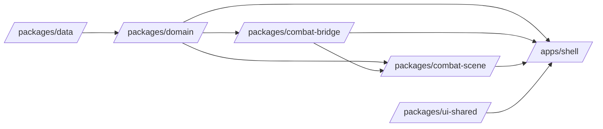
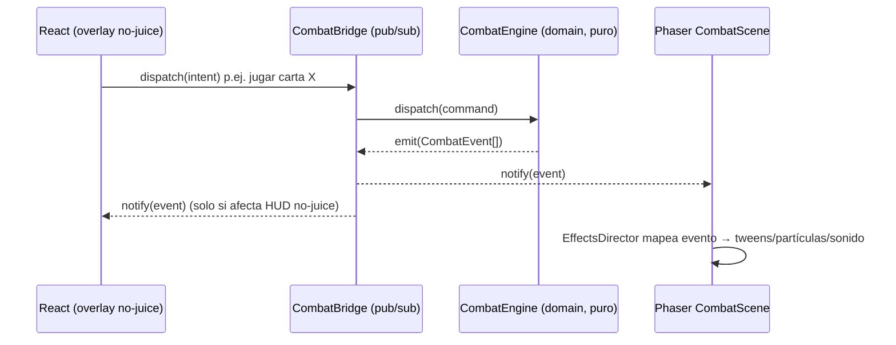
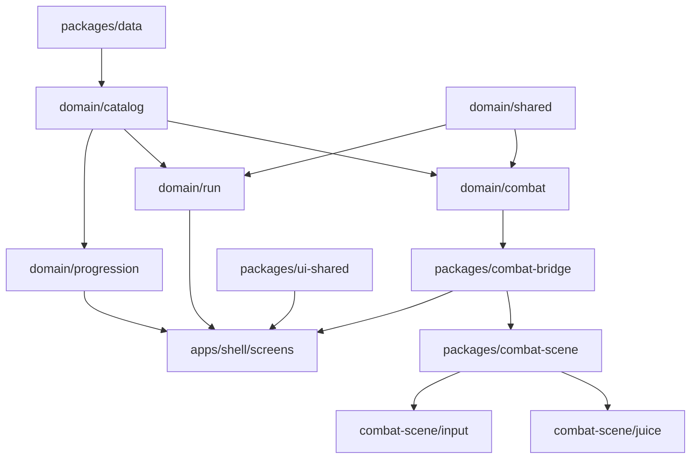

# Arquitectura de Stack — The Collector

> Spec de arquitectura inicial del Architect. Consume la decisión de stack registrada en `.ai-studio/memory/decisions.md` (2026-07-05). Define estructura, interfaces y puntos de extensión — no código final. El Programmer implementa contra esta spec.

Referencias vivas: `docs/GDD_The_Collector_v2.md` (reglas), `.ai-studio/memory/decisions.md` (por qué), `.ai-studio/memory/glossary.md` (vocabulario).

---

## 0. Objetivos que condicionan la arquitectura

1. **Stack fijado:** TypeScript + React (shell) + Phaser (combate), PWA instalable, mobile-first adaptable a PC.
2. **"Feel chulo" es prioridad explícita del Director Creativo** sobre simplicidad de implementación → la escena de combate necesita una capa de "juice" (tweens, partículas, screen shake, hit-stop, sonido) tratada como ciudadano de primera clase, no como añadido posterior.
3. **La lógica de reglas del GDD (Núcleos, cooldowns, Umbral, Trama, IA del enemigo, evolución de cartas, Level-Up...) debe ser testable sin React ni Phaser** — es el activo más valioso y el más propenso a bugs de balance; no puede depender de un framework de UI.
4. **El catálogo de contenido (cartas, Líderes, Enemigos, Escenarios, plantillas de evolución) es datos, no código** — necesario para llegar al alcance MVP (8 Líderes, 4 Enemigos, 4 Escenarios, 2 universos) sin recompilar por cada carta nueva.

---

## 1. Estructura de módulos de alto nivel

Se propone un monorepo con separación estricta por capas de dependencia (workspaces; el gestor de paquetes concreto lo decide Programmer, p.ej. npm/pnpm workspaces).

```
/packages
  /domain            # Lógica de reglas pura del GDD. Sin dependencia de 'react' ni 'phaser'.
    /combat            # Motor de combate: turnos, Núcleos, cooldowns, Umbral, Trama, IA enemigo, Combo, Contratiempo
    /run               # Estructura de la run: sorteo cruzado, slots N1-N3, descanso, auto-cura, evolución, level-up
    /catalog           # Tipos de datos + loader/validador del catálogo de contenido (sección 5)
    /progression       # Colección permanente, matriz de completitud, Créditos, sobres
    /shared            # Tipos/utilidades comunes (ids, resultados, RNG determinista, event bus genérico)

  /combat-scene      # Phaser. Consume /domain y /combat-bridge, nunca al revés.
    /scenes            # CombatScene, BoardScene (si se separa preload/board)
    /juice             # Recetas de efectos, EffectsDirector, config de mapeo evento→efecto (sección 3)
    /input             # InputAdapter: gestos táctiles/ratón → intents semánticos (sección 4)
    /view              # Traducción de estado de dominio a game objects (cartas, dados, tablero)

  /combat-bridge     # NUEVO H2.3 — puente React↔Phaser (sección 2). Paquete neutral: sin 'react' ni
                      # 'phaser' como dependencia runtime, consumido tanto por /combat-scene como por
                      # /apps/shell (ver justificación de boundaries en docs/specs/H2.3_combat_bridge.md
                      # §0.3 — enmienda a la ubicación originalmente descrita aquí, "apps/shell/combat-bridge").

  /ui-shared         # Componentes React reutilizables entre pantallas del shell (design system "habitación del coleccionista")

  /data              # Catálogo de contenido en datos (JSON), sin lógica (sección 5)
    /cards /leaders /enemies /scenarios /dramaturgy /evolution-templates /assets-manifest

/apps
  /shell             # React + Vite (o equivalente). Pantallas de menú, inicio de run, colección/deckbuilding,
                      # descanso entre combates, economía. Aloja al <CombatScreen> que monta Phaser, e
                      # instancia el CombatBridge (de /packages/combat-bridge) inyectándolo a React/Phaser.
    /screens
    /pwa               # manifest, service worker, iconos (sección 4)
```

**Regla de dependencia (una sola dirección):**



`domain` no importa `react` ni `phaser` en ningún punto. `combat-scene` importa `domain` y `combat-bridge`
pero nunca al revés. `combat-bridge` (NUEVO H2.3) es, igual que `domain`, agnóstico de framework — no
importa `react` ni `phaser` — y es consumido tanto por `combat-scene` como por `shell` sin que ninguno de
los dos dependa del otro para acceder a él (ver `docs/specs/H2.3_combat_bridge.md` §0.3). Esto es lo que
garantiza que las reglas del GDD se puedan testear con un test runner puro (unit tests contra
`CombatEngine`), sin levantar Phaser ni un DOM.

---

## 2. Puente React ↔ Phaser

### 2.1 Principio

El **dominio es la única fuente de verdad**. Ni React ni Phaser mutan reglas de juego directamente: ambos son "vistas" que reaccionan a eventos del dominio y envían **intents** (comandos) que el dominio valida y resuelve.



### 2.2 Contratos (firmas, no implementación)

```
// packages/domain/combat
interface CombatEngine {
  dispatch(command: CombatCommand): CombatCommandResult
  subscribe(listener: (event: CombatEvent) => void): Unsubscribe
  getSnapshot(): CombatStateSnapshot  // estado inmutable de solo lectura
}

type CombatCommand =
  | { type: 'PLAY_CARD', cardInstanceId: string, actionSlot: 1 | 2 | 3 }
  | { type: 'ACTIVATE_ABILITY', abilityId: string, sourceId: string }
  | { type: 'GENERATE_ENERGY' } | { type: 'CHANNEL' }
  | { type: 'REDIRECT_DAMAGE', targetAllyId: string }
  | { type: 'PLAY_CONTRATIEMPO', cardInstanceId: string }
  | { type: 'END_TURN' }
  // ... resto de intents jugables, ver GDD secciones 2-3

type CombatEvent =
  | { type: 'CORE_ROLLED', pool: CoreValue[] }
  | { type: 'ABILITY_ACTIVATED', abilityId: string, coreSpent: CoreValue }
  | { type: 'DAMAGE_DEALT', targetId: string, amount: number, absorbedBy?: string }
  | { type: 'COOLDOWN_TICKED', abilityId: string, newCd: number }
  | { type: 'PLOT_CHANGED', delta: number, newValue: number }
  | { type: 'CARD_EVOLVED', cardDefId: string, templateId: string }
  | { type: 'LEADER_LEVELED_UP', abilityId: string, newLevel: number }
  | { type: 'COMBAT_ENDED', outcome: 'victory' | 'defeat' }
  // ... uno por cada regla observable del GDD, catálogo cerrado y versionado junto al motor
```

```
// packages/combat-bridge — instancia única por combate, agnóstica de framework (NUEVO H2.3;
// ver docs/specs/H2.3_combat_bridge.md §0.3 — enmienda a la ubicación "apps/shell/combat-bridge"
// originalmente descrita en esta sección). apps/shell instancia CombatBridge con un CombatEngine
// ya construido y la inyecta a React/Phaser; el código de la clase vive en este paquete neutral.
interface CombatBridge {
  readonly engine: CombatEngine
  subscribeHudEvents(listener: (e: CombatEvent) => void): Unsubscribe   // consumido por React (HUD no-juice)
  subscribeSceneEvents(listener: (e: CombatEvent) => void): Unsubscribe // consumido por Phaser (EffectsDirector)
}
```

### 2.3 Reparto de responsabilidades UI

- **Todo lo que es "juice" vive dentro del canvas de Phaser:** tablero, Núcleos/dados, cartas en mano y en mesa, animaciones, cooldowns visuales, secuaces. Se decide así para que el feel sea consistente y con buen rendimiento — mezclar cartas DOM animadas con CSS junto a un canvas Phaser degrada el "feel chulo" pedido y duplica motores de animación.
- **React solo aporta el "chrome" no-juice** alrededor del canvas: barra superior (pausa, ajustes, salir), pantallas de transición antes/después de combate, modal de resultado, overlays de confirmación (p.ej. "¿seguro que quieres rendirte?"). Estos se montan como overlay/portal sobre el `<canvas>`, nunca dentro de él.
- `<CombatScreen>` (React) monta un `<PhaserMount>` una única vez por combate; el `CombatEngine` se crea en React (o en un factory de `apps/shell`) y se inyecta a Phaser vía `scene.init(data)` / `game.registry.set('bridge', bridge)` — Phaser nunca instancia su propio motor de reglas.
- El HUD React que sí necesita leer estado (vida, Trama, turno) se suscribe vía un hook (`useCombatSnapshot(bridge)`, implementable con `useSyncExternalStore` sobre `subscribeHudEvents`) que **no** se re-renderiza en cada tick de animación — Phaser gestiona su propio loop de render desacoplado del ciclo de render de React, evitando jank.

### 2.4 Testabilidad

`CombatEngine` (y el resto de `packages/domain`) se testea emitiendo `CombatCommand`s y aserting sobre `CombatEvent[]` y `CombatStateSnapshot`, con un test runner estándar de JS/TS — cero renderizado, cero Phaser, cero DOM. Esto es lo que permite testear balance de Núcleos/Umbral/cooldowns/IA del enemigo de forma rápida y determinista (RNG inyectable — ver `packages/domain/shared`, un `RandomSource` como interfaz para poder fijar semillas en tests).

---

## 3. Mecanismo de "feel chulo" en Phaser

### 3.1 Enfoque general

No se introduce una librería de tweening externa: **Phaser Tween Manager + Timeline nativos** son suficientes y evitan una dependencia más que sincronizar con el ciclo de vida de escenas. Se recomienda en su lugar construir una **capa de juice propia y desacoplada de las reglas**, para que el feel se pueda iterar sin tocar el motor de dominio.

```
packages/combat-scene/juice/
  EffectsDirector       # escucha CombatEvent del CombatBridge, resuelve qué recetas disparar
  recipes/              # funciones de efecto reutilizables (una por "verbo" visual)
    diceRoll, cardFlip, hitImpact, screenShake, hitStop, particleBurst, cardEvolveShimmer, ...
  JuiceConfig           # tabla de mapeo evento → [receta(s) + parámetros], ver 3.3
```

### 3.2 Contratos

> **Nota (H2.4):** los contratos de `JuiceRecipe`/`EffectsDirector`/`JuiceConfig` mostrados a continuación
> usan nombres de evento de un sketch previo a H1.3 (`CORE_ROLLED`, `DAMAGE_DEALT`, `PLOT_CHANGED`). El
> contrato vigente, contra el `CombatEvent` real (23 variantes, `packages/domain/combat/src/types/events.ts`),
> vive en `docs/specs/H2.4_effects_director.md` §2-§4 — mismo tipo de enmienda que H2.3 §0.3 aplicó a la
> ubicación de `CombatBridge`.

```
// packages/combat-scene/juice
interface JuiceRecipe<Params = unknown> {
  readonly id: string
  play(scene: Phaser.Scene, target: JuiceTarget, params: Params): Promise<void>
}

interface EffectsDirector {
  attach(bridge: CombatBridge, scene: Phaser.Scene): void   // se suscribe a subscribeSceneEvents
  // resuelve cada CombatEvent contra JuiceConfig y ejecuta la cadena de recetas correspondiente,
  // en paralelo o en serie según se declare en la config del evento
}

type JuiceConfig = Record<CombatEvent['type'], JuiceStep[]>
interface JuiceStep { recipeId: string; params?: Record<string, unknown>; mode: 'parallel' | 'sequential' }
```

- **Dados/Núcleos (`CORE_ROLLED`):** receta `diceRoll` — tween de rotación + escala sobre un game object de dado con `Phaser.Tweens.Timeline` encadenando "roll" + "settle", más un `particleBurst` sutil al asentar.
- **Cartas (`ability`/`play card`):** receta `cardFlip` — tween de `scaleX` 1→0→1 sincronizado con cambio de textura a mitad de tween (truco estándar de flip 2D en Phaser), más sombra/offset para dar profundidad.
- **Golpes (`DAMAGE_DEALT`):** cadena `hitImpact` (flash de tinte + tween de "punch" de escala) + `screenShake` (uso de `Camera.shake()` nativo, parametrizado por magnitud de daño) + `hitStop` opcional (congelar brevemente `scene.time.timeScale`/`tweens.timeScale` unos ms antes del impacto pleno, técnica estándar de "juice" para dar peso) + `particleBurst` (chispazo con `GameObjects.Particles`, atlas de textura por tipo de daño/color de Núcleo).
- **Partículas:** se usa el sistema nativo de partículas de Phaser (`GameObjects.Particles.ParticleEmitter`) para chispas de impacto, brillo de evolución de carta (`CARD_EVOLVED`), resplandor de Umbral activado, etc. — no requiere librería adicional.
- **Sonido:** el mismo `EffectsDirector`/`JuiceConfig` dispara cues de audio vía el `Sound Manager` nativo de Phaser en el mismo mapeo evento→efecto, de modo que el diseño de feel visual y sonoro se define en un único sitio versionable (la `JuiceConfig`), no repartido en el código de la escena.

### 3.3 Punto de extensión clave

`JuiceConfig` es **datos declarativos**, separados de `EffectsDirector` y de las recetas. Añadir o ajustar el "feel" de un evento nuevo (p. ej. una keyword futura) es editar una entrada de la tabla, no tocar el motor de reglas ni la lógica de la escena. Esto es lo que permite iterar el "feel chulo" pedido por el Director Creativo sin recompilar/retocar `domain` ni arriesgar regresiones de reglas.

---

## 4. Soporte PWA y mobile-first / adaptable a PC

### 4.1 PWA

- `apps/shell/pwa/manifest.webmanifest`: nombre, iconos (múltiples resoluciones), `display: standalone`, `orientation` preferente, colores de tema — cumple el requisito "instalable en móvil" de `vision.md`.
- Service worker (recomendado vía plugin de build tipo Vite PWA/Workbox, decisión de tooling concreta para Programmer): estrategia **cache-first** para assets estáticos (sprites, atlas de Phaser, fuentes, audio) y **network-first / stale-while-revalidate** para el catálogo de datos (`packages/data`) si en el futuro se sirve remoto en vez de empaquetado — hoy el catálogo va empaquetado, así que cache-first aplica también a él. Pantalla de fallback offline mínima.

### 4.2 Mobile-first, adaptable a PC

- **Escalado del canvas Phaser:** `Scale Manager` de Phaser en modo `FIT` (o `ENVELOP` si se prioriza llenar pantalla sobre letterboxing) con una resolución virtual de diseño fija; el contenedor React que aloja el `<canvas>` reporta cambios de tamaño (vía `ResizeObserver`) al `Scale Manager` para reajustar en rotación de móvil o resize de ventana en PC.
- **Layout del shell React:** mobile-first con breakpoints CSS; los mismos componentes de `packages/ui-shared` se reorganizan (flex/grid) para pantallas anchas de PC sin duplicar componentes.

### 4.3 Abstracción de input (táctil vs ratón/teclado)

```
// packages/combat-scene/input
interface InputAdapter {
  attach(scene: Phaser.Scene): void
  onIntent(listener: (intent: PlayerIntent) => void): Unsubscribe
}

type PlayerIntent =
  | { type: 'SELECT_CARD', cardInstanceId: string }
  | { type: 'CONFIRM_TARGET', targetId: string }
  | { type: 'CANCEL' }
  | { type: 'PREVIEW_CARD', cardInstanceId: string }   // long-press en táctil, hover en ratón
```

El `InputAdapter` traduce gestos concretos (tap, drag para redirigir daño a un Aliado, long-press para previsualizar carta / hover + click derecho en PC) a **intents semánticos únicos**, reutilizando el `Pointer` unificado que Phaser ya expone para touch y mouse. La lógica de combate (y el `EffectsDirector`) solo conocen `PlayerIntent`, nunca el tipo de dispositivo — así ningún código de reglas ni de juice se ramifica por plataforma. Mejoras solo-PC (tooltips en hover, atajos de teclado como espacio para pasar turno) se añaden como listeners adicionales sobre el mismo `InputAdapter`, aditivos y opcionales.

---

## 5. Puntos de extensión del catálogo de contenido

### 5.1 Principio

Ningún Líder/Enemigo/Escenario/carta/plantilla de evolución se hardcodea en `domain` ni en `combat-scene`. Vive como datos en `packages/data`, tipado y validado por `packages/domain/catalog`.

```
packages/data/
  cards/*.json                  # CardDefinition[]
  leaders/*.json                # LeaderDefinition[] (incluye pool de 10 cartas propias, 4 habilidades base)
  enemies/*.json                # EnemyDefinition[] (habilidades, fases, IA de prioridades por defecto del GDD 3.5)
  scenarios/*.json               # ScenarioDefinition[] (Trama, umbrales)
  dramaturgy/*.json              # mazo de Dramaturgia por Enemigo+Escenario
  evolution-templates/*.json     # EvolutionTemplate[] (sección 7 del GDD)
  assets-manifest/*.json         # id de contenido → rutas de arte/audio, por universo/set
```

### 5.2 Contratos de datos (tipos, no implementación)

```
// packages/domain/catalog
interface CardDefinition {
  id: string
  name: string
  type: 'Equipo' | 'Aliado' | 'Evento' | 'Contratiempo'
  cost: { energy?: number; coreRequirement: CoreCostRequirement }
  keywords: KeywordInstance[]     // Ataque+X, Trama X, Defensa X, Umbral, Combo, Arrollar, Neutro, etc.
  universeSkin?: string           // referencia a assets-manifest, no arte embebido
}

interface EvolutionTemplate {
  id: string
  appliesToCardType: CardDefinition['type'] | 'Ataque'
  kind: 'template' | 'bespoke'    // puerta abierta explícita del GDD 7.2 a evoluciones únicas futuras
  effect: EvolutionEffectSpec     // p.ej. { op: 'increase', field: 'damageBonus', amount: 1 }
}

interface LeaderDefinition {
  id: string
  baseAbilities: AbilityDefinition[4]   // CD1 siempre ⚫ puro, ver GDD 3.1/2.5
  cardPoolIds: string[]                  // 10 ids → resueltos contra CardDefinition vía loader
  levelUpOptions: LevelUpOption[]        // elige 1 de 3 al subir, GDD 4.3/7.3
}

interface EnemyDefinition { /* habilidades Ataque/Trama separadas, fases, prioridades IA — GDD 3.4/3.5 */ }
interface ScenarioDefinition { /* umbrales de Trama, pasivos siempre activos — GDD 3.6 */ }

interface CatalogLoader {
  load(): Promise<Catalog>                 // valida contra schema, resuelve referencias cruzadas
  getCard(id: string): CardDefinition
  getLeader(id: string): LeaderDefinition
  // ... accessors equivalentes para enemy/scenario/evolutionTemplate/dramaturgyDeck
}
```

- La validación de esquema (recomendado: librería de schema-first tipo zod o equivalente, decisión de tooling de Programmer) ocurre en el `CatalogLoader`, no dispersa por el código — así un dato de contenido mal formado falla rápido y con mensaje claro, no como bug de runtime en combate.
- `EvolutionTemplate.kind` deja explícitamente la puerta abierta (ya pedida en GDD §7.2 y §8.1) a evoluciones escritas a mano por carta sin rehacer el modelo: basta con añadir instancias `kind: 'bespoke'` referenciadas por `CardDefinition.id` en vez de por tipo genérico.
- El arte/audio nunca vive embebido en las definiciones de contenido: siempre se referencia por id contra `assets-manifest`, de modo que añadir un universo/set nuevo (más allá de los 2 del MVP) es añadir archivos de datos + assets, no tocar `domain` ni `combat-scene`.
- Tanto el shell (deckbuilding, habitación, colección) como el motor de combate consumen el **mismo** `CatalogLoader` — una sola fuente de verdad de contenido, evitando duplicar definiciones entre la pantalla de construcción de mazo y las reglas de combate.

---

## 6. Resumen de dependencias entre módulos



Nada en `domain`, `data` ni sus subcarpetas importa `react` o `phaser`. Esto es lo que garantiza el requisito "la lógica de reglas debe poder testearse sin Phaser ni React": los tests de `domain` corren en Node/test-runner puro, sin canvas ni DOM.

---

## 7. Siguientes pasos para Programmer

1. Elegir tooling concreto de build (Vite recomendado por integración simple con React + PWA plugin + assets de Phaser) y de test runner/schema — no fijado aquí por ser detalle de implementación, no de arquitectura.
2. Implementar `packages/domain/shared` (tipos base, `RandomSource` inyectable) y `packages/domain/combat` (motor de turnos/Núcleos/cooldowns) primero, con tests, antes de tocar Phaser — permite validar reglas del GDD de forma aislada.
3. Implementar `CatalogLoader` con 1-2 Líderes/Enemigos/Escenarios de prueba antes de escalar a los 8/4/4 del MVP.
4. Montar el puente `CombatBridge` + `<PhaserMount>` mínimo (una escena vacía reaccionando a un evento de prueba) antes de invertir en recetas de juice — valida el contrato de comunicación primero.
5. Iterar la capa de `juice`/`JuiceConfig` en paralelo con feedback directo del Director Creativo contra las referencias forcetable.net/strawtable.net, dado que es el criterio de aceptación explícito del "feel chulo".
