# FIX — Viewport de combate no encaja en pantalla + solapamiento de etiquetas de habilidad

> Spec técnica del Architect para Programmer. Origen: bug confirmado en producción
> (https://pablodabernal.github.io/TheCardCollector/, navegador de escritorio), diagnóstico ya cerrado por un
> agente de exploración (ver informe adjunto al bug). Esta spec cubre DOS bugs independientes que comparten
> archivo de entrega pero no comparten causa raíz — se implementan y verifican por separado, aunque en el
> mismo ciclo de Programmer/Reviewer/QA.
>
> Dependencias: `apps/shell/src/screens/CombatScreen.tsx` (H2.9, H2.14), `packages/combat-scene/src/view/
> board-layout.ts` (H2.8, H2.10), `packages/combat-scene/src/view/ability-cooldown-view.ts` (H2.10),
> `packages/combat-scene/src/view/minions-view.ts` (H1.16/H2.8).

---

## 0. Qué resuelve esta spec (y qué NO)

### 0.1 Dos bugs independientes

1. **Bug 1 (crítico, bloquea todo el combate):** el `<div id="phaser-mount">` que aloja el `Phaser.Game` no
   tiene ningún CSS que le dé tamaño propio. `Phaser.Scale.FIT` no tiene nada que medir en el `parent` en el
   momento de construir el `Game`, así que el `<canvas>` se renderiza a su tamaño lógico nativo
   (`COMBAT_SCENE_VIEWPORT` = 1080×1920) en vez de escalarlo hacia abajo para encajar en la ventana. Efecto
   observable: scroll de página, mano de cartas/pool de Núcleos (`HAND_ROW_POSITION`/`NUCLEO_POOL_ROW_Y`,
   ambos en el tercio inferior del canvas, y≈1450-1600) fuera del área visible sin hacer scroll, ningún tap
   sobre esos elementos llega a dispararse.
2. **Bug 2 (independiente, cosmético/legibilidad):** en `board-layout.ts`, `MINIONS_ROW_Y` (500) y
   `ENEMY_ABILITIES_ROW_Y` (`ENEMY_POSITION.y + 180` = 480) están separadas solo 20px pero los tiles de
   secuaz miden 180px de alto (`CARD_PLACEHOLDER_HEIGHT`, `juice/recipes/placeholder.ts`) — se solapan
   verticalmente. Además, en `ability-cooldown-view.ts`, `ABILITY_ICON_SEPARATION_PX` (100) es menor que el
   ancho real que ocupa el texto de cada etiqueta de habilidad (`"{name} {remaining}/{baseCooldown}"`,
   14px), que en el catálogo actual del MVP llega hasta ~20 caracteres — las etiquetas de habilidades
   adyacentes se solapan horizontalmente en cuanto hay 2+ habilidades del mismo lado.

### 0.2 Fuera de alcance — explícito

- **Cero arte/sprites reales.** Todo sigue siendo `Rectangle`/`Text` placeholder (`resolveOrCreatePlaceholder`,
  `resolveOrCreateCardPlaceholder`). No se introduce ninguna textura, atlas, ni cambio visual más allá de
  posición/tamaño de contenedor y separación entre elementos ya existentes.
- **Ninguna receta de juice, evento de dominio, `CombatCommand`/`CombatEvent` cambia.**
- **PWA/manifest/service worker** (H2.15) no se toca — el fix de CSS del contenedor es independiente del
  ciclo de vida de instalación.
- **No se rediseña el layout de tablero completo** — solo se corrigen las dos colisiones puntuales ya
  diagnosticadas (fila secuaces/habilidades enemigo, separación entre etiquetas de habilidad). El resto de
  filas (`ALLIES_ROW_Y`, `NUCLEO_POOL_ROW_Y`, `HAND_ROW_POSITION`, `LEADER_POSITION`, `SCENARIO_POSITION`)
  no cambian.

---

## 1. Fix Bug 1 — el contenedor de Phaser necesita tamaño real que `Scale.FIT` pueda medir

### 1.1 Diagnóstico de la causa exacta

`CombatScreen.tsx` construye hoy:

```tsx
return (
  <div style={{ position: 'relative' }}>
    <div ref={mountRef} id="phaser-mount" />
    ...
  </div>
);
```

Ninguno de los dos `<div>` tiene `width`/`height`. En HTML, un `<div>` de bloque sin contenido y sin altura
explícita colapsa a `height: 0` (su ancho hereda el 100% del body, pero su alto depende de su contenido — y
antes de que Phaser inserte el `<canvas>`, no tiene ninguno). `Phaser.Scale.FIT` lee `parent.clientWidth`/
`clientHeight` en el momento de `new Phaser.Game(...)` (dentro de `buildCombatSetup(...).then(...)`, línea
47 de `CombatScreen.tsx`) — con `clientHeight` en 0 (o un valor arbitrario heredado de un `<body>` sin altura
fijada tampoco, ver `apps/shell/index.html` — sin ningún `<style>`/hoja global), el cálculo de escala de FIT
no tiene una relación de aspecto de contenedor válida contra la que ajustar 1080×1920, y Phaser cae en
renderizar el canvas a su tamaño lógico nativo.

### 1.2 Decisión: contenedor a tamaño completo de viewport (`100dvh`/`100vw`), letterboxing vertical u
horizontal según proporción de pantalla, sin scroll de página

**Qué se especifica:**

1. Un nuevo archivo global de estilos `apps/shell/src/index.css`, importado una única vez desde
   `apps/shell/src/main.tsx` (antes del `createRoot(...).render(...)`), con:

   ```css
   html, body {
     margin: 0;
     padding: 0;
     width: 100%;
     height: 100%;
     overflow: hidden; /* ningún scroll de página — el juego vive enteramente dentro del viewport */
     background: #000; /* color de "letterbox": lo que se ve fuera del canvas cuando FIT no puede
                           llenar el contenedor completo sin distorsionar el aspect ratio 9:16 */
   }

   #root {
     width: 100%;
     height: 100%;
   }
   ```

   *Por qué `overflow: hidden` en `html`/`body` (no solo en el contenedor del juego):* es la garantía a nivel
   de documento de que ningún elemento (HUD overlay, modal de resultado, mensaje "Cargando combate…") puede
   introducir scroll de página por accidente — refuerza el criterio de aceptación "no debería haber scroll
   si el fit funciona bien" de forma robusta ante futuras pantallas, no solo dentro de `CombatScreen`.

2. Un nuevo archivo `apps/shell/src/screens/CombatScreen.css`, importado desde `CombatScreen.tsx`, con una
   única clase:

   ```css
   .combat-screen-root {
     position: relative;
     width: 100vw;
     height: 100dvh; /* dvh en vez de vh: evita el salto de tamaño al aparecer/ocultarse la barra de
                        direcciones del navegador móvil (Safari/Chrome Android) — 100vh se queda corto o
                        deja hueco en esos casos; dvh es soportado por los navegadores objetivo del
                        proyecto (Chrome/Safari/Firefox recientes, PWA instalada) */
     overflow: hidden;
   }

   #phaser-mount {
     width: 100%;
     height: 100%;
   }
   ```

3. `CombatScreen.tsx` gana `className="combat-screen-root"` en el `<div>` raíz (sustituye el
   `style={{ position: 'relative' }}` inline actual, que se elimina — la clase ya cubre `position: relative`
   más el tamaño nuevo):

   ```tsx
   return (
     <div className="combat-screen-root">
       <div ref={mountRef} id="phaser-mount" />
       {!bridge && <p>Cargando combate…</p>}
       {bridge && <CombatHudOverlay bridge={bridge} leaderName={leaderName} />}
     </div>
   );
   ```

4. **Ningún cambio a la config de `Phaser.Game`** (`scale.mode: Phaser.Scale.FIT`,
   `autoCenter: Phaser.Scale.CENTER_BOTH`, `width`/`height: COMBAT_SCENE_VIEWPORT`) — el bug nunca estuvo en
   la config de Phaser, estaba en que su `parent` no tenía tamaño que medir. Con `#phaser-mount` a
   `width: 100%; height: 100%` de un ancestro (`.combat-screen-root`) que a su vez ocupa el viewport
   completo (`100vw`/`100dvh`, con `html`/`body`/`#root` propagando 100% de alto sin colapsar), `clientWidth`/
   `clientHeight` del `parent` en el momento de `new Phaser.Game(...)` ya son números reales y `Scale.FIT`
   puede calcular la escala correctamente.

### 1.3 Comportamiento en pantallas anchas (desktop) vs. estrechas (móvil)

El viewport virtual del combate es 1080×1920 (proporción 9:16, retrato). `Scale.FIT` + `CENTER_BOTH`
preserva esa proporción SIN distorsión, escalando por el eje más restrictivo y centrando el resultado dentro
del contenedor:

- **Pantalla ancha (desktop, ej. 16:9 o más ancha que 9:16):** el eje limitante es la altura
  (`clientHeight`). El canvas se escala hasta llenar el 100% del alto disponible; sobra ancho a los lados →
  franjas verticales de "letterbox" a izquierda/derecha, del color de fondo (`#000`, definido en `index.css`
  §1.2 punto 1) por fuera del `<canvas>` pero dentro de `html`/`body`. Esto es exactamente el resultado
  correcto para un juego móvil-primero visto en desktop (referencia ya fijada en `decisions.md`:
  "Plataforma: móvil primero, adaptable a PC") — no se estira el contenido para rellenar el ancho.
- **Pantalla estrecha (móvil, retrato, cerca de o más estrecha que 9:16):** el eje limitante es el ancho. El
  canvas se escala hasta llenar el 100% del ancho disponible; sobra alto → franjas horizontales arriba/abajo
  si la pantalla del dispositivo es proporcionalmente más "cuadrada" que 9:16 (poco común en móviles reales,
  pero posible en tablets o ventanas de navegador de escritorio redimensionadas a algo casi cuadrado).
- **Ningún caso produce scroll de página:** con `html`/`body` a `overflow: hidden` y tamaño 100%/100%, y
  `.combat-screen-root` a `100vw`/`100dvh` con su propio `overflow: hidden`, el documento nunca crece más
  allá del viewport — el letterbox vive dentro de los límites ya fijados, nunca fuera de ellos.

### 1.4 Nota de implementación — `resize` de ventana no está en alcance de este fix

`Phaser.Scale.FIT` recalcula automáticamente al evento `resize` del `ScaleManager` (ya escucha
`window.resize` por defecto en Phaser) siempre que el `parent` también cambie de tamaño con la ventana — lo
cual ya ocurre solo con el CSS de §1.2 (`100vw`/`100dvh` son relativos al viewport, se recalculan solos por
el navegador en cada resize). No hace falta ningún listener manual adicional en `CombatScreen.tsx` — se dejó
constancia explícita para que Programmer no añada código de más.

---

## 2. Fix Bug 2 — solapamiento de layout (fila secuaces/habilidades enemigo + etiquetas de habilidad)

### 2.1 Vertical: `MINIONS_ROW_Y` vs. `ENEMY_ABILITIES_ROW_Y`

Geometría real hoy (`packages/combat-scene/src/view/board-layout.ts` + constantes ya definidas en otros
archivos):

- Tile de secuaz: `CARD_PLACEHOLDER_WIDTH`/`HEIGHT` = 120×180 (`juice/recipes/placeholder.ts`), centrado en
  `MINIONS_ROW_Y` → ocupa verticalmente `[MINIONS_ROW_Y - 90, MINIONS_ROW_Y + 90]`.
- Icono de habilidad enemigo: `ICON_HEIGHT` = 24 (`ability-cooldown-view.ts`), centrado en
  `ENEMY_ABILITIES_ROW_Y` → ocupa verticalmente `[ENEMY_ABILITIES_ROW_Y - 12, ENEMY_ABILITIES_ROW_Y + 12]`.
- Con los valores actuales (`MINIONS_ROW_Y = 500`, `ENEMY_ABILITIES_ROW_Y = 480`): rango de secuaces
  `[410, 590]` vs. rango de habilidades enemigo `[468, 492]` → solapan por completo (492 > 410).

**Fix: mover `MINIONS_ROW_Y` hacia abajo**, sin tocar `ENEMY_ABILITIES_ROW_Y` (que ya deja margen razonable
bajo el tile del Enemigo — `ENEMY_POSITION.y + 180`, sin cambios). Fórmula explícita para dejar constancia
del margen de seguridad (usar un margen fijo `ROW_GAP_PX = 20`, mismo criterio de "espaciado mínimo entre
filas" que ya se usa implícitamente en el resto de `board-layout.ts`):

```ts
// packages/combat-scene/src/view/board-layout.ts
const ROW_GAP_PX = 20;
const MINION_TILE_HEIGHT_PX = 180; // = CARD_PLACEHOLDER_HEIGHT (juice/recipes/placeholder.ts) — duplicado
                                    // aquí como constante local de layout en vez de importar desde `juice/`
                                    // para no crear una dependencia cruzada `view` → `juice/recipes` solo
                                    // por una constante (mismo criterio de aislamiento que ya separa ambos
                                    // módulos); si Programmer prefiere importar directamente
                                    // `CARD_PLACEHOLDER_HEIGHT`, es una decisión de implementación menor
                                    // que no cambia el resultado numérico.
const ABILITY_ICON_HEIGHT_PX = 24; // = ICON_HEIGHT (ability-cooldown-view.ts), mismo criterio que arriba

export const MINIONS_ROW_Y =
  ENEMY_ABILITIES_ROW_Y + ABILITY_ICON_HEIGHT_PX / 2 + MINION_TILE_HEIGHT_PX / 2 + ROW_GAP_PX;
// = 480 + 12 + 90 + 20 = 602 → redondear a 620 para dejar margen legible (no pixel-perfect al límite)
```

**Valor final: `MINIONS_ROW_Y = 620`** (antes 500). Verificado contra el resto de filas fijas del tablero
(`SCENARIO_POSITION.y = 960`, `ALLIES_ROW_Y = 1300`) — 620 deja hueco amplio sin nueva colisión por ningún
lado (secuaz ocupa `[530, 710]`, lejos de ambas).

### 2.2 Horizontal: separación entre etiquetas de habilidad

**Diagnóstico cuantificado:** el texto de cada etiqueta (`labelFor()`, `ability-cooldown-view.ts`) es
`"{name} {remaining}/{baseCooldown}"` o `"{name} LISTA"`, fontSize 14px. Contra el catálogo real de contenido
del MVP 2×2×2 (`packages/data/leaders/*.json`, `packages/data/enemies/*.json`), el nombre de habilidad más
largo es "Grito de Guerra" (Líder Soldado) / "Embestida Feroz", "Eco de Tragedia" (Enemigos) — la etiqueta
completa más larga ronda **20 caracteres** (`"Grito de Guerra 2/4"`). A 14px con la fuente por defecto de
Phaser (sans-serif del sistema), el ancho renderizado de una etiqueta de ese largo es
aproximadamente 170-180px — muy por encima de los 100px actuales de `ABILITY_ICON_SEPARATION_PX`.

**Fix: `ABILITY_ICON_SEPARATION_PX: 100 → 200`.** Con 4 habilidades por lado (máximo actual del catálogo —
Líder y Enemigo siempre tienen exactamente 4 en `baseAbilities`/`abilities`, ver los 4 archivos de datos
citados arriba; el motor de dominio no impone un máximo distinto de "lo que traiga el catálogo", pero el
MVP fija 4 en los 4 roles disponibles), el ancho total de la fila es `3 × 200 = 600px`, centrada en
`x = 540` (mismo `centerX` que usa `createAbilityCooldownView`, tanto para Líder como para Enemigo) → rango
`[240, 840]`, dentro del viewport de 1080px de ancho con margen sobrado a ambos lados. 200px de separación
deja un hueco de `200 - 180 ≈ 20px` entre el borde derecho de una etiqueta de 180px y el borde izquierdo de
la siguiente — suficiente para que no se toquen, con margen adicional si el catálogo crece con nombres algo
más largos en el futuro (hasta ~23 caracteres antes de volver a solaparse).

```ts
// packages/combat-scene/src/view/board-layout.ts
export const ABILITY_ICON_SEPARATION_PX = 200; // antes: 100 — ver FIX_combat_viewport_and_layout.md §2.2
                                                // para el cálculo de por qué 100 era insuficiente
```

**Nota explícita para Programmer:** si en el futuro el catálogo de contenido añade un enemigo/líder con más
de 4 habilidades, o nombres sensiblemente más largos que los actuales, este valor fijo puede volver a quedar
corto — el test de regresión de §3.2 está diseñado para fallar de forma explícita en ese caso (en vez de
descubrirlo en producción, como pasó con el bug original), forzando una revisión consciente del valor en ese
momento. No se especifica aquí un layout dinámico basado en medición real de texto (`Text.width`) porque
sería una complejidad nueva (Phaser mide texto vía `canvas.measureText`, no disponible de forma fiable en el
entorno de test sin canvas real que usa el resto de `combat-scene`) sin beneficio claro para el contenido
2×2×2 actual — decisión consistente con el criterio ya aplicado en H2.10 ("sin abstracciones nuevas
todavía").

---

## 3. Tests a actualizar/añadir

### 3.1 Bug 1 — `apps/shell`

1. **Nuevo test unitario** `apps/shell/src/screens/CombatScreen.test.tsx` (o extensión de `App.test.tsx` si
   Programmer prefiere no crear un archivo nuevo — mismo mock de `phaser`/`@collector/combat-scene` que ya
   usa `App.test.tsx`, §referencia líneas 14-35): verificar que, en el momento de invocar
   `new Phaser.Game(...)`, el `config.parent` (`mountRef.current`) tiene `className`/ancestro con la clase
   `combat-screen-root` — regresión de "el contenedor tiene una clase de tamaño, no solo un `<div>` vacío".
   Como jsdom no calcula layout real (`clientWidth`/`clientHeight` siempre son 0 en jsdom
   independientemente del CSS), este test NO puede verificar el tamaño en píxeles — se limita a confirmar
   que el JSX/CSS correcto está en su sitio (presencia de la clase, existencia de `CombatScreen.css`
   importado). La verificación real de tamaño en píxeles ya la cubre el E2E de Playwright (§3.1 punto 2).
2. **Extensión de `apps/shell/e2e/combat-end-to-end.spec.ts`** (Playwright, verificación manual
   complementaria, no gate de CI — mismo criterio que el resto de `e2e/*.spec.ts`): el test ya afirma
   `box.width / box.height` ≈ `1080/1920` (línea 56), pero eso por sí solo NO detecta este bug (un canvas a
   tamaño nativo 1080×1920 sin escalar también cumple esa proporción). Añadir dos aserciones nuevas
   inmediatamente después de obtener `box`:
   - `expect(box.width).toBeLessThanOrEqual(viewportSize.width)` y
     `expect(box.height).toBeLessThanOrEqual(viewportSize.height)` (contra `page.viewportSize()`) — confirma
     que el canvas realmente encogió para caber en la ventana, no que conserva la proporción a tamaño nativo.
   - Verificar ausencia de scroll de página:
     `const scrollHeight = await page.evaluate(() => document.documentElement.scrollHeight);` y
     `const clientHeight = await page.evaluate(() => document.documentElement.clientHeight);` →
     `expect(scrollHeight).toBeLessThanOrEqual(clientHeight)` (con tolerancia de 1-2px por redondeo de
     subpíxel).
3. **Nuevo test E2E** (o extensión del mismo archivo) que fije expĺicitamente un viewport de escritorio
   ancho (ej. `page.setViewportSize({ width: 1280, height: 800 })`, proporción bien distinta de 9:16) y
   repita las aserciones del punto 2 — cubre el caso "desktop ancho" citado en el diagnóstico del bug
   original (reportado exactamente en ese contexto).

### 3.2 Bug 2 — `packages/combat-scene`

1. **Nuevo test** en `packages/combat-scene/src/view/board-layout.test.ts` (crear si no existe): verificar
   con aritmética simple (sin canvas) que los rangos verticales de `MINIONS_ROW_Y` (±`MINION_TILE_HEIGHT_PX/2`)
   y `ENEMY_ABILITIES_ROW_Y` (±`ABILITY_ICON_HEIGHT_PX/2`) no se solapan — mismo cálculo que §2.1, expresado
   como aserción (`minionsRange.start > enemyAbilitiesRange.end`) para que un cambio futuro accidental de
   cualquiera de las dos constantes rompa el test en vez de descubrirse visualmente.
2. **Extensión de `ability-cooldown-view.test.ts`** (§5.1 de H2.10, ya existente): nuevo caso — para
   `abilities` con las 4 entradas reales de cada uno de los 4 roles del catálogo MVP (usar los datos
   literales de `soldado-base.json`/`mago-base.json`/`bestia-base.json`/`espectro-base.json`, no un mock
   sintético, para que el test detecte de verdad una regresión de contenido), calcular el ancho aproximado
   de cada etiqueta con una función de test-only `estimateLabelWidthPx(label: string): number` (constante
   `AVG_CHAR_WIDTH_PX` documentada como estimación conservadora/pesimista, ej. `8.5`, solo para este test —
   no se usa en runtime) y verificar que, para cada par de etiquetas adyacentes en la fila,
   `ABILITY_ICON_SEPARATION_PX >= estimateLabelWidthPx(labelMasLargo) + MIN_GAP_PX` (`MIN_GAP_PX` pequeño,
   ej. 8, como margen de seguridad). Este test debe fallar hoy contra el valor viejo (100) y pasar contra el
   nuevo (200) — confirmación directa de que el fix numérico es correcto y de que queda protegido ante
   regresiones futuras de contenido (nombres más largos).
3. **Verificación visual Playwright** (extensión de `combat-scene-smoke.spec.ts` o del E2E de `apps/shell`
   ya existente, mismo criterio "no gate de CI" que el resto de verificaciones visuales del proyecto):
   captura de pantalla con el contenido 2×2×2 real mostrando las 4 etiquetas de habilidad del Enemigo y los
   tiles de secuaz (si hay alguno invocado) sin solapamiento visible.

---

## 4. Diagrama lógico (contenedor → Scale Manager)

```mermaid
flowchart TD
  A[apps/shell/src/main.tsx] -->|import| B[apps/shell/src/index.css<br/>html/body/#root: 100%, overflow hidden]
  C[CombatScreen.tsx] -->|import| D[CombatScreen.css<br/>.combat-screen-root: 100vw/100dvh<br/>#phaser-mount: 100%/100%]
  C -->|className| E[div.combat-screen-root]
  E --> F[div#phaser-mount ref=mountRef]
  F -->|parent: mountRef.current, ya con clientWidth/clientHeight reales| G[new Phaser.Game&#40;...&#41;]
  G --> H[Scale.FIT + CENTER_BOTH<br/>escala 1080x1920 al contenedor real<br/>sin distorsión, centrado]
  H --> I[canvas real dentro de #phaser-mount<br/>letterbox negro fuera si aplica]
```



---

## 5. Cambios de archivos — resumen

- `apps/shell/src/index.css` — **nuevo** (§1.2 punto 1).
- `apps/shell/src/main.tsx` — importa `./index.css` (1 línea nueva).
- `apps/shell/src/screens/CombatScreen.css` — **nuevo** (§1.2 punto 2).
- `apps/shell/src/screens/CombatScreen.tsx` — importa `./CombatScreen.css`, `<div style={{...}}>` →
  `<div className="combat-screen-root">` (§1.2 punto 3). Ningún cambio a la config de `Phaser.Game` ni al
  `useEffect` de montaje.
- `packages/combat-scene/src/view/board-layout.ts` — `MINIONS_ROW_Y`: 500 → 620 (fórmula §2.1),
  `ABILITY_ICON_SEPARATION_PX`: 100 → 200 (§2.2). `ENEMY_ABILITIES_ROW_Y`, `LEADER_ABILITIES_ROW_Y`,
  `TILE_SEPARATION_PX`, resto de constantes — sin cambio.
- `packages/combat-scene/src/view/board-layout.test.ts` — **nuevo** (§3.2 punto 1).
- `packages/combat-scene/src/view/ability-cooldown-view.test.ts` — nuevo caso con datos reales del catálogo
  (§3.2 punto 2).
- `apps/shell/src/screens/CombatScreen.test.tsx` — **nuevo** (§3.1 punto 1), o caso añadido a
  `App.test.tsx` si Programmer prefiere no crear archivo nuevo.
- `apps/shell/e2e/combat-end-to-end.spec.ts` — aserciones nuevas de tamaño real/ausencia de scroll (§3.1
  puntos 2-3).
- Ningún cambio a `@collector/combat-bridge`, `CombatCommand`/`CombatEvent`, motor de dominio
  (`packages/domain/combat`), recetas de juice, ni manifest/service worker PWA.

---

## 6. Checklist de Definition of Done para Programmer

- [ ] `apps/shell/src/index.css` creado e importado desde `main.tsx` (§1.2.1).
- [ ] `apps/shell/src/screens/CombatScreen.css` creado e importado desde `CombatScreen.tsx` (§1.2.2).
- [ ] `CombatScreen.tsx`: `<div>` raíz usa `className="combat-screen-root"` en vez de `style` inline;
      `#phaser-mount` sigue siendo el mismo elemento DOM real que se pasa a `parent` (§1.2.3).
- [ ] Config de `new Phaser.Game(...)` sin cambios (`scale.mode`, `width`/`height`, `autoCenter`).
- [ ] `board-layout.ts`: `MINIONS_ROW_Y = 620`, `ABILITY_ICON_SEPARATION_PX = 200` (§2.1/§2.2).
- [ ] `board-layout.test.ts` nuevo: rangos verticales de secuaces vs. habilidades enemigo no se solapan.
- [ ] `ability-cooldown-view.test.ts`: nuevo caso con las 4 habilidades reales de cada uno de los 4 roles
      del catálogo MVP, verificando separación suficiente contra ancho de etiqueta estimado.
- [ ] Test nuevo (unitario) confirmando que el contenedor de Phaser tiene la clase CSS de tamaño antes de
      `new Phaser.Game(...)`.
- [ ] `combat-end-to-end.spec.ts`: aserciones nuevas de tamaño real del canvas vs. viewport y ausencia de
      scroll de página, en al menos un viewport ancho tipo desktop además del que ya prueba.
- [ ] Verificación visual manual (captura) confirmando: (a) sin scroll de página en desktop ancho y en
      móvil estrecho, (b) mano de cartas y pool de Núcleos visibles sin scroll, (c) etiquetas de habilidad
      del Enemigo/Líder sin solapamiento, (d) fila de secuaces sin solapar con habilidades del Enemigo.
- [ ] `npm run build`, `npm run lint`, `npm run typecheck`, `npm run test` (raíz) pasan en verde.
- [ ] Cero cambios a arte/sprites/texturas — todo sigue siendo `Rectangle`/`Text` placeholder.
- [ ] Cero cambios a `@collector/combat-bridge`, `CombatCommand`/`CombatEvent`, motor de dominio, PWA.
