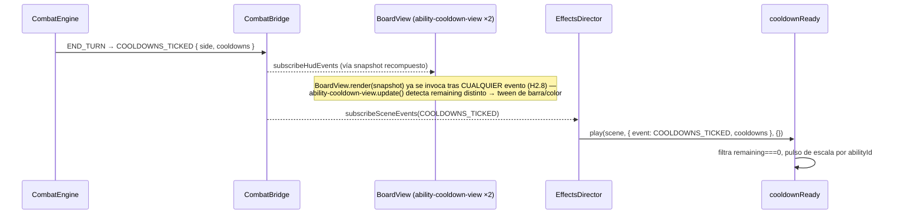

# Spec H2.10 — Cooldowns visuales de habilidades (Líder + Enemigo)

> Spec técnica del Architect para Programmer. Historia origen: `.ai-studio/memory/backlog.md`, Épica E2,
> "H2.10: Cooldowns visuales en cartas y habilidades". Depende de H2.4 (cerrada: `EffectsDirector`/
> `JuiceConfig`), H2.5 (cerrada: recetas base), H2.8 (cerrada: `BoardView`, `role-view.ts` con CD como texto
> plano), H2.9 (cerrada: flujo end-to-end, `BoardViewContext`/`HandCardViewData` con patrón de "resuelto una
> vez desde catálogo").

---

## 0. Qué resuelve esta historia (y qué NO)

### 0.1 Re-secuenciación de alcance: "CD en cartas" es una imprecisión heredada del backlog

El título y la descripción de H2.10 en `backlog.md` ("cooldowns visuales en cartas y habilidades... cada
carta en mesa/mano tiene un display de CD") **no es ejecutable tal cual**: el motor de dominio
(`packages/domain/combat/src/types/cooldown.ts`, `AbilityCooldownDefinition`/`AbilityCooldownSnapshot`,
`CombatEngineConfig.abilityCooldowns` en `config.ts`) modela el CD **exclusivamente sobre habilidades**
(`AbilityId` + `side`), nunca sobre `CardDefinition`/`CardInstance`/`HandCardViewData`. Confirmado también en
`card-hand-view.ts` (H2.8): las cartas de mano solo llevan `energyCost` (atenuado por alpha), sin ningún
campo de cooldown — porque no existe tal concepto para cartas en el GDD (§2.5 habla de CD de habilidades del
Líder/Aliado/Enemigo, no de cartas de mano).

**Decisión:** el alcance real de H2.10 es **mejorar la representación visual de los cooldowns de
habilidades que YA existen** (mostrados como texto plano dentro de `role-view.ts` desde H2.8, confirmado por
QA: `"ability-soldado-base-guardia-firme (Guardia Firme) CD 0/1 LISTA"`). Cero cartas de mano involucradas.
Se registra como candidato de `decisions.md` (mismo patrón que la re-secuenciación de H2.7, `decisions.md`
2026-07-06 "H2.7 InputAdapter: re-secuenciación de alcance") — ver §7.

El evento de dominio real es `COOLDOWNS_TICKED` (plural), no `COOLDOWN_TICKED` (singular) como escribe el
backlog — `packages/domain/combat/src/types/events.ts` línea 42. Esta spec usa el nombre real en todo momento.

### 0.2 Consecuencia arquitectónica: hacen falta sprites individuales de habilidad, que hoy NO existen

`role-view.ts` (H2.8) crea **un único** `Rectangle`+`Text` por rol (Líder/Enemigo/Escenario), con
`setName(FOCUS_ID_LEADER|ENEMY|SCENARIO)` — las 4 habilidades del Líder (`baseAbilities`, ver
`packages/data/leaders/soldado-base.json`) y las 4 del Enemigo (`abilities`, ver
`packages/data/enemies/bestia-base.json`) están agregadas en una sola línea de texto dentro de ese único
tile. No hay ningún game object individual por habilidad — igual que H2.9 §0.3 constató para
`ACTIVATE_ABILITY` ("role-view.ts solo expone un targetId por rol completo... inventar 4 iconos de habilidad
clickeables por rol es trabajo de renderizado nuevo... se deja como nota para Coordinator: activar
habilidades necesita una historia previa de renderizado con su propio targetId").

**Esta historia ES esa historia previa de renderizado.** H2.10 crea un icono individual por habilidad
(Rectangle + Text + barra de progreso), con `targetId = abilityId` en los del Líder (preparando el terreno
para una futura `ACTIVATE_ABILITY` vía tap, igual que H2.8 preparó `targetId` en cartas de mano antes de que
H2.9 lo consumiera) — **sin conectar ningún gesto a `ACTIVATE_ABILITY` en esta historia** (ese wiring de
`gesture-command-translator.ts` es explícitamente la historia futura que H2.9 §0.3/§4.6 ya dejó anotada).

### 0.3 Dentro de alcance

1. Icono individual por habilidad de Líder (4) y de Enemigo (4), con barra de progreso + número + color.
2. `role-view.ts` deja de imprimir la línea `CD: ...` como texto plano (ahora redundante) — el resto de su
   texto (Daño/Escudo/Energía/Nivel, Fase) no cambia.
3. Nueva receta de juice `cooldownReady` mapeada a `COOLDOWNS_TICKED` (hoy `[]` en `JUICE_CONFIG` — H2.4
   §4 ya dejaba constancia explícita de que la ausencia de receta era una decisión pendiente, no un olvido).
4. `targetId = abilityId` interactivo en los iconos del Líder (prepara terreno, sin wiring de dispatch).
   Iconos del Enemigo se crean como game objects nombrados pero **sin** `setInteractive()` (el Enemigo nunca
   es objetivo de un gesto de `ACTIVATE_ABILITY` del jugador — la IA decide sus propias habilidades, H1.7).
5. Extensión de `BoardViewContext` con `leaderAbilities`/`enemyAbilities` (mismo patrón que
   `leaderCardPool`, H2.8/H2.9), resueltas una vez en `apps/shell/src/combat/build-combat-setup.ts`.
6. Tests unitarios (sin canvas real) + verificación visual con Playwright mostrando el cambio de barra/color
   tras un `END_TURN` real (mismo patrón que `combat-scene-smoke.spec.ts`).

### 0.4 Fuera de alcance (diferido explícitamente, con destino)

- **Cooldowns de cartas de mano**: no existen en el dominio, no se inventan aquí (§0.1). Si en el futuro el
  Director Creativo decide que alguna carta tenga cooldown propio, es un cambio de GDD/motor previo a
  cualquier trabajo visual — no una tarea de `combat-scene`.
- **Wiring de `ACTIVATE_ABILITY`** desde el icono del Líder: el `targetId` queda preparado (§0.3 punto 4)
  pero `gesture-command-translator.ts` (H2.9) no se toca en esta historia. Queda anotado para Coordinator
  como próxima historia natural de la Épica E2 (extensión de la máquina de estados con `pendingAbilityId`,
  tal como H2.9 §4.6 ya lo previó).
- **Iconos de habilidad de Aliados/Secuaces**: fuera de alcance (H1.15/H1.16 no modelan CD para ellos en el
  motor — sin dato que mostrar).
- **Sonido** de "habilidad lista" — H2.13, historia propia de audio.
- **Ninguna otra receta de `JUICE_CONFIG` cambia** salvo la entrada `COOLDOWNS_TICKED`.

---

## 1. Diseño visual elegido: barra de progreso horizontal + número + color rojo→verde

### 1.1 Opciones consideradas

| Opción | Complejidad Phaser | Encaje con el proyecto |
|---|---|---|
| Anillo radial (`Graphics.arc` con `startAngle`/`endAngle` animado) | Alta: requiere `Graphics` a mano, redibujado por frame o con un objeto custom (no hay `Sprite` de aro nativo); ningún precedente en el proyecto | Bajo — introduce una técnica nueva (`Graphics` dinámico) que ninguna receta usa hoy |
| Número grande + overlay de opacidad | Baja, pero pobre "feel" — ya es básicamente lo que hace `role-view.ts` hoy (texto plano), solo con una fuente más grande | Bajo — no mejora sustancialmente el criterio de aceptación ("resaltar cuando CD=0") |
| **Barra de progreso horizontal (2 Rectangles: fondo + relleno con tween de `scaleX`)** | Baja — `Rectangle.setScale`/tween de `scaleX` es EXACTAMENTE el mecanismo que `hitImpact`/`cardFlip` (H2.5) ya usan sobre `Rectangle` placeholders; cero técnica nueva | **Alto** — reutiliza 100% el patrón de tween de escala ya establecido, mismo `scene.tweens.chain`/`add` que el resto de recetas |

**Decisión: barra de progreso horizontal.** Justificación de "feel"/complejidad: el proyecto no tiene
todavía ningún `Sprite`/textura real (`role-view.ts`, `nucleo-pool-view.ts`, `card-hand-view.ts` — todo son
`Rectangle`+`Text` placeholders, ver `resolveOrCreatePlaceholder`); un anillo radial exigiría introducir
`Graphics` dinámico sin precedente y sin beneficio claro sobre una barra en esta fase del vertical slice.
La barra de progreso es el mecanismo de menor fricción que consigue el criterio de aceptación completo
("número y/o barra visual", "tween de cambio visual, escala + color rojo→verde", "resaltar CD=0") con las
primitivas ya dominadas por el equipo.

### 1.2 Composición de cada icono de habilidad

Por cada habilidad (Líder ×4, Enemigo ×4), 3 game objects agrupados lógicamente (sin `Phaser.GameObjects.
Container`, mismo criterio "sin abstracciones nuevas todavía" que el resto de `view/*.ts` — cada uno se
posiciona por coordenadas absolutas, igual que `role-view`/`card-hand-view`):

1. **`iconBg` (`Rectangle`, 80×24)** — fondo fijo, color gris oscuro (`0x2c2c2c`), NUNCA cambia. Representa
   el "raíl" de la barra.
2. **`iconFill` (`Rectangle`, 80×24, `setOrigin(0, 0.5)`)** — relleno de progreso, anclado a la izquierda
   del `iconBg` (mismo `x` de borde izquierdo), escala `scaleX` en `[0, 1]` proporcional a progreso
   (`(baseCooldown - remaining) / baseCooldown`). Color interpolado rojo (`0xc0392b`, CD activo) → verde
   (`0x27ae60`, CD=0/listo) vía `Phaser.Display.Color.Interpolate.ColorWithColor`.
3. **`labelText` (`Text`, sobre el centro del icono)** — `"{name} {remaining}/{baseCooldown}"`, o
   `"{name} LISTA"` cuando `remaining === 0` (mismo vocabulario que el texto plano de H2.8, para no romper
   continuidad de lectura del jugador).

Solo `iconBg` (o un `Rectangle` invisible del mismo tamaño superpuesto, ver §2.2) lleva
`setInteractive().setData('targetId', abilityId)` — y solo en los iconos del Líder (§0.3 punto 4).

### 1.3 Actualización de `remaining` → tween de la barra (no salto instantáneo)

Cuando `update(snapshot)` detecta que `remaining` cambió respecto al valor anterior conocido (guardado en un
`Map<AbilityId, number>` interno de cierre, mismo patrón "estado previo recordado" que `card-hand-view` NO
necesita pero que aquí sí hace falta para decidir si animar): tween de `iconFill.scaleX` desde el valor viejo
al nuevo en 250ms (`Sine.easeOut`), y tween paralelo de color del `iconFill` del color viejo al nuevo
(`Phaser.Display.Color.Interpolate` a lo largo del propio tween, actualizado en el callback `onUpdate`). Si
es la primera llamada a `update()` (sin valor previo registrado), se fija el `scaleX`/color directamente sin
tween (evita una animación de "aparición" rara en el primer render, mismo criterio que `role-view.ts` usa
"sin tween, spec §0.3" para su primer texto).

### 1.4 Resaltado cuando `remaining === 0` ("lista")

Al terminar el tween de progreso (o inmediatamente si ya estaba en 0 y no hubo tween), si el nuevo valor es
`0` y el valor previo era `> 0` (transición real a "lista", no “ya estaba lista”): pulso de escala sobre el
grupo completo (`iconBg`+`iconFill`+`labelText`, mismo `x`/`y` de referencia) `1 → 1.15 → 1` en 160ms
(`Sine.easeOut`/`Sine.easeIn`, idéntico patrón de duración/easing que `hitImpact` §3.3 de H2.5). Esta parte
(el pulso) se implementa como la receta de juice `cooldownReady` (§3), NO dentro de `update()` de
`ability-cooldown-view.ts` — separación de responsabilidades: `update()` sincroniza estado persistente
(BoardView), `cooldownReady` reacciona a la transición puntual (EffectsDirector), mismo criterio que ya
separa `hitImpact` (transición) de los contadores persistentes de vida/Trama en `role-view.ts` (§2 abajo
detalla por qué se reparte así en vez de todo en un sitio).

---

## 2. Dónde vive el código: `ability-cooldown-view.ts` (BoardView) + receta nueva (EffectsDirector)

### 2.1 Decisión de reparto

Dos responsabilidades distintas, dos mecanismos ya establecidos en el proyecto, sin inventar un tercero:

- **Estado persistente actualizado en cada snapshot** (progreso de la barra, número, color base) →
  `BoardView.render()`, igual que roles/mano/aliados/secuaces/pool ya hacen — nuevo módulo
  `packages/combat-scene/src/view/ability-cooldown-view.ts`, análogo a `role-view.ts`/`card-hand-view.ts`
  (game objects creados una vez, actualizados in-place, nunca destruidos/recreados — mismo criterio de
  "estabilidad de identidad" que ya documentan ambos).
- **Transición puntual/celebración cuando algo se pone "listo"** (pulso al llegar a CD=0) →
  `EffectsDirector`, reaccionando a `COOLDOWNS_TICKED` vía una receta nueva `cooldownReady` en
  `packages/combat-scene/juice/recipes/`, igual que `hitImpact` ya reacciona a `LEADER_DAMAGED`/
  `ENEMY_DAMAGED`/`SCENARIO_PLOT_CHANGED`/`ALLY_DAMAGED`.

Encaje con la arquitectura ya establecida (`architecture_stack.md` §2.3/§3.1): `BoardView` es la fuente de
verdad del **estado** (qué se ve ahora mismo, idempotente, reconstruible desde cualquier snapshot);
`EffectsDirector`/`JuiceConfig` es la fuente de las **transiciones** (qué animación dispara un evento
puntual). El cambio de `scaleX`/color de la barra pertenece a lo primero (si `BoardView.render()` se llama
dos veces seguidas con el mismo snapshot, mismo criterio de idempotencia que exige `board-view.test.ts`, la
barra debe reflejar el mismo progreso ambas veces sin duplicar tweens) — el pulso de "lista" pertenece a lo
segundo (dispara UNA vez, exactamente cuando el evento de dominio lo confirma, no en cada `render()`).

### 2.2 Contrato de `ability-cooldown-view.ts`

```ts
// packages/combat-scene/src/view/ability-cooldown-view.ts (contrato, no implementación completa)
import type Phaser from 'phaser';
import type { CombatStateSnapshot } from '@collector/domain-combat';
import type { AbilityId } from '@collector/domain-shared';
import type { BoardViewContext, AbilityViewData } from './board-view-context';

export interface AbilityCooldownView {
  /** Actualiza barra/color/número de TODAS las habilidades de este lado contra el snapshot actual.
   *  Idempotente (§2.1): llamar dos veces con el mismo snapshot no duplica tweens ni deja la barra en
   *  un estado distinto — el tween de la 2ª llamada, si `remaining` no cambió, no se dispara (mismo
   *  valor origen=destino, ver §1.3 "detecta que remaining cambió"). Nunca destruye/recrea game
   *  objects — misma garantía que `RoleView`/`CardHandView`. */
  update(snapshot: CombatStateSnapshot): void;
}

/** Crea (una única vez) un icono por entrada de `abilities` (Líder o Enemigo, según `side`), en fila
 *  horizontal centrada sobre `y` (posición de layout, §2.3). Solo los del Líder reciben
 *  `setInteractive().setData('targetId', abilityId)` (§0.3 punto 4) — parámetro `interactive` decide
 *  esto, para no duplicar la función completa entre Líder/Enemigo. */
export function createAbilityCooldownView(
  scene: Phaser.Scene,
  abilities: readonly AbilityViewData[],
  side: 'LEADER' | 'ENEMY',
  rowY: number,
  interactive: boolean,
): AbilityCooldownView;

/** Helper de nombre estable para `setName`/`getByName` — usado también por `cooldownReady` (§3) para
 *  resolver el game object de una habilidad concreta a partir de su `abilityId`. Idéntico patrón a
 *  `cardTileName` de `card-hand-view.ts`. */
export function abilityIconGroupName(abilityId: AbilityId): string;
```

Internamente: `Map<AbilityId, { iconBg, iconFill, labelText, lastRemaining: number | null }>` construido una
vez a partir de `abilities` (uno por entrada), en fila horizontal centrada (mismo cálculo de `startX` que
`createCardHandView`, reutilizando `TILE_SEPARATION_PX`/una nueva constante de ancho de icono en
`board-layout.ts`).

### 2.3 Layout — nuevas constantes en `board-layout.ts`

```ts
// packages/combat-scene/src/view/board-layout.ts (extensión)
export const LEADER_ABILITIES_ROW_Y = LEADER_POSITION.y + 180; // debajo del tile de rol y su HUD de texto
export const ENEMY_ABILITIES_ROW_Y = ENEMY_POSITION.y + 180; // debajo del tile de rol y su HUD de texto
export const ABILITY_ICON_SEPARATION_PX = 100; // 4 iconos de 80px + separación, más compacto que TILE_SEPARATION_PX
```

### 2.4 Extensión de `BoardViewContext` (mismo patrón que `HandCardViewData`)

```ts
// packages/combat-scene/src/view/board-view-context.ts (extensión)
import type { AbilityId } from '@collector/domain-shared';

/** NUEVO H2.10. Dato mínimo de una habilidad (Líder o Enemigo) necesario para pintar su icono de CD —
 *  mismo espíritu de "resuelto una vez desde catálogo" que `HandCardViewData` (H2.8 §0.1). */
export interface AbilityViewData {
  readonly abilityId: AbilityId;
  readonly name: string;
  readonly baseCooldown: number;
}

export interface BoardViewContext {
  readonly nameLookup: NameLookup;
  readonly leaderMaxHealth: number;
  readonly enemyMaxHealth: number;
  readonly scenarioPlotDefeatThreshold: number;
  readonly leaderCardPool: readonly HandCardViewData[];
  readonly leaderAbilities: readonly AbilityViewData[]; // NUEVO H2.10
  readonly enemyAbilities: readonly AbilityViewData[]; // NUEVO H2.10
}
```

### 2.5 `apps/shell/src/combat/build-combat-setup.ts` — construcción de `leaderAbilities`/`enemyAbilities`

Extensión del mismo bloque que ya resuelve `leaderCardPool` (H2.9 §1.2), leyendo `leader.baseAbilities` y
`enemy.abilities` (`packages/domain/catalog`, ya cargados por `CatalogLoader`):

```ts
// apps/shell/src/combat/build-combat-setup.ts (extensión sobre H2.9 §1.2)
const leaderAbilities: AbilityViewData[] = leader.baseAbilities.map((ability) => ({
  abilityId: ability.id,
  name: ability.name,
  baseCooldown: ability.baseCooldown,
}));
const enemyAbilities: AbilityViewData[] = enemy.abilities.map((ability) => ({
  abilityId: ability.id,
  name: ability.name,
  baseCooldown: ability.baseCooldown,
}));

const boardContext: BoardViewContext = {
  nameLookup,
  leaderMaxHealth: config.leaderMaxHealth,
  enemyMaxHealth: config.enemyMaxHealth,
  scenarioPlotDefeatThreshold: config.scenarioPlotDefeatThreshold,
  leaderCardPool,
  leaderAbilities, // NUEVO H2.10
  enemyAbilities, // NUEVO H2.10
};
```

`packages/combat-scene/src/main.ts` (harness standalone) y cualquier mock de `BoardViewContext` en tests
(`board-view.test.ts`, `gesture-command-translator.test.ts`) deben incluir los 2 campos nuevos — mismo
impacto de "actualizar mocks sin cambio de comportamiento" que H2.9 §8 ya documentó para
`requiresNucleoInstance`.

### 2.6 `board-view.ts` — wiring

```ts
// packages/combat-scene/src/view/board-view.ts (extensión sobre H2.8/H2.9)
import { createAbilityCooldownView } from './ability-cooldown-view';
import { LEADER_ABILITIES_ROW_Y, ENEMY_ABILITIES_ROW_Y } from './board-layout';

export function createBoardView(scene: Phaser.Scene, ctx: BoardViewContext): BoardView {
  createBoard(scene);

  const leaderRoleView = createLeaderRoleView(scene);
  const enemyRoleView = createEnemyRoleView(scene);
  const scenarioRoleView = createScenarioRoleView(scene);
  const cardHandView = createCardHandView(scene, ctx);
  const alliesView = createAlliesView(scene);
  const minionsView = createMinionsView(scene);
  const nucleoPoolView = createNucleoPoolView(scene);
  const leaderAbilitiesView = createAbilityCooldownView(scene, ctx.leaderAbilities, 'LEADER', LEADER_ABILITIES_ROW_Y, true); // NUEVO
  const enemyAbilitiesView = createAbilityCooldownView(scene, ctx.enemyAbilities, 'ENEMY', ENEMY_ABILITIES_ROW_Y, false); // NUEVO

  return {
    render(snapshot: CombatStateSnapshot): void {
      leaderRoleView.update(snapshot, ctx);
      enemyRoleView.update(snapshot, ctx);
      scenarioRoleView.update(snapshot, ctx);
      cardHandView.update(snapshot);
      alliesView.syncFromSnapshot(snapshot);
      minionsView.syncFromSnapshot(snapshot);
      nucleoPoolView.syncFromSnapshot(snapshot);
      leaderAbilitiesView.update(snapshot); // NUEVO
      enemyAbilitiesView.update(snapshot); // NUEVO
    },
  };
}
```

### 2.7 `role-view.ts` — retirada de la línea `CD: ...`

```ts
// packages/combat-scene/src/view/role-view.ts (edición sobre H2.8)
export function createLeaderRoleView(scene: Phaser.Scene): RoleView {
  const { text } = createRoleTile(scene, LEADER_POSITION, LEADER_COLOR, FOCUS_ID_LEADER);
  return {
    update(snapshot: CombatStateSnapshot, ctx: BoardViewContext): void {
      // Línea "CD: ..." RETIRADA (H2.10) — ahora la muestran los iconos de ability-cooldown-view.
      text.setText(
        `Líder — Daño ${snapshot.leaderDamage}/${ctx.leaderMaxHealth} | Escudo ${snapshot.leaderShield} | ` +
          `Energía ${snapshot.leaderEnergy} | Nivel ${snapshot.leaderState.level}`,
      );
    },
  };
}
// createEnemyRoleView: misma retirada de la línea "CD: ..." al final de su texto.
```

`ctx.nameLookup.abilityName` deja de usarse en `role-view.ts` (se usaba solo para esa línea) — sigue
usándose en `ability-cooldown-view.ts` si se prefiere resolver el nombre ahí en vez de precomputarlo en
`AbilityViewData.name` (§2.4 ya lo precomputa, igual que `HandCardViewData.name`, así que
`ability-cooldown-view.ts` NO necesita `ctx.nameLookup` — consistencia con cómo `card-hand-view.ts` tampoco
lo usa).

---

## 3. Receta de juice nueva: `cooldownReady`

### 3.1 Contrato

```ts
// packages/combat-scene/src/juice/recipes/cooldown-ready.ts (contrato, no implementación completa)
import type Phaser from 'phaser';
import type { JuiceRecipe } from '../juice-recipe';
import { abilityIconGroupName } from '../../view/ability-cooldown-view';

const PULSE_LEG_MS = 80;

/** H2.10 — reacciona a `COOLDOWNS_TICKED` (`target.event.cooldowns: readonly AbilityCooldownSnapshot[]`,
 *  ya filtrado por `side` — ver `events.ts` línea 52). Para cada entrada con `remaining === 0`, resuelve su
 *  grupo de game objects vía `abilityIconGroupName(abilityId)` + `scene.children.getByName(...)` y aplica
 *  un pulso de escala `1→1.15→1` (mismo patrón de `scene.tweens.chain` que `hitImpact`, H2.5 §3.3). Si el
 *  game object no existe todavía (icono de un lado que `ability-cooldown-view.ts` no llegó a crear —
 *  no debería ocurrir en producción, pero es defensivo) se omite esa entrada sin lanzar error. NO
 *  distingue "ya estaba en 0" de "acaba de llegar a 0" — repetir el pulso en una habilidad que ya estaba
 *  lista es una animación redundante pero inocua (el CD solo puede volver a subir al activarla, lo que
 *  dispara `ABILITY_ACTIVATED`, sin receta hoy — no hay bucle de pulsos infinitos). */
export const cooldownReady: JuiceRecipe = {
  id: 'cooldownReady',
  async play(scene, target): Promise<void> {
    if (target.event.type !== 'COOLDOWNS_TICKED') {
      return;
    }
    const readyAbilities = target.event.cooldowns.filter((c) => c.remaining === 0);
    await Promise.all(
      readyAbilities.map(
        (ability) =>
          new Promise<void>((resolve) => {
            const group = scene.children.getByName(abilityIconGroupName(ability.abilityId));
            if (!group) {
              resolve();
              return;
            }
            scene.tweens.chain({
              targets: group,
              tweens: [
                { scale: 1.15, duration: PULSE_LEG_MS, ease: 'Sine.easeOut' },
                { scale: 1, duration: PULSE_LEG_MS, ease: 'Sine.easeIn' },
              ],
              onComplete: () => resolve(),
            });
          }),
      ),
    );
  },
};
```

Nota de implementación: si `ability-cooldown-view.ts` no agrupa sus 3 game objects bajo un único nombre
(no hay `Container` en esta historia, §2.1), Programmer puede optar por que `abilityIconGroupName` resuelva
únicamente el `iconFill` (el elemento más representativo del "pulso de listo") en vez de un grupo compuesto —
decisión de implementación menor que no cambia el contrato público de la receta ni el criterio de
aceptación ("resaltar visualmente" es satisfecho igual con un único Rectangle pulsando).

### 3.2 `juice-config.ts` — nueva entrada

```ts
// packages/combat-scene/src/juice/juice-config.ts (edición de una única línea)
COOLDOWNS_TICKED: [{ recipeId: 'cooldownReady', mode: 'parallel' }], // antes: []
```

### 3.3 `recipes/index.ts` — registro

`cooldownReady` se añade al `JuiceRecipeRegistry` real (mismo patrón que `diceRoll`/`cardFlip`/`hitImpact`/
`screenShake` ya siguen en `recipes/index.ts`).

### 3.4 `resolveEvent`/`effects-director.ts` — sin cambio de `resolveJuiceTarget`

`COOLDOWNS_TICKED` no necesita un `focusId` — la receta ya recibe el evento completo (`target.event`, con
`cooldowns: AbilityCooldownSnapshot[]`) y resuelve sus propios múltiples targets internamente (§3.1). El
`switch` de `resolveJuiceTarget` (`effects-director.ts` línea 16) no requiere un caso nuevo — cae en el
`default` existente (`{ event }`, sin `focusId`), que ya es exactamente lo que la receta necesita.

---

## 4. Diagrama lógico



---

## 5. Verificación

### 5.1 Test unitario — `ability-cooldown-view.test.ts` (sin canvas real)

Nuevo archivo `packages/combat-scene/src/view/ability-cooldown-view.test.ts`, mismo patrón que
`board-view.test.ts` (fake scene de `test-utils/fake-board-scene.ts`, `createMockSnapshot` de
`test-utils/mock-snapshot.ts` — extendido para aceptar `cooldowns` con overrides).

Casos a cubrir:
1. Se crea exactamente 1 icono (grupo de game objects) por entrada de `abilities`, nombrado
   `abilityIconGroupName(abilityId)`.
2. Solo los iconos construidos con `interactive: true` (Líder) tienen `getData('targetId') === abilityId`;
   los del Enemigo (`interactive: false`) no son interactivos.
3. `update()` llamado con `remaining === baseCooldown` (recién gastada) seguido de `remaining === 0`
   (lista): el `scaleX` del `iconFill` pasa de un valor bajo a `1`.
4. `update()` llamado dos veces con el MISMO snapshot: el `scaleX`/color no cambian entre ambas llamadas
   (idempotencia, §2.1) — ningún tween adicional se dispara (verificable contando llamadas a
   `scene.tweens.add`/`chain` en el fake, mismo mecanismo que otros tests de recetas ya usan).
5. Color interpolado: `remaining === baseCooldown` → color cercano a rojo; `remaining === 0` → color
   cercano a verde (comparar `iconFill.fillColor`/tint contra `0xc0392b`/`0x27ae60` con tolerancia, o
   verificar las llamadas al interpolador si se mockea).
6. Texto: `"{name} {remaining}/{baseCooldown}"` cuando `remaining > 0`; `"{name} LISTA"` cuando
   `remaining === 0`.

### 5.2 Test unitario — `cooldown-ready.test.ts` (mismo patrón que `hit-impact.test.ts`)

Nuevo archivo `packages/combat-scene/src/juice/recipes/cooldown-ready.test.ts`:
1. Evento `COOLDOWNS_TICKED` con 2 entradas de `cooldowns`, una con `remaining: 0` y otra con
   `remaining: 2` → solo se dispara pulso (tween) sobre el game object de la primera.
2. Evento con ninguna entrada en `remaining: 0` → ninguna llamada a `scene.tweens.chain`.
3. Game object inexistente para un `abilityId` con `remaining: 0` (mock de `scene.children.getByName`
   devolviendo `null`) → no lanza error, `Promise` resuelve igualmente.
4. Evento de tipo distinto de `COOLDOWNS_TICKED` pasado por error al `play()` (defensivo) → no-op inmediato.

### 5.3 Test unitario — `juice-config.test.ts` / `recipes/index.test.ts` (extensión)

Verificar que `JUICE_CONFIG.COOLDOWNS_TICKED` ya no es `[]` y apunta a `recipeId: 'cooldownReady'`; que
`recipes/index.ts` registra `cooldownReady` con `id === 'cooldownReady'` (mismo test que ya existe para las
4 recetas anteriores, extendido).

### 5.4 Verificación visual — Playwright (extensión de `combat-scene-smoke.spec.ts` o nuevo spec hermano)

1. Levantar `CombatScene` con el contenido 2×2×2 real (mismo mecanismo que `main.ts`/smoke tests
   existentes).
2. Captura de screenshot inicial: 4 barras de habilidad del Líder visibles bajo su rol, colores
   coherentes con el CD inicial de catálogo (`baseCooldown` de cada una, todas "recién listas" al empezar
   combate — confirmar contra el estado inicial real del motor, no asumir).
3. Disparar un `END_TURN` real (mismo mecanismo que otros smoke tests que despachan comandos contra el
   `CombatBridge` de prueba).
4. Captura de screenshot tras el turno: al menos una barra cambió de color/longitud respecto al paso 2
   (evidencia de que `COOLDOWNS_TICKED` se propagó correctamente a `ability-cooldown-view`).
5. Si alguna habilidad llegó a `remaining === 0` en esa transición, confirmar visualmente (o via captura de
   2 frames consecutivos) el pulso de `cooldownReady`.
6. No gate de CI — verificación manual complementaria, mismo criterio que el resto de specs de juice.

---

## 6. Cambios de dependencias/tooling — resumen

- `packages/combat-scene/src/view/ability-cooldown-view.ts` — **nuevo** (§2.2).
- `packages/combat-scene/src/view/ability-cooldown-view.test.ts` — **nuevo** (§5.1).
- `packages/combat-scene/src/view/board-layout.ts` — 3 constantes nuevas (§2.3).
- `packages/combat-scene/src/view/board-view-context.ts` — `AbilityViewData` nuevo, `BoardViewContext`
  gana `leaderAbilities`/`enemyAbilities` (§2.4).
- `packages/combat-scene/src/view/board-view.ts` — wiring de las 2 nuevas `AbilityCooldownView` (§2.6).
- `packages/combat-scene/src/view/role-view.ts` — retirada de la línea `CD: ...` en Líder y Enemigo (§2.7).
- `packages/combat-scene/src/juice/recipes/cooldown-ready.ts` — **nuevo** (§3.1).
- `packages/combat-scene/src/juice/recipes/cooldown-ready.test.ts` — **nuevo** (§5.2).
- `packages/combat-scene/src/juice/recipes/index.ts` — registro de `cooldownReady` (§3.3).
- `packages/combat-scene/src/juice/juice-config.ts` — `COOLDOWNS_TICKED` deja de ser `[]` (§3.2).
- `packages/combat-scene/src/view/board-view.test.ts` — mocks de `BoardViewContext` actualizados con
  `leaderAbilities`/`enemyAbilities` (§2.5, sin cambio de comportamiento de los tests existentes).
- `packages/combat-scene/src/main.ts` — setup mínimo del harness actualizado con los 2 campos nuevos.
- `apps/shell/src/combat/build-combat-setup.ts` — construye `leaderAbilities`/`enemyAbilities` desde
  `leader.baseAbilities`/`enemy.abilities` (§2.5).
- Ningún cambio a `@collector/combat-bridge`, `CombatCommand`, `CombatEvent`, ni al motor de dominio
  (`packages/domain/combat`) — el evento `COOLDOWNS_TICKED` y `AbilityCooldownSnapshot` ya existían tal
  cual desde H1.4/H1.18.
- `eslint.config.mjs` — sin cambios (ningún import cruza límites nuevos).

---

## 7. Candidato para `decisions.md` (a registrar por Coordinator/Architect tras cierre de la historia)

> **H2.10: "CD en cartas" del backlog era una imprecisión — el CD pertenece solo a habilidades.** El motor
> de dominio (H1.4) nunca modeló cooldown de cartas de mano, solo de habilidades de Líder/Enemigo. H2.10 se
> re-enfoca a mejorar la representación visual de cooldowns de habilidad ya existentes (de texto plano,
> H2.8, a icono individual con barra de progreso + color + pulso de "lista"), y de paso crea los sprites
> individuales de habilidad con `targetId` que una futura historia de `ACTIVATE_ABILITY` vía gesto va a
> necesitar (mismo patrón de secuenciación "sprites primero, gestos después" que H2.7→H2.8→H2.9 ya
> establecieron para cartas de mano y Núcleos).

---

## 8. Checklist de Definition of Done para Programmer

- [ ] `packages/combat-scene/src/view/ability-cooldown-view.ts` creado (§2.2): icono por habilidad (barra +
      número + color), `targetId` solo en Líder, tween de progreso/color, idempotente entre `render()`
      repetidos con el mismo snapshot.
- [ ] `packages/combat-scene/src/view/board-layout.ts` extendido con `LEADER_ABILITIES_ROW_Y`/
      `ENEMY_ABILITIES_ROW_Y`/`ABILITY_ICON_SEPARATION_PX` (§2.3).
- [ ] `packages/combat-scene/src/view/board-view-context.ts`: `AbilityViewData` + `BoardViewContext.
      leaderAbilities`/`enemyAbilities` añadidos (§2.4).
- [ ] `packages/combat-scene/src/view/board-view.ts`: `render()` invoca las 2 nuevas
      `AbilityCooldownView.update()` (§2.6).
- [ ] `packages/combat-scene/src/view/role-view.ts`: línea `CD: ...` retirada de Líder y Enemigo, resto del
      texto sin cambio (§2.7).
- [ ] `packages/combat-scene/src/juice/recipes/cooldown-ready.ts` creado (§3.1), registrado en
      `recipes/index.ts` (§3.3).
- [ ] `packages/combat-scene/src/juice/juice-config.ts`: `COOLDOWNS_TICKED` apunta a `cooldownReady` (§3.2).
- [ ] `apps/shell/src/combat/build-combat-setup.ts`: `leaderAbilities`/`enemyAbilities` resueltos desde
      `leader.baseAbilities`/`enemy.abilities` (§2.5).
- [ ] Mocks de `BoardViewContext` actualizados en todos los tests existentes que lo construyen
      (`board-view.test.ts`, cualquier otro) con los 2 campos nuevos — sin romper aserciones previas.
- [ ] Tests nuevos: `ability-cooldown-view.test.ts` (§5.1, 6 casos), `cooldown-ready.test.ts` (§5.2, 4
      casos), extensión de `juice-config`/`recipes/index` test (§5.3).
- [ ] Verificación visual Playwright (§5.4) ejecutada manualmente, capturas adjuntas a la entrega (no gate
      de CI).
- [ ] `npm run build`, `npm run lint`, `npm run typecheck`, `npm run test` (raíz) pasan en verde.
- [ ] Ningún cambio a `@collector/combat-bridge`, `CombatCommand`/`CombatEvent`, ni al motor de dominio.
- [ ] Ningún gesto dispara `ACTIVATE_ABILITY` en esta historia (el `targetId` de habilidad del Líder queda
      preparado pero sin wiring, §0.4) — confirmado por ausencia de cambios en
      `gesture-command-translator.ts`.
- [ ] Candidato de `decisions.md` (§7) trasladado por Coordinator/Architect al cierre de la historia.
