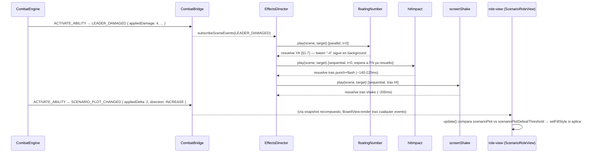

# Spec H2.11 — Daño y Trama visuales (floating numbers + resaltado de umbral)

> Spec técnica del Architect para Programmer. Historia origen: `.ai-studio/memory/backlog.md`, Épica E2,
> "H2.11: Daño y Trama visuales con animaciones". Depende de H2.4 (cerrada: `EffectsDirector`/`JuiceConfig`),
> H2.5 (cerrada: `hitImpact`/`screenShake`, con el fix de `rawAmount` en `ENEMY_DAMAGED`), H2.8 (cerrada:
> `role-view.ts` con vida/Trama como texto plano persistente), H2.10 (cerrada: patrón de recetas de "pulso"
> reaccionando a un evento de dominio, y patrón de estado previo en cierre cuando hace falta).

---

## 0. Qué resuelve esta historia (y qué NO)

### 0.1 Lo que ya existe (no se reconstruye)

- `hitImpact` (H2.5) ya anima punch de escala + flash de tinte sobre el `focusId` resuelto por
  `resolveJuiceTarget` (`effects-director.ts`) al recibir `LEADER_DAMAGED`/`ENEMY_DAMAGED`/`ALLY_DAMAGED`/
  `SCENARIO_PLOT_CHANGED` — pero **nunca muestra un número**, solo la sacudida del objeto.
- `role-view.ts` (H2.8/H2.10) muestra vida/Escudo/Energía/Nivel y Trama/Fase como **texto plano
  persistente**, reescrito completo en cada `render()` — no anima el delta, no distingue "cuánto cambió"
  de "cuánto vale ahora".
- Confirmado en `packages/combat-scene/src/juice/juice-config.ts` (estado real tras H2.4-H2.10, ver bloque
  íntegro más abajo): `SCENARIO_PLOT_CHANGED` **ya** tiene `hitImpact` mapeado (`sequential`) — no es un
  hueco vacío como podría sugerir el resumen de H2.4. Lo que falta es el número, no el impacto.

```ts
// packages/combat-scene/src/juice/juice-config.ts — estado real (líneas relevantes)
LEADER_DAMAGED: [
  { recipeId: 'hitImpact', mode: 'sequential' },
  { recipeId: 'screenShake', mode: 'sequential' },
],
SCENARIO_PLOT_CHANGED: [{ recipeId: 'hitImpact', mode: 'sequential' }],
ALLY_DAMAGED: [{ recipeId: 'hitImpact', mode: 'sequential' }],
ENEMY_DAMAGED: [
  { recipeId: 'hitImpact', mode: 'sequential' },
  { recipeId: 'screenShake', mode: 'sequential' },
],
```

### 0.2 Lo que falta genuinamente

1. **Floating number**: texto efímero (número + signo) que aparece en la posición del objetivo, sube y se
   desvanece — el elemento de "juice" clásico de daño/curación en RPGs/juegos de cartas, ausente hoy.
2. **Resaltado de umbral de Trama**: cuando `scenarioPlot` alcanza `scenarioPlotDefeatThreshold`, el
   Escenario debe señalarse visualmente de forma persistente (no solo un pulso puntual) — hoy
   `createScenarioRoleView` no lee `ctx.scenarioPlotDefeatThreshold` para nada visual, solo para el texto.

### 0.3 Dentro de alcance

1. Receta de juice nueva `floatingNumber`, mapeada como step adicional (no sustituto de `hitImpact`) en
   `LEADER_DAMAGED`, `ENEMY_DAMAGED`, `ALLY_DAMAGED`, `SCENARIO_PLOT_CHANGED`.
2. Función pura `resolveFloatingNumberEntries(event)` que decide, por tipo de evento, qué campo numérico
   exacto se muestra, con qué signo y qué color — sin closure de estado previo (§1.2 explica por qué no
   hace falta, a diferencia de `cooldownReady` en H2.10).
3. Resaltado persistente de umbral de Trama en `createScenarioRoleView` (`role-view.ts`): cambio de color de
   fondo del tile del Escenario cuando `scenarioPlot >= scenarioPlotDefeatThreshold`, evaluado en cada
   `render()` de forma idempotente (mismo criterio de idempotencia que el resto de `BoardView`).
4. Tests unitarios (patrón `FakeJuiceScene`/fake scene ya establecido) + verificación visual con Playwright.

### 0.4 Fuera de alcance (diferido explícitamente, con destino)

- **Sonido** del floating number o del umbral de Trama — H2.13, historia propia de audio.
- **Curación/vida ganada** con floating number verde genérico para el Líder — el motor actual no tiene
  ningún evento de "vida recuperada del Líder" fuera de escudo (`LEADER_SHIELD_GAINED`, sin receta hoy y
  fuera del criterio de aceptación literal de H2.11, que habla solo de "daño y Trama"); no se inventa.
- **Animación de "Trama en umbral" más allá del cambio de color de fondo** (p.ej. parpadeo continuo/loop)
  — el criterio de aceptación pide "se señala visualmente", satisfecho con un color de alerta persistente
  y estable; un loop de parpadeo introduce gestión de vida de tween persistente (cancelar al bajar de
  umbral) que no aporta claridad adicional relevante para esta historia.
- **Iconos de vida sobre Aliados individuales** (barra de vida propia) — ya renderizados por
  `allies-view.ts` de una forma no tocada por esta historia; el floating number de `ALLY_DAMAGED` se posa
  sobre el `focusId` que ya resuelve `resolveJuiceTarget` (el Aliado concreto), reutilizando esa vista
  existente sin modificarla.

---

## 1. Decisiones de diseño

### 1.1 Receta nueva `floatingNumber`, NO ampliación de `hitImpact`

`hitImpact` (H2.5 `HitImpactParams`) resuelve un único `Rectangle` vía `resolveOrCreatePlaceholder` y le
aplica flash+punch — su responsabilidad es "sacudir el game object golpeado", agnóstica del tipo de evento
concreto (no lee campos específicos de `LEADER_DAMAGED` vs `SCENARIO_PLOT_CHANGED`, solo `target.focusId`).
Meter la lógica de "qué número mostrar según el tipo de evento" dentro de `hitImpact` rompería esa
agnosticidad y forzaría a la única función existente a conocer la forma de 4 variantes distintas de
`CombatEvent`.

**Decisión: receta nueva `floatingNumber`**, con su propia función de resolución de campos
(`resolveFloatingNumberEntries`, §1.3) — mismo criterio de separación que ya distingue `hitImpact`
(sacudida agnóstica) de `screenShake` (`computeIntensity`, que sí lee campos concretos del evento,
`screen-shake.ts` líneas 22-40). `floatingNumber` es al número lo que `screenShake` es a la intensidad de
cámara: una receta que interpreta el evento para decidir su parámetro visual, ejecutada en paralelo a
`hitImpact` sobre el mismo evento.

### 1.2 Campo exacto por tipo de evento — sin closure de estado previo (a diferencia de H2.10)

`docs/specs/H2.10_cooldowns_visuales.md` necesitó un `Map` de estado previo en cierre porque
`COOLDOWNS_TICKED.cooldowns` solo da el valor **absoluto** tras el tick, no el delta. **Ese problema NO se
repite aquí**: los 4 eventos relevantes ya traen el delta o el monto real aplicado como campo propio del
evento — no hace falta ningún estado previo recordado por `EffectsDirector` ni por la receta.

| Evento | Campo usado | Por qué (no el que parece obvio a primera vista) |
|---|---|---|
| `LEADER_DAMAGED` | `appliedDamage` | Monto realmente sumado a `leaderDamage` (post-Escudo). `rawAmount` es el daño ANTES de Escudo — mostrarlo daría un número que no corresponde a la vida realmente perdida. Si `appliedDamage === 0` (Escudo absorbió todo, sin Arrollar) se **omite** el floating number — mostrar "-0" es ruido, y `hitImpact`/`absorbedByShield` ya comunican que el golpe llegó sin restar vida (deuda conocida: no hay hoy indicador visual específico de "bloqueado por Escudo"; anotado en §4 como candidato de historia futura, no de esta). |
| `ENEMY_DAMAGED` | `rawAmount` | Mismo hallazgo ya validado en `screen-shake.ts` líneas 22-30 (comentario explícito de H2.5): `rawAmount` es el único monto que el motor realmente suma a `enemyDamage`; `bonusResolvedValue` es el resultado de una `bonusFormula` independiente que puede no representar daño (ej. robar una carta) y el motor NUNCA lo añade a `enemyDamage`, aunque `bonusActivated` sea `true`. Usar `bonusResolvedValue` aquí repetiría el bug ya corregido en H2.5. |
| `ALLY_DAMAGED` | `absorbedByAlly` (sobre el Aliado) + `appliedDamageToLeader` (sobre el Líder, solo si `> 0`) | Dos números, dos posiciones — ver §1.4. `rawAmount` es el golpe antes de repartir entre Aliado/exceso; no es lo que cada objetivo pierde realmente. |
| `SCENARIO_PLOT_CHANGED` | `appliedDelta` | Ya es el delta con signo aplicado (`rawAmount` con signo, `direction === 'INCREASE'` → positivo, `'DECREASE'` → negativo), **antes** del piso en 0 (`events.ts` línea 104-105, comentario explícito del propio tipo). Es exactamente "cuánto cambió", sin necesidad de restar contra un valor previo — a diferencia de `COOLDOWNS_TICKED` en H2.10, este evento no requiere `Map` de cierre. Caso límite documentado: si `scenarioPlot` ya estaba en 0 y `appliedDelta` es más negativo de lo que el piso permite, el número mostrado puede ser mayor en magnitud que la reducción real aplicada (ej. Trama en 1, `appliedDelta: -3` → texto "-3" pero `scenarioPlotAfter` solo bajó 1). Se acepta como comportamiento conocido (igual de fiel a la intención de la jugada que mostrar `scenarioPlotAfter - antes`, que exigiría el mismo problema de estado previo que H2.10 evitó donde pudo) — no se corrige en esta historia. |

### 1.3 Contrato de `resolveFloatingNumberEntries`

```ts
// packages/combat-scene/src/juice/recipes/floating-number.ts (contrato)
export interface FloatingNumberEntry {
  /** `targetId` estable ya nombrado en escena (`FOCUS_ID_LEADER`/`FOCUS_ID_ENEMY`/`FOCUS_ID_SCENARIO`/
   *  `allyInstanceId`) — resuelto vía `resolveOrCreatePlaceholder`, mismo mecanismo que `hitImpact`. */
  readonly focusId: string;
  /** Texto final ya formado, con signo (`"-4"`, `"+2"`). */
  readonly text: string;
  /** Color hex del texto (rojo daño, verde/naranja Trama según dirección — §1.5). */
  readonly color: number;
}

/** Pura, sin acceso a `scene` — decide QUÉ mostrar y DÓNDE, nunca CÓMO animarlo (eso es `floatingNumber.
 *  play()`, §2). Puede devolver 0, 1 o 2 entradas (2 solo en `ALLY_DAMAGED` con Arrollar, §1.4). */
export function resolveFloatingNumberEntries(event: CombatEvent): readonly FloatingNumberEntry[];
```

### 1.4 `ALLY_DAMAGED` con Arrollar: dos floating numbers, dos posiciones

Criterio de aceptación explícito de H2.11: *"El daño absorbido por Aliados se visualiza sobre el Aliado, no
sobre el Líder."* `resolveJuiceTarget` (`effects-director.ts` línea 22) ya resuelve `focusId:
event.allyInstanceId` para este evento — ese es el `focusId` primario que usa `hitImpact` (sacude solo al
Aliado, nunca al Líder, ya correcto desde H2.5). `resolveFloatingNumberEntries` debe:

1. Si `absorbedByAlly > 0`: entrada `{ focusId: event.allyInstanceId, text: "-{absorbedByAlly}", color: DAMAGE_COLOR }`.
2. Si `appliedDamageToLeader > 0` (Arrollar con exceso — GDD §3.7): entrada ADICIONAL
   `{ focusId: FOCUS_ID_LEADER, text: "-{appliedDamageToLeader}", color: DAMAGE_COLOR }` — usando la
   constante `FOCUS_ID_LEADER` importada de `../effects-director` (mismo import que `cooldown-ready.ts` ya
   hace de `abilityIconGroupName`), NO `target.focusId` (que en este evento siempre apunta al Aliado).

### 1.5 Colores: rojo para daño, verde/naranja para Trama según dirección

| Caso | Color | Razonamiento |
|---|---|---|
| `LEADER_DAMAGED` / `ENEMY_DAMAGED` / `ALLY_DAMAGED` (ambas entradas) | `0xe74c3c` (rojo) | Daño siempre es pérdida — un único color inequívoco, sin distinguir "a quién" (la posición ya lo dice). |
| `SCENARIO_PLOT_CHANGED`, `direction === 'DECREASE'` | `0x27ae60` (verde) | Bueno para el jugador (Trama baja) — mismo verde "listo"/positivo que `cooldownReady` (H2.10) ya asocia a CD=0. |
| `SCENARIO_PLOT_CHANGED`, `direction === 'INCREASE'` | `0xe67e22` (naranja) | Malo para el jugador (Trama sube hacia derrota) pero deliberadamente distinto del rojo de daño de vida — criterio de aceptación "Daño > Trama visible con claridad (diferente color de texto)"; usar rojo para ambos violaría ese criterio literal. |

### 1.6 Animación: spawn sobre el objetivo, sube, se desvanece — ~900ms

Por cada `FloatingNumberEntry`: crear un `Phaser.GameObjects.Text` efímero (no nombrado, no reutilizado —
mismo patrón "objeto de un solo uso, autodestruido" que `spawnParticleBurst` de `diceRoll`, H2.5) en la
posición actual de `resolveOrCreatePlaceholder(scene, entry.focusId)` (`x`, `y - OFFSET` para nacer justo
encima del objeto, no centrado sobre él). Tween único:

- `y`: `origin - 60px` en 900ms, `ease: 'Cubic.easeOut'` (sube y frena, no lineal — más "juice" que un
  movimiento constante).
- `alpha`: `1 → 0`, mismo tween (mismo `duration`), consistente con el criterio de aceptación ("floating
  text que... se desvanece").
- Al completar: `text.destroy()`.

### 1.7 `floatingNumber.play()` resuelve su Promise de inmediato — NO espera a que termine el tween

Contraste deliberado con el resto de recetas (`hitImpact`/`screenShake`/`diceRoll`/`cardFlip`), que
resuelven su `Promise` cuando la animación termina, porque `EffectsDirector.resolveEvent` usa esa promesa
para secuenciar el siguiente `step` (`sequential`). `LEADER_DAMAGED`/`ENEMY_DAMAGED` ya encadenan
`hitImpact` (`sequential`) → `screenShake` (`sequential`): el `screenShake` debe disparar justo después del
punch (~140-220ms), NO después de que el número de daño termine de flotar y desvanecerse (~900ms) — eso
rompería el ritmo ya validado en H2.5/H2.10 de "impacto → sacudida de cámara, casi inmediato".

**Decisión:** `floatingNumber.play()` crea el `Text` + tween (que sigue corriendo en background, gestionado
por el propio `scene.tweens`) y devuelve `Promise.resolve()` **inmediatamente**, sin esperar el `onComplete`
del tween. Es un "fire-and-forget dentro del fire-and-forget" ya existente a nivel de
`EffectsDirector.attach` (`effects-director.ts` línea 101, comentario "Fire-and-forget respecto al bus de
eventos de dominio"): el floating number es puramente decorativo y su ciclo de vida no debe condicionar el
temporizado de ningún otro step. Se documenta explícitamente en el código (comentario JSDoc) para que quede
claro que es una desviación intencional del patrón `Promise` = "animación terminada" del resto de recetas,
no un descuido.

### 1.8 Orden en `JuiceConfig`: `floatingNumber` PRIMERO, antes de `hitImpact`

Para que el número nazca en el mismo instante que arranca el punch/flash (no 140-220ms después, que sería
el caso si `floatingNumber` fuera el step siguiente a un `hitImpact` en modo `sequential`, ya que
`resolveEvent` no empieza el step N+1 hasta que el step N `sequential` se resuelve por completo):

```ts
LEADER_DAMAGED: [
  { recipeId: 'floatingNumber', mode: 'parallel' }, // NUEVO — antes de hitImpact, ver §1.8
  { recipeId: 'hitImpact', mode: 'sequential' },
  { recipeId: 'screenShake', mode: 'sequential' },
],
```

Traza de tiempos con este orden (`resolveEvent`, `effects-director.ts` líneas 60-86):
1. `floatingNumber` (`parallel`) → se empuja a `pending`, arranca en t=0, resuelve su promesa en el mismo
   tick (§1.7) — el tween de subida/fade sigue corriendo en background.
2. `hitImpact` (`sequential`) → espera `Promise.all(pending)` (instantáneo, ya resuelto), arranca también
   en t≈0 — punch y número nacen juntos.
3. `screenShake` (`sequential`) → espera a que `hitImpact` termine (~140-220ms) antes de sacudir cámara —
   **sin cambio respecto al comportamiento ya validado en H2.5**, porque `floatingNumber` nunca entra en el
   `pending` que `screenShake` tendría que esperar (ya se resolvió en el paso 1).

Mismo razonamiento y mismo orden (`floatingNumber` primero) para `ENEMY_DAMAGED`, `ALLY_DAMAGED` y
`SCENARIO_PLOT_CHANGED` (estos 2 últimos sin `screenShake` detrás, así que el orden les afecta menos, pero
se mantiene por consistencia y legibilidad de la tabla).

### 1.9 Resaltado de umbral de Trama: estado persistente en `role-view.ts`, no receta de juice

A diferencia del número flotante (transición puntual → receta de `EffectsDirector`), "Trama en umbral" es
un **estado que se mantiene mientras dure la condición** (`scenarioPlot >= scenarioPlotDefeatThreshold`),
verdadero o falso en cada snapshot — mismo criterio de reparto que H2.10 §2.1 ya estableció
("`BoardView` es la fuente de verdad del estado, idempotente, reconstruible desde cualquier snapshot").
Se implementa dentro de `createScenarioRoleView.update()` (`role-view.ts`), comparando
`snapshot.scenarioPlot` contra `ctx.scenarioPlotDefeatThreshold` (ya presente en `BoardViewContext` desde
H2.8) en cada llamada — sin tween, cambio de `fillColor` directo del `Rectangle` del tile (mismo patrón
"sin tween, spec §0.3" que el propio `role-view.ts` ya declara para su primer render):

```ts
// packages/combat-scene/src/view/role-view.ts (extensión)
const SCENARIO_COLOR = 0x8e44ad; // violeta (sin cambio)
const SCENARIO_ALERT_COLOR = 0xc0392b; // NUEVO H2.11 — mismo rojo de alerta que ENEMY_COLOR

export function createScenarioRoleView(scene: Phaser.Scene): RoleView {
  const { rect, text } = createRoleTile(scene, SCENARIO_POSITION, SCENARIO_COLOR, FOCUS_ID_SCENARIO);

  return {
    update(snapshot: CombatStateSnapshot, ctx: BoardViewContext): void {
      const atThreshold = snapshot.scenarioPlot >= ctx.scenarioPlotDefeatThreshold;
      rect.setFillStyle(atThreshold ? SCENARIO_ALERT_COLOR : SCENARIO_COLOR); // NUEVO H2.11
      text.setText(
        `Escenario — Trama ${snapshot.scenarioPlot}/${ctx.scenarioPlotDefeatThreshold} | ` +
          `Fase ${snapshot.scenarioPhase.phaseNumber}/${snapshot.scenarioPhase.totalPhases}`,
      );
    },
  };
}
```

`createRoleTile` debe devolver también `rect` (hoy solo devuelve `text` en el destructuring de
`createLeaderRoleView`/`createEnemyRoleView`, pero la función interna ya retorna ambos — cambio trivial de
destructuring, sin tocar la firma de `createRoleTile`).

`rect.setFillStyle(...)` llamado en cada `render()` es idempotente por construcción (Phaser no acumula
estado al reasignar el mismo color dos veces) — coherente con el resto de `BoardView`.

---

## 2. Contrato de la receta `floatingNumber`

```ts
// packages/combat-scene/src/juice/recipes/floating-number.ts (contrato, no implementación completa)
import type Phaser from 'phaser';
import type { CombatEvent } from '@collector/domain-combat';
import type { JuiceRecipe } from '../juice-recipe';
import { resolveOrCreatePlaceholder } from './placeholder';
import { FOCUS_ID_LEADER } from '../effects-director';

const RISE_DISTANCE_PX = 60;
const SPAWN_Y_OFFSET_PX = -20; // nace justo por encima del objeto, no centrado
const DURATION_MS = 900;
const DAMAGE_COLOR = 0xe74c3c;
const PLOT_INCREASE_COLOR = 0xe67e22;
const PLOT_DECREASE_COLOR = 0x27ae60;

export interface FloatingNumberEntry {
  readonly focusId: string;
  readonly text: string;
  readonly color: number;
}

/** §1.2-§1.4 — pura, sin acceso a `scene`. Exportada para test unitario aislado (§4.1). */
export function resolveFloatingNumberEntries(event: CombatEvent): readonly FloatingNumberEntry[] {
  switch (event.type) {
    case 'LEADER_DAMAGED':
      return event.appliedDamage > 0
        ? [{ focusId: FOCUS_ID_LEADER, text: `-${event.appliedDamage}`, color: DAMAGE_COLOR }]
        : [];
    case 'ENEMY_DAMAGED':
      return [{ focusId: 'enemy', text: `-${event.rawAmount}`, color: DAMAGE_COLOR }];
    case 'ALLY_DAMAGED': {
      const entries: FloatingNumberEntry[] = [];
      if (event.absorbedByAlly > 0) {
        entries.push({ focusId: event.allyInstanceId, text: `-${event.absorbedByAlly}`, color: DAMAGE_COLOR });
      }
      if (event.appliedDamageToLeader > 0) {
        entries.push({ focusId: FOCUS_ID_LEADER, text: `-${event.appliedDamageToLeader}`, color: DAMAGE_COLOR });
      }
      return entries;
    }
    case 'SCENARIO_PLOT_CHANGED':
      return [
        {
          focusId: 'scenario',
          text: event.appliedDelta > 0 ? `+${event.appliedDelta}` : `${event.appliedDelta}`,
          color: event.direction === 'INCREASE' ? PLOT_INCREASE_COLOR : PLOT_DECREASE_COLOR,
        },
      ];
    default:
      return [];
  }
}

function spawnFloatingText(scene: Phaser.Scene, entry: FloatingNumberEntry): void {
  const anchor = resolveOrCreatePlaceholder(scene, entry.focusId);
  const label = scene.add.text(anchor.x, anchor.y + SPAWN_Y_OFFSET_PX, entry.text, {
    fontSize: '28px',
    color: `#${entry.color.toString(16).padStart(6, '0')}`,
    fontStyle: 'bold',
  });
  label.setOrigin(0.5, 0.5);

  scene.tweens.add({
    targets: label,
    y: label.y - RISE_DISTANCE_PX,
    alpha: 0,
    duration: DURATION_MS,
    ease: 'Cubic.easeOut',
    onComplete: () => label.destroy(),
  });
}

/** H2.11 — floating number de daño/Trama. NO espera a que termine su propia animación para resolver
 *  (§1.7) — desviación intencional del contrato "Promise = animación completa" del resto de recetas,
 *  para no retrasar `screenShake` (LEADER_DAMAGED/ENEMY_DAMAGED) ni ningún step `sequential` posterior. */
export const floatingNumber: JuiceRecipe = {
  id: 'floatingNumber',
  play(scene, target): Promise<void> {
    const entries = resolveFloatingNumberEntries(target.event);
    for (const entry of entries) {
      spawnFloatingText(scene, entry);
    }
    return Promise.resolve();
  },
};
```

Nota: `FOCUS_ID_LEADER`/`FOCUS_ID_ENEMY`/`FOCUS_ID_SCENARIO` ya se exportan desde `effects-director.ts`
(líneas 9-11) — se reutilizan literalmente en vez de repetir los strings `'leader'`/`'enemy'`/`'scenario'`
(en el contrato de arriba se usan literales por brevedad de lectura; la implementación real de Programmer
debe importar las constantes, no repetir los strings, mismo criterio que `cooldown-ready.ts` ya sigue
importando `FOCUS_ID_LEADER`... — Programmer debe usar el import real, ver checklist §6).

---

## 3. `juice-config.ts` — 4 entradas editadas

```ts
// packages/combat-scene/src/juice/juice-config.ts (edición)
LEADER_DAMAGED: [
  { recipeId: 'floatingNumber', mode: 'parallel' }, // NUEVO
  { recipeId: 'hitImpact', mode: 'sequential' },
  { recipeId: 'screenShake', mode: 'sequential' },
],
SCENARIO_PLOT_CHANGED: [
  { recipeId: 'floatingNumber', mode: 'parallel' }, // NUEVO
  { recipeId: 'hitImpact', mode: 'sequential' },
],
ALLY_DAMAGED: [
  { recipeId: 'floatingNumber', mode: 'parallel' }, // NUEVO
  { recipeId: 'hitImpact', mode: 'sequential' },
],
ENEMY_DAMAGED: [
  { recipeId: 'floatingNumber', mode: 'parallel' }, // NUEVO
  { recipeId: 'hitImpact', mode: 'sequential' },
  { recipeId: 'screenShake', mode: 'sequential' },
],
```

Ninguna otra entrada de `JUICE_CONFIG` cambia. `recipes/index.ts` registra `floatingNumber` en el
`JuiceRecipeRegistry` real, mismo patrón que las 5 recetas anteriores.

`resolveJuiceTarget` (`effects-director.ts`) **no necesita ningún caso nuevo**: los 4 tipos de evento ya
tienen un `focusId` resuelto (§0.1); `floatingNumber` ignora ese `focusId` de nivel `JuiceTarget` y en su
lugar lee `target.event` directamente para poder emitir 0-2 entradas con sus propios `focusId` internos
(§1.4) — mismo criterio que `diceRoll` ya ignora cualquier `focusId` de nivel superior y opera sobre
`target.event.pool` directamente.

---

## 4. Diagrama lógico



---

## 5. Verificación

### 5.1 Test unitario — `floating-number.test.ts` (mismo patrón que `hit-impact.test.ts`/`cooldown-ready.test.ts`)

Nuevo archivo `packages/combat-scene/src/juice/recipes/floating-number.test.ts`:

1. `resolveFloatingNumberEntries` con `LEADER_DAMAGED { appliedDamage: 4 }` → 1 entrada,
   `focusId: FOCUS_ID_LEADER`, `text: '-4'`, color rojo.
2. `resolveFloatingNumberEntries` con `LEADER_DAMAGED { appliedDamage: 0 }` (Escudo absorbió todo) → 0
   entradas (§1.2).
3. `resolveFloatingNumberEntries` con `ENEMY_DAMAGED { rawAmount: 5, bonusResolvedValue: 99,
   bonusActivated: true }` → entrada usa `5` (no `99`) — test de regresión explícito del bug de
   `bonusResolvedValue` ya corregido en H2.5 para `screenShake`, replicado aquí para esta receta.
4. `resolveFloatingNumberEntries` con `ALLY_DAMAGED { absorbedByAlly: 3, appliedDamageToLeader: 0 }` → 1
   entrada sobre el Aliado, ninguna sobre el Líder.
5. `resolveFloatingNumberEntries` con `ALLY_DAMAGED { absorbedByAlly: 5, appliedDamageToLeader: 2 }`
   (Arrollar con exceso) → 2 entradas: Aliado `-5`, Líder `-2` (`focusId: FOCUS_ID_LEADER`).
6. `resolveFloatingNumberEntries` con `SCENARIO_PLOT_CHANGED { appliedDelta: 2, direction: 'INCREASE' }` →
   texto `'+2'`, color naranja.
7. `resolveFloatingNumberEntries` con `SCENARIO_PLOT_CHANGED { appliedDelta: -3, direction: 'DECREASE' }` →
   texto `'-3'`, color verde.
8. `floatingNumber.play()` resuelve su `Promise` de forma síncrona/inmediata (no espera `onComplete` del
   tween) — verificable con un fake scene cuyo `tweens.add` no invoque `onComplete` nunca; el test falla si
   la `Promise` no resuelve de todos modos.
9. Evento sin mapeo (p.ej. `TURN_ENDED`) pasado por error a `play()` → 0 entradas, ninguna llamada a
   `scene.add.text`.

### 5.2 Test unitario — `role-view.test.ts` (extensión, resaltado de umbral)

1. `createScenarioRoleView().update(snapshot, ctx)` con `snapshot.scenarioPlot < ctx.
   scenarioPlotDefeatThreshold` → `rect.fillColor === SCENARIO_COLOR` (violeta, sin cambio).
2. Mismo `update()` con `snapshot.scenarioPlot >= ctx.scenarioPlotDefeatThreshold` → `rect.fillColor ===
   SCENARIO_ALERT_COLOR` (rojo de alerta).
3. Dos llamadas consecutivas con el mismo snapshot en umbral → mismo color ambas veces (idempotencia).
4. Transición: `update()` con Trama por debajo del umbral, luego `update()` con Trama en umbral → color
   cambia de violeta a rojo entre ambas llamadas.

### 5.3 Test — `juice-config.test.ts` / `recipes/index.test.ts` (extensión)

Verificar que las 4 entradas editadas (§3) incluyen `{ recipeId: 'floatingNumber', mode: 'parallel' }` como
primer step; que `recipes/index.ts` registra `floatingNumber` con `id === 'floatingNumber'`.

### 5.4 Verificación visual — Playwright (extensión de `combat-scene-smoke.spec.ts`)

1. Levantar `CombatScene` con el contenido 2×2×2 real.
2. Disparar una acción real que resulte en `LEADER_DAMAGED`/`ENEMY_DAMAGED` (mismo mecanismo que otros
   smoke tests que despachan comandos contra el `CombatBridge` de prueba).
3. Captura de 2-3 frames consecutivos tras el golpe: el número `-N` visible sobre el objetivo, en
   posición más alta y más transparente en cada frame sucesivo (evidencia de la subida + fade).
4. Disparar una acción que incremente `scenarioPlot` hasta `scenarioPlotDefeatThreshold` (contenido de
   juguete real, valor conocido de `packages/data/scenarios/*.json`) → captura confirmando el tile del
   Escenario en color rojo de alerta.
5. No gate de CI — verificación manual complementaria, mismo criterio que el resto de specs de juice.

---

## 6. Cambios de dependencias/tooling — resumen

- `packages/combat-scene/src/juice/recipes/floating-number.ts` — **nuevo** (§2).
- `packages/combat-scene/src/juice/recipes/floating-number.test.ts` — **nuevo** (§5.1).
- `packages/combat-scene/src/juice/recipes/index.ts` — registro de `floatingNumber`.
- `packages/combat-scene/src/juice/juice-config.ts` — 4 entradas editadas (§3): `LEADER_DAMAGED`,
  `SCENARIO_PLOT_CHANGED`, `ALLY_DAMAGED`, `ENEMY_DAMAGED` ganan el step `floatingNumber` como primer
  elemento.
- `packages/combat-scene/src/view/role-view.ts` — `createScenarioRoleView` gana resaltado de umbral
  (§1.9); `createRoleTile` cambia su destructuring interno para exponer también `rect` (sin cambio de
  firma).
- `packages/combat-scene/src/view/role-view.test.ts` — casos nuevos de umbral (§5.2).
- `packages/combat-scene/src/juice/juice-config.test.ts` / `recipes/index.test.ts` — extensión (§5.3).
- Ningún cambio a `@collector/combat-bridge`, `CombatCommand`/`CombatEvent`, ni al motor de dominio
  (`packages/domain/combat`) — todos los campos usados (`appliedDamage`, `rawAmount`, `absorbedByAlly`,
  `appliedDamageToLeader`, `appliedDelta`, `direction`) ya existen en `events.ts` desde H1.6/H1.15/H1.16.
- Ningún cambio a `BoardViewContext` — `scenarioPlotDefeatThreshold` ya está disponible desde H2.8.
- `eslint.config.mjs` — sin cambios (ningún import cruza límites nuevos).

---

## 7. Candidato para `decisions.md` (a registrar por Coordinator/Architect tras cierre de la historia)

> **H2.11: los floating numbers de daño/Trama usan directamente campos de delta/monto ya existentes en
> los eventos de dominio (`appliedDamage`, `rawAmount`, `absorbedByAlly`, `appliedDamageToLeader`,
> `appliedDelta`) — a diferencia de H2.10 (`COOLDOWNS_TICKED`), ninguno de los 4 eventos relevantes
> necesitó estado previo recordado en cierre por `EffectsDirector`, porque el motor ya emite el delta
> aplicado, no solo el valor absoluto resultante.** Patrón reutilizable: antes de asumir que hace falta un
> `Map` de estado previo (patrón H2.10), revisar si el evento de dominio ya trae el delta como campo propio
> — evita complejidad innecesaria.
>
> **`floatingNumber` es la primera receta cuya `Promise` resuelve antes de que termine su propia
> animación**, por diseño (§1.7) — precedente a tener en cuenta para futuras recetas puramente decorativas
> que no deban condicionar el temporizado de otros steps `sequential` del mismo evento.

---

## 8. Checklist de Definition of Done para Programmer

- [ ] `packages/combat-scene/src/juice/recipes/floating-number.ts` creado (§2): `resolveFloatingNumberEntries`
      exportada y pura, `floatingNumber` receta registrada en `recipes/index.ts`.
- [ ] `resolveFloatingNumberEntries` usa `appliedDamage` (`LEADER_DAMAGED`), `rawAmount` (`ENEMY_DAMAGED`,
      NO `bonusResolvedValue`), `absorbedByAlly`+`appliedDamageToLeader` (`ALLY_DAMAGED`, 0-2 entradas),
      `appliedDelta`+`direction` (`SCENARIO_PLOT_CHANGED`) — exactamente como §1.2/§2.
- [ ] `LEADER_DAMAGED { appliedDamage: 0 }` no genera floating number (§1.2).
- [ ] `floatingNumber.play()` resuelve su `Promise` sin esperar el `onComplete` del tween (§1.7) —
      verificado por test §5.1 punto 8.
- [ ] `juice-config.ts`: `LEADER_DAMAGED`, `SCENARIO_PLOT_CHANGED`, `ALLY_DAMAGED`, `ENEMY_DAMAGED` ganan
      `{ recipeId: 'floatingNumber', mode: 'parallel' }` como PRIMER step de su array (§3, orden importa
      para el timing de `screenShake`, §1.8).
- [ ] `role-view.ts`: `createScenarioRoleView` cambia `fillColor` del tile a `SCENARIO_ALERT_COLOR` cuando
      `scenarioPlot >= scenarioPlotDefeatThreshold`, revierte a `SCENARIO_COLOR` en caso contrario, en cada
      `render()` (idempotente) (§1.9).
- [ ] Colores: rojo (`0xe74c3c`) para todo daño; verde (`0x27ae60`) Trama `DECREASE`; naranja (`0xe67e22`)
      Trama `INCREASE` (§1.5).
- [ ] Tests nuevos: `floating-number.test.ts` (§5.1, 9 casos), extensión `role-view.test.ts` (§5.2, 4
      casos), extensión `juice-config`/`recipes/index` test (§5.3).
- [ ] Verificación visual Playwright (§5.4) ejecutada manualmente, capturas adjuntas a la entrega (no gate
      de CI).
- [ ] `npm run build`, `npm run lint`, `npm run typecheck`, `npm run test` (raíz) pasan en verde.
- [ ] Ningún cambio a `@collector/combat-bridge`, `CombatCommand`/`CombatEvent`, ni al motor de dominio.
- [ ] Candidato de `decisions.md` (§7) trasladado por Coordinator/Architect al cierre de la historia.
