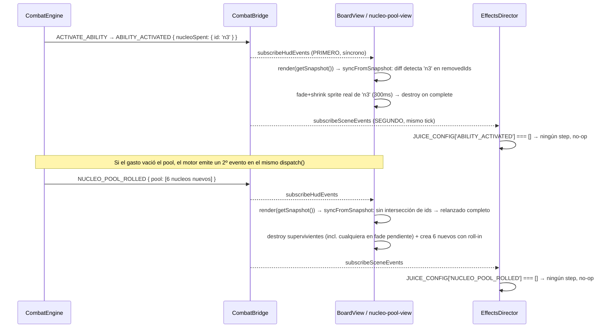

# Spec H2.12 — Animaciones de Núcleos gastados y pool nuevo rolleado

> Spec técnica del Architect para Programmer. Historia origen: `.ai-studio/memory/backlog.md`, Épica
> E2, "H2.12: Animaciones de Núcleos gastados y pool nuevo rolleado". Depende de H2.4 (cerrada:
> `EffectsDirector`/`JuiceConfig`), H2.5 (cerrada: `diceRoll`), H2.8 (cerrada: `nucleo-pool-view.ts`,
> `BoardView`), H2.11 (cerrada: último precedente de receta de juice y de estado en cierre).

---

## 0. Qué resuelve esta historia (y qué NO)

### 0.1 Hallazgo crítico que redefine el enfoque: el orden de entrega del `CombatBridge` hace inviable
la solución "obvia" de receta de juice sobre el sprite real

`createCombatBridge` (`packages/combat-bridge/src/combat-bridge.ts` líneas 46-55) reenvía cada
`CombatEvent` a **ambos** canales de forma **síncrona y en un orden fijo**: `hudBus.emit(event)` primero,
`sceneBus.emit(event)` después, dentro del mismo `engine.subscribe(...)`. `CombatScene.create()`
(`scenes/CombatScene.ts` líneas 85-89) conecta `BoardView.render(...)` a `subscribeHudEvents` y
`EffectsDirector` a `subscribeSceneEvents`. Consecuencia verificada leyendo `combat-engine.ts`
(líneas 946-961: el Núcleo se elimina de `this.nucleoPool` **antes** de emitir `ABILITY_ACTIVATED`):

> Para CUALQUIER evento, cuando `EffectsDirector` (canal scene) recibe el evento y podría reaccionar, el
> `BoardView` (canal hud) **ya se ejecutó** para ese mismo evento — y `nucleo-pool-view.ts` (H2.8) ya
> destruyó y recreó el pool completo reflejando el estado YA sin el Núcleo gastado.

Esto significa que **ninguna receta de `EffectsDirector`/`JuiceConfig` puede animar el sprite real de
`nucleo-pool-view.ts` antes de su destrucción** — el sprite ya no existe (fue destruido en el `render()`
disparado por el canal hud, milisegundos/microtareas antes de que el canal scene procese el mismo evento).
Este hallazgo cierra la pregunta abierta del encargo ("¿hace falta una desviación del patrón placeholder
vs. persistente?") con una respuesta distinta a la hipótesis de partida: **no es que haga falta una
receta especial que opere sobre el sprite real — es que es arquitectónicamente imposible que una receta
de juice (canal scene) llegue a tiempo**, dado el orden hud-antes-que-scene ya fijado desde H2.3 y
reafirmado en cada spec posterior. Cambiar ese orden global tendría radio de impacto sobre las ~14
entradas ya cerradas de `JUICE_CONFIG` — fuera de alcance y sin necesidad, ver §1.1.

### 0.2 Lo que ya existe (no se reconstruye)

- `nucleo-pool-view.ts` (H2.8): `syncFromSnapshot(snapshot)` destruye TODOS los `Rectangle`/`Text` del
  pool anterior y crea uno nuevo por cada `NucleoInstance` del snapshot actual, en cada llamada. Sin
  animación. Confirmado por el propio comentario del archivo ("`NUCLEO_POOL_ROLLED` no lleva `focusId`,
  así que ningún juice necesita `getByName` sobre un Núcleo individual" — línea 18) que la intención
  original de H2.8 era, explícitamente, NO exponer los dados a resolución por nombre desde juice.
- `diceRoll` (H2.5, `juice/recipes/dice-roll.ts`): recibe `NUCLEO_POOL_ROLLED` vía `JUICE_CONFIG`
  (`NUCLEO_POOL_ROLLED: [{ recipeId: 'diceRoll', mode: 'parallel' }]`) y crea sus **propios**
  `Rectangle` efímeros (`scene.add.rectangle(...)`, línea 64 de `dice-roll.ts`) — nunca toca los
  sprites reales de `nucleo-pool-view.ts`. Confirmado: opera en `params.poolOrigin ?? DEFAULT_PLACEHOLDER_POSITION`
  (`{x:540, y:960}`, la posición fija del Escenario, `placeholder.ts` línea 17) mientras que el pool
  REAL se pinta en `NUCLEO_POOL_ROW_Y = 1450`, `x = 200 + index*140` (`board-layout.ts`). **Los dos
  conjuntos de dados no solo son objetos distintos — hoy aparecen en coordenadas de pantalla distintas**,
  ninguna alineada con el tablero real. Dado que además, por §0.1, el canal hud ya pintó los dados reales
  ESTÁTICOS antes de que `diceRoll` dispare, el efecto real hoy es: "6 dados reales aparecen de golpe en
  su fila, y 500ms de dados fantasma ruedan y explotan en partículas sobre el tile del Escenario,
  encima de su HUD de texto" — confirma la sospecha del encargo: es ruido visual desconectado, no una
  mejora.

### 0.3 Alcance literal del criterio de aceptación (backlog.md)

> "Evento `ABILITY_ACTIVATED` dispara animación de desaparición del Núcleo (0.3s)."

`ABILITY_ACTIVATED.nucleoSpent` (`events.ts` línea 33) es un campo **obligatorio** (nunca `null`) —
tanto para activación de habilidad de Líder/Enemigo (`handleActivateAbility`) como para acción de
Secuaz (`RESOLVE_MINION_ACTION` vía el mismo `executeAbilityEffect` compartido, `combat-engine.ts`
línea 1584). Esta historia anima la desaparición del Núcleo identificado por
`event.nucleoSpent.id` en ambos casos — mismo evento, mismo campo, sin distinguir origen.

**Gap conocido, fuera de alcance explícito:** `PLAY_CARD` también puede gastar un Núcleo
(`handlePlayCard`, `combat-engine.ts` líneas 1753-1757) pero **no emite ningún evento con el id del
Núcleo gastado** — ni `CARD_PLAYED` (`events.ts` línea 250, sin campo `nucleoSpent`) ni ningún otro.
El criterio de aceptación literal de H2.12 solo pide reaccionar a `ABILITY_ACTIVATED`; este caso queda
sin animación de desaparición individual (el pool simplemente reflejará el Núcleo ausente en el
siguiente `render()`, sin fade, mismo comportamiento instantáneo de hoy) — se documenta como candidato
de historia futura en §7, no se inventa un evento de dominio nuevo aquí.

### 0.4 Dentro de alcance

1. Rediseño de `nucleo-pool-view.ts` para que `syncFromSnapshot` compare el pool anterior contra el
   nuevo (diff por `id`) en vez de destruir-todo-siempre, y anime dos transiciones sobre los
   **sprites reales y persistentes**:
   - Núcleo presente antes y ausente ahora (gastado) → fade+shrink 300ms, luego destrucción.
   - Pool completo reemplazado (relanzado, `NUCLEO_POOL_ROLLED`) → destrucción instantánea de los
     supervivientes + creación de los 6 nuevos con animación de "dado rodando" (rotación+escala+
     partícula), reutilizando la matemática pura ya validada en `diceRoll` (H2.5), extraída a un
     módulo compartido — **no delegado a `EffectsDirector`**, por §0.1.
2. Extracción de `rotationDegreesFor` (y el patrón de `particleBurst`) de `juice/recipes/dice-roll.ts`
   a un módulo neutral de `view/` para reutilización sin duplicación ni dependencia inversa view→juice.
3. Retirada de la entrada `NUCLEO_POOL_ROLLED: [{ recipeId: 'diceRoll', ... }]` de `JUICE_CONFIG`
   (pasa a `[]`) — el "dado rodando" pasa a vivir en `nucleo-pool-view.ts`, no en el canal de juice.
   `diceRoll` (receta, archivo, tests unitarios) **no se borra** — queda sin wiring de producción, ver
   §1.4 para el razonamiento de conservarla.
4. Actualización de `board-view.test.ts` (caso existente que este cambio de comportamiento vuelve
   incorrecto, ver §1.5) + tests nuevos de `nucleo-pool-view.ts` (no existía archivo de test propio
   hasta ahora — H2.8 solo lo cubría indirectamente vía `board-view.test.ts`).
5. Verificación visual con Playwright mostrando un Núcleo desapareciendo con fade al gastarlo y el
   pool relanzándose con dados rodando en su posición real.

### 0.5 Fuera de alcance (diferido explícitamente, con destino)

- **Animación de reposicionamiento (slide) de los Núcleos supervivientes cuando el índice de alguno
  cambia** tras retirarse uno del medio del array (p. ej. se gasta el Núcleo en índice 2 de 6; los de
  índice 3-5 deberían "deslizarse" a 2-4 para cerrar el hueco). Esta historia solo pide animar la
  desaparición del gastado — el reposicionamiento de los supervivientes se resuelve con un salto
  instantáneo a su nueva posición (sin tween), igual de "sin salto raro" que el resto de `BoardView`
  hoy (ver §1.2 punto 3). Candidato de pulido futuro, no de esta historia.
- **Sonido** del Núcleo gastado / del relanzado — H2.13, historia propia de audio (mismo criterio ya
  usado en H2.10/H2.11).
- **Animación de gasto de Núcleo vía `PLAY_CARD`** — gap de evento de dominio, §0.3, no se inventa
  aquí.
- **Cambiar el orden de entrega `hudBus`/`sceneBus` de `CombatBridge`** — descartado en §0.1 por
  radio de impacto sobre toda la tabla de `JUICE_CONFIG` ya cerrada; no aporta nada que la solución de
  §1.1 no resuelva ya de forma más simple y sin riesgo.

---

## 1. Decisiones de diseño

### 1.1 Mecanismo elegido: la animación vive en `nucleo-pool-view.ts` (capa `BoardView`), NO en
`EffectsDirector`/`JuiceConfig`

Justificado por §0.1: dado que el canal hud siempre entrega el evento a `BoardView` antes que el canal
scene lo entregue a `EffectsDirector`, y `nucleo-pool-view.ts` es la única capa con acceso a los
sprites reales en el instante exacto en que el pool cambia, **`nucleo-pool-view.ts` debe animar la
transición él mismo**, comparando el snapshot anterior contra el nuevo dentro de la misma llamada a
`syncFromSnapshot`. Esto es exactamente la alternativa "más simple" que el encargo dejaba abierta como
opción B — se adopta como única solución viable, no como preferencia entre dos igual de válidas.

Esto es una **desviación documentada** del principio "juice opera sobre placeholders efímeros,
`BoardView` opera sobre sprites persistentes sin animación" que H2.4/H2.5/H2.8 establecieron — pero la
desviación no consiste en que juice invada `BoardView` (lo que el encargo proponía como hipótesis 1);
consiste en lo contrario: **`BoardView` gana una responsabilidad de animación de transición propia**,
que hasta ahora nunca había necesitado (H2.10/H2.11 animan reacciones puntuales vía juice sobre
placeholders que apuntan a sprites ya existentes de `BoardView`, sin que `BoardView` mismo anime nada).
Se registra como candidato de `decisions.md` (§7).

### 1.2 Contrato de `nucleo-pool-view.ts` (reescrito)

```ts
// packages/combat-scene/src/view/nucleo-pool-view.ts (contrato)
export interface NucleoPoolView {
  /** Compara el pool del snapshot anterior (estado interno, inicialmente vacío) contra
   *  `snapshot.nucleoPool` y anima la transición según el caso (§1.2 punto 1-3) en vez de
   *  destruir-y-recrear siempre. Sigue siendo síncrono/idempotente en el sentido de que llamar dos
   *  veces con el MISMO snapshot no produce ninguna animación ni cambio (diff vacío) — pero YA NO
   *  es "reconstruible desde cero sin memoria": mantiene estado interno (último pool visto) para
   *  poder diferenciar "igual" de "cambiado". */
  syncFromSnapshot(snapshot: CombatStateSnapshot): void;
}
```

Algoritmo de `syncFromSnapshot(snapshot)` (Programmer implementa; nombres de variables sugeridos, no
literales):

1. Sea `previousPool` el array de `NucleoInstance` visto en la última llamada (estado de cierre,
   inicial `[]` — primera llamada real de `CombatScene.create()`, sin animación, ver punto 4).
   Sea `newPool = snapshot.nucleoPool`.
2. Calcular `previousIds = new Set(previousPool.map(n => n.id))`,
   `newIds = new Set(newPool.map(n => n.id))`.
3. **Caso relanzado completo** (`NUCLEO_POOL_ROLLED`): se detecta estructuralmente, sin leer el tipo
   de evento (`nucleo-pool-view.ts` no recibe el `CombatEvent`, solo el snapshot — mismo criterio que
   el resto de `BoardView`), como "ninguna intersección entre `previousIds` y `newIds`, y
   `previousPool.length > 0`" (si `previousPool` está vacío, es el primer render — punto 4, no un
   relanzado). Cuando se detecta:
   - Para cada sprite vivo trackeado internamente (incluyendo cualquiera todavía en fade-out
     pendiente del punto 3 de una llamada anterior, si la hubiera): `scene.tweens.killTweensOf(rect)`
     + `rect.destroy()` + `text.destroy()` — nunca dejar un tween huérfano corriendo sobre un objeto
     ya destruido.
   - Para cada `NucleoInstance` de `newPool`, crear el `Rectangle`+`Text` en su posición final
     (`x`/`y` calculados igual que hoy por índice) pero arrancando la animación de "dado rodando":
     mismo tween de `angle`/`scale` que `diceRoll` (H2.5) ya define — `angle: {from: 0, to:
     rotationDegreesFor(nucleo.value)}`, `scale: {from: 1.2, to: 1}`, `duration: 500`, `ease:
     'Cubic.easeOut'` — seguido de `particleBurst` al completar (misma matemática, extraída a módulo
     compartido, §1.3). El `Rectangle`/`Text` reales YA llevan `setInteractive().setData('targetId',
     ...)` desde su creación (igual que hoy) — son tocables durante la animación, sin bloqueo de
     input adicional pedido por esta historia.
4. **Caso primer render** (`previousPool` vacío): crear cada sprite estático, sin animación —
   comportamiento idéntico al actual (H2.8), consistente con la decisión ya registrada en `events.ts`
   ("la tirada inicial no emite evento, solo se refleja en `getSnapshot()`" — no hay "roll" que animar
   la primera vez que se monta la escena).
5. **Caso parcial** (ni relanzado completo ni primer render): calcular
   `removedIds = previousIds \ newIds`, `keptIds = previousIds ∩ newIds`.
   - Para cada id en `removedIds`: iniciar tween de fade+shrink sobre su `Rectangle`/`Text` reales
     (`alpha: 1→0`, `scale: 1→0.6`, `duration: 300`, `ease: 'Cubic.easeIn'`); `onComplete`:
     `rect.destroy()` + `text.destroy()` + eliminar de la estructura interna de seguimiento. El
     sprite permanece trackeado como "pendiente de destrucción" durante esos 300ms para que, si
     llegara un relanzado completo a mitad de la animación (punto 3), se le aplique
     `killTweensOf`+`destroy()` inmediato sin esperar a que su propio `onComplete` corra.
   - Para cada id en `keptIds`: si su índice en `newPool` cambió respecto a su índice en
     `previousPool`, reposicionar el `Rectangle`/`Text` existentes a la nueva `x`/`y` sin tween (salto
     instantáneo, §0.5) — **nunca destruir/recrear un id conservado**; si el índice no cambió, no
     tocar el sprite en absoluto.
   - `newIds \ previousIds` en este caso debería ser siempre vacío dado cómo el motor muta
     `nucleoPool` (nunca añade una ficha suelta fuera de un relanzado completo) — si llegara a ocurrir
     (defensivo), crear estático sin animación, mismo criterio que el punto 4.
6. Actualizar el estado interno `previousPool = newPool` (una copia, no la misma referencia del
   snapshot) al final de la llamada.

### 1.3 Extracción de la matemática de "dado rodando" a un módulo compartido `view/`

Mismo patrón ya usado en H2.8 §6 para `NUCLEO_COLOR_HEX` (extraída de `dice-roll.ts` a
`view/nucleo-colors.ts` para que `nucleo-pool-view.ts` la reutilizara sin duplicar la tabla, "sin
cambio de valores/comportamiento"). Esta historia repite el mismo movimiento con la función pura de
rotación y el patrón de `particleBurst`:

- **Nuevo** `packages/combat-scene/src/view/nucleo-roll-animation.ts`:
  - `export function rotationDegreesFor(nucleoValue: number): number` — literalmente la función hoy
    privada en `dice-roll.ts` líneas 26-29, movida sin cambios (`360 * (2 + clampedValue/4)`, con el
    mismo `clamp` a `[0,4]`).
  - `export function spawnDieParticleBurst(scene, x, y, tint): void` — la lógica hoy privada
    `spawnParticleBurst` de `dice-roll.ts` líneas 31-42, movida sin cambios (mismas constantes
    `PARTICLE_QUANTITY=8`, `PARTICLE_DESTROY_DELAY_MS=300`, `PARTICLE_TEXTURE_KEY='__WHITE'`).
- `juice/recipes/dice-roll.ts` pasa a importar ambas funciones desde `../../view/nucleo-roll-animation`
  en vez de definirlas localmente — **sin cambio de comportamiento para `dice-roll.ts` ni sus tests
  existentes** (`dice-roll.test.ts` sigue pasando tal cual, sigue probando la receta completa).
- `nucleo-pool-view.ts` importa las mismas dos funciones para su propio uso en el caso "relanzado
  completo" (§1.2 punto 3).

Se evita así toda dependencia inversa `view/ → juice/recipes/` (que rompería la dirección de import
`combat-scene → domain` de forma más sutil, dentro del propio paquete) — ambos consumidores importan
de un módulo neutral de `view/`, exactamente como ya ocurre con `NUCLEO_COLOR_HEX`.

### 1.4 `diceRoll` (receta H2.5) se desconecta de `NUCLEO_POOL_ROLLED` mas NO se borra

`JUICE_CONFIG.NUCLEO_POOL_ROLLED` pasa de `[{ recipeId: 'diceRoll', mode: 'parallel' }]` a `[]` —
comentario explícito en el código señalando que la animación de relanzado ahora vive en
`nucleo-pool-view.ts` (§1.1/§1.2) y que mantener este mapeo produciría exactamente el bug descrito en
§0.2 (dados fantasma en la posición del Escenario, encima de dados reales ya estáticos).

**Se conserva el archivo `dice-roll.ts` y sus tests** (`dice-roll.test.ts`, `recipes/index.ts` sigue
registrando `diceRoll` en `JuiceRecipeRegistry`) — no queda huérfano por accidente sino documentado: es
la única receta hoy sin ninguna entrada de `JUICE_CONFIG` apuntándola, candidata a reutilizarse si en
el futuro el motor incorpora un evento de "relanzar un único dado" (p. ej. una keyword de carta que
fuerza el reroll de un Núcleo específico sin vaciar el pool) — ese caso SÍ sería compatible con el
patrón receta-sobre-placeholder porque no competiría con un sprite real recién destruido en el mismo
instante. Se anota en §7 para `decisions.md`.

### 1.5 Test existente que este cambio de comportamiento invalida — debe actualizarse, no ignorarse

`board-view.test.ts`, caso `'render() llamado dos veces con el mismo snapshot no duplica roles ni
tiles de mano; solo el pool de Núcleos se recrea'` (líneas 80-117) afirma hoy, con el MISMO `id: 'n1'`
en ambas llamadas a `render(snapshot)`, que el segundo render **destruye** el `Rectangle` del primero y
crea uno **distinto** (`expect(nucleoRectsAlive[0]).not.toBe(nucleoRectsAfterFirst[0])`, línea 116).
Esa era la garantía correcta bajo el diseño H2.8 ("destruye-y-recrea siempre, sin fuga"). Bajo el nuevo
diseño (§1.2 punto 5, caso "parcial" con `keptIds`), un id presente en ambos snapshots **debe
conservar la misma referencia** de `Rectangle`/`Text` — la aserción anterior queda invertida.

**Programmer debe reescribir este caso** para reflejar el contrato nuevo: llamar `render()` dos veces
con el MISMO snapshot (mismo id `n1` ambas veces) debe producir el MISMO `Rectangle` vivo en ambas
lecturas (`nucleoRectsAlive[0] === nucleoRectsAfterFirst[0]`), sin ninguna destrucción de por medio —
y añadir un caso nuevo que sí ejercite destrucción real (snapshot con un id que desaparece entre
llamadas, ver §4.1).

---

## 2. `nucleo-pool-view.ts` — cambios de estructura interna

- Sustituir los arrays paralelos `dieRects: Rectangle[]` / `dieTexts: Text[]` (indexados por posición)
  por un `Map<NucleoInstanceId, { rect: Rectangle; text: Text }>` — necesario para localizar por `id`
  en el diff de §1.2, en vez de por índice posicional (el índice ya no es una clave estable entre
  renders si el pool se reordena por retirada).
- Mantener `previousPool: readonly NucleoInstance[]` como estado de cierre adicional (§1.2 punto 6).
- El resto del contrato público (`syncFromSnapshot(snapshot)`, sin otros métodos) no cambia — sigue
  invocado exactamente igual desde `board-view.ts` (`nucleoPoolView.syncFromSnapshot(snapshot)`, sin
  cambios en `board-view.ts` más allá de los ya existentes).

---

## 3. `juice-config.ts` — 1 entrada editada

```ts
// packages/combat-scene/src/juice/juice-config.ts (edición)
NUCLEO_POOL_ROLLED: [], // H2.12 — antes: [{ recipeId: 'diceRoll', mode: 'parallel' }].
                        // El "dado rodando" ahora anima el sprite REAL en nucleo-pool-view.ts
                        // (BoardView), no un placeholder efímero de EffectsDirector — ver spec
                        // H2.12 §0.1/§1.1 (el canal hud siempre entrega antes que el canal scene,
                        // así que ninguna receta llegaría a tiempo sobre el sprite real).
ABILITY_ACTIVATED: [], // sin cambio — la animación de "Núcleo gastado" tampoco pasa por juice
                        // (mismo razonamiento, §1.1); `nucleo-pool-view.ts` la resuelve internamente
                        // leyendo el diff de snapshot, no el evento.
```

Ninguna otra entrada de `JUICE_CONFIG` cambia. Tests que hoy verifican el wiring
`NUCLEO_POOL_ROLLED → diceRoll` (`effects-director.test.ts` línea 68, `recipes/index.test.ts` línea
76) deben actualizarse para reflejar que ya no hay receta mapeada (mismo patrón que cualquier entrada
`[]` del resto de la tabla — verificar `JUICE_CONFIG.NUCLEO_POOL_ROLLED` es `[]`, no que dispare
`diceRoll`).

---

## 4. Diagrama lógico



---

## 5. Verificación

### 5.1 Test unitario nuevo — `nucleo-pool-view.test.ts` (no existía archivo propio hasta ahora)

Usando el mismo `FakeBoardScene`/utilidades ya presentes en `board-view.test.ts`:

1. Primer `syncFromSnapshot` con pool de 2 Núcleos → 2 tiles creados, estáticos, sin ningún tween
   registrado (caso "primer render", §1.2 punto 4).
2. Segundo `syncFromSnapshot` con el MISMO pool (mismos ids) → ningún tile destruido, mismas
   referencias de `Rectangle`/`Text` que el primer render (caso "parcial", `keptIds` completo,
   `removedIds` vacío).
3. `syncFromSnapshot` con un pool que retira exactamente 1 id de los 2 anteriores → el `Rectangle`
   del id retirado sigue vivo inmediatamente después de la llamada (no destruido en el mismo tick,
   está en fade) pero con un tween de `alpha`/`scale` registrado; tras completar el tween
   (`fake.completeTween(...)`), el `Rectangle`/`Text` quedan destruidos. El id superviviente no fue
   tocado (misma referencia, sin tween).
4. `syncFromSnapshot` con un pool completamente disjunto del anterior (0 ids en común, relanzado) →
   todos los sprites anteriores destruidos inmediatamente (incluido uno que estuviera a mitad de fade
   de un caso anterior — `killTweensOf` invocado antes de `destroy()`), 6 sprites nuevos creados con
   tween de `angle`/`scale` (mismos valores que `dice-roll.test.ts` ya verifica: `scale: {from: 1.2,
   to: 1}`, `duration: 500`, `ease: 'Cubic.easeOut'`) y `particleBurst` disparado al completar cada
   uno (reutilizando `createFakeJuiceScene`/`fake.recordedTweens`/`fake.recordedParticles`, mismo
   patrón que `dice-roll.test.ts`).
5. Reposicionamiento sin tween: pool de 3 ids, se retira el del medio (índice 1) quedando 2
   supervivientes → sus nuevas posiciones `x` (recalculadas por índice 0 y 1) se aplican de forma
   inmediata (sin tween) a los `Rectangle`/`Text` existentes.

### 5.2 Test — `nucleo-roll-animation.test.ts` (extracción, si Programmer decide un test dedicado) o
cobertura vía `dice-roll.test.ts` sin cambios

`rotationDegreesFor`/`spawnDieParticleBurst` ya están cubiertas indirectamente por `dice-roll.test.ts`
(sin cambios tras la extracción, §1.3) — un test unitario directo de las funciones puras es opcional
pero recomendado dado que ahora dos consumidores dependen de ellas.

### 5.3 Test — `board-view.test.ts` (actualización obligatoria, §1.5)

- Reescribir el caso de líneas 80-117 para afirmar identidad de referencia CONSERVADA entre dos
  renders con el mismo id (contrato invertido respecto a H2.8).
- Añadir caso nuevo: `render()` con pool `[n1]`, luego `render()` con pool `[]` (n1 retirado) →
  `n1` no destruido inmediatamente tras el segundo `render()` sin dejar avanzar el tween (está en
  fade); tras completar el tween, destruido.

### 5.4 Test — `juice-config.test.ts` / `effects-director.test.ts` / `recipes/index.test.ts`
(actualización)

Actualizar las aserciones que hoy esperan `diceRoll` disparado por `NUCLEO_POOL_ROLLED` — deben pasar
a verificar que `JUICE_CONFIG.NUCLEO_POOL_ROLLED` es `[]` y que ningún step se dispara para ese
evento (mismo patrón que cualquier otra entrada vacía de la tabla, p. ej. `TURN_ENDED`).

### 5.5 Verificación visual — Playwright (nuevo `nucleo-animation-smoke.spec.ts`, mismo harness que
`board-view-smoke.spec.ts`)

1. Levantar `CombatScene` con el contenido 2×2×2 real, esperar pintura inicial del pool (sin
   animación, screenshot de referencia).
2. Disparar (vía `window.__combatBridge.dispatch(...)`) una acción real que gaste un Núcleo sin vaciar
   el pool → captura de 2-3 frames consecutivos mostrando el dado gastado encogiéndose/desvaneciéndose
   en su posición REAL de la fila de Núcleos (no en el centro de pantalla).
3. Disparar acciones hasta vaciar el pool y forzar `NUCLEO_POOL_ROLLED` → captura de 2-3 frames
   mostrando los 6 dados nuevos rotando/escalando en su fila real (`NUCLEO_POOL_ROW_Y`), sin ningún
   dado fantasma superpuesto sobre el tile del Escenario.
4. Sin gate de CI — verificación manual complementaria, mismo criterio que el resto de specs de juice.

---

## 6. Cambios de dependencias/tooling — resumen

- `packages/combat-scene/src/view/nucleo-roll-animation.ts` — **nuevo** (§1.3): `rotationDegreesFor`,
  `spawnDieParticleBurst`, extraídas de `dice-roll.ts` sin cambio de comportamiento.
- `packages/combat-scene/src/view/nucleo-pool-view.ts` — reescrito (§1.2/§2): diff por `id` en vez de
  destruir-todo-siempre; `Map<NucleoInstanceId, {rect, text}>` + `previousPool` como estado de cierre;
  anima fade de gastados y roll-in de relanzados directamente sobre los sprites reales.
- `packages/combat-scene/src/view/nucleo-pool-view.test.ts` — **nuevo** (§5.1).
- `packages/combat-scene/src/juice/recipes/dice-roll.ts` — importa `rotationDegreesFor`/
  `spawnDieParticleBurst` desde `../../view/nucleo-roll-animation` en vez de definirlas localmente;
  sin cambio de comportamiento (§1.3). `dice-roll.test.ts` sin cambios.
- `packages/combat-scene/src/juice/juice-config.ts` — `NUCLEO_POOL_ROLLED` pasa de
  `[{ recipeId: 'diceRoll', ... }]` a `[]` (§3).
- `packages/combat-scene/src/juice/effects-director.test.ts`,
  `packages/combat-scene/src/juice/recipes/index.test.ts` — actualizar aserciones de wiring de
  `NUCLEO_POOL_ROLLED` (§5.4).
- `packages/combat-scene/src/view/board-view.test.ts` — reescribir caso de líneas 80-117 + caso nuevo
  (§5.3).
- `packages/combat-scene/e2e/nucleo-animation-smoke.spec.ts` — **nuevo** (§5.5).
- Ningún cambio a `@collector/combat-bridge`, `CombatCommand`/`CombatEvent`, ni al motor de dominio
  (`packages/domain/combat`) — `ABILITY_ACTIVATED.nucleoSpent.id` y `NUCLEO_POOL_ROLLED.pool` ya
  existen desde H1.3/H1.14.
- `eslint.config.mjs` — sin cambios (el nuevo import de `dice-roll.ts` hacia `view/` ya es una
  dirección permitida, mismo patrón que `NUCLEO_COLOR_HEX` desde H2.8).

---

## 7. Candidato para `decisions.md` (a registrar por Coordinator/Architect tras cierre de la historia)

> **H2.12: el orden de entrega fijo del `CombatBridge` (canal hud siempre antes que canal scene,
> `combat-bridge.ts` línea 52-54) hace inviable que una receta de `EffectsDirector`/`JuiceConfig`
> anime un sprite real de `BoardView` antes de que `BoardView` lo destruya/recree reaccionando al
> mismo evento.** Cuando una animación necesita actuar sobre el estado de un sprite real justo ANTES
> de una transición que `BoardView` aplicaría instantáneamente, la solución es que la propia vista de
> `BoardView` (aquí, `nucleo-pool-view.ts`) asuma la animación internamente (diff de snapshot anterior
> vs. nuevo), no que se intente enrutar por el canal de juice. Patrón reutilizable para futuras
> historias que quieran animar "algo real que va a desaparecer/cambiar de golpe" en vez de "una
> reacción puntual superpuesta a algo que ya existe" (que sí es el caso servido correctamente por
> `hitImpact`/`floatingNumber`/`cooldownReady`, H2.5/H2.10/H2.11).
>
> **`nucleo-pool-view.ts` deja de ser una vista "destruye-y-recrea-todo-siempre, sin memoria" (H2.8) y
> pasa a mantener estado de cierre (`previousPool`) para diferenciar Núcleos conservados de
> retirados/añadidos** — precedente de que no toda vista de `BoardView` necesita ser "puramente
> reconstruible desde el snapshot actual sin memoria" cuando el objetivo es animar una transición
> específica en vez de solo reflejar un estado.
>
> **`diceRoll` (H2.5) queda sin ninguna entrada de `JUICE_CONFIG` que la dispare tras H2.12** — la
> receta y sus tests se conservan como candidata a reutilización futura (p. ej. reroll de un único
> Núcleo sin vaciar el pool), no se elimina código válido sin un reemplazo funcional real.

---

## 8. Checklist de Definition of Done para Programmer

- [ ] `packages/combat-scene/src/view/nucleo-roll-animation.ts` creado (§1.3): `rotationDegreesFor` y
      `spawnDieParticleBurst` exportadas, idénticas en comportamiento a las versiones privadas
      previas de `dice-roll.ts`.
- [ ] `dice-roll.ts` importa ambas funciones del nuevo módulo; `dice-roll.test.ts` sigue en verde sin
      modificaciones.
- [ ] `nucleo-pool-view.ts` reescrito: `Map<NucleoInstanceId, {rect, text}>` + `previousPool` en
      cierre; diff de 3 casos implementado exactamente como §1.2 (primer render sin animación,
      relanzado completo con roll-in, parcial con fade de retirados + reposición instantánea de
      supervivientes sin destruir/recrear).
- [ ] Núcleo gastado (`removedIds`) anima fade (`alpha 1→0`) + shrink (`scale 1→0.6`) en 300ms,
      `ease: 'Cubic.easeIn'`, destruye `Rectangle`+`Text` al completar — nunca antes.
- [ ] Relanzado completo: `killTweensOf` antes de `destroy()` sobre cualquier sprite (incluidos los
      en fade pendiente); 6 nuevos con tween `angle`/`scale` idéntico a `diceRoll` H2.5 + partícula al
      completar, en la posición REAL del pool (`NUCLEO_POOL_ROW_Y`, no en la posición del Escenario).
- [ ] Núcleos conservados (`keptIds`) NUNCA se destruyen/recrean; solo se reposicionan sin tween si su
      índice cambió.
- [ ] `juice-config.ts`: `NUCLEO_POOL_ROLLED` es `[]` (§3); comentario explicando por qué.
- [ ] `effects-director.test.ts` / `recipes/index.test.ts` actualizados para reflejar que
      `NUCLEO_POOL_ROLLED` ya no dispara `diceRoll` (§5.4).
- [ ] `board-view.test.ts`: caso de líneas 80-117 reescrito con la aserción invertida (misma
      referencia conservada, no destruida) + caso nuevo de retirada real con fade (§5.3).
- [ ] `nucleo-pool-view.test.ts` nuevo con los 5 casos de §5.1.
- [ ] Verificación visual Playwright (`nucleo-animation-smoke.spec.ts`, §5.5) ejecutada manualmente,
      capturas adjuntas a la entrega (no gate de CI) — confirmando que ya no aparece ningún dado
      fantasma sobre el tile del Escenario.
- [ ] `npm run build`, `npm run lint`, `npm run typecheck`, `npm run test` (raíz) pasan en verde.
- [ ] Ningún cambio a `@collector/combat-bridge`, `CombatCommand`/`CombatEvent`, ni al motor de
      dominio (`packages/domain/combat`).
- [ ] Candidato de `decisions.md` (§7) trasladado por Coordinator/Architect al cierre de la historia.
