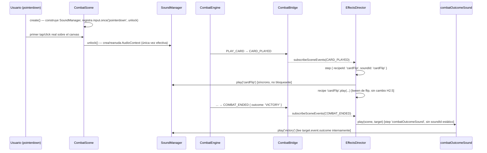

# Spec H2.13 — Audio: Sound Manager, `JuiceStep.soundId`, 5 cues mínimas (stub/tonos genéricos)

> Spec técnica del Architect para Programmer. Historia origen: `.ai-studio/memory/backlog.md`, Épica E2,
> "H2.13: Audio — sistema básico de cues y mapeo evento→sonido en JuiceConfig". Depende de H2.4 (cerrada:
> `EffectsDirector`/`JuiceConfig`), H2.5 (cerrada: `hitImpact`/`cardFlip`), H2.7 (cerrada: `InputAdapter`,
> gestos genéricos), H2.11 (cerrada: patrón de recetas que leen el evento para decidir un parámetro
> dinámico, `resolveFloatingNumberEntries`), H2.12 (cerrada: `NUCLEO_POOL_ROLLED`/`ABILITY_ACTIVATED` ya
> NO disparan ningún `JuiceStep` — el "dado rodando" vive en `nucleo-pool-view.ts`, no en juice).
>
> Decisión de alcance ya validada por el Director (`decisions.md`, "2026-07-06 — Cierre de dudas de
> alcance de la Épica E2"): **audio de H2.13 es stub/tonos genéricos para este MVP, no audio real.** Esta
> spec implementa tonos sintéticos vía Web Audio API (`AudioContext.createOscillator()`); NO se cargan ni
> buscan assets `.mp3`/`.ogg`. El arte de sonido real queda diferido a una iteración posterior.

---

## 0. Qué resuelve esta historia (y qué NO)

### 0.1 Por qué no `scene.sound`/Phaser Sound Manager ni `tone()`

El encargo de `backlog.md` (redactado antes de que este Architect verificara la versión de Phaser)
asumía "integrar el Sound Manager nativo de Phaser" cargando "assets vía `preload()`". Verificado:

- Phaser 3.80 no expone ningún `tone()` sintético — su Sound Manager (`Phaser.Sound.WebAudioSoundManager`)
  está diseñado para reproducir **archivos de audio decodificados** (`this.load.audio(key, url)` en
  `preload()`), no para generar osciladores en runtime. Adoptarlo literalmente obligaría a conseguir o
  fabricar 5 archivos de audio reales — exactamente lo que la decisión de alcance del Director descarta
  para este MVP.
- La alternativa pragmática y ya insinuada por el propio encargo ("generar tonos sintéticos directamente
  con Web Audio API, `AudioContext.createOscillator()`") es la que se adopta aquí, **fuera** del Sound
  Manager de Phaser: un módulo `packages/combat-scene/src/audio/` propio, con su propia interfaz
  `SoundManager`, construido y probado exactamente con el mismo criterio de inyectabilidad/fakes que
  `EffectsDirector`/`InputAdapter` (H2.4/H2.7) — nunca tocando `window.AudioContext` directamente desde
  código de producción sin pasar por una fábrica sustituible en tests.
- **Se conserva el nombre "Sound Manager"** del criterio de aceptación (`SoundManager` interfaz), pero es
  una abstracción propia de `combat-scene`, no el `Phaser.Sound.BaseSoundManager`. Se documenta como
  desviación explícita (candidato de `decisions.md`, §7).

### 0.2 Lo que ya existe (no se reconstruye)

- `JuiceStep`/`JuiceRecipe`/`JuiceRecipeRegistry` (`juice-recipe.ts`, H2.4): contrato estable, `recipeId`
  **obligatorio**. Esta historia añade un campo **opcional** (`soundId?`), no toca `recipeId`/`params`/`mode`.
- `EffectsDirector.resolveEvent` (`effects-director.ts`, H2.4): recorre `steps` en orden, respetando
  `parallel`/`sequential`. Este mecanismo de secuenciación **no cambia** — el sonido se añade como un
  efecto lateral síncrono y no bloqueante disparado en el mismo instante en que cada step arranca,
  análogo al criterio ya sentado por `floatingNumber` (H2.11 §1.7: "fire-and-forget dentro del
  fire-and-forget", nunca condiciona el timing de otros steps).
- `RECIPE_REGISTRY` (`recipes/index.ts`, H2.5-H2.11): registro estático id→receta. Esta historia lo
  convierte en una **fábrica** `createRecipeRegistry(soundManager)` porque una única receta nueva
  (`combatOutcomeSound`, §1.4) necesita el `SoundManager` inyectado en su clausura para decidir
  dinámicamente qué cue reproducir según el `outcome` del evento — mismo patrón ya usado por
  `createCooldownReadyRecipe()` (H2.10, clausura con `Map` de estado) y `resolveFloatingNumberEntries`
  (H2.11, función pura que lee el evento para decidir un parámetro).
- `CombatScene.create()` (H2.6/H2.7/H2.9): construye `EffectsDirector`/`InputAdapter`/`BoardView` y
  limpia todo en `SHUTDOWN`. Esta historia añade la construcción del `SoundManager` con el mismo patrón.

### 0.3 Dentro de alcance

1. Módulo `packages/combat-scene/src/audio/` nuevo: interfaz `SoundManager`, tipo `SoundCueId` (5
   valores), tabla `SOUND_CUE_CONFIG` (frecuencia/forma de onda/duración por cue), implementación real
   `createWebAudioSoundManager()` sobre Web Audio API cruda, y utilidad de test `createFakeAudioContext()`.
2. `JuiceStep` extendido con `soundId?: SoundCueId` (contrato literal del criterio de aceptación).
3. `EffectsDirector` extendido: recibe un `SoundManager` inyectado (3er parámetro de
   `createEffectsDirector`) y, para cada `step` con `soundId` definido, llama `soundManager.play(step.soundId)`
   de forma síncrona y no bloqueante en el instante en que el step arranca.
4. Receta nueva `soundOnly` (no-op visual, existe solo para satisfacer `recipeId` obligatorio en eventos
   sin ninguna receta visual — `NUCLEO_POOL_ROLLED`) y receta nueva `combatOutcomeSound` (lee
   `event.outcome` para elegir `victory`/`defeat`, único caso que no cabe en el campo estático `soundId`).
5. 5 entradas de `JUICE_CONFIG` editadas/creadas para cubrir las 5 cues mínimas (§1.5).
6. Desbloqueo de audio en el primer gesto real del usuario (`pointerdown` de la escena), NO en
   `create()` — política de autoplay de navegadores (§1.6).
7. Verificación: tests unitarios con `AudioContext` fake (mock que registra `createOscillator`/
   `frequency.setValueAtTime`/`start`/`stop`) + flag de debug logueable en consola, capturable por
   Playwright vía `page.on('console')`, como verificación manual complementaria (§5).

### 0.4 Fuera de alcance (diferido explícitamente, con destino)

- **Audio real (archivos `.mp3`/`.ogg`, música, mezcla, volumen configurable por el usuario)** — iteración
  posterior, una vez el feel visual esté validado (decisión ya cerrada del Director).
- **Más de 5 cues** — el criterio de aceptación pide un mínimo de 5; esta historia no cubre sonido para
  `ALLY_DAMAGED`, `COOLDOWNS_TICKED`, `PHASE_CHANGED`, etc. Candidatas de expansión futura de la tabla
  `SOUND_CUE_CONFIG`/`JUICE_CONFIG`, mismo patrón ya establecido, sin rediseño.
- **Control de volumen/mute persistente entre sesiones** — no hay ningún requisito de UI de opciones en
  esta historia; `SoundManager` no expone `setVolume`/`mute` todavía.
- **Integración con `Phaser.Sound` real** — descartada en §0.1, no se retoma aquí ni se dejan hooks para
  ella (YAGNI: si el arte de sonido real llega, se puede introducir en ese momento con menor certeza hoy
  de qué necesitará).

---

## 1. Decisiones de diseño

### 1.1 `SoundManager`: interfaz propia, Web Audio crudo, inyectable

```ts
// packages/combat-scene/src/audio/sound-manager.ts (contrato)
export type SoundCueId = 'diceRoll' | 'cardFlip' | 'hit' | 'victory' | 'defeat';

export interface SoundManager {
  /** Debe llamarse dentro del handler síncrono de un gesto real del usuario (§1.6) — crea/reanuda el
   *  `AudioContext` interno si aún no existe o está `suspended`. Idempotente: llamadas repetidas tras
   *  el primer desbloqueo son no-op barato (comprueba `state` antes de actuar). */
  unlock(): void;
  /** Reproduce el tono sintético de `cueId` (§1.3). Si el `AudioContext` todavía no existe (nunca se
   *  llamó `unlock()`, o el entorno no soporta Web Audio — p.ej. jsdom en tests/SSR), no-op silencioso
   *  (con log opcional si `debug`, §1.7) — nunca lanza. */
  play(cueId: SoundCueId): void;
}
```

Abstracción mínima de Web Audio para permitir un fake en tests (jsdom no implementa `AudioContext`):

```ts
// packages/combat-scene/src/audio/audio-context-like.ts (contrato)
export interface AudioContextLike {
  readonly currentTime: number;
  readonly destination: unknown;
  readonly state: 'suspended' | 'running' | 'closed';
  createOscillator(): OscillatorLike;
  createGain(): GainNodeLike;
  resume(): Promise<void>;
}
export interface OscillatorLike {
  type: OscillatorType;
  readonly frequency: { setValueAtTime(value: number, time: number): void };
  connect(destination: unknown): unknown;
  start(when?: number): void;
  stop(when?: number): void;
}
export interface GainNodeLike {
  readonly gain: {
    setValueAtTime(value: number, time: number): void;
    exponentialRampToValueAtTime(value: number, endTime: number): void;
  };
  connect(destination: unknown): unknown;
}
```

`createWebAudioSoundManager(options?)`:

```ts
// packages/combat-scene/src/audio/sound-manager.ts (contrato, continuación)
export interface CreateWebAudioSoundManagerOptions {
  /** Inyección de test (§4.1) — evita depender de `window.AudioContext` global. Por defecto, busca
   *  `globalThis.AudioContext ?? globalThis.webkitAudioContext`; si ninguno existe (jsdom, SSR), el
   *  `SoundManager` queda permanentemente en modo no-op silencioso. */
  readonly audioContextFactory?: () => AudioContextLike;
  /** Por defecto `false`. Si `true`, cada `unlock()`/`play()` loguea vía `console.log`
   *  (`'[SoundManager] ...'`) — verificación manual con Playwright (§5.3/§1.7). */
  readonly debug?: boolean;
}

export function createWebAudioSoundManager(options?: CreateWebAudioSoundManagerOptions): SoundManager;
```

**Construcción perezosa del `AudioContext`**: nunca se instancia en la fábrica ni en `unlock()` si ya
existe uno — solo la PRIMERA llamada a `unlock()` (o a `play()`, defensivamente, por si algo invoca
`play()` antes de cualquier gesto) intenta `audioContextFactory()`. Si la fábrica no encuentra ningún
constructor disponible, `ensureContext()` devuelve `null` y el `SoundManager` queda en no-op permanente
para esa instancia — nunca lanza una excepción por falta de soporte de Web Audio.

### 1.2 Tabla de cues — `SOUND_CUE_CONFIG`

Un tono por cue, cada uno con forma de onda/frecuencia/duración distinta para ser identificable pese a
ser sintético (criterio de aceptación explícito: "5 sonidos distintos... cada uno con un tono/frecuencia
distinta"):

```ts
// packages/combat-scene/src/audio/sound-cues.ts (contrato)
export interface SoundCueDefinition {
  readonly waveform: OscillatorType;
  readonly frequencyHz: number;
  readonly durationMs: number;
}

export const SOUND_CUE_CONFIG: Record<SoundCueId, SoundCueDefinition> = {
  diceRoll: { waveform: 'square', frequencyHz: 220, durationMs: 150 },
  cardFlip: { waveform: 'sine', frequencyHz: 440, durationMs: 120 },
  hit: { waveform: 'sawtooth', frequencyHz: 150, durationMs: 100 },
  victory: { waveform: 'sine', frequencyHz: 880, durationMs: 400 },
  defeat: { waveform: 'sine', frequencyHz: 110, durationMs: 500 },
};
```

`playTone(ctx, def)` (privada, no exportada): crea 1 `oscillator` + 1 `gainNode`, conecta
`oscillator → gainNode → ctx.destination`, fija `oscillator.type`/`oscillator.frequency` en
`ctx.currentTime`, aplica una envolvente simple (`gain` en un valor audible fijo, con
`exponentialRampToValueAtTime` hacia casi-cero al final de `durationMs` para evitar un "click" audible de
corte abrupto), y agenda `oscillator.start(ctx.currentTime)` / `oscillator.stop(ctx.currentTime +
durationMs/1000)`. Sin dependencia de `setTimeout`/`scene.time` — toda la temporización la gestiona el
propio `AudioContext` vía su reloj (`currentTime`), consistente con cómo Web Audio está diseñado para
agendar sonido con precisión sin acoplarse al loop de Phaser.

### 1.3 `JuiceStep.soundId?` — campo estático, forwarding genérico desde `EffectsDirector`

```ts
// packages/combat-scene/src/juice/juice-recipe.ts (edición)
export interface JuiceStep {
  readonly recipeId: string;
  readonly params?: Record<string, unknown>;
  readonly mode: JuiceStepMode;
  /** NUEVO H2.13 — cue de audio estático a reproducir cuando este step arranca (independiente de si
   *  su receta visual tiene éxito/fracasa). `undefined` = sin sonido para este step, criterio de
   *  aceptación satisfecho por las 5 entradas de §1.5; el resto de la tabla queda sin cambio. Casos que
   *  necesitan decidir el cue dinámicamente según el payload del evento (p.ej. victoria vs. derrota, un
   *  único campo `soundId` no puede bifurcar) NO usan este campo — usan una receta dedicada que lee
   *  `target.event` y llama al `SoundManager` ella misma (§1.4), mismo criterio ya sentado por
   *  `resolveFloatingNumberEntries`/`computeIntensity` para parámetros visuales dependientes del evento. */
  readonly soundId?: SoundCueId;
}
```

`EffectsDirector.resolveEvent` (edición mínima, sin alterar el algoritmo de `parallel`/`sequential` ya
validado en H2.4/H2.5):

```ts
// packages/combat-scene/src/juice/effects-director.ts (edición de resolveEvent)
async function resolveEvent(
  steps: readonly JuiceStep[],
  target: JuiceTarget,
  scene: Phaser.Scene,
  recipes: JuiceRecipeRegistry,
  soundManager: SoundManager, // NUEVO H2.13
): Promise<void> {
  let pending: Promise<void>[] = [];

  for (const step of steps) {
    const recipe = recipes[step.recipeId];
    if (!recipe) {
      throw new Error(/* sin cambio */);
    }

    if (step.soundId) {
      soundManager.play(step.soundId); // NUEVO H2.13 — síncrono, no bloqueante, no participa en `pending`
    }

    if (step.mode === 'parallel') {
      pending.push(recipe.play(scene, target, step.params ?? {}));
    } else {
      await Promise.all(pending);
      pending = [];
      await recipe.play(scene, target, step.params ?? {});
    }
  }

  await Promise.all(pending);
}
```

`createEffectsDirector` gana un 3er parámetro obligatorio:

```ts
export function createEffectsDirector(
  config: JuiceConfig,
  recipes: JuiceRecipeRegistry,
  soundManager: SoundManager, // NUEVO H2.13
): EffectsDirector;
```

**Por qué obligatorio y no opcional con default silencioso**: mismo criterio que `recipes` — forzar que
cada caller (producción y tests) decida explícitamente qué `SoundManager` usar (real en `CombatScene`,
fake/espía en tests) en vez de esconder un default que oculte la ausencia de sonido por accidente. Todos
los callers existentes (`CombatScene.ts`, `main.ts`, `effects-director.test.ts`,
`recipes/index.test.ts`) deben actualizarse — ver checklist §8.

### 1.4 `combatOutcomeSound` — única receta que decide el cue dinámicamente

`COMBAT_ENDED.outcome` es `'VICTORY' | 'DEFEAT'` (`combat-status.ts`) — un único `JuiceStep.soundId`
estático no puede bifurcar entre `victory`/`defeat` según el payload. Se resuelve con una receta dedicada,
mismo patrón de clausura que `createCooldownReadyRecipe` (H2.10):

```ts
// packages/combat-scene/src/juice/recipes/combat-outcome-sound.ts (contrato)
import type { SoundManager } from '../../audio/sound-manager';
import type { JuiceRecipe } from '../juice-recipe';

/** H2.13 — única receta de esta historia con acceso directo al `SoundManager` (vía clausura, mismo
 *  criterio que `createCooldownReadyRecipe`/H2.10 con su `Map` de estado). Lee `target.event.outcome`
 *  para decidir `victory` vs `defeat` — caso que `JuiceStep.soundId` estático no puede cubrir (§1.3).
 *  Resuelve su Promise de inmediato (mismo criterio que `floatingNumber`, H2.11 §1.7): el sonido es
 *  puramente decorativo y no debe condicionar ningún step secuencial posterior (aquí no hay ninguno,
 *  pero se mantiene el criterio por consistencia). */
export function createCombatOutcomeSoundRecipe(soundManager: SoundManager): JuiceRecipe {
  return {
    id: 'combatOutcomeSound',
    play(_scene, target): Promise<void> {
      if (target.event.type === 'COMBAT_ENDED') {
        soundManager.play(target.event.outcome === 'VICTORY' ? 'victory' : 'defeat');
      }
      return Promise.resolve();
    },
  };
}
```

### 1.5 Receta `soundOnly` — no-op visual para eventos sin receta visual propia

`NUCLEO_POOL_ROLLED` mapea a `[]` desde H2.12 (el "dado rodando" real vive en `nucleo-pool-view.ts`, no en
`EffectsDirector`) — pero `JuiceStep.recipeId` sigue siendo obligatorio, así que un cue de sonido en este
evento necesita un `recipeId` que exista en el registro aunque no haga nada visual:

```ts
// packages/combat-scene/src/juice/recipes/sound-only.ts (contrato)
import type { JuiceRecipe } from '../juice-recipe';

/** H2.13 — receta sin efecto visual, existe únicamente para llevar un `soundId` en eventos que ya no
 *  tienen ninguna receta visual mapeada (p.ej. NUCLEO_POOL_ROLLED, retirado de JUICE_CONFIG en H2.12).
 *  El propio sonido lo dispara EffectsDirector vía `step.soundId` (§1.3), no esta receta — `play()` es
 *  un no-op puro que resuelve de inmediato. */
export const soundOnly: JuiceRecipe = {
  id: 'soundOnly',
  play(): Promise<void> {
    return Promise.resolve();
  },
};
```

### 1.6 Las 5 cues mínimas — mapeo evento→cue en `JUICE_CONFIG`

| # | Cue (`SoundCueId`) | Evento(s) | Mecanismo |
|---|---|---|---|
| 1 | `diceRoll` | `NUCLEO_POOL_ROLLED` | `soundId` estático sobre nueva entrada `{ recipeId: 'soundOnly', mode: 'parallel', soundId: 'diceRoll' }` |
| 2 | `cardFlip` | `CARD_PLAYED` | `soundId` estático añadido al step `cardFlip` ya existente |
| 3 | `hit` | `LEADER_DAMAGED`, `ENEMY_DAMAGED` | `soundId` estático añadido al step `hitImpact` ya existente en ambos eventos |
| 4 | `victory` | `COMBAT_ENDED` (`outcome: 'VICTORY'`) | Vía receta `combatOutcomeSound` (§1.4), no `soundId` estático |
| 5 | `defeat` | `COMBAT_ENDED` (`outcome: 'DEFEAT'`) | Vía receta `combatOutcomeSound` (§1.4), mismo step que #4 |

Nota sobre el criterio de aceptación literal ("Evento `ABILITY_ACTIVATED` → `cardFlip` sound (si es
válido en ese evento, p.ej. no siempre)"): verificado contra `JUICE_CONFIG` real (H2.12),
`ABILITY_ACTIVATED` mapea a `[]` (ninguna receta visual desde H2.4, confirmado de nuevo en H2.12) — nunca
tuvo `cardFlip`. El evento que sí dispara `cardFlip` es `CARD_PLAYED` (bajar una carta de mano). Esta
spec corrige el mapeo al evento real en vez de inventar un step en `ABILITY_ACTIVATED` que no tiene
ninguna contraparte visual — mismo criterio de fidelidad al estado real de `JUICE_CONFIG` que H2.11/H2.12
ya aplicaron sobre lecturas desactualizadas del backlog original.

### 1.7 Autoplay policy de navegadores: desbloqueo en el primer `pointerdown` de la escena

Los navegadores modernos bloquean la creación/reanudación de un `AudioContext` (`state: 'suspended'`)
hasta que ocurre un gesto de usuario real (click/tap/keydown) dentro de la misma pila de llamadas
síncrona. **Decisión: `CombatScene.create()` registra `this.input.once('pointerdown', () =>
soundManager.unlock())`** — el primer toque/click real sobre el canvas de Phaser desbloquea el audio.

- **Por qué en `CombatScene` y no en `InputAdapter`**: `InputAdapter` (H2.7 §0.1) fue deliberadamente
  redefinido como "clasificación genérica de gestos", sin conocimiento semántico de nada fuera de
  tap/drag/long-press — acoplarle una responsabilidad de "desbloquear audio" sería scope creep sobre una
  decisión de re-secuenciación ya cerrada. `CombatScene.create()` ya es donde se cablean side-effects
  transversales (`EffectsDirector`, `BoardView`, `GestureCommandTranslator`) — el desbloqueo de audio es
  uno más, con el mismo criterio.
- **Por qué `.once` sobre `scene.input` directamente, no vía `InputAdapter.subscribe`**: el
  desbloqueo debe dispararse en el PRIMER `pointerdown` nativo, sin pasar por la máquina de estados de
  gestos (que podría, en teoría, tardar unos ms en clasificar tap/drag) — Web Audio exige que la llamada
  a crear/reanudar el contexto ocurra en la misma pila de llamadas síncrona del evento de gesto del
  navegador; delegar a un paso intermedio (por mínimo que sea) arriesga que el navegador ya no considere
  la llamada "dentro" del gesto. Un listener nativo de Phaser sobre `pointerdown` es la opción más directa.
- **Idempotencia**: `soundManager.unlock()` es seguro de llamar más de una vez (comprueba `state` antes
  de actuar) — el uso de `.once` en `CombatScene` es una optimización (no re-registrar el listener), no
  una dependencia de corrección; si la escena se reinicia (`scene.start()` de nuevo), `create()` vuelve a
  registrar un `once` fresco sobre el `SoundManager` recién construido (mismo criterio que el resto de
  listeners `SHUTDOWN` de `CombatScene`).
- **`play()` antes del desbloqueo**: no lanza, no-op silencioso (§1.1) — si el jugador dispara un evento
  con cue de sonido ANTES de tocar la pantalla (no debería ocurrir en el flujo real, el jugador siempre
  interactúa primero para que pase algo), simplemente no suena nada esa vez; no hay cola de reproducción
  diferida (YAGNI, complejidad no pedida por el criterio de aceptación).

### 1.8 `debug: true` — verificación manual vía consola (§0.3 punto 7)

Web Audio no es capturable por captura de pantalla. Para permitir verificación manual sin depender
únicamente de tests unitarios con fakes, `createWebAudioSoundManager({ debug: true })` loguea:

- `'[SoundManager] unlocked'` en el primer `unlock()` efectivo (transición real de "sin contexto" a
  "contexto creado", o de `suspended` a `resume()` disparado).
- `'[SoundManager] playing cue: ' + cueId` en cada `play()` que efectivamente agenda un tono (contexto
  disponible).
- `'[SoundManager] play skipped (no AudioContext): ' + cueId` cuando `play()` es no-op por falta de
  contexto (antes de `unlock()`, o entorno sin soporte).

`main.ts` (harness standalone) y el smoke test de Playwright (§5.3) construyen su `SoundManager` con
`debug: true`; `CombatScene` de producción real (integrada en `apps/shell`, fuera de esta historia)
decide su propio valor cuando se cablee ahí — esta historia solo fija el mecanismo, no obliga producción
a loguear siempre.

---

## 2. Diagrama lógico



---

## 3. `juice-config.ts` — 4 entradas editadas + 1 nueva

```ts
// packages/combat-scene/src/juice/juice-config.ts (ediciones H2.13)
NUCLEO_POOL_ROLLED: [{ recipeId: 'soundOnly', mode: 'parallel', soundId: 'diceRoll' }], // NUEVO H2.13
                    // antes: [] (H2.12). soundOnly no anima nada — el "dado rodando" real sigue
                    // viviendo en nucleo-pool-view.ts; esta entrada solo añade el cue de sonido.
CARD_PLAYED: [{ recipeId: 'cardFlip', mode: 'parallel', soundId: 'cardFlip' }], // soundId NUEVO H2.13
LEADER_DAMAGED: [
  { recipeId: 'floatingNumber', mode: 'parallel' },
  { recipeId: 'hitImpact', mode: 'sequential', soundId: 'hit' }, // soundId NUEVO H2.13
  { recipeId: 'screenShake', mode: 'sequential' },
],
ENEMY_DAMAGED: [
  { recipeId: 'floatingNumber', mode: 'parallel' },
  { recipeId: 'hitImpact', mode: 'sequential', soundId: 'hit' }, // soundId NUEVO H2.13
  { recipeId: 'screenShake', mode: 'sequential' },
],
COMBAT_ENDED: [{ recipeId: 'combatOutcomeSound', mode: 'parallel' }], // NUEVO H2.13, antes: []
```

Ninguna otra entrada de `JUICE_CONFIG` cambia. `recipes/index.ts` pasa de exportar `RECIPE_REGISTRY`
estático a exportar una fábrica:

```ts
// packages/combat-scene/src/juice/recipes/index.ts (edición)
import type { SoundManager } from '../../audio/sound-manager';
import { soundOnly } from './sound-only';
import { createCombatOutcomeSoundRecipe } from './combat-outcome-sound';
// ... imports existentes sin cambio (diceRoll, cardFlip, hitImpact, screenShake, cooldownReady, floatingNumber)

/** H2.13 — pasa de objeto estático a fábrica: `combatOutcomeSound` necesita `soundManager` en su
 *  clausura (§1.4); el resto de recetas no cambia. Todos los callers (`CombatScene.ts`, `main.ts`,
 *  tests) deben migrar de `RECIPE_REGISTRY` (import directo) a `createRecipeRegistry(soundManager)`. */
export function createRecipeRegistry(soundManager: SoundManager): JuiceRecipeRegistry {
  return {
    diceRoll,
    cardFlip,
    hitImpact,
    screenShake,
    cooldownReady,
    floatingNumber,
    soundOnly, // NUEVO H2.13
    combatOutcomeSound: createCombatOutcomeSoundRecipe(soundManager), // NUEVO H2.13
  };
}
```

---

## 4. Verificación

### 4.1 Test unitario — `sound-manager.test.ts` (nuevo, con `FakeAudioContext`)

Nuevo `packages/combat-scene/src/audio/test-utils/fake-audio-context.ts`, mismo espíritu que
`FakeJuiceScene`: implementa solo la superficie de `AudioContextLike` consumida, registrando cada
llamada.

```ts
// packages/combat-scene/src/audio/test-utils/fake-audio-context.ts (contrato)
export interface RecordedOscillator {
  readonly type: OscillatorType;
  readonly frequencySetCalls: Array<{ value: number; time: number }>;
  readonly startCalls: number[];
  readonly stopCalls: number[];
}
export interface FakeAudioContext {
  readonly ctx: AudioContextLike;
  readonly recordedOscillators: RecordedOscillator[];
  currentTime: number; // mutable por el test si hace falta simular avance de reloj
  state: 'suspended' | 'running' | 'closed';
}
export function createFakeAudioContext(): FakeAudioContext;
```

Casos:

1. `soundManager.play('hit')` ANTES de `unlock()` (sin `audioContextFactory` invocado todavía) →
   ningún `createOscillator` registrado (no-op, §1.1/§1.7).
2. `soundManager.unlock()` seguido de `soundManager.play('hit')` → exactamente 1 `createOscillator`
   registrado con `type: 'sawtooth'`, `frequencySetCalls` incluye `{ value: 150, time: ctx.currentTime }`,
   `startCalls`/`stopCalls` con longitud 1 cada uno, `stopCalls[0] - startCalls[0]` ≈ `0.1` (100ms/1000).
2b. Repetir para las otras 4 cues (`diceRoll`/`cardFlip`/`victory`/`defeat`) verificando `type`/`frequencyHz`/
    `durationMs` exactos de `SOUND_CUE_CONFIG` — 5 aserciones paramétricas, una por cue.
3. `unlock()` llamado dos veces seguidas → `audioContextFactory` invocado una sola vez (el segundo
   `unlock()` detecta `ctx` ya existente y no reconstruye).
4. `audioContextFactory` no provisto y sin `globalThis.AudioContext`/`webkitAudioContext` (entorno de
   test real, jsdom) → `play()` no lanza excepción, no-op silencioso.
5. `debug: true` → `unlock()`/`play()` invocan `console.log` con los mensajes exactos de §1.8 (espiado
   con `vi.spyOn(console, 'log')`).

### 4.2 Test unitario — `combat-outcome-sound.test.ts` (nuevo)

1. `createCombatOutcomeSoundRecipe(fakeSoundManager).play(scene, { event: { type: 'COMBAT_ENDED',
   outcome: 'VICTORY' } })` → `fakeSoundManager.play` invocado con `'victory'`.
2. Mismo con `outcome: 'DEFEAT'` → invocado con `'defeat'`.
3. Evento distinto de `COMBAT_ENDED` pasado por error → `fakeSoundManager.play` NUNCA invocado, `Promise`
   resuelve igualmente (mismo criterio defensivo que `cooldownReady`/`floatingNumber` con eventos no
   esperados).
4. `play()` resuelve su `Promise` de forma síncrona/inmediata (no depende de ningún tween) — verificable
   con un `fakeSoundManager.play` que no bloquea nada.

### 4.3 Test unitario — `effects-director.test.ts` (extensión)

Usando un `FakeSoundManager` de test (objeto simple `{ play: vi.fn(), unlock: vi.fn() }`, sin necesidad
de `FakeAudioContext` real — `EffectsDirector` no conoce Web Audio, solo la interfaz `SoundManager`):

1. `createEffectsDirector(JUICE_CONFIG, registry, fakeSoundManager)` (3 args, firma nueva) — todas las
   llamadas existentes del archivo deben migrar a 3 argumentos.
2. Emitir `CARD_PLAYED` → `fakeSoundManager.play` invocado con `'cardFlip'`, exactamente 1 vez.
3. Emitir `LEADER_DAMAGED` → `fakeSoundManager.play` invocado con `'hit'` — verificar que se invoca ANTES
   de que `hitImpact`/`screenShake` completen sus tweens (mismo criterio de "no bloquea el `pending`" que
   ya usa el test de `floatingNumber`, H2.11).
4. Emitir `NUCLEO_POOL_ROLLED` → `fakeSoundManager.play` invocado con `'diceRoll'`, y `soundOnly.play()`
   no registra ningún tween (`fake.recordedTweens` sigue en 0, confirmando que `soundOnly` es
   verdaderamente no-op visual).
5. Emitir un evento sin `soundId` en ninguno de sus steps (p.ej. `SCENARIO_PLOT_CHANGED`) →
   `fakeSoundManager.play` NUNCA invocado para ese evento.

### 4.4 Test unitario — `recipes/index.test.ts` (extensión/migración)

- Migrar todas las llamadas de `RECIPE_REGISTRY` (import estático) a `createRecipeRegistry(fakeSoundManager)`.
- Verificar `createRecipeRegistry(fakeSoundManager).soundOnly.id === 'soundOnly'`.
- Verificar `createRecipeRegistry(fakeSoundManager).combatOutcomeSound.id === 'combatOutcomeSound'`, y
  que invocar su `play()` con un evento `COMBAT_ENDED` delega correctamente en `fakeSoundManager.play`.

### 4.5 Test unitario — `juice-config.test.ts` (extensión, si existe, o aserciones en `effects-director.test.ts`)

- Verificar las 5 entradas de §3 literalmente (`soundId` presente donde corresponde, ausente donde no
  cambia).

### 4.6 Verificación manual — Playwright (extensión de `combat-scene-smoke.spec.ts`, sin gate de CI)

1. Levantar `CombatScene` con el contenido 2×2×2 real, `SoundManager` con `debug: true`.
2. Capturar `page.on('console', msg => ...)` desde el inicio de la página.
3. Simular un primer tap real sobre el canvas → aserción: aparece `'[SoundManager] unlocked'` en los
   mensajes de consola capturados.
4. Disparar (vía `window.__combatBridge.dispatch(...)`) un `PLAY_CARD` → aserción: aparece
   `'[SoundManager] playing cue: cardFlip'`.
5. Disparar una acción que resulte en `LEADER_DAMAGED`/`ENEMY_DAMAGED` → aserción: aparece
   `'[SoundManager] playing cue: hit'`.
6. Jugar hasta `COMBAT_ENDED` (victoria o derrota según el seed de contenido de prueba) → aserción:
   aparece `'[SoundManager] playing cue: victory'` o `'[SoundManager] playing cue: defeat'` según
   corresponda.
7. Sin gate de CI — verificación manual complementaria, mismo criterio que el resto de specs de juice
   (H2.5/H2.11/H2.12). Esta es la única vía de verificación fiable de que el audio real (no solo el
   mock) se agenda correctamente, dado que Web Audio no es capturable por screenshot.

---

## 5. Cambios de dependencias/tooling — resumen

- `packages/combat-scene/src/audio/sound-manager.ts` — **nuevo**: `SoundCueId`, `SoundManager`,
  `createWebAudioSoundManager` (§1.1).
- `packages/combat-scene/src/audio/audio-context-like.ts` — **nuevo**: `AudioContextLike`,
  `OscillatorLike`, `GainNodeLike` (§1.1).
- `packages/combat-scene/src/audio/sound-cues.ts` — **nuevo**: `SoundCueDefinition`,
  `SOUND_CUE_CONFIG` (§1.2).
- `packages/combat-scene/src/audio/test-utils/fake-audio-context.ts` — **nuevo** (§4.1).
- `packages/combat-scene/src/audio/sound-manager.test.ts` — **nuevo** (§4.1).
- `packages/combat-scene/src/audio/index.ts` — **nuevo** barrel: re-exporta `SoundManager`,
  `SoundCueId`, `createWebAudioSoundManager`, `SOUND_CUE_CONFIG`.
- `packages/combat-scene/src/juice/juice-recipe.ts` — `JuiceStep.soundId?: SoundCueId` (§1.3).
- `packages/combat-scene/src/juice/effects-director.ts` — `createEffectsDirector` gana 3er parámetro
  `soundManager: SoundManager`; `resolveEvent` reenvía `step.soundId` (§1.3).
- `packages/combat-scene/src/juice/recipes/sound-only.ts` — **nuevo** (§1.5).
- `packages/combat-scene/src/juice/recipes/combat-outcome-sound.ts` — **nuevo** (§1.4).
- `packages/combat-scene/src/juice/recipes/combat-outcome-sound.test.ts` — **nuevo** (§4.2).
- `packages/combat-scene/src/juice/recipes/index.ts` — `RECIPE_REGISTRY` estático sustituido por
  `createRecipeRegistry(soundManager)` (§3).
- `packages/combat-scene/src/juice/juice-config.ts` — 5 entradas editadas/nuevas (§3).
- `packages/combat-scene/src/scenes/CombatScene.ts` — construye `SoundManager` real en `create()`,
  pasa a `createEffectsDirector`/`createRecipeRegistry`, registra `input.once('pointerdown',
  soundManager.unlock)` (§1.7).
- `packages/combat-scene/src/main.ts` — mismo cableado que `CombatScene` (fábrica de `SoundManager`
  con `debug: true` para el harness standalone).
- `packages/combat-scene/src/juice/effects-director.test.ts`,
  `packages/combat-scene/src/juice/recipes/index.test.ts` — migración a 3 argumentos /
  `createRecipeRegistry`, casos nuevos (§4.3/§4.4).
- `packages/combat-scene/e2e/combat-scene-smoke.spec.ts` (o nuevo `audio-smoke.spec.ts`) — extensión
  de verificación manual (§4.6).
- Ningún cambio a `@collector/combat-bridge`, `CombatCommand`/`CombatEvent`, ni al motor de dominio
  (`packages/domain/combat`) — `COMBAT_ENDED.outcome` ya existe desde H1.18.
- `eslint.config.mjs` — sin cambios (todo el nuevo código vive dentro de `combat-scene`, mismo
  paquete; `audio/` no cruza ningún límite nuevo entre `domain`/`combat-scene`/`ui-shared`).
- Sin dependencias npm nuevas — Web Audio API es nativa del navegador/runtime, sin paquete que instalar.

---

## 6. Candidato para `decisions.md` (a registrar por Coordinator/Architect tras cierre de la historia)

> **H2.13: el "Sound Manager" de esta historia es una abstracción propia de `combat-scene/audio`
> (Web Audio API cruda, `AudioContext.createOscillator()`), NO el `Phaser.Sound.BaseSoundManager`
> nativo.** Phaser 3.80 no tiene ningún `tone()` sintético — su Sound Manager está pensado para
> archivos de audio decodificados vía `preload()`, incompatible con la decisión de alcance "stub/tonos
> genéricos, no audio real" ya cerrada por el Director. Precedente para cualquier historia futura de
> audio real: en ese momento sí correspondería adoptar `Phaser.Sound` cargando assets reales, sustituyendo
> esta capa — el contrato `SoundManager`/`SoundCueId` de esta historia debería sobrevivir esa migración
> sin cambiar su superficie pública (`unlock()`/`play(cueId)`), solo su implementación interna.
>
> **`RECIPE_REGISTRY` estático (H2.5-H2.11) se convierte en fábrica `createRecipeRegistry(soundManager)`
> en H2.13** — porque `combatOutcomeSound` es la primera receta que necesita un servicio inyectado
> (`SoundManager`) distinto de `scene`/`target`/`params` ya provistos por el contrato de `JuiceRecipe`.
> Precedente: si una receta futura necesita otro servicio transversal (p.ej. analítica, telemetría), el
> mismo patrón de fábrica aplica sin tener que rediseñar `JuiceRecipe` en sí.
>
> **El desbloqueo de audio (política de autoplay) vive en `CombatScene.create()` como un listener nativo
> de `scene.input` sobre `pointerdown`, no en `InputAdapter`** — mantiene `InputAdapter` fiel a su
> alcance ya re-secuenciado en H2.7 (clasificación genérica de gestos, sin conocimiento semántico externo).

---

## 7. Checklist de Definition of Done para Programmer

- [ ] `packages/combat-scene/src/audio/` creado con `sound-manager.ts`, `audio-context-like.ts`,
      `sound-cues.ts`, `index.ts` (§1.1/§1.2, §5).
- [ ] `createWebAudioSoundManager`: construcción perezosa del `AudioContext` (solo en el primer
      `unlock()`/`play()` efectivo), `audioContextFactory` inyectable, `debug` opcional con los 3
      mensajes exactos de §1.8.
- [ ] `SOUND_CUE_CONFIG` con las 5 entradas exactas de §1.2 (`waveform`/`frequencyHz`/`durationMs`
      distintos por cue).
- [ ] `JuiceStep.soundId?: SoundCueId` añadido sin romper ningún uso existente de `recipeId`/`params`/`mode`.
- [ ] `createEffectsDirector(config, recipes, soundManager)` — 3er parámetro obligatorio;
      `resolveEvent` llama `soundManager.play(step.soundId)` de forma síncrona y no bloqueante cuando
      `step.soundId` está definido, en el mismo instante en que el step arranca (antes de `recipe.play`).
- [ ] `soundOnly` (no-op visual) y `combatOutcomeSound` (lee `event.outcome`, clausura con
      `soundManager`) creadas y registradas en `createRecipeRegistry`.
- [ ] `juice-config.ts`: las 5 entradas de §3 exactas — `NUCLEO_POOL_ROLLED` con `soundOnly`+`diceRoll`,
      `CARD_PLAYED` con `soundId: 'cardFlip'` sobre el step `cardFlip` ya existente, `LEADER_DAMAGED`/
      `ENEMY_DAMAGED` con `soundId: 'hit'` sobre el step `hitImpact` ya existente, `COMBAT_ENDED` con
      `combatOutcomeSound`.
- [ ] `recipes/index.ts`: `RECIPE_REGISTRY` estático eliminado, sustituido por
      `createRecipeRegistry(soundManager)`; todos los callers migrados (`CombatScene.ts`, `main.ts`,
      tests).
- [ ] `CombatScene.create()`: construye `SoundManager` real, lo inyecta en `createEffectsDirector`/
      `createRecipeRegistry`, registra `this.input.once('pointerdown', () => soundManager.unlock())`.
- [ ] Tests nuevos: `sound-manager.test.ts` (§4.1, ≥5 casos incl. las 5 cues paramétricas),
      `combat-outcome-sound.test.ts` (§4.2, 4 casos).
- [ ] Tests migrados/extendidos: `effects-director.test.ts` (§4.3), `recipes/index.test.ts` (§4.4),
      `juice-config` (§4.5).
- [ ] Verificación manual Playwright (§4.6) ejecutada, capturas de consola (`page.on('console')`)
      adjuntas a la entrega confirmando los 4 mensajes de log esperados (unlock, cardFlip, hit,
      victory/defeat) — no gate de CI.
- [ ] `npm run build`, `npm run lint`, `npm run typecheck`, `npm run test` (raíz) pasan en verde.
- [ ] Ningún cambio a `@collector/combat-bridge`, `CombatCommand`/`CombatEvent`, ni al motor de dominio.
- [ ] Sin dependencias npm nuevas (Web Audio API es nativa).
- [ ] Candidato de `decisions.md` (§6) trasladado por Coordinator/Architect al cierre de la historia.
