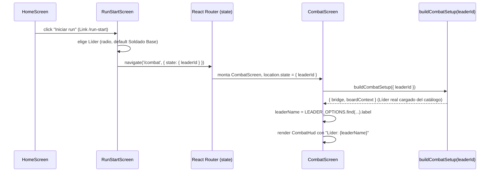

# Spec H2.14 — Transición entre pantalla de inicio de run y combate visual

> Spec técnica del Architect para Programmer. Historia origen: `.ai-studio/memory/backlog.md`, Épica E2,
> "H2.14: Transición entre pantalla de inicio de run y combate visual". Depende de H2.2 (cerrada:
> `RunStartScreen` placeholder puro, "la implementación real es H2.14" según su propia spec) y H2.9 (cerrada:
> `CombatScreen` monta Phaser real vía `buildCombatSetup()`, hoy con Líder/Enemigo/Escenario fijos por
> constante). Cierra el flujo de navegación Home → RunStart → Combat con datos reales de punta a punta.

---

## 0. Qué resuelve esta historia (y qué NO)

### 0.1 Estado actual confirmado (lectura de código, no suposición)

- `RunStartScreen.tsx` (H2.2): placeholder puro, un `<Link to="/combat">` sin ningún estado ni elección.
- `CombatScreen.tsx` (H2.9): llama `buildCombatSetup()` **sin argumentos**.
- `build-combat-setup.ts` (H2.9): construye **siempre** los mismos 3 IDs hardcodeados
  (`DEFAULT_LEADER_ID = 'leader-soldado-base'`, `DEFAULT_ENEMY_ID = 'enemy-bestia-base'`,
  `DEFAULT_SCENARIO_ID = 'scenario-bosque-encantado-base'`) — ningún parámetro configurable desde fuera hoy.
- `packages/data/leaders/` tiene 2 `LeaderDefinition` reales y jugables (`leader-soldado-base` "Soldado Base",
  `leader-mago-base` "Mago Base") desde H1.9 — ambos ya cargables por `CatalogLoader` y ya usados en tests de
  dominio. Enemigo y Escenario, en cambio, solo tienen 1 combinación jugada de verdad en `apps/shell` hasta
  ahora (`enemy-bestia-base` + `scenario-bosque-encantado-base`).
- `App.tsx` ya registra las 3 rutas (`/`, `/run-start`, `/combat`) desde H2.2 — sin cambios de routing en esta
  historia.
- `role-view.ts`/`BoardViewContext` (H2.8-H2.11) **no muestran hoy el nombre del Líder en ningún sitio** — el
  texto de rol es genérico ("Líder — Daño X/Y | Escudo... "), sin nombre propio. Esto importa para §4 (cómo se
  verifica que el Líder elegido en RunStart es el que aparece en Combat).

### 0.2 Decisión de alcance — qué elección real ofrece `RunStartScreen` (y por qué no más)

Confirmado con decisions.md "2026-07-06 — Cierre de dudas de alcance de la Épica E2" (reutilizar el 2×2×2 de
H1 sin contenido nuevo) y con la propia decisión de vision.md/decisions.md "El sorteo cruza, el jugador
ordena" (Líder+mazo fijados **antes** del sorteo de un pool de 3+3 Enemigos/Escenarios, con sorteo cruzado de
los 3 cruces) — esa mecánica completa (elección de mazo, pool 3+3, sorteo cruzado, asignación a N1/N2/N3) es
la pantalla de inicio de run **real** de una futura épica de contenido/run, no de este vertical slice técnico.

**Esta historia implementa exactamente un punto de decisión real y ningún simulacro de los demás:**

1. **Elegir Líder — real.** `RunStartScreen` ofrece un selector entre los 2 Líderes reales del catálogo
   (`leader-soldado-base` "Soldado Base", `leader-mago-base` "Mago Base"). La elección viaja de verdad hasta
   `CombatEngine` (mismo Líder que el jugador vio en pantalla es el que juega el combate) — no es cosmético.
2. **Enemigo y Escenario — fijos, sin elección.** Se mantienen `enemy-bestia-base` +
   `scenario-bosque-encantado-base`, exactamente los mismos que `build-combat-setup.ts` ya usa hoy. Ofrecer un
   pool de 3+3 con sorteo cruzado exigiría: UI de selección de mazo, pantalla de revelado del sorteo,
   asignación de cruces a niveles N1/N2/N3, y contenido adicional de Enemigos/Escenarios más allá del 2×2×2 —
   ninguna de estas piezas existe ni es responsabilidad de la Épica E2 (vertical slice técnico, no contenido).
   Queda explícitamente para Coordinator, como historia futura de una épica de contenido/run.
3. **Sin mazo, sin pool, sin sorteo, sin niveles N1/N2/N3.** El combate sigue siendo un único combate visual
   (el mismo que H2.9-H2.13 ya validaron), no una run de 3 combates con descansos — la pantalla de descanso
   entre combates (decisions.md "Descanso entre combates y evolución de la baraja") es, igualmente, contenido
   fuera de alcance de E2.

Este alcance es deliberadamente el mínimo que hace de "Inicio de Run" algo más que un botón vacío, sin
inventar ningún sistema de la visión completa del producto que esta épica no pidió construir.

### 0.3 Mecanismo de paso de datos entre rutas — `useNavigate` con `state`

El propio criterio de aceptación del backlog ya lo fija literalmente: *"Botón 'iniciar combate' navega a
`<CombatScreen>` pasando Líder ID vía React Router state"*. Se descarta:

- **Query param** (`/combat?leaderId=...`): obligaría a serializar/parsear el ID en cada navegación y a
  validar contra basura de URL manual — sin beneficio, ya que esta pantalla nunca se comparte por URL directa
  ni se recarga con el estado persistido (no hay caso de uso de "bookmarkear un combate concreto").
- **Context de React compartido** entre pantallas: exige un Provider nuevo envolviendo el router entero
  (`App.tsx`) para pasar un solo valor entre 2 pantallas que ya son adyacentes en el grafo de navegación —
  sobre-ingeniería para este alcance. `location.state` de React Router (ya en `package.json` desde H2.2) es
  exactamente el mecanismo nativo para "pasar datos a la siguiente ruta sin URL ni store global", y es lo que
  el propio criterio de aceptación pide.

`CombatScreen` accede al `state` mediante `useLocation()` (ya parte de `react-router-dom`, sin dependencia
nueva). Si `CombatScreen` se monta sin `state` (navegación directa a `/combat`, tests existentes, o futuro
deep-link), usa el mismo Líder por defecto de hoy (`leader-soldado-base`) — **sin romper ningún test/flujo
existente que no pase por `RunStartScreen`.**

---

## 1. `apps/shell/src/combat/leader-options.ts` — catálogo mínimo de Líderes seleccionables (nuevo)

Fuente única de verdad, compartida por `RunStartScreen` (§2) y `CombatScreen` (§3), de los 2 Líderes
seleccionables y su nombre de presentación — evita hardcodear el mismo string `'leader-soldado-base'` en dos
sitios y mantiene la elección honesta (mismos 2 IDs reales de `packages/data/leaders/`, sin inventar
contenido).

```ts
// apps/shell/src/combat/leader-options.ts (contrato completo — módulo pequeño, sin lógica adicional)

/** Opción seleccionable en `RunStartScreen` (§2). `leaderId` coincide exactamente con `LeaderDefinition.id`
 *  (`packages/data/leaders/*.json`) — sin conversión a `LeaderId` con marca de tipo aquí; esa conversión
 *  (`createId<'LeaderId'>`) sigue ocurriendo solo en `build-combat-setup.ts` (§3.2), único punto que ya la
 *  hacía desde H2.9. */
export interface LeaderOption {
  readonly leaderId: string;
  readonly label: string;
}

/** Únicos 2 Líderes reales del contenido de juguete 2×2×2 (H1.9) — no se amplía en esta historia
 *  (decisions.md 2026-07-06: "reutilizar el 2×2×2 de H1"). */
export const LEADER_OPTIONS: readonly LeaderOption[] = [
  { leaderId: 'leader-soldado-base', label: 'Soldado Base' },
  { leaderId: 'leader-mago-base', label: 'Mago Base' },
];

/** Mismo Líder por defecto que `build-combat-setup.ts` ya usaba antes de esta historia — se conserva como
 *  fallback cuando `CombatScreen` se monta sin `location.state` (§0.3). */
export const DEFAULT_LEADER_OPTION: LeaderOption = LEADER_OPTIONS[0];
```

---

## 2. `RunStartScreen.tsx` — selector real de Líder + navegación con `state`

### 2.1 Contrato

```tsx
// apps/shell/src/screens/RunStartScreen.tsx (contrato, no implementación completa — reemplaza el placeholder de H2.2)
import { useState } from 'react';
import { useNavigate } from 'react-router-dom';
import { LEADER_OPTIONS, DEFAULT_LEADER_OPTION } from '../combat/leader-options';
import type { RunStartNavigationState } from '../combat/run-start-navigation-state'; // §2.3

export function RunStartScreen(): JSX.Element {
  const [leaderId, setLeaderId] = useState<string>(DEFAULT_LEADER_OPTION.leaderId);
  const navigate = useNavigate();

  const handleStartCombat = (): void => {
    const state: RunStartNavigationState = { leaderId };
    navigate('/combat', { state });
  };

  return (
    <div>
      <p>Inicio de Run</p>
      <fieldset>
        <legend>Elige tu Líder</legend>
        {LEADER_OPTIONS.map((option) => (
          <label key={option.leaderId}>
            <input
              type="radio"
              name="leader"
              value={option.leaderId}
              checked={leaderId === option.leaderId}
              onChange={() => setLeaderId(option.leaderId)}
            />
            {option.label}
          </label>
        ))}
      </fieldset>
      <button onClick={handleStartCombat}>Iniciar combate</button>
    </div>
  );
}
```

Nota: `<Link to="/combat">Ir a combate (placeholder)</Link>` de H2.2 se retira por completo — el botón
"Iniciar combate" es su reemplazo real (mismo destino de ruta, ahora con `state` real adjunto).

### 2.2 Elección por defecto y accesibilidad mínima

`leaderId` empieza en `DEFAULT_LEADER_OPTION.leaderId` (Soldado Base preseleccionado) — el jugador puede
confirmar sin tocar nada y obtiene exactamente el mismo combate que `apps/shell` ya jugaba antes de esta
historia (regresión cero para quien no interactúa con el selector). `<fieldset>`/`<legend>`/`<label>` nativos
son suficientes para lectura de pantalla — sin librería de UI nueva, mismo criterio "HTML semántico mínimo"
que `HomeScreen`/`CombatHud` ya usan.

### 2.3 `RunStartNavigationState` — tipo compartido del contrato de navegación

```ts
// apps/shell/src/combat/run-start-navigation-state.ts (contrato completo, archivo nuevo y mínimo)

/** Forma exacta de `location.state` cuando se navega desde `RunStartScreen` a `/combat` (§2.1). Tipo
 *  compartido para que `CombatScreen` (§3.1) lea `location.state` con seguridad de tipos en vez de un
 *  `unknown`/`any` sin contrato — único campo hoy (`leaderId`); un futuro pool 3+3/sorteo (fuera de
 *  alcance, §0.2) añadiría campos aquí sin romper la forma actual. */
export interface RunStartNavigationState {
  readonly leaderId: string;
}
```

---

## 3. `CombatScreen.tsx` + `build-combat-setup.ts` — leer el Líder elegido y mostrarlo en el HUD

### 3.1 `CombatScreen.tsx` — lee `location.state`, resuelve nombre a mostrar

```tsx
// apps/shell/src/screens/CombatScreen.tsx (extensión sobre H2.9 — solo las partes que cambian)
import { useLocation } from 'react-router-dom';
import { LEADER_OPTIONS, DEFAULT_LEADER_OPTION } from '../combat/leader-options';
import type { RunStartNavigationState } from '../combat/run-start-navigation-state';
// ... imports existentes de H2.9 sin cambio ...

export function CombatScreen(): JSX.Element {
  const location = useLocation();
  const leaderId =
    (location.state as RunStartNavigationState | null)?.leaderId ?? DEFAULT_LEADER_OPTION.leaderId;
  const leaderName =
    LEADER_OPTIONS.find((option) => option.leaderId === leaderId)?.label ?? DEFAULT_LEADER_OPTION.label;

  const mountRef = useRef<HTMLDivElement>(null);
  const [bridge, setBridge] = useState<CombatBridge | null>(null);

  useEffect(() => {
    // ... idéntico a H2.9, salvo la llamada siguiente ...
    void buildCombatSetup({ leaderId }).then(({ bridge: newBridge, boardContext }) => {
      // ... resto idéntico a H2.9 ...
    });
    // ...
  }, [leaderId]); // NUEVO — antes era `[]`; ver §3.3 para justificación

  return (
    <div style={{ position: 'relative' }}>
      <div ref={mountRef} id="phaser-mount" />
      {!bridge && <p>Cargando combate…</p>} {/* NUEVO — "loading spinner opcional" del criterio de aceptación */}
      {bridge && <CombatHudOverlay bridge={bridge} leaderName={leaderName} />}
    </div>
  );
}

function CombatHudOverlay({
  bridge,
  leaderName, // NUEVO
}: {
  readonly bridge: CombatBridge;
  readonly leaderName: string; // NUEVO
}): JSX.Element {
  const snapshot = useCombatSnapshot(bridge);
  return (
    <>
      <CombatHud snapshot={snapshot} onEndTurn={() => bridge.dispatch({ type: 'END_TURN' })} leaderName={leaderName} />
      {snapshot.status !== 'IN_PROGRESS' && <CombatResultModal snapshot={snapshot} />}
    </>
  );
}
```

### 3.2 `build-combat-setup.ts` — acepta `leaderId` como parámetro opcional

```ts
// apps/shell/src/combat/build-combat-setup.ts (extensión sobre H2.9 — solo la firma y su uso interno)
import { DEFAULT_LEADER_OPTION } from './leader-options'; // NUEVO — sustituye a la constante local

const DEFAULT_ENEMY_ID = 'enemy-bestia-base'; // SIN CAMBIO — fuera de alcance (§0.2)
const DEFAULT_SCENARIO_ID = 'scenario-bosque-encantado-base'; // SIN CAMBIO
const SHELL_SEED = 1; // SIN CAMBIO

export interface BuildCombatSetupParams {
  /** ID de `LeaderDefinition` a cargar — NUEVO H2.14. Si se omite, usa el mismo Líder por defecto que
   *  `apps/shell` ya jugaba antes de esta historia (`DEFAULT_LEADER_OPTION.leaderId`, §1). */
  readonly leaderId?: string;
}

export async function buildCombatSetup(params: BuildCombatSetupParams = {}): Promise<DefaultCombatSetup> {
  const leaderId = params.leaderId ?? DEFAULT_LEADER_OPTION.leaderId;

  const rawInput = await loadRawContent();
  const catalog = await new CatalogLoader(rawInput).load();

  const leader = catalog.leaders.get(createId<'LeaderId'>('LeaderId', leaderId) as LeaderId)!; // NUEVO: leaderId dinámico
  const enemy = catalog.enemies.get(createId<'EnemyId'>('EnemyId', DEFAULT_ENEMY_ID) as EnemyId)!; // SIN CAMBIO
  const scenario = catalog.scenarios.get(
    createId<'ScenarioId'>('ScenarioId', DEFAULT_SCENARIO_ID) as ScenarioId,
  )!; // SIN CAMBIO

  // ... resto del cuerpo IDÉNTICO a H2.9 (randomSource, config, engine, bridge, nameLookup, leaderCardPool,
  // leaderAbilities, enemyAbilities, boardContext) — ninguna línea posterior cambia ...
}
```

Si `leaderId` no existe en el catálogo (imposible hoy porque `LEADER_OPTIONS` solo contiene IDs reales del
2×2×2, pero defensivo ante un `location.state` corrupto/manipulado manualmente): el `!` no-null actual ya
lanzaría (comportamiento idéntico al de `enemy`/`scenario` hoy, sin cambio de criterio de manejo de errores —
fuera de alcance añadir validación nueva que el código existente no tenía para sus 3 IDs fijos).

### 3.3 Por qué el `useEffect` de `CombatScreen` gana `[leaderId]` como dependencia

Antes de esta historia, `CombatScreen` se montaba siempre con el mismo Líder fijo — el array de dependencias
vacío (`[]`, H2.9 §3.1) bastaba porque "una vez por montaje" y "una vez por combate" eran equivalentes. Ahora
`leaderId` puede variar entre montajes reales de la misma sesión de navegador (el usuario vuelve a
`/run-start`, elige el otro Líder, navega de nuevo a `/combat`) — React Router **desmonta y remonta**
`CombatScreen` en cada navegación a la misma ruta con `state` distinto (comportamiento nativo de
`createBrowserRouter`, no requiere código adicional), así que en la práctica `[leaderId]` y `[]` producen el
mismo efecto observable en el 100% de los casos reales de esta historia. Se documenta explícitamente por
higiene de dependencias de hooks (ESLint `react-hooks/exhaustive-deps`, ya activo en el proyecto) — sin
comportamiento nuevo que probar más allá de lo que §5 ya cubre.

### 3.4 `CombatHud.tsx` — gana el nombre del Líder elegido (visible en DOM, no en canvas)

```tsx
// apps/shell/src/combat/CombatHud.tsx (extensión sobre H2.9 — nueva prop `leaderName`)
export interface CombatHudProps {
  readonly snapshot: CombatStateSnapshot;
  readonly onEndTurn: () => void;
  readonly leaderName: string; // NUEVO H2.14
}

export function CombatHud({ snapshot, onEndTurn, leaderName }: CombatHudProps): JSX.Element {
  return (
    <div style={{ position: 'absolute', top: 0, left: 0, right: 0 }}>
      <p>Líder: {leaderName}</p> {/* NUEVO — única evidencia textual, en DOM, de qué Líder se eligió */}
      <button onClick={onEndTurn} disabled={snapshot.status !== 'IN_PROGRESS'}>
        Fin de turno
      </button>
    </div>
  );
}
```

**Decisión de diseño — por qué el nombre se muestra en el DOM de React y no dentro del canvas de Phaser:**
`role-view.ts` (H2.8-H2.11) no muestra hoy el nombre del Líder (solo daño/escudo/energía/nivel, §0.1) y
`BoardViewContext` no tiene ningún campo de nombre de Líder — añadirlo ahí exigiría tocar
`packages/combat-scene` (paquete ya cerrado desde H2.13) y `packages/domain/catalog` solo para pintar un dato
que ya conoce `apps/shell` de sobra (`leaderName` se resuelve localmente contra `LEADER_OPTIONS`, §1, sin
tocar el catálogo). Mostrarlo en el "chrome" no-juice de React (mismo lugar que el botón "Fin de turno",
`architecture_stack.md` §2.3) es además la única forma de que la verificación automatizada (§5) pueda leer el
nombre por texto real (RTL `getByText`/Playwright `getByText`) en vez de depender de comparación de píxeles de
un `<canvas>` — mismo criterio de honestidad de verificación que ya se aplicó en H2.9 §6.3 al preferir un
cambio de HUD observable sobre una captura de pantalla genérica.

---

## 4. Diagrama de flujo



---

## 5. Verificación

### 5.1 Test unitario/RTL — extiende `App.test.tsx` (patrón ya usado en H2.9)

Mismo mock de `phaser`/`@collector/combat-scene`/`./combat/build-combat-setup` ya existente. Se añade:

1. **Selección por defecto sin interacción:** navegar Home → RunStart → click directo en "Iniciar combate"
   (sin tocar el selector) → `buildCombatSetup` mockeado recibe `{ leaderId: 'leader-soldado-base' }` →
   `screen.getByText('Líder: Soldado Base')` visible tras el montaje de `CombatHud`.
2. **Selección real de "Mago Base":** Home → RunStart → click en el radio "Mago Base" → click "Iniciar
   combate" → `buildCombatSetup` mockeado recibe `{ leaderId: 'leader-mago-base' }` →
   `screen.getByText('Líder: Mago Base')` visible (NO "Soldado Base") — evidencia de que la elección real
   viajó de punta a punta hasta el HUD.
3. **Regresión H2.9:** el texto `'Fin de turno'` sigue apareciendo tras el montaje (sin cambios de
   comportamiento del flujo ya cubierto), y `document.getElementById('phaser-mount')` sigue no-nulo.
4. Actualizar el mock de `buildCombatSetup` para que sea un `vi.fn()` capturable por argumentos (antes
   devolvía siempre la misma promesa sin inspeccionar sus parámetros) — necesario para los asserts de los
   puntos 1-2.

### 5.2 Test unitario — `leader-options.ts`

Trivial (constante pura): confirmar que `LEADER_OPTIONS` tiene exactamente 2 entradas con los IDs reales
esperados y que `DEFAULT_LEADER_OPTION === LEADER_OPTIONS[0]`. Puede integrarse como parte del test de §5.1
sin archivo propio si Programmer lo prefiere (módulo trivial, sin lógica que falle de forma no cubierta por
el flujo end-to-end).

### 5.3 Verificación E2E real — Playwright, extiende el patrón de `combat-end-to-end.spec.ts`

Nuevo test (mismo archivo o uno hermano `apps/shell/e2e/run-start-to-combat.spec.ts`, mismo criterio "no gate
de CI" que el resto de `apps/shell/e2e/`):

1. `page.goto('/run-start')`.
2. Confirmar que el selector de Líder es visible (`page.getByLabel('Mago Base')` o equivalente por rol).
3. Click en el radio "Mago Base".
4. Click en "Iniciar combate".
5. Confirmar navegación real a `/combat` (`page.url()` contiene `/combat`) y que `#phaser-mount canvas` es
   visible (mismo criterio que H2.9 §6.3).
6. **Confirmación literal del criterio del enunciado** ("el Líder elegido en RunStart es efectivamente el que
   aparece en el HUD de combate"): `await expect(page.getByText('Líder: Mago Base')).toBeVisible()` — texto
   real en el DOM (§3.4), no una comparación de píxeles del canvas.
7. Repetir el mismo flujo sin tocar el selector (confirmar por defecto `'Líder: Soldado Base'`) como caso de
   regresión del comportamiento previo a esta historia.
8. Sin errores de consola (`page.on('pageerror', ...)`) durante toda la navegación.

---

## 6. Cambios de dependencias/tooling — resumen

- `apps/shell/src/combat/leader-options.ts` — **nuevo**, catálogo mínimo de 2 Líderes seleccionables (§1).
- `apps/shell/src/combat/run-start-navigation-state.ts` — **nuevo**, tipo `RunStartNavigationState` (§2.3).
- `apps/shell/src/screens/RunStartScreen.tsx` — **reescrito completo** (§2.1), sustituye el placeholder de
  H2.2 (retira el `<Link>` de placeholder).
- `apps/shell/src/screens/CombatScreen.tsx` — extendido (§3.1): lee `useLocation()`, resuelve `leaderName`,
  pasa `{ leaderId }` a `buildCombatSetup`, añade texto de "Cargando combate…" mientras `bridge === null`,
  pasa `leaderName` a `CombatHudOverlay`/`CombatHud`.
- `apps/shell/src/combat/build-combat-setup.ts` — extendido (§3.2): nueva interfaz `BuildCombatSetupParams`,
  `leaderId` opcional con fallback a `DEFAULT_LEADER_OPTION.leaderId`; `DEFAULT_LEADER_ID` local se retira en
  favor de la constante compartida de `leader-options.ts`; `DEFAULT_ENEMY_ID`/`DEFAULT_SCENARIO_ID` **sin
  cambio** (§0.2).
- `apps/shell/src/combat/CombatHud.tsx` — extendido (§3.4): nueva prop `leaderName`, nuevo `<p>` visible.
- `apps/shell/src/App.test.tsx` — extendido (§5.1): nuevos casos de selección de Líder + regresión.
- `apps/shell/e2e/run-start-to-combat.spec.ts` — **nuevo** (§5.3).
- **Sin cambios** a `App.tsx` (routing ya existente desde H2.2), a `packages/combat-scene`, a
  `packages/domain/catalog`, a `packages/domain/combat`, ni a `packages/combat-bridge` — toda esta historia
  vive dentro de `apps/shell`.
- **Sin contenido nuevo** — mismos 2 Líderes de H1.9, mismo Enemigo/Escenario de H2.9. Ningún pool 3+3, ningún
  sorteo cruzado, ninguna pantalla de descanso — explícitamente fuera de alcance (§0.2), pendiente de una
  futura épica de contenido/run.

---

## 7. Checklist de Definition of Done para Programmer

- [ ] `apps/shell/src/combat/leader-options.ts` creado (§1): `LEADER_OPTIONS` (2 entradas reales),
      `DEFAULT_LEADER_OPTION`.
- [ ] `apps/shell/src/combat/run-start-navigation-state.ts` creado (§2.3): interfaz `RunStartNavigationState`.
- [ ] `RunStartScreen.tsx` reescrito (§2.1): selector real de Líder (radio, default preseleccionado), botón
      "Iniciar combate" navega con `useNavigate('/combat', { state })`; el `<Link>` placeholder de H2.2 se
      retira.
- [ ] `build-combat-setup.ts` extendido (§3.2): `BuildCombatSetupParams` con `leaderId` opcional, fallback
      correcto, `DEFAULT_ENEMY_ID`/`DEFAULT_SCENARIO_ID` sin cambio, resto del cuerpo idéntico a H2.9.
- [ ] `CombatScreen.tsx` extendido (§3.1): lee `location.state` con el tipo `RunStartNavigationState`,
      resuelve `leaderName` contra `LEADER_OPTIONS`, pasa `leaderId` a `buildCombatSetup`, muestra "Cargando
      combate…" mientras `bridge === null`, pasa `leaderName` al HUD.
- [ ] `CombatHud.tsx` extendido (§3.4): prop `leaderName`, texto `Líder: {leaderName}` visible en el DOM.
- [ ] `App.test.tsx` extendido (§5.1): navegación con selección por defecto y con "Mago Base" explícito,
      ambos verificando `buildCombatSetup` recibe el `leaderId` correcto y que el HUD muestra el nombre
      correcto; regresión del flujo H2.9 (`'Fin de turno'`, `#phaser-mount`) sigue en verde.
- [ ] `apps/shell/e2e/run-start-to-combat.spec.ts` creado (§5.3), ejecutado manualmente contra `npm run dev`
      (no gate de CI, mismo criterio que el resto de `apps/shell/e2e/`).
- [ ] `npm run build`, `npm run lint`, `npm run typecheck`, `npm run test` (raíz) pasan en verde.
- [ ] Confirmado que ningún cambio toca `packages/combat-scene`, `packages/domain/*`, ni
      `packages/combat-bridge` — toda la historia es interna a `apps/shell` (§6).
- [ ] Confirmado que Enemigo/Escenario siguen fijos (`enemy-bestia-base`/`scenario-bosque-encantado-base`) y
      que no se introduce ningún pool 3+3 ni sorteo cruzado (§0.2) — criterio explícito de "no ambigüedad de
      alcance" para que Coordinator pueda desglosar la mecánica completa como historia(s) futura(s) sin
      solaparse con lo ya construido aquí.
