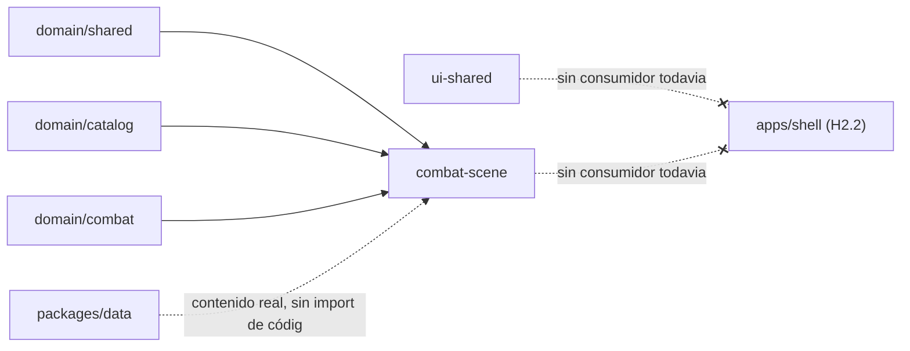

# Spec H2.1 — Setup de `packages/combat-scene` + `packages/ui-shared` + tooling Vite/Phaser

> Spec técnica del Architect para Programmer. Historia origen: backlog.md, Épica E2, "H2.1: Setup de
> `packages/combat-scene` y `packages/ui-shared` con tooling Vite + Phaser". Decisiones de alcance ya
> cerradas por el Director: ver `.ai-studio/memory/decisions.md` §"2026-07-06 — Cierre de dudas de alcance
> de la Épica E2". Arquitectura de referencia: `docs/architecture_stack.md` §1, §2, §6.

---

## 0. Qué resuelve esta historia (y qué NO)

### 0.1 Dentro de alcance de H2.1

1. Crear dos paquetes nuevos de workspace: `packages/combat-scene` (Phaser puro, sin React) y
   `packages/ui-shared` (React puro, sin Phaser).
2. Tooling: Vite instalado y configurado en `combat-scene` (dev server + build) como entorno de
   desarrollo/verificación aislado de este paquete. `ui-shared` se configura como librería TS
   compilable (sin bundler propio todavía — no tiene consumidor real hasta H2.2).
3. `tsconfig`, referencias de proyecto (`tsconfig.json` raíz) y entradas de workspace (`package.json` raíz)
   para ambos paquetes nuevos.
4. Activar en `eslint.config.mjs` las reglas de boundaries ya pre-declaradas como "entradas futuras" para
   `combat-scene` y `ui-shared` (líneas 20-22 y 34-35 del archivo actual) — pasan de comentario a reglas
   vivas y verificadas.
5. Un "hello world" ejecutable en `combat-scene` que demuestre que el setup entero funciona de punta a
   punta: Vite sirve una escena Phaser real que consume `CombatEngine`/`CatalogLoader` reales (mismo
   contenido 2×2×2 de H1, sin datos mock) y pinta el resultado como texto plano en el canvas.
6. `ui-shared` en esta historia es exclusivamente el esqueleto de paquete + un único componente/util
   trivial de ejemplo (ver §3) que demuestre que compila con JSX/React sin依 de `combat-scene` — no se
   diseña aún el design system real de la "habitación del coleccionista" (eso vendrá con las pantallas
   concretas de H2.2+).

### 0.2 Fuera de alcance de H2.1 (frontera explícita con otras historias)

- **`apps/shell` no se crea en esta historia.** H2.1 deja `combat-scene` y `ui-shared` como paquetes de
  librería consumibles, pero **sin ningún consumidor real todavía**. El primer consumidor (`apps/shell`,
  React + Vite, con su propio `package.json`/`vite.config.ts`) es responsabilidad exclusiva de **H2.2**.
  Esto es intencional: valida que ambos paquetes compilan e importan correctamente de forma aislada antes
  de invertir en el shell.
- El servidor Vite de `combat-scene` levantado en esta historia es una **verificación de desarrollo del
  propio paquete** (análogo a una demo/playground interno), no la app final. No se monta dentro de un
  `<PhaserMount>` de React — eso es H2.9.
- Nada de `CombatBridge` (H2.3), `EffectsDirector` ni `JuiceConfig`/recetas de juice (H2.4/H2.5) — la
  escena de esta historia no se suscribe a eventos de combate ni dispara ninguna animación de "feel".
- Nada de `InputAdapter` (H2.7).
- Nada de renderizado real de tablero/Núcleos/cartas/HUD gráfico (H2.6/H2.8) — solo texto plano de
  verificación (ver §4).
- Nada de PWA (manifest/service worker — H2.15); no aplica a `combat-scene` como librería, y `apps/shell`
  aún no existe.
- Nada de contenido nuevo: se reutiliza literalmente `packages/data` de H1 (2 Líderes, 2 Enemigos, 2
  Escenarios, cartas), igual que hace `packages/cli`.

---

## 1. Estructura de paquetes y archivos

```
packages/
  combat-scene/
    package.json
    tsconfig.json
    vite.config.ts
    vitest.config.ts
    index.html                      # entry HTML del dev server (mount point <div id="app">)
    src/
      main.ts                       # entry point de Vite: crea Phaser.Game y arranca la escena
      scenes/
        HelloCombatScene.ts         # NUEVO H2.1 — única escena de esta historia (ver §3.1)
      juice/                        # carpeta vacía + .gitkeep (placeholder de H2.4/H2.5)
      input/                        # carpeta vacía + .gitkeep (placeholder de H2.7)
      view/                         # carpeta vacía + .gitkeep (placeholder de H2.8)
      hello-combat-scene.test.ts    # test de verificación (ver §4.2)

  ui-shared/
    package.json
    tsconfig.json
    vitest.config.ts
    src/
      index.ts                     # export * del contenido del paquete
      components/
        Placeholder.tsx             # NUEVO H2.1 — componente trivial de verificación (ver §3.2)
      components/Placeholder.test.tsx
```

Notas:
- `combat-scene/juice`, `/input`, `/view` se crean vacíos (con `.gitkeep`) en esta historia porque
  `docs/architecture_stack.md` §1 ya fija esa subestructura como parte de la definición del paquete; no
  tiene sentido para Programmer inventar la estructura de nuevo en H2.4/H2.6/H2.7. No se implementa
  ninguna lógica dentro de ellas todavía.
- `ui-shared/components/` (plural, sin subcarpetas por componente) es suficiente para un único componente
  placeholder; la organización interna real (atómico, por dominio, etc.) se decide cuando haya más de 1-2
  componentes reales, no es objeto de esta historia.

---

## 2. Tooling: gestor de paquetes, workspaces, tsconfig

### 2.1 `package.json` raíz

Añadir las dos rutas nuevas al array `workspaces` (mantener el orden alfabético/lógico ya existente):

```jsonc
"workspaces": [
  "packages/domain/*",
  "packages/data",
  "packages/cli",
  "packages/combat-scene",   // NUEVO H2.1
  "packages/ui-shared"       // NUEVO H2.1
]
```

No es necesario tocar los scripts raíz (`test`, `lint`, `typecheck`, `build`) — `vitest run`/`eslint .`
ya operan sobre todo el repo por glob; `tsc -b` sigue el grafo de `references` de `tsconfig.json` raíz
(ver 2.2), y Vite de `combat-scene` se invoca con su propio script de paquete (`npm run dev -w
@collector/combat-scene`), igual que ya se hace con `play-combat` para `cli`.

### 2.2 `tsconfig.json` raíz

Añadir referencias de proyecto para que `tsc -b` incluya ambos paquetes en el grafo de compilación:

```jsonc
"references": [
  { "path": "packages/domain/shared" },
  { "path": "packages/domain/catalog" },
  { "path": "packages/domain/combat" },
  { "path": "packages/data" },
  { "path": "packages/cli" },
  { "path": "packages/combat-scene" },  // NUEVO H2.1
  { "path": "packages/ui-shared" }      // NUEVO H2.1
]
```

### 2.3 `tsconfig.base.json` raíz

Añadir alias de import para `combat-scene` y `ui-shared`, siguiendo el patrón ya usado por los tres
paquetes de dominio (necesario porque `apps/shell` en H2.2 y `packages/cli`/tests futuros importarán
estos paquetes por nombre de paquete npm, no por ruta relativa):

```jsonc
"paths": {
  "@collector/domain-shared": ["packages/domain/shared/src/index.ts"],
  "@collector/domain-catalog": ["packages/domain/catalog/src/index.ts"],
  "@collector/domain-combat": ["packages/domain/combat/src/index.ts"],
  "@collector/combat-scene": ["packages/combat-scene/src/main.ts"],   // NUEVO H2.1
  "@collector/ui-shared": ["packages/ui-shared/src/index.ts"]         // NUEVO H2.1
}
```

### 2.4 `packages/combat-scene/package.json`

Sigue el patrón de `packages/cli/package.json` (dependencias de dominio con `"*"`) pero añade Phaser
como dependencia runtime y Vite como devDependency local del paquete (necesario para que `npm run dev`
funcione ejecutado desde dentro del paquete, igual que cualquier app Vite estándar):

```jsonc
{
  "name": "@collector/combat-scene",
  "version": "0.0.0",
  "private": true,
  "type": "module",
  "main": "./dist/main.js",
  "scripts": {
    "dev": "vite",
    "build": "tsc -b && vite build",
    "preview": "vite preview"
  },
  "dependencies": {
    "@collector/domain-shared": "*",
    "@collector/domain-catalog": "*",
    "@collector/domain-combat": "*",
    "phaser": "^3.80.0"
  },
  "devDependencies": {
    "vite": "^5.0.0"
  }
}
```

Justificación de versión: Phaser 3.80.x es la última serie estable 3.x a la fecha de esta spec (Phaser 4
está en desarrollo pero no es la recomendación estable para iniciar un proyecto nuevo); fijar `^3.80.0`
dentro del rango mayor 3.x. Vite `^5.0.0` porque `package-lock.json` raíz ya trae Vite 5.x como
dependencia transitiva (de `vite-tsconfig-paths`/`vitest`) — reutilizar la misma mayor evita dos versiones
de Vite conviviendo en el repo.

### 2.5 `packages/combat-scene/tsconfig.json`

```jsonc
{
  "extends": "../../tsconfig.base.json",
  "compilerOptions": {
    "rootDir": "src",
    "outDir": "dist",
    "types": ["vite/client"]
  },
  "include": ["src"],
  "references": [
    { "path": "../domain/shared" },
    { "path": "../domain/catalog" },
    { "path": "../domain/combat" }
  ]
}
```

Nota: `"types": ["vite/client"]` (no `"node"` como en `cli`) porque `combat-scene` corre en entorno de
navegador/canvas, no en Node — mismo patrón de especialización de `types` que ya usa `cli` para su propio
runtime.

### 2.6 `packages/combat-scene/vite.config.ts`

Config mínima; usa `vite-tsconfig-paths` (ya en devDependencies raíz) para resolver los alias
`@collector/*` sin duplicar configuración de paths:

```ts
import { defineConfig } from 'vite';
import tsconfigPaths from 'vite-tsconfig-paths';

export default defineConfig({
  plugins: [tsconfigPaths()],
  server: { port: 5174 }
});
```

(Puerto explícito distinto del futuro `apps/shell` para evitar colisión cuando ambos corran en paralelo
durante H2.2+; 5173 es el default de Vite, se reserva implícitamente para el shell.)

### 2.7 `packages/combat-scene/vitest.config.ts`

Mismo patrón que `packages/cli/vitest.config.ts`, pero entorno `jsdom` (Phaser necesita `window`/`document`
aunque sea mínimamente, incluso en modo headless de test) en vez de `node`:

```ts
import { defineConfig } from 'vitest/config';
import tsconfigPaths from 'vite-tsconfig-paths';

export default defineConfig({
  plugins: [tsconfigPaths()],
  test: {
    environment: 'jsdom',
    include: ['src/**/*.test.ts']
  }
});
```

Nota para Programmer: añadir `jsdom` a devDependencies raíz (no está en `package.json` raíz actual);
es la única dependencia nueva de tooling fuera de Phaser/Vite que exige esta historia.

### 2.8 `packages/ui-shared/package.json`

```jsonc
{
  "name": "@collector/ui-shared",
  "version": "0.0.0",
  "private": true,
  "type": "module",
  "main": "./dist/index.js",
  "scripts": {
    "build": "tsc -b"
  },
  "dependencies": {
    "react": "^18.3.0"
  },
  "devDependencies": {
    "@types/react": "^18.3.0"
  }
}
```

`ui-shared` NO lleva Vite propio en esta historia — es una librería de componentes sin entry point
ejecutable; se compila con `tsc -b` como cualquier paquete de dominio. El bundling real con JSX lo
resuelve el consumidor (`apps/shell` en H2.2, vía su propio Vite + plugin de React).

### 2.9 `packages/ui-shared/tsconfig.json`

```jsonc
{
  "extends": "../../tsconfig.base.json",
  "compilerOptions": {
    "rootDir": "src",
    "outDir": "dist",
    "jsx": "react-jsx",
    "types": ["react"]
  },
  "include": ["src"]
}
```

### 2.10 `packages/ui-shared/vitest.config.ts`

Entorno `jsdom` para poder testear render de componentes React con Testing Library si Programmer lo
considera necesario para el placeholder (no obligatorio para el criterio mínimo de esta historia, ver
§4.3):

```ts
import { defineConfig } from 'vitest/config';
import tsconfigPaths from 'vite-tsconfig-paths';

export default defineConfig({
  plugins: [tsconfigPaths()],
  test: {
    environment: 'jsdom',
    include: ['src/**/*.test.{ts,tsx}']
  }
});
```

---

## 3. Contenido mínimo de cada paquete (el "hello world")

### 3.1 `combat-scene`: `HelloCombatScene`

Objetivo: demostrar que Vite + Phaser + import de `domain/*` + carga de contenido real de
`packages/data` funcionan juntos, sin ningún renderizado gráfico complejo (nada de sprites/tweens/board —
eso es H2.6/H2.8).

Contrato de la escena (firma, no implementación):

```ts
// packages/combat-scene/src/scenes/HelloCombatScene.ts
import Phaser from 'phaser';
import type { CombatStateSnapshot } from '@collector/domain-combat';

export class HelloCombatScene extends Phaser.Scene {
  constructor();
  preload(): void;   // no-op en esta historia (sin assets todavía)
  create(): void;    // construye engine real (ver abajo) y pinta snapshot inicial como Phaser.Text
}
```

Comportamiento requerido de `create()`:
1. Carga el contenido real 2×2×2 de `packages/data` reutilizando exactamente el mismo patrón que
   `packages/cli/src/load-raw-content.ts` (leer los mismos JSON vía `readFileSync`/`fetch` — en entorno
   navegador, la forma correcta es `fetch` de assets estáticos servidos por Vite desde `public/`, o bien
   `import` estático de los JSON de `packages/data` con `resolveJsonModule` ya activo en
   `tsconfig.base.json`; Programmer elige la vía más simple, pero **debe ser contenido real, no mockeado
   a mano**).
2. Instancia `CatalogLoader` (de `@collector/domain-catalog`), `buildCombatEngineConfig` y `CombatEngine`
   (de `@collector/domain-combat`) exactamente como hace `packages/cli/src/main.ts`, usando los mismos IDs
   de contenido por defecto (`leader-soldado-base`, `enemy-bestia-base`,
   `scenario-bosque-encantado-base`) y un `SeededRandomSource` con semilla fija (para reproducibilidad del
   test, ver §4).
3. Llama a `engine.getSnapshot()` y pinta en pantalla, como `this.add.text(...)` plano (sin estilos
   elaborados), al menos: `turnNumber`, vida del Líder, vida del Enemigo, valor del pool de Núcleos
   actual. Formato de texto libre para Programmer, no normativo.
4. `console.log(snapshot)` del snapshot inicial completo, para verificación manual en devtools además del
   texto en canvas.

`packages/combat-scene/src/main.ts` (entry de Vite):

```ts
import Phaser from 'phaser';
import { HelloCombatScene } from './scenes/HelloCombatScene';

new Phaser.Game({
  type: Phaser.AUTO,
  width: 1080,
  height: 1920,
  parent: 'app',
  scene: [HelloCombatScene]
});
```

(El modo de escala `FIT`/viewport definitivo se configura en H2.6 — aquí basta un tamaño fijo para que
el canvas se vea al abrir `index.html`.)

### 3.2 `ui-shared`: `Placeholder`

Único requisito: demostrar que el paquete compila JSX/TSX correctamente y es importable desde fuera sin
arrastrar `phaser` ni nada de `combat-scene` (boundaries lo impide en cualquier caso, ver §5).

```tsx
// packages/ui-shared/src/components/Placeholder.tsx
export interface PlaceholderProps {
  readonly label: string;
}

export function Placeholder(props: PlaceholderProps): JSX.Element;
```

Implementación esperada: un `<div>` o `<span>` que renderiza `props.label` sin más lógica. No es un
componente de producto — es la prueba de que el tooling JSX del paquete funciona.

---

## 4. Criterio de verificación (qué significa "el setup funciona")

Se definen tres capas de verificación, todas obligatorias — evita que "el setup existe" se confunda con
"el setup funciona":

### 4.1 Verificación de tooling (build/lint/typecheck)

- `npm run build` (raíz, `tsc -b`) compila los 7 paquetes del grafo (5 previos + `combat-scene` +
  `ui-shared`) sin errores.
- `npm run lint` (raíz) pasa sin violaciones de `boundaries/element-types` — en particular, un import de
  prueba deliberadamente incorrecto (`ui-shared` importando algo de `combat-scene`, o `domain-combat`
  importando de `combat-scene`) debe ser añadido temporalmente durante desarrollo y confirmarse que ESLint
  lo rechaza, luego revertido antes de mergear (verificación manual del Programmer, no un test
  automatizado permanente).
- `npm run typecheck` limpio.

### 4.2 Verificación funcional automatizada (`combat-scene/src/hello-combat-scene.test.ts`)

Este es el criterio central — no un smoke test vacío. El test debe, sin levantar un navegador real
(usa `jsdom` vía la config de §2.7 y el modo headless de Phaser):

1. Instanciar `HelloCombatScene` (o invocar su lógica de construcción de engine extraída a una función
   pura testeable, p.ej. `buildHelloSnapshot(): CombatStateSnapshot`, recomendado para no depender del
   ciclo de vida completo de `Phaser.Scene` en el test — Programmer decide si separa esta lógica en un
   módulo `scenes/build-hello-engine.ts` importado por la escena, para facilitar el test).
2. Cargar el contenido real de `packages/data` (mismo patrón que `load-raw-content.ts` de `cli`).
3. Construir `CombatEngine` con `SeededRandomSource(<semilla fija>)`.
4. Asertar sobre `engine.getSnapshot()`:
   - `turnNumber === 1`.
   - vida del Líder y del Enemigo coinciden con los valores esperados de `leader-soldado-base` /
     `enemy-bestia-base` (los mismos que ya validan los tests de H1.18 / `packages/cli`).
   - el pool de Núcleos tiene la cardinalidad esperada (5+1) con valores dentro de rango 1-4.
5. Esto prueba, de forma determinista y automatizada, que `combat-scene` puede importar y ejecutar
   `domain-combat`/`domain-catalog` reales contra datos reales de `packages/data` — el mismo contrato que
   consumirá `apps/shell` en H2.2+, sin depender de un navegador real ni de inspección manual.

### 4.3 Verificación manual de dev-server (no automatizable, documentar en PR/notas de historia)

- `npm run dev -w @collector/combat-scene` levanta un servidor Vite en `http://localhost:5174`.
- Al abrir esa URL, el canvas de Phaser se renderiza y muestra el texto plano con `turnNumber`/vida
  Líder/vida Enemigo (ver §3.1.3); la consola del navegador muestra el `console.log` del snapshot
  completo.
- Este paso es manual porque validar renderizado visual real de un `<canvas>` en un navegador real está
  fuera de lo que Vitest+jsdom puede aserting de forma útil; el test automatizado de §4.2 ya cubre la
  lógica que importa (construcción real del engine), dejando esta verificación manual como confirmación
  de que el "cableado" Vite→Phaser→DOM funciona end-to-end, no como sustituto del test.
- `ui-shared`: no requiere dev-server propio en esta historia (no tiene consumidor); su verificación es
  `npm run build -w @collector/ui-shared` limpio + (opcional) un test de render de `Placeholder` con
  Testing Library si Programmer lo añade.

---

## 5. ESLint boundaries — activación de reglas ya pre-declaradas

`eslint.config.mjs` ya declara `combat-scene`, `ui-shared` y `shell` como "entradas futuras" (comentario
en línea 19) con sus reglas de `element-types` ya escritas (líneas 34-36). **Esta historia no añade reglas
nuevas** — solo retira el comentario de "entradas futuras" para `combat-scene` y `ui-shared` (no para
`shell`, que sigue siendo H2.2) y verifica que las reglas ya escritas se cumplen contra el código real
creado en esta historia:

```jsonc
// settings.boundaries/elements — sin cambios de contenido, solo deja de ser "futuro" para estas dos:
{ type: 'combat-scene', pattern: 'packages/combat-scene/**' },
{ type: 'ui-shared', pattern: 'packages/ui-shared/**' },
// 'shell' permanece como entrada futura hasta H2.2

// rules.boundaries/element-types — ya vigentes, sin cambios:
{ from: 'combat-scene', allow: ['domain-shared', 'domain-catalog', 'domain-combat'] },
{ from: 'ui-shared', allow: [] },
```

Confirmar en la revisión de esta historia que:
- `combat-scene` puede importar `domain-shared`/`domain-catalog`/`domain-combat` (usado en §3.1) y el
  linter no lo bloquea.
- `combat-scene` NO puede importar `ui-shared` ni viceversa (ninguna regla lo permite en ninguna
  dirección) — correcto para esta historia, ya que no hay razón de dependencia entre ambos todavía;
  `apps/shell` es quien los compondrá a los dos en H2.2+.
- El override de `no-restricted-imports` (líneas 41-47 de `eslint.config.mjs`, que prohíbe `react`/
  `phaser` dentro de `packages/domain/**` y `packages/data/**`) sigue aplicando sin cambios — no toca
  a `combat-scene` ni `ui-shared`, que están fuera de esos globs.

---

## 6. Resumen de dependencias (mermaid, alcance de esta historia)



`ui-shared` y `combat-scene` quedan como hojas del grafo de dependencias en este momento — ninguno de los
dos es importado por nadie todavía. Eso se resuelve en H2.2 (`apps/shell` importa a ambos) y H2.3+
(bridge, escena real).

---

## 7. Checklist de Definition of Done para Programmer

- [ ] `packages/combat-scene/{package.json,tsconfig.json,vite.config.ts,vitest.config.ts,index.html}` creados.
- [ ] `packages/combat-scene/src/{main.ts,scenes/HelloCombatScene.ts,hello-combat-scene.test.ts}` creados;
      carpetas `juice/`, `input/`, `view/` creadas vacías con `.gitkeep`.
- [ ] `packages/ui-shared/{package.json,tsconfig.json,vitest.config.ts}` creados.
- [ ] `packages/ui-shared/src/{index.ts,components/Placeholder.tsx}` creados.
- [ ] `package.json` raíz: `workspaces` actualizado (§2.1).
- [ ] `tsconfig.json` raíz: `references` actualizado (§2.2).
- [ ] `tsconfig.base.json` raíz: `paths` actualizado (§2.3).
- [ ] `eslint.config.mjs`: comentario de "entradas futuras" retirado para `combat-scene`/`ui-shared` (§5).
- [ ] `jsdom` añadido a devDependencies raíz.
- [ ] `npm run build`, `npm run lint`, `npm run typecheck`, `npm run test` (raíz) pasan en verde,
      incluyendo el test nuevo de §4.2.
- [ ] Verificación manual de §4.3 realizada y documentada (captura o nota en la entrega de la historia).
