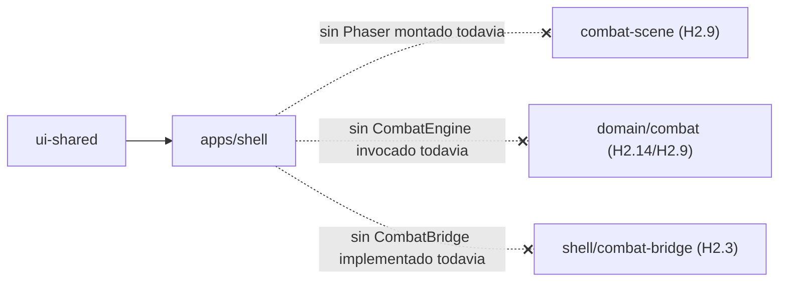

# Spec H2.2 — Setup de `apps/shell` (React + Vite), routing, pantallas stub

> Spec técnica del Architect para Programmer. Historia origen: `.ai-studio/memory/backlog.md`, Épica E2,
> "H2.2: Setup de `apps/shell` (React + Vite) y estructura de pantallas base". Depende de H2.1 (ya cerrada:
> `packages/combat-scene` y `packages/ui-shared` existen, sin consumidor real). Arquitectura de referencia:
> `docs/architecture_stack.md` §1 (estructura de módulos, línea `apps/shell`), §2.3, §4.1. Decisiones de
> alcance de la Épica E2: `.ai-studio/memory/decisions.md` §"2026-07-06 — Cierre de dudas de alcance de la
> Épica E2".

---

## 0. Qué resuelve esta historia (y qué NO)

### 0.1 Dentro de alcance de H2.2

1. Crear el paquete de aplicación `apps/shell` (React + Vite), primer consumidor real de
   `packages/ui-shared`.
2. Routing mínimo con `react-router-dom` (justificación en §3.1) entre 3 pantallas stub navegables:
   `HomeScreen` (menú principal), `RunStartScreen` (placeholder), `CombatScreen` (placeholder puro, sin
   Phaser).
3. Estructura de carpetas fijada por `docs/architecture_stack.md` §1: `screens/`, `combat-bridge/` (vacía,
   placeholder de H2.3), `pwa/` (stubs de manifest/service worker, no funcionales, placeholder de H2.15).
4. `apps/shell` consume `@collector/ui-shared` (el componente `Placeholder` existente) para demostrar que
   el boundary shell→ui-shared funciona de punta a punta.
5. Activar en `eslint.config.mjs` la regla de boundaries para `shell`, ya pre-declarada como "entrada
   futura" desde H2.1 (línea 22 y regla de la línea 36 del archivo actual).
6. `package.json`/`tsconfig.json` raíz actualizados con la nueva entrada de workspace.
7. Verificación en 3 capas, mismo patrón que H2.1: build/lint/typecheck en verde, test automatizado de
   routing con React Testing Library, y verificación manual de dev-server.

### 0.2 Fuera de alcance de H2.2 (frontera explícita con otras historias)

- **No se monta Phaser dentro de `CombatScreen` todavía.** Esta historia solo crea el contenedor
  `<div id="phaser-mount">` vacío. Instanciar `Phaser.Game`, `CombatBridge` real y conectar
  `packages/combat-scene` es responsabilidad exclusiva de **H2.9**. `apps/shell` en esta historia **no**
  declara `@collector/combat-scene` como dependencia real todavía (ver §2.4) — se añadirá cuando H2.9 la
  consuma de verdad, para no instalar código sin usar antes de tiempo.
- **`combat-bridge/` se crea vacía** (con `.gitkeep`), sin ninguna clase `CombatBridge` implementada — eso
  es **H2.3**. Esta historia solo dejar el sitio, igual que H2.1 hizo con `combat-scene/{juice,input,view}`.
- **`pwa/` contiene únicamente stubs no funcionales** (manifest y service worker de plantilla, sin
  registrar, sin plugin de build, sin lógica de caché) — el setup completo y funcional es **H2.15**. Nota:
  el criterio de aceptación de H2.2 en backlog.md referencia "ver H2.7" para este punto, que es una
  inconsistencia de redacción del Coordinator (H2.7 es `InputAdapter`); la referencia correcta según
  decisions.md y el propio backlog es **H2.15**, la historia de PWA. Esta spec sigue la referencia
  correcta.
- **`RunStartScreen` es un placeholder sin lógica de selección real** (sin dropdown de Líder, sin pool
  3+3, sin sorteo cruzado) — la implementación funcional de esa pantalla y su navegación con paso de
  config a `CombatScreen` es **H2.14**. Aquí solo existe la ruta y un texto de marcador de posición, para
  demostrar que el routing de 3 pantallas funciona.
- **No hay `CombatEngine`/`CatalogLoader` invocados desde `apps/shell` en esta historia.** Ninguna
  pantalla carga contenido real de `packages/data` todavía; eso empieza en H2.14 (Líder seleccionable) y
  se completa en H2.9 (combate real).
- **Nada de `EffectsDirector`, `InputAdapter`, recetas de juice** — no aplican a `apps/shell`, viven en
  `packages/combat-scene` y ya están fuera de alcance de H2.1/H2.2 por igual.

---

## 1. Estructura de paquetes y archivos

```
apps/
  shell/
    package.json
    tsconfig.json
    vite.config.ts
    vitest.config.ts
    index.html                        # entry HTML del dev server (mount point <div id="root">)
    public/
      # vacío en esta historia; H2.15 añadirá manifest.webmanifest / iconos servibles aquí
    src/
      main.tsx                        # entry point de Vite: renderiza <App/> con RouterProvider
      App.tsx                         # define el router (ver §3.1) y el layout raíz
      test-setup.ts                   # registra matchers de @testing-library/jest-dom para vitest
      screens/
        HomeScreen.tsx                 # NUEVO H2.2 — menú principal (ver §3.2)
        RunStartScreen.tsx              # NUEVO H2.2 — placeholder puro (ver §3.3)
        CombatScreen.tsx                # NUEVO H2.2 — placeholder con #phaser-mount (ver §3.4)
      combat-bridge/
        .gitkeep                        # placeholder de H2.3 — carpeta vacía, sin código
      pwa/
        manifest.webmanifest            # stub NO funcional (ver §3.5) — no registrado, no servido aún
        service-worker.js               # stub NO funcional (ver §3.5) — no registrado, no cacheado aún
      App.test.tsx                      # test de verificación de routing (ver §4.2)
```

Notas:
- `combat-bridge/` se crea vacía en esta historia porque `docs/architecture_stack.md` §1 ya fija esa
  subestructura como parte de la definición del paquete `apps/shell`; igual que H2.1 hizo con
  `combat-scene/{juice,input,view}`, no tiene sentido que Programmer la invente de nuevo en H2.3.
- `pwa/` vive dentro de `src/` (no `public/`) en esta historia porque los stubs no están registrados ni
  se sirven todavía — no hay razón para que Vite los copie tal cual a la build. H2.15 decidirá si se
  mueven a `public/` (necesario para que el navegador pueda hacer fetch real del manifest/SW) o si se
  gestionan vía un plugin (`vite-plugin-pwa`), que es la recomendación de `architecture_stack.md` §4.1.
  Programmer no debe anticipar esa decisión de tooling aquí; solo dejar el contenido textual del stub.
- `screens/` (plural, sin subcarpetas por pantalla) es suficiente para 3 pantallas triviales; reorganizar
  por dominio se decide cuando haya más pantallas reales (H2.14+).

---

## 2. Tooling: workspaces, tsconfig, package.json

### 2.1 `package.json` raíz

```jsonc
"workspaces": [
  "packages/domain/*",
  "packages/data",
  "packages/cli",
  "packages/combat-scene",
  "packages/ui-shared",
  "apps/shell"              // NUEVO H2.2
]
```

No es necesario tocar los scripts raíz (`test`, `lint`, `typecheck`, `build`) por el mismo motivo que en
H2.1: `vitest run` / `eslint .` operan por glob sobre todo el repo, y `tsc -b` sigue el grafo de
`references` de `tsconfig.json` raíz (ver 2.2).

### 2.2 `tsconfig.json` raíz

```jsonc
"references": [
  { "path": "packages/domain/shared" },
  { "path": "packages/domain/catalog" },
  { "path": "packages/domain/combat" },
  { "path": "packages/data" },
  { "path": "packages/cli" },
  { "path": "packages/combat-scene" },
  { "path": "packages/ui-shared" },
  { "path": "apps/shell" }             // NUEVO H2.2
]
```

### 2.3 `tsconfig.base.json` raíz

**Sin cambios.** No se añade alias `@collector/shell` porque, a diferencia de `combat-scene`/`ui-shared`
(consumidos por `apps/shell`), nada en el monorepo importa `apps/shell` — es la hoja final del grafo de
dependencias (ver §6). Un alias de import solo tiene sentido para paquetes que otros consumen por nombre.

### 2.4 `apps/shell/package.json`

```jsonc
{
  "name": "@collector/shell",
  "version": "0.0.0",
  "private": true,
  "type": "module",
  "scripts": {
    "dev": "vite",
    "build": "tsc -b && vite build",
    "preview": "vite preview"
  },
  "dependencies": {
    "react": "^18.3.0",
    "react-dom": "^18.3.0",
    "react-router-dom": "^6.26.0",
    "@collector/ui-shared": "*"
  },
  "devDependencies": {
    "@types/react": "^18.3.0",
    "@types/react-dom": "^18.3.0",
    "@vitejs/plugin-react": "^4.3.0",
    "vite": "^5.0.0",
    "@testing-library/react": "^16.0.0",
    "@testing-library/jest-dom": "^6.0.0",
    "@testing-library/user-event": "^14.0.0"
  }
}
```

Notas:
- Sin `main`/`dist` como entry point de librería — `apps/shell` es una aplicación final servida por Vite,
  no un paquete consumido por otro workspace (a diferencia de `cli`/`combat-scene`/`ui-shared`, que sí
  declaran `main`).
- **No** se declara `@collector/domain-*` ni `@collector/combat-scene` como dependencia todavía — ninguna
  pantalla de esta historia los importa (ver §0.2). Se añaden en H2.9/H2.14 cuando haya un import real que
  lo justifique, siguiendo la misma disciplina de H2.1 de no instalar dependencias sin consumidor.
- `react-router-dom` `^6.26.0`: última serie estable v6 (API de "data router",
  `createBrowserRouter`/`RouterProvider`, disponible desde v6.4) — ver justificación en §3.1. Se evita
  fijar v7 (con cambios de API futuros) para minimizar riesgo en el primer setup de routing del proyecto.
- `@testing-library/react` + `@testing-library/jest-dom` + `@testing-library/user-event`: nuevas en el
  monorepo (H2.1 evitó montar DOM real y testeó `Placeholder` como función pura). H2.2 sí requiere montar
  el árbol real de React Router para verificar navegación entre pantallas (ver §4.2) — no es posible
  aserting sobre cambios de ruta sin renderizado real de DOM, así que esta es la primera historia que
  introduce esta librería de testing, con alcance acotado a `apps/shell`.

### 2.5 `apps/shell/tsconfig.json`

```jsonc
{
  "extends": "../../tsconfig.base.json",
  "compilerOptions": {
    "rootDir": "src",
    "outDir": "dist",
    "jsx": "react-jsx",
    "types": ["vite/client"]
  },
  "include": ["src"],
  "references": [
    { "path": "../../packages/ui-shared" }
  ]
}
```

Nota: solo referencia `ui-shared` (único import real de código de esta historia). `domain-*` y
`combat-scene` se añadirán a `references` cuando se añadan como dependencias reales (§2.4).

### 2.6 `apps/shell/vite.config.ts`

```ts
import { defineConfig } from 'vite';
import react from '@vitejs/plugin-react';
import tsconfigPaths from 'vite-tsconfig-paths';

export default defineConfig({
  plugins: [react(), tsconfigPaths()],
  server: { port: 5173 }
});
```

Puerto `5173` (default de Vite) — ya reservado implícitamente para el shell desde la spec de H2.1 (que fijó
`combat-scene` en `5174` explícitamente para evitar colisión cuando ambos corran en paralelo, p.ej. durante
el desarrollo de H2.9).

### 2.7 `apps/shell/vitest.config.ts`

```ts
import { defineConfig } from 'vitest/config';
import react from '@vitejs/plugin-react';
import tsconfigPaths from 'vite-tsconfig-paths';

export default defineConfig({
  plugins: [react(), tsconfigPaths()],
  test: {
    environment: 'jsdom',
    include: ['src/**/*.test.{ts,tsx}'],
    setupFiles: ['./src/test-setup.ts']
  }
});
```

`apps/shell/src/test-setup.ts`:

```ts
import '@testing-library/jest-dom/vitest';
```

(Registra los matchers de `jest-dom`, p.ej. `toBeInTheDocument()`, usados en §4.2.)

---

## 3. Contenido mínimo de cada pieza (routing + pantallas stub)

### 3.1 Router: `react-router-dom` (justificación)

Se elige `react-router-dom` (API de data router: `createBrowserRouter` + `RouterProvider`) por:

- Es la librería de routing de facto del ecosistema React, con la mayor cantidad de documentación,
  integraciones y familiaridad para cualquier desarrollador que se incorpore al proyecto — reduce fricción
  frente a alternativas más nicho (`wouter`, `TanStack Router`).
- El criterio de aceptación de H2.2 en `backlog.md` ya la menciona explícitamente ("routing mínimo (ej.
  React Router)"), por lo que no hay ambigüedad de elección a resolver: se confirma la sugerencia del
  Coordinator.
- La API de "data router" (`createBrowserRouter`) es la recomendada desde v6.4 y es la que mejor encaja con
  necesidades futuras de este proyecto: pasar datos de configuración de run entre pantallas (H2.14, "navega
  a `<CombatScreen>` pasando Líder ID vía React Router state") vía `loader`/`action`/`useLocation().state`
  sin lógica adicional de estado global.
- No se necesita persistencia de ruta más allá de navegación en memoria del propio SPA; `createBrowserRouter`
  (con History API) es correcto porque el shell es una PWA instalable (H2.15) que se espera que soporte
  recarga de página y URLs compartibles en el futuro (p.ej. deep-link a colección).

Contrato (`apps/shell/src/App.tsx`):

```tsx
import { createBrowserRouter, RouterProvider } from 'react-router-dom';
import { HomeScreen } from './screens/HomeScreen';
import { RunStartScreen } from './screens/RunStartScreen';
import { CombatScreen } from './screens/CombatScreen';

const router = createBrowserRouter([
  { path: '/', element: <HomeScreen /> },
  { path: '/run-start', element: <RunStartScreen /> },
  { path: '/combat', element: <CombatScreen /> }
]);

export function App(): JSX.Element {
  return <RouterProvider router={router} />;
}
```

`apps/shell/src/main.tsx`:

```tsx
import { StrictMode } from 'react';
import { createRoot } from 'react-dom/client';
import { App } from './App';

createRoot(document.getElementById('root')!).render(
  <StrictMode><App /></StrictMode>
);
```

`apps/shell/index.html`: HTML mínimo con `<div id="root"></div>` y `<script type="module" src="/src/main.tsx">`
— patrón estándar de plantilla Vite+React, sin nada específico de este proyecto que documentar.

### 3.2 `HomeScreen` (menú principal)

Objetivo: pantalla de entrada de la app, demuestra el consumo de `@collector/ui-shared` y da navegación a
`RunStartScreen`.

```tsx
// apps/shell/src/screens/HomeScreen.tsx
import { Link } from 'react-router-dom';
import { Placeholder } from '@collector/ui-shared';

export function HomeScreen(): JSX.Element {
  return (
    <div>
      <Placeholder label="The Collector" />
      <nav>
        <Link to="/run-start">Iniciar run</Link>
      </nav>
    </div>
  );
}
```

Uso de `Placeholder` (de `ui-shared`) como título provisional: es intencional y trivial — el objetivo de
esta historia es demostrar que el boundary `shell → ui-shared` funciona de punta a punta (import real,
compila JSX de un paquete a otro, boundaries de ESLint lo permite), no diseñar el menú principal real
(eso es contenido de una historia de UI posterior, fuera de E2).

### 3.3 `RunStartScreen` (placeholder puro)

```tsx
// apps/shell/src/screens/RunStartScreen.tsx
import { Link } from 'react-router-dom';

export function RunStartScreen(): JSX.Element {
  return (
    <div>
      <p>Inicio de Run — pantalla pendiente de implementación (ver H2.14).</p>
      <Link to="/combat">Ir a combate (placeholder)</Link>
    </div>
  );
}
```

Sin dropdown de Líder, sin pool 3+3, sin ningún estado — únicamente texto de marcador y un link de
navegación para poder verificar el routing de las 3 pantallas de un tirón. H2.14 sustituye por completo el
contenido de este componente sin tocar su ruta ni su rol en el árbol.

### 3.4 `CombatScreen` (placeholder con mount point de Phaser)

```tsx
// apps/shell/src/screens/CombatScreen.tsx
export function CombatScreen(): JSX.Element {
  return (
    <div>
      <p>Combate — pantalla pendiente de montar Phaser (ver H2.9).</p>
      <div id="phaser-mount" />
    </div>
  );
}
```

El `<div id="phaser-mount">` es el contrato exacto que exige el criterio de aceptación de H2.2 en
`backlog.md` y que consumirá `<PhaserMount>` en H2.9 (`docs/architecture_stack.md` §2.3). No se instancia
`Phaser.Game` ni `CombatBridge` aquí — el `div` existe vacío, listo para ser el punto de montaje.

### 3.5 Stubs de PWA (`apps/shell/src/pwa/`)

`manifest.webmanifest` (stub, contenido mínimo de plantilla, sin iconos reales todavía):

```json
{
  "name": "The Collector",
  "short_name": "Collector",
  "display": "standalone",
  "orientation": "portrait-primary",
  "start_url": "/",
  "icons": []
}
```

`service-worker.js` (stub, sin ninguna estrategia de caché real, sin registrar en `main.tsx`):

```js
// Stub de H2.2 — no funcional, no registrado. Implementación real (cache-first/network-first,
// vite-plugin-pwa) en H2.15 según docs/architecture_stack.md §4.1.
self.addEventListener('install', () => {});
self.addEventListener('fetch', () => {});
```

Ninguno de los dos archivos se referencia desde `index.html` ni desde `main.tsx` en esta historia —
existen como contenido textual de plantilla únicamente, cumpliendo el criterio de aceptación literal de
backlog.md ("Service worker y manifest son stubs para PWA, no funcionales aún").

---

## 4. Criterio de verificación

### 4.1 Verificación de tooling (build/lint/typecheck)

- `npm run build` (raíz, `tsc -b`) compila los 8 paquetes del grafo (7 previos + `apps/shell`) sin errores.
- `npm run lint` (raíz) pasa sin violaciones de `boundaries/element-types` — en particular, un import de
  prueba deliberadamente incorrecto (`shell` importando algo de `combat-scene` en esta historia, cuando aún
  no hay dependencia declarada) debe confirmarse manualmente que ESLint lo rechaza si se prueba, luego
  revertirse antes de mergear — mismo procedimiento que H2.1 §4.1.
- `npm run typecheck` limpio.

### 4.2 Verificación funcional automatizada (`apps/shell/src/App.test.tsx`)

Test de routing con React Testing Library — criterio central de esta historia:

1. Renderizar `<App />` completo (con el router real, no un mock).
2. Confirmar que la ruta inicial (`/`) muestra el contenido de `HomeScreen` (p.ej. buscar el texto
   "The Collector" del `Placeholder`, vía `screen.getByText(...)`).
3. Simular click (vía `@testing-library/user-event`) en el link "Iniciar run" y aserting que el DOM ahora
   muestra el contenido de `RunStartScreen`.
4. Simular click en "Ir a combate (placeholder)" y aserting que el DOM muestra el contenido de
   `CombatScreen`, incluyendo que existe un elemento con `id="phaser-mount"`
   (`document.getElementById('phaser-mount')` no nulo, o `container.querySelector('#phaser-mount')`).
5. Esto prueba, de forma determinista y automatizada, que las 3 rutas son navegables end-to-end y que el
   contrato del mount point de Phaser (`#phaser-mount`) existe tal como lo necesitará H2.9.

Nota técnica: `createBrowserRouter` usa la History API real; en JSDOM esto funciona sin configuración
adicional (Testing Library soporta este patrón de forma estándar), no hace falta envolver en
`MemoryRouter` manualmente salvo que Programmer prefiera crear el router con `createMemoryRouter` en el
test para aislar el historial de navegación entre tests — cualquiera de las dos vías es aceptable, la
señal a verificar es la misma (contenido de pantalla cambia tras click).

### 4.3 Verificación manual de dev-server (no automatizable, documentar en PR/notas de historia)

- `npm run dev -w @collector/shell` levanta un servidor Vite en `http://localhost:5173`.
- Al abrir esa URL se ve `HomeScreen` con el texto del `Placeholder` de `ui-shared` y el link "Iniciar
  run".
- Navegar manualmente por las 3 rutas (`/`, `/run-start`, `/combat`) confirma que cada pantalla stub se
  renderiza y que `/combat` contiene el `<div id="phaser-mount">` vacío (inspeccionable en devtools).
- Este paso es manual porque, aunque el test de §4.2 ya cubre la lógica de navegación de forma
  automatizada, confirmar que el servidor Vite real sirve la app sin errores de consola/red es una
  verificación de "cableado" adicional de bajo coste, mismo patrón que H2.1 §4.3.

---

## 5. ESLint boundaries — activación de la regla ya pre-declarada para `shell`

`eslint.config.mjs` ya declara `shell` como "entrada futura" (comentario en línea 21-22) con su regla de
`element-types` ya escrita (línea 36). Esta historia **no añade reglas nuevas** — solo retira el comentario
de "entrada futura" y verifica que la regla ya escrita se cumple contra el código real de esta historia:

```jsonc
// settings.boundaries/elements — sin cambios de contenido, solo deja de ser "futuro":
{ type: 'shell', pattern: 'apps/shell/**' },

// rules.boundaries/element-types — ya vigente, sin cambios:
{ from: 'shell', allow: ['domain-shared', 'domain-catalog', 'domain-combat', 'combat-scene', 'ui-shared'] },
```

Confirmar en la revisión de esta historia que:
- `shell` puede importar `ui-shared` (usado en `HomeScreen`, §3.2) y el linter no lo bloquea.
- `shell` NO importa `combat-scene` ni `domain-*` todavía en el código real de esta historia (aunque la
  regla ya lo permitiría) — coherente con §0.2/§2.4: la dependencia se añade cuando exista un import real
  que lo justifique (H2.9/H2.14), no antes.
- Ningún otro elemento (`combat-scene`, `ui-shared`, `domain-*`, `data`, `cli`) puede importar `shell` —
  correcto, `shell` es la hoja final del grafo de dependencias (§6).

---

## 6. Resumen de dependencias (mermaid, alcance de esta historia)



`apps/shell` pasa a ser el primer consumidor real de `ui-shared` (cerrando el boundary que H2.1 dejó
abierto sin consumidor). `combat-scene` y `domain/*` permanecen sin conexión real con `shell` hasta H2.9 y
H2.14 respectivamente — esta historia solo deja el routing y las pantallas stub listas para recibirlas.

---

## 7. Checklist de Definition of Done para Programmer

- [ ] `apps/shell/{package.json,tsconfig.json,vite.config.ts,vitest.config.ts,index.html}` creados.
- [ ] `apps/shell/src/{main.tsx,App.tsx,test-setup.ts,App.test.tsx}` creados.
- [ ] `apps/shell/src/screens/{HomeScreen.tsx,RunStartScreen.tsx,CombatScreen.tsx}` creados.
- [ ] `apps/shell/src/combat-bridge/.gitkeep` creado (carpeta vacía).
- [ ] `apps/shell/src/pwa/{manifest.webmanifest,service-worker.js}` creados como stubs no registrados.
- [ ] `package.json` raíz: `workspaces` actualizado (§2.1).
- [ ] `tsconfig.json` raíz: `references` actualizado (§2.2).
- [ ] `eslint.config.mjs`: comentario de "entrada futura" retirado para `shell` (§5).
- [ ] `npm run build`, `npm run lint`, `npm run typecheck`, `npm run test` (raíz) pasan en verde,
      incluyendo el test nuevo de §4.2.
- [ ] Verificación manual de §4.3 realizada y documentada (captura o nota en la entrega de la historia).
