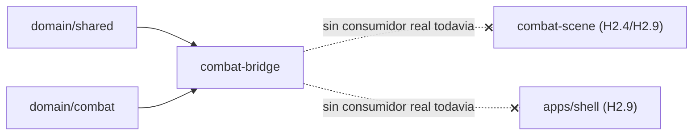

# Spec H2.3 — `CombatBridge`: pub/sub entre `CombatEngine` y vistas (React + Phaser)

> Spec técnica del Architect para Programmer. Historia origen: `.ai-studio/memory/backlog.md`, Épica E2,
> "H2.3: CombatBridge — pub/sub entre `CombatEngine` y vistas (React + Phaser)". Depende de H2.1 (cerrada:
> `packages/combat-scene`/`packages/ui-shared` existen) y H2.2 (cerrada: `apps/shell` existe con routing y
> un `.gitkeep` placeholder en `apps/shell/src/combat-bridge/`). Arquitectura de referencia:
> `docs/architecture_stack.md` §2 (contratos de `CombatEngine`/`CombatBridge`), §6 (dependencias). Esta
> spec **amenda** la ubicación de archivo propuesta en `architecture_stack.md` §1/§2.1 — ver §0.3.

---

## 0. Qué resuelve esta historia (y qué NO)

### 0.1 Dentro de alcance de H2.3

1. Crear el paquete nuevo `packages/combat-bridge`: agnóstico de framework (sin `react`, sin `phaser` como
   dependencia runtime), que implementa la clase `CombatBridge` — intermediaria de pub/sub entre un
   `CombatEngine` ya construido y sus consumidores (React/Phaser, ninguno de los dos importado aquí).
2. `CombatBridge` envuelve una instancia de `CombatEngine` inyectada por el caller (nunca la construye ella
   misma — ver §0.4) y expone:
   - `dispatch(command)`: reenvía el comando al engine y retorna su resultado (`CombatCommandResult`).
   - `getSnapshot()`: reenvía a `engine.getSnapshot()`.
   - `subscribeHudEvents(listener)`: canal dedicado a consumidores "HUD no-juice" (React, `architecture_stack.md` §2.3).
   - `subscribeSceneEvents(listener)`: canal dedicado a consumidores "juice" (Phaser/`EffectsDirector`, H2.4).
3. Un test unitario en aislamiento (sin React, sin Phaser, sin DOM) que construye un `CombatEngine` real
   contra contenido real de `packages/data` (mismo patrón que `catalog-adapter.test.ts`/H1.19), lo envuelve
   en un `CombatBridge`, despacha un comando real y verifica que ambos canales reciben el mismo evento
   exactamente una vez cada uno, sin duplicación ni pérdida.
4. Activar en `eslint.config.mjs` una nueva regla de boundaries para el elemento `combat-bridge` (§5).
5. Actualizar `package.json`/`tsconfig.json`/`tsconfig.base.json` raíz con la nueva entrada de workspace
   (mismo patrón que H2.1/H2.2, ver §2).
6. **Retirar** el placeholder `apps/shell/src/combat-bridge/.gitkeep` creado por H2.2 — superado por la
   decisión de ubicación de esta historia (ver §0.3). La carpeta `apps/shell/src/combat-bridge/` se elimina
   por completo; no hay ningún archivo de `apps/shell` en esta historia.

### 0.2 Fuera de alcance de H2.3 (frontera explícita con otras historias)

- **Ningún hook de React (`useCombatBridge`/`useCombatSnapshot`)**. `architecture_stack.md` §2.3 ya esboza
  `useCombatSnapshot(bridge)` como el patrón recomendado (`useSyncExternalStore` sobre
  `subscribeHudEvents`), pero implementarlo requiere un consumidor real (`<CombatScreen>`) que no existe
  hasta H2.9. Construir el hook ahora, sin consumidor, repetiría el error que H2.1/H2.2 evitaron
  deliberadamente ("no instalar/construir código sin consumidor real antes de tiempo"). **H2.9 construye el
  hook**, consumiendo el `CombatBridge` ya cerrado por esta historia.
- **Ninguna suscripción real desde `packages/combat-scene`/`CombatScene`**. `EffectsDirector.attach(bridge, scene)`
  (contrato ya definido en `architecture_stack.md` §3.2) es H2.4; `CombatScene` inyectando el bridge vía
  `scene.init(data)` es H2.6/H2.9. Esta historia solo deja `subscribeSceneEvents` funcionando y testeado en
  aislamiento — nadie lo consume todavía desde Phaser.
- **Ninguna inicialización de combate real** (carga de catálogo, `buildCombatEngineConfig`, instanciación de
  `CombatEngine` desde una pantalla). `CombatBridge` recibe un `CombatEngine` **ya construido** — quien
  decide cómo se construye (qué Líder/Enemigo/Escenario, qué `RandomSource`) es responsabilidad del caller
  (H2.9, `<CombatScreen>`), reutilizando `buildCombatEngineConfig` (H1.19, `@collector/domain-combat`) tal
  cual, sin envolverlo dentro del bridge. Ver justificación en §0.4.
- **Nada de `EffectsDirector`, `InputAdapter`, `<PhaserMount>`, `<CombatScreen>`** — todos ellos historias
  posteriores (H2.4, H2.6, H2.7, H2.9) que **consumirán** `@collector/combat-bridge` como dependencia, sin
  que esta historia los toque.
- **No se decide aquí el mecanismo concreto de inyección hacia Phaser** (`scene.init(data)` vs.
  `game.registry.set('bridge', bridge)`) — ambos ya están anotados como opciones válidas en
  `architecture_stack.md` §2.3; esa decisión de detalle es de H2.6/H2.9, que sí tienen una `CombatScene`
  real contra la que decidir.

### 0.3 Decisión de arquitectura: ubicación del Bridge — paquete neutral, no `apps/shell`

**Decisión: `CombatBridge` vive en un paquete nuevo `packages/combat-bridge`, no en `apps/shell/src/combat-bridge`**
como H2.2 había dejado planeado (placeholder `.gitkeep`). Esta spec amenda esa expectativa y la de
`architecture_stack.md` §1/§2.1 (que listaba `combat-bridge` como subcarpeta de `apps/shell`).

**Por qué:**

1. **Dirección de dependencias y ESLint boundaries.** `eslint.config.mjs` fija una única dirección de
   dependencia: `combat-scene` solo puede importar `domain-*` (línea 33: `{ from: 'combat-scene', allow:
   ['domain-shared', 'domain-catalog', 'domain-combat'] }`); nada permite a `combat-scene` importar
   `shell`, ni existe (ni debería existir) una regla que lo permita — `shell` es la hoja final del grafo de
   dependencias (H2.2 §6: "nada en el monorepo importa `apps/shell`"). Si `CombatBridge` viviera dentro de
   `apps/shell`, `packages/combat-scene` (y su futura `CombatScene`/`EffectsDirector`, H2.4/H2.6) **no
   podría importar el tipo `CombatBridge`** sin violar boundaries o sin invertir la dirección del grafo —
   ninguna de las dos opciones es aceptable. La alternativa de que Phaser reciba el bridge por duck-typing
   (una interfaz local duplicada en `combat-scene` que coincida estructuralmente) es peor: duplica el
   contrato en dos sitios que divergerían con el tiempo, exactamente el tipo de deuda que boundaries existe
   para evitar.
2. **Ambos consumidores necesitan el mismo contrato real, no uno estructuralmente compatible.** H2.9 conecta
   `apps/shell` (React) y `packages/combat-scene` (Phaser) contra el **mismo** `CombatBridge` — ambos deben
   `import type { CombatBridge } from '@collector/combat-bridge'` y ambos deben poder invocar
   `subscribeSceneEvents`/`subscribeHudEvents`/`dispatch`/`getSnapshot` desde su propio código (React vía
   hook en H2.9, Phaser vía `EffectsDirector.attach`/`CombatScene.create` en H2.4/H2.6/H2.9). Un paquete
   neutral consumido por ambos (mismo patrón que `domain/*`) es la única forma de que los dos importen el
   mismo tipo real sin invertir ninguna dirección de dependencia.
3. **Coherencia con el patrón ya establecido en el repo.** `packages/domain/*` ya demuestra el patrón
   "paquete neutral, sin `react` ni `phaser`, consumido por múltiples paquetes de capas superiores"
   (`combat-scene` y `apps/shell` ya importan `domain-combat`/`domain-catalog` de forma independiente, sin
   que uno dependa del otro para acceder a dominio). `CombatBridge` es, en esencia, una capa de
   presentación de eventos de dominio — encaja en el mismo patrón, no en el de "código de aplicación final"
   que sí es exclusivo de `apps/shell` (pantallas, routing, PWA).
4. **`CombatBridge` no importa nada de UI.** No usa JSX, no usa `Phaser.Scene`, no usa el DOM — es una clase
   TypeScript pura sobre `EventBus`/`CombatEngine` (mismo nivel de "framework-agnostic" que
   `packages/domain/combat`). No hay ninguna razón técnica para que viva dentro de un paquete de aplicación
   (`apps/shell`) en vez de un paquete de librería (`packages/*`) — la única razón por la que H2.2 lo
   planeó dentro de `apps/shell` fue seguir literalmente la estructura de carpetas de
   `architecture_stack.md` §1, que en este punto describía una intención ("puente React↔Phaser") sin haber
   resuelto todavía el detalle de boundaries que esta historia sí resuelve.

**Consecuencia para `architecture_stack.md`:** esta spec actualiza directamente §1, §2.1-2.2 y §6 de
`docs/architecture_stack.md` (ver diffs aplicados junto con esta spec) para reflejar `packages/combat-bridge`
como el paquete real. `apps/shell` seguirá siendo quien **instancia** `CombatBridge` (con un `CombatEngine`
ya construido) e inyecta la instancia a React/Phaser — la ubicación del *código de la clase* cambia, el
reparto de responsabilidades de `architecture_stack.md` §2.3 (quién construye qué, cuándo) no cambia.

### 0.4 Decisión de arquitectura: alcance — Bridge envuelve un engine ya construido, no lo construye

**Decisión: `CombatBridge` recibe un `CombatEngine` ya instanciado por el caller; no orquesta carga de
catálogo ni `buildCombatEngineConfig`.**

**Por qué:**

- `buildCombatEngineConfig` (H1.19, `packages/domain/combat/src/catalog-adapter.ts`) ya es la función
  reutilizable que construye un `CombatEngineConfig` a partir de `Catalog` + Líder + Enemigo + Escenario +
  `RandomSource`; `packages/cli` ya la consume tal cual, sin envolverla en ninguna clase adicional. Duplicar
  esa responsabilidad dentro de `CombatBridge` (ej. `CombatBridge.fromCatalog(...)`) mezclaría dos
  responsabilidades distintas — "orquestar construcción de una partida" y "retransmitir eventos de una
  partida ya en curso" — en la misma clase, sin necesidad real: nada en H2.9/H2.14 exige que sea la misma
  pieza quien haga ambas cosas.
- H2.9 (que sí conecta React+Phaser+contenido real) necesita, de todos modos, decidir **cuándo** y **con
  qué IDs** de Líder/Enemigo/Escenario se construye el combate (viene de `RunStartScreen`/H2.14, o de
  valores por defecto como hace hoy `packages/cli/src/main.ts`) — esa decisión de "qué combate armar" es
  lógica de pantalla (`<CombatScreen>`), no de bridge. Mantener `CombatBridge` "tonto" respecto al catálogo
  significa que H2.9 solo tiene que escribir el mismo tipo de código que ya escribió `packages/cli/src/main.ts`
  líneas 69-97 (cargar catálogo, resolver Líder/Enemigo/Escenario, `buildCombatEngineConfig`, `new
  CombatEngine(config)`) y luego pasar ese engine ya vivo a `new CombatBridge(engine)` — cero código nuevo
  de orquestación de catálogo que inventar o mantener dentro de este paquete.
- Consecuencia práctica: **`packages/combat-bridge` no depende de `packages/data`** (no lee JSON, no hace
  `fetch`/`readFileSync`) — solo depende de `@collector/domain-shared` y `@collector/domain-combat` (para
  los tipos `CombatCommand`/`CombatEvent`/`CombatStateSnapshot`/`CombatCommandResult`/`Unsubscribe`). Esto
  mantiene el paquete mínimo y coherente con "una responsabilidad, un pub/sub" (título de la historia en
  backlog.md).

---

## 1. Estructura de paquetes y archivos

```
packages/
  combat-bridge/
    package.json
    tsconfig.json
    vitest.config.ts
    src/
      index.ts                      # export * de todo el paquete
      combat-bridge.ts               # NUEVO H2.3 — clase CombatBridge + createCombatBridge (ver §3)
      combat-bridge.test.ts          # NUEVO H2.3 — test de aislamiento con engine real (ver §4)

apps/
  shell/
    src/
      # combat-bridge/.gitkeep ELIMINADO — ver §0.3, superado por packages/combat-bridge
```

Notas:
- Un único archivo de implementación (`combat-bridge.ts`) es suficiente — la clase es deliberadamente
  pequeña (4 métodos públicos, 2 `EventBus` internos, ver §3). No hay razón para dividir en más módulos en
  esta historia (contraste con `packages/domain/combat`, que sí separa por dominio de reglas — aquí no hay
  reglas, solo relé de eventos).
- `index.ts` re-exporta `CombatBridge` (la interfaz), `createCombatBridge` (el factory) y, por
  conveniencia, re-exporta los tipos de `@collector/domain-combat` que un consumidor necesitará junto al
  bridge (`CombatCommand`, `CombatEvent`, `CombatStateSnapshot`, `CombatCommandResult`) — así React/Phaser
  en H2.9 importan un único paquete (`@collector/combat-bridge`) para todo lo que necesitan del contrato de
  comunicación, sin tener que importar `@collector/domain-combat` por separado solo para los tipos. Ver
  §3.3.

---

## 2. Tooling: workspaces, tsconfig, package.json

### 2.1 `package.json` raíz

```jsonc
"workspaces": [
  "packages/domain/*",
  "packages/data",
  "packages/cli",
  "packages/combat-scene",
  "packages/combat-bridge",   // NUEVO H2.3
  "packages/ui-shared",
  "apps/shell"
]
```

### 2.2 `tsconfig.json` raíz

```jsonc
"references": [
  { "path": "packages/domain/shared" },
  { "path": "packages/domain/catalog" },
  { "path": "packages/domain/combat" },
  { "path": "packages/data" },
  { "path": "packages/cli" },
  { "path": "packages/combat-scene" },
  { "path": "packages/combat-bridge" },  // NUEVO H2.3
  { "path": "packages/ui-shared" },
  { "path": "apps/shell" }
]
```

### 2.3 `tsconfig.base.json` raíz

```jsonc
"paths": {
  "@collector/domain-shared": ["packages/domain/shared/src/index.ts"],
  "@collector/domain-catalog": ["packages/domain/catalog/src/index.ts"],
  "@collector/domain-combat": ["packages/domain/combat/src/index.ts"],
  "@collector/combat-scene": ["packages/combat-scene/src/main.ts"],
  "@collector/combat-bridge": ["packages/combat-bridge/src/index.ts"],  // NUEVO H2.3
  "@collector/ui-shared": ["packages/ui-shared/src/index.ts"]
}
```

Nuevo alias necesario porque `packages/combat-scene` (futuro, H2.4/H2.6) y `apps/shell` (futuro, H2.9)
importarán `@collector/combat-bridge` por nombre de paquete npm — mismo patrón que `combat-scene`/`ui-shared`
en H2.1.

### 2.4 `packages/combat-bridge/package.json`

Sigue el patrón de `packages/cli/package.json` (dependencias de dominio con `"*"`, sin dependencias de
framework):

```jsonc
{
  "name": "@collector/combat-bridge",
  "version": "0.0.0",
  "private": true,
  "type": "module",
  "main": "./dist/index.js",
  "scripts": {
    "build": "tsc -b"
  },
  "dependencies": {
    "@collector/domain-shared": "*",
    "@collector/domain-combat": "*"
  }
}
```

Nota: **sin** `@collector/domain-catalog` como dependencia — `CombatBridge` nunca toca `CatalogLoader`/
`buildCombatEngineConfig` (§0.4), solo los tipos de `domain-combat` (`CombatCommand`, `CombatEvent`,
`CombatStateSnapshot`, `CombatCommandResult`, la clase `CombatEngine` en sí) y `Unsubscribe`/`EventBus` de
`domain-shared`. Sin `react`, sin `phaser` — coherente con §0.3 punto 4.

### 2.5 `packages/combat-bridge/tsconfig.json`

```jsonc
{
  "extends": "../../tsconfig.base.json",
  "compilerOptions": {
    "rootDir": "src",
    "outDir": "dist",
    "types": ["node"]
  },
  "include": ["src"],
  "references": [
    { "path": "../domain/shared" },
    { "path": "../domain/combat" }
  ]
}
```

`"types": ["node"]` (no `"vite/client"` como `combat-scene`, no `"react"` como `ui-shared`) — este paquete
no corre en navegador ni en Phaser, es lógica pura testeada con Vitest en Node, mismo patrón que
`packages/cli`/`packages/domain/*`.

### 2.6 `packages/combat-bridge/vitest.config.ts`

```ts
import { defineConfig } from 'vitest/config';
import tsconfigPaths from 'vite-tsconfig-paths';

export default defineConfig({
  plugins: [tsconfigPaths()],
  test: {
    environment: 'node',
    include: ['src/**/*.test.ts']
  }
});
```

Entorno `node` (no `jsdom`) — sin DOM, sin Phaser, mismo patrón que `packages/domain/combat`/`packages/cli`.

---

## 3. Contrato de `CombatBridge`

### 3.1 Interfaz pública

```ts
// packages/combat-bridge/src/combat-bridge.ts
import type {
  CombatEngine,
  CombatCommand,
  CombatEvent,
  CombatCommandResult,
  CombatStateSnapshot,
} from '@collector/domain-combat';
import type { Unsubscribe } from '@collector/domain-shared';

export interface CombatBridge {
  readonly engine: CombatEngine;

  /** Reenvía el comando a `engine.dispatch(command)`. El valor de retorno es el mismo
   *  `CombatCommandResult` del engine (mismo contrato que ya usa `packages/cli`) — útil
   *  para lógica síncrona inmediata del propio caller (p.ej. mostrar un error de
   *  validación en el mismo tick). Si el comando tuvo éxito, los eventos resultantes
   *  YA fueron publicados a ambos canales de suscripción ANTES de que `dispatch`
   *  retorne (ver §3.2, orden de entrega). */
  dispatch(command: CombatCommand): CombatCommandResult;

  /** Reenvía a `engine.getSnapshot()`. Sin caché ni transformación — el snapshot
   *  siempre refleja el estado inmediatamente después del último `dispatch()`. */
  getSnapshot(): CombatStateSnapshot;

  /** Canal para consumidores "HUD no-juice" (React overlay, `architecture_stack.md`
   *  §2.3) — vida, Trama, turno, resultado final. */
  subscribeHudEvents(listener: (event: CombatEvent) => void): Unsubscribe;

  /** Canal para consumidores "juice" (Phaser/`EffectsDirector`, H2.4) — el mismo
   *  stream de eventos que `subscribeHudEvents`, canal independiente. */
  subscribeSceneEvents(listener: (event: CombatEvent) => void): Unsubscribe;
}

/** Único punto de construcción — `CombatBridge` no tiene constructor propio expuesto
 *  (se evita `new CombatBridge(...)` para dejar la puerta abierta a que el factory, en
 *  el futuro, añada validación o instrumentación sin romper la firma pública). Recibe
 *  un `CombatEngine` YA CONSTRUIDO (ver spec §0.4) — este paquete nunca instancia uno. */
export function createCombatBridge(engine: CombatEngine): CombatBridge;
```

### 3.2 Comportamiento interno (orden de entrega, no duplicación)

- `createCombatBridge(engine)` crea internamente **dos** `EventBus<CombatEvent>` (`@collector/domain-shared`,
  H1.1 — el mismo genérico ya usado por `CombatEngine` para su bus interno): uno para HUD, otro para
  Scene. No se comparte un único bus con "temas"/filtros — dos instancias independientes es más simple y
  hace explícito en el tipo que ambos canales son independientes (un listener de `subscribeSceneEvents`
  nunca puede, por accidente, recibir algo pensado solo para HUD o viceversa, porque no existe tal cosa —
  ambos reciben siempre el mismo stream completo).
- En la construcción, `createCombatBridge` se suscribe **una sola vez** a `engine.subscribe(listener)` (el
  método pub/sub que `CombatEngine` ya expone, ver `packages/domain/combat/src/combat-engine.ts` líneas
  1916-1917 — no hace falta añadir nada al engine, ya cumple el contrato de `architecture_stack.md` §2.2).
  Ese único listener interno reemite cada `CombatEvent` recibido a **ambos** buses (`hudBus.emit(event)`
  seguido de `sceneBus.emit(event)`, mismo orden siempre). Este es el mecanismo de relé — no hay lógica de
  relé duplicada en `dispatch()`: `dispatch()` solo reenvía la llamada a `engine.dispatch(command)` y
  retorna su resultado tal cual.
- Por qué relé vía `engine.subscribe()` y no vía el valor de retorno de `engine.dispatch()`: ambos canales
  transportan literalmente los mismos objetos de evento en el mismo orden (`CombatCommandResult` ya
  documenta esto — "esos mismos eventos también se emiten por `subscribe()` en el mismo orden", ver
  `packages/domain/combat/src/types/errors.ts` líneas 92-98). Usar `engine.subscribe()` como única fuente
  evita mantener dos caminos de emisión sincronizados a mano (uno desde el valor de retorno, otro desde una
  suscripción) — un solo listener interno, una sola responsabilidad.
- "Sin duplicación" (criterio de aceptación de backlog.md) significa: cada evento que el engine emite llega
  **exactamente una vez** a cada suscriptor de cada canal — nunca dos veces al mismo listener por el mismo
  evento, y los dos canales son independientes entre sí (un mismo evento SÍ llega a HUD y a Scene — eso es
  el propósito del pub/sub de dos canales — pero nunca dos veces al mismo canal para el mismo evento).
- `getSnapshot()` no necesita ningún estado propio en `CombatBridge` — reenvía directo a
  `engine.getSnapshot()` en cada llamada, sin caché. El bridge no mantiene su propia copia de estado.

### 3.3 `packages/combat-bridge/src/index.ts`

```ts
export { createCombatBridge } from './combat-bridge';
export type { CombatBridge } from './combat-bridge';
export type {
  CombatCommand,
  CombatEvent,
  CombatCommandResult,
  CombatStateSnapshot,
  CombatEngine,
} from '@collector/domain-combat';
export type { Unsubscribe } from '@collector/domain-shared';
```

Re-exportar estos tipos (no solo `CombatBridge`) es intencional (§1): el consumidor de H2.9 (React o
Phaser) hace `import type { CombatBridge, CombatEvent } from '@collector/combat-bridge'` sin tener que
declarar además una dependencia directa a `@collector/domain-combat` solo para los tipos de evento — aunque
nada impide que también lo haga si lo prefiere (ambos paquetes exportan el mismo tipo real, no hay
duplicación de definición, solo de ruta de import).

---

## 4. Verificación: test unitario en aislamiento

`packages/combat-bridge/src/combat-bridge.test.ts` — mismo rigor y mismo patrón de "contenido real, no
mockeado a mano" que `catalog-adapter.test.ts` (H1.19) y `hello-combat-scene.test.ts` (H2.1 §4.2):

1. Cargar el contenido real 2×2×2 de `packages/data` (mismo patrón de lectura de JSON que
   `catalog-adapter.test.ts` líneas 15-37 — duplicado localmente en este test, por la misma razón ya
   documentada allí: evitar una dependencia `combat-bridge -> data` prohibida por boundaries, ver §5).
2. Construir un `CombatEngine` real vía `CatalogLoader` + `buildCombatEngineConfig` +
   `SeededRandomSource(<semilla fija>)` — idéntico a como lo hace `packages/cli/src/main.ts` líneas 69-97 y
   `catalog-adapter.test.ts`.
3. `const bridge = createCombatBridge(engine)`.
4. Registrar dos listeners de prueba, uno vía `bridge.subscribeHudEvents(hudListener)`, otro vía
   `bridge.subscribeSceneEvents(sceneListener)` (ambos simples `vi.fn()` o arrays acumuladores).
5. Despachar un comando real que produzca al menos un evento observable — p.ej. `ACTIVATE_ABILITY` sobre la
   habilidad CD1 del Líder con un Núcleo válido del pool inicial del snapshot (mismo patrón de resolución de
   Núcleo por color/valor que usan los tests de `combat-engine.test.ts`), y asertar:
   - El resultado de `bridge.dispatch(command)` es `{ ok: true, value: [...] }` con al menos 1 evento
     (`ABILITY_ACTIVATED` como mínimo).
   - `hudListener` fue invocado exactamente el mismo número de veces que eventos hay en `result.value`, con
     los mismos eventos, en el mismo orden.
   - `sceneListener` fue invocado exactamente el mismo número de veces, con los mismos eventos, en el mismo
     orden — **sin que ninguno de los dos listeners se haya invocado más de una vez por evento** (criterio
     "sin duplicación" de backlog.md).
6. Verificar `Unsubscribe`: llamar al `Unsubscribe` retornado por `subscribeHudEvents`, despachar un segundo
   comando, y confirmar que `hudListener` ya NO recibe el nuevo evento mientras `sceneListener` (que sigue
   suscrito) sí lo recibe — prueba que ambos canales son independientes y que `Unsubscribe` funciona por
   canal, no globalmente.
7. Verificar `bridge.getSnapshot()` refleja el mismo estado que `engine.getSnapshot()` tras el dispatch
   (`toEqual`, no solo "no lanza") — confirma que no hay transformación ni desincronización de estado entre
   engine y bridge.
8. (Opcional, recomendado) Un segundo `it()` que valida el caso de comando rechazado (`ok: false`, p.ej.
   `ACTIVATE_ABILITY` con un `nucleoInstanceId` inexistente): confirmar que **ningún** listener de ningún
   canal es invocado — un comando rechazado no genera eventos de dominio, coherente con
   `CombatEngine.dispatch` (no muta estado ni emite en la rama de error, ver `combat-engine.ts` líneas
   1005-1031).

Este test cubre el criterio de aceptación literal de backlog.md ("Test unitario muestra que un comando
genera eventos que se reciben en ambos suscriptores sin duplicación") sin depender de React, Phaser, ni
`apps/shell`/`packages/combat-scene` — exactamente el nivel de aislamiento que `docs/architecture_stack.md`
§2.4 exige para todo lo que compone el pub/sub de dominio.

---

## 5. ESLint boundaries — nuevo elemento `combat-bridge`

`eslint.config.mjs` necesita una entrada nueva (no pre-declarada como "entrada futura" en el archivo
actual — a diferencia de `combat-scene`/`ui-shared`/`shell`, el propio paquete `combat-bridge` es nuevo en
esta historia, no algo que H2.1/H2.2 hubieran anticipado con un comentario):

```jsonc
// settings.boundaries/elements — nueva entrada:
{ type: 'combat-bridge', pattern: 'packages/combat-bridge/**' }, // NUEVO H2.3

// rules.boundaries/element-types — nueva regla + 2 reglas existentes ampliadas:
{ from: 'combat-bridge', allow: ['domain-shared', 'domain-combat'] }, // NUEVO H2.3
{ from: 'combat-scene', allow: ['domain-shared', 'domain-catalog', 'domain-combat', 'combat-bridge'] }, // AMPLIADA H2.3
{ from: 'shell', allow: ['domain-shared', 'domain-catalog', 'domain-combat', 'combat-scene', 'combat-bridge', 'ui-shared'] }, // AMPLIADA H2.3
```

Confirmar en la revisión de esta historia que:
- `combat-bridge` puede importar `domain-shared`/`domain-combat` (usado en §3.1) — **no** `domain-catalog`
  (§2.4 — sin dependencia, coherente con §0.4).
- `combat-bridge` NO puede importar `combat-scene`, `ui-shared` ni `shell` en ninguna dirección — es una
  hoja intermedia del grafo (paralela a `domain-combat`, no un consumidor de capas superiores).
- `combat-scene` y `shell` pueden ahora importar `combat-bridge` (regla ampliada) — aunque, igual que
  disciplina ya aplicada en H2.1/H2.2, **ningún código real de esta historia lo hace todavía** (nadie en
  `combat-scene`/`shell` importa `@collector/combat-bridge` en H2.3 — el primer import real es H2.9/H2.4).
  No se declara `@collector/combat-bridge` como dependencia en `package.json` de `combat-scene`/`shell`
  hasta que exista ese import real, mismo criterio que H2.1 §2.4/H2.2 §2.4.

---

## 6. Resumen de dependencias (mermaid, alcance de esta historia)



`packages/combat-bridge` queda como hoja del grafo de dependencias en este momento (igual que
`combat-scene`/`ui-shared` quedaron tras H2.1) — ningún paquete lo importa de verdad todavía. Eso se
resuelve en H2.4 (`EffectsDirector.attach(bridge, scene)` dentro de `combat-scene`) y H2.9
(`<CombatScreen>` instancia el bridge e inyecta a React/Phaser).

---

## 7. Checklist de Definition of Done para Programmer

- [ ] `packages/combat-bridge/{package.json,tsconfig.json,vitest.config.ts}` creados.
- [ ] `packages/combat-bridge/src/{index.ts,combat-bridge.ts,combat-bridge.test.ts}` creados.
- [ ] `apps/shell/src/combat-bridge/.gitkeep` **eliminado** (carpeta completa retirada) — ver §0.1 punto 6.
- [ ] `package.json` raíz: `workspaces` actualizado (§2.1).
- [ ] `tsconfig.json` raíz: `references` actualizado (§2.2).
- [ ] `tsconfig.base.json` raíz: `paths` actualizado (§2.3).
- [ ] `eslint.config.mjs`: nueva entrada `combat-bridge` + 2 reglas ampliadas (§5).
- [ ] `docs/architecture_stack.md` §1/§2.1-2.2/§6 actualizado para reflejar `packages/combat-bridge` como
      paquete real (ya aplicado junto con esta spec — confirmar que el diff sigue vigente si esta historia
      se implementa más adelante que la fecha de esta spec).
- [ ] `npm run build`, `npm run lint`, `npm run typecheck`, `npm run test` (raíz) pasan en verde, incluyendo
      el test nuevo de §4.
- [ ] Test de §4 cubre explícitamente: entrega sin duplicación en ambos canales, independencia de
      `Unsubscribe` por canal, y el caso de comando rechazado sin eventos (punto 8, recomendado).
