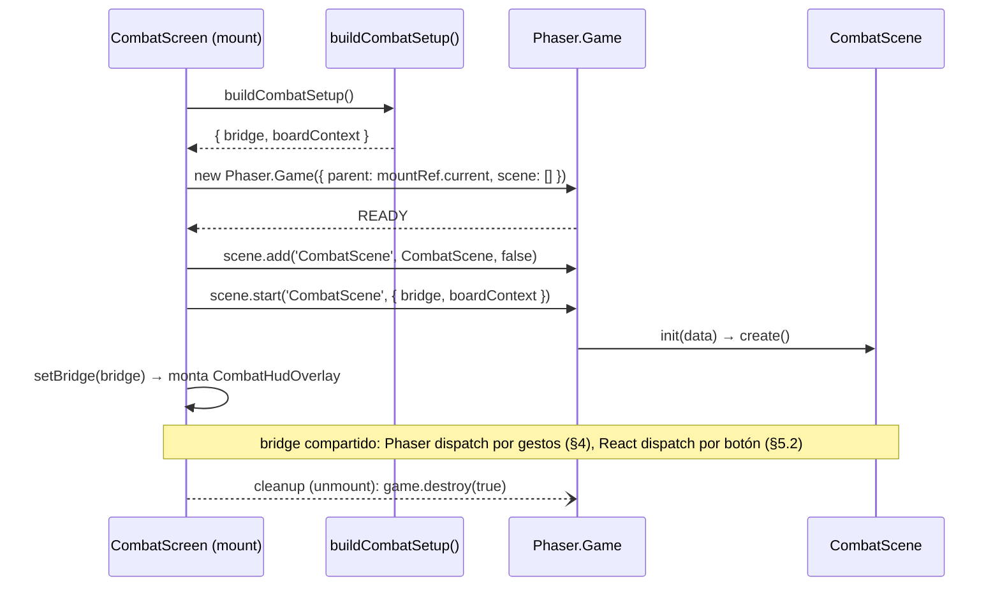
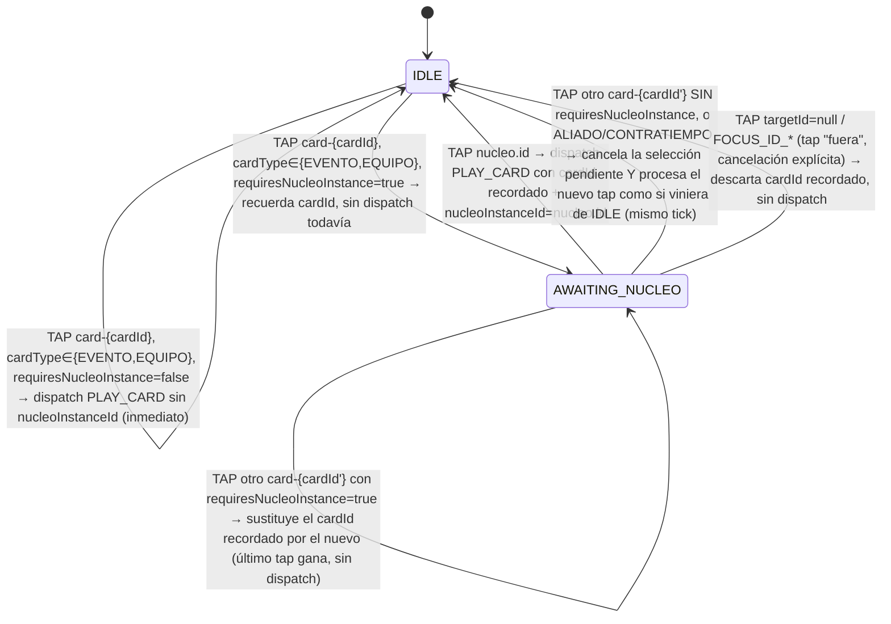

# Spec H2.9 — Flujo end-to-end jugable: React aloja Phaser, dispatch de comandos, reacción visual

> Spec técnica del Architect para Programmer. Historia origen: `.ai-studio/memory/backlog.md`, Épica E2,
> "H2.9: Flujo end-to-end jugable — React aloja Phaser, dispatch de comandos, reacción visual". Depende de
> H2.2 (cerrada: `apps/shell` con `<CombatScreen>` placeholder), H2.3 (cerrada: `CombatBridge`), H2.6
> (cerrada: `CombatScene`), H2.7 (cerrada: `InputAdapter` de gestos genéricos), H2.8 (cerrada: `BoardView`
> con `targetId` real en todo game object interactivo). Cierra el círculo React↔Phaser de la Épica E2 —
> después de esta historia el vertical slice es jugable de principio a fin con la mano/el ratón/el dedo.

---

## 0. Qué resuelve esta historia (y qué NO)

### 0.1 El hallazgo que condiciona el alcance: la traducción gesto→comando vive DENTRO de `CombatScene`, no en `apps/shell`

`CombatScene.create()` (H2.6/H2.7/H2.8) ya construye y posee, como propiedades de instancia, exactamente
las tres piezas que la traducción necesita: `this.bridge` (para `dispatch`), `this.boardContext` (para
saber qué carta es cada `targetId` de mano y si necesita Núcleo), y `this.inputAdapter` (la fuente de
`PointerGesture`). No hay ninguna razón arquitectónica para sacar esta lógica fuera de `combat-scene` hacia
`apps/shell` — hacerlo obligaría a exponer `bridge`/`boardContext`/`inputAdapter` fuera de la escena sin
beneficio, y rompería la regla de dependencia de `architecture_stack.md` §1 (`combat-scene` consume
`domain`+`combat-bridge`, `shell` consume a todos — nunca al revés; mover la traducción a `shell` no violaría
esa regla, pero sí duplicaría conocimiento de convenciones internas de `combat-scene` —
`cardTileName`, `FOCUS_ID_*`, `nucleo.id` — en un paquete que no las define). **Decisión:** la traducción
`PointerGesture → CombatCommand → bridge.dispatch(...)` es un módulo nuevo de `combat-scene`
(`src/interaction/`), instanciado y conectado dentro de `CombatScene.create()`, igual que
`EffectsDirector`/`BoardView` ya lo son. `apps/shell` no necesita saber que existe.

Consecuencia directa: **`apps/shell` no gana ninguna lógica de gestos**. Su responsabilidad se limita a (a)
construir `CombatBridge`+`BoardViewContext` (§1), (b) montar `Phaser.Game`+`CombatScene` dentro de
`<CombatScreen>` (§3), y (c) aportar el "chrome" no-juice de React que ya preveía
`architecture_stack.md` §2.3 (barra de fin de turno, HUD de vida/Trama vía hook, modal de resultado) —
usando el MISMO `CombatBridge` que se inyectó a Phaser, sin gestos, sin traducir nada.

### 0.2 Dentro de alcance de H2.9

1. **Construcción del `CombatBridge`+`BoardViewContext` movida a `apps/shell`** (§1) — sustituye a
   `buildDefaultCombatBridge` de `packages/combat-scene/src/build-default-combat-bridge.ts` como el punto de
   construcción de producción; ese archivo se retira de `combat-scene` (§1.3).
2. **`packages/combat-scene` gana un punto de entrada de librería público** (`src/index.ts`, §2) — hasta
   ahora ningún paquete lo consumía como dependencia (su único "consumidor" era su propio harness vía
   `index.html`); `apps/shell` es el primer consumidor real.
3. **`<CombatScreen>` monta `Phaser.Game` de verdad** dentro de `div#phaser-mount` (§3), vía `useEffect` con
   cleanup — sustituye el placeholder vacío de H2.2.
4. **Máquina de estados de selección pendiente** (`src/interaction/gesture-command-translator.ts`, §4):
   traduce `PointerGesture` (tap) sobre tiles de mano/Núcleo a `CombatCommand` real y lo dispatch contra
   `this.bridge`. Cubre `PLAY_CARD` (con selección de Núcleo en 2 pasos cuando el efecto de la carta lo
   exige), `PLAY_ALLY`, `PLAY_CONTRATIEMPO` (ambos en 1 paso, sin Núcleo).
5. **Extensión de `HandCardViewData` con `requiresNucleoInstance`** (§4.2) — dato que la máquina de estados
   necesita para saber si debe esperar un segundo tap sobre un Núcleo antes de dispatch `PLAY_CARD`.
   Calculado una sola vez al construir `BoardViewContext` (mismo punto que ya resuelve `energyCost`/`name`),
   reutilizando una función nueva y pequeña exportada de `domain/combat` (§4.2.1) — sin duplicar el
   vocabulario de keywords de ataque en `combat-scene`/`shell`.
6. **HUD React no-juice** (`useCombatSnapshot`, §5): hook de lectura de snapshot vía
   `useSyncExternalStore`, botón "Fin de turno" que dispatch `END_TURN` directo contra el bridge (sin pasar
   por gestos de Phaser — ver §0.3 para por qué), y modal de resultado (`COMBAT_ENDED`).
7. **Verificación** (§6): test unitario de la máquina de estados (sin canvas/DOM real) + Playwright E2E real
   contra `apps/shell` sirviendo `/combat` (§6.2).

### 0.3 Fuera de alcance de H2.9 (diferido explícitamente, con destino)

- **`ACTIVATE_ABILITY` del Líder/Enemigo NO se conecta a ningún gesto en esta historia.** `ACTIVATE_ABILITY`
  exige `abilityId` + `nucleoInstanceId` (`commands.ts`), y el Líder tiene **4** `baseAbilities` (una por
  CD1-4, `leader.ts`) — pero `role-view.ts` (H2.8) solo creó **un** Rectangle por rol (`FOCUS_ID_LEADER`),
  sin ningún icono individual por habilidad que un tap pueda distinguir. Inventar 4 icones de habilidad
  clickeables por rol es trabajo de renderizado nuevo (posiciones, arte, layout), no de traducción de
  gestos — y el criterio de aceptación literal de H2.9 en el backlog ("Usuario puede clickear una carta en
  mano → `PLAY_CARD`") no lo exige. Se deja constancia explícita para Coordinator: activar habilidades del
  Líder/Enemigo desde gestos necesita una historia previa de renderizado (icono de habilidad por
  `abilityId`, con su propio `targetId`) antes de que la traducción gesto→comando pueda direccionar
  `ACTIVATE_ABILITY` sin ambigüedad — mismo patrón de "sprites primero, traducción después" que H2.7 §0.1 ya
  fijó para H2.8.
- **`SET_DAMAGE_REDIRECT` (drag para redirigir daño a un Aliado) NO se conecta.** `InputAdapter` ya clasifica
  `DRAG_START`/`DRAG_MOVE`/`DRAG_END` (H2.7), pero esta historia solo traduce `TAP` — el criterio de
  aceptación de H2.9 no menciona redirección de daño. Queda para una historia futura de la Épica E2/E3 que
  la mencione explícitamente.
- **`SUMMON_MINION`/`RESOLVE_MINION_ACTION`** son comandos exclusivos de `turnOwner === 'ENEMY'`, ya
  automatizados por la IA del Enemigo (`domain/combat`, H1.16/H1.7) — nunca disparados por gesto del
  jugador. Sin cambio aquí.
- **Ninguna animación/juice nueva.** El dispatch resultante ya dispara `CombatEvent`s reales que
  `EffectsDirector` (H2.4/H2.5) ya sabe animar — cero cambio a recetas/`JuiceConfig`.
- **Ningún contenido nuevo.** Sigue el 2×2×2 de H1 (decisions.md 2026-07-06), movido de
  `combat-scene/src/load-raw-content.ts` a donde ahora vive la construcción del bridge (§1).
- **PWA/manifest/service worker** — H2.15, historia propia, sin solapar con esta.

---

## 1. Quién construye el `CombatBridge` ahora — se mueve a `apps/shell`

### 1.1 Decisión

`apps/shell` asume la responsabilidad de construir `CombatEngine` → `CombatBridge` → `BoardViewContext`,
migrando la lógica completa de `packages/combat-scene/src/build-default-combat-bridge.ts` (ya lo anticipaba
su propio comentario: *"H2.9 sustituirá esta función por la construcción equivalente que viva en
`apps/shell`"*). Esto es coherente con `architecture_stack.md` §2.3: *"el `CombatEngine` se crea en React (o
en un factory de `apps/shell`) y se inyecta a Phaser vía `scene.init(data)`"* — React/shell es quien "posee"
el ciclo de vida del combate (más adelante decidirá qué Líder/Enemigo/Escenario cargar según la run;
contenido fijo por ahora, decisions.md 2026-07-06).

`combat-scene` dejará de tener una función de "construcción de producción" propia — solo sigue exportando
los TIPOS que `BoardViewContext`/`CombatSceneInitData` necesitan (§2), de los que `apps/shell` depende para
construir el objeto correcto, nunca al revés.

### 1.2 Nuevo módulo `apps/shell/src/combat/build-combat-setup.ts`

```ts
// apps/shell/src/combat/build-combat-setup.ts (contrato, no implementación completa)
import { createId, SeededRandomSource } from '@collector/domain-shared';
import type { LeaderId, EnemyId, ScenarioId } from '@collector/domain-shared';
import { CatalogLoader, buildNameLookup } from '@collector/domain-catalog';
import { CombatEngine, buildCombatEngineConfig, cardHasAttackEffect } from '@collector/domain-combat'; // NUEVO §4.2.1
import { createCombatBridge } from '@collector/combat-bridge';
import type { CombatBridge } from '@collector/combat-bridge';
import type { BoardViewContext, HandCardViewData, DefaultCombatSetup } from '@collector/combat-scene'; // NUEVO §2
import { loadRawContent } from './load-raw-content'; // MOVIDO de combat-scene, §1.3

const DEFAULT_LEADER_ID = 'leader-soldado-base';
const DEFAULT_ENEMY_ID = 'enemy-bestia-base';
const DEFAULT_SCENARIO_ID = 'scenario-bosque-encantado-base';
const SHELL_SEED = 1;

/** Reemplaza a `buildDefaultCombatBridge` de `combat-scene` (retirada, §1.3) — mismo contrato de retorno
 *  (`DefaultCombatSetup`, tipo reexportado desde `@collector/combat-scene`, §2.3) para que `CombatScreen`
 *  (§3) no tenga que conocer su forma interna, solo pasarlo tal cual a `game.scene.start(...)`. */
export async function buildCombatSetup(): Promise<DefaultCombatSetup> {
  const rawInput = await loadRawContent();
  const catalog = await new CatalogLoader(rawInput).load();

  const leader = catalog.leaders.get(createId<'LeaderId'>('LeaderId', DEFAULT_LEADER_ID) as LeaderId)!;
  const enemy = catalog.enemies.get(createId<'EnemyId'>('EnemyId', DEFAULT_ENEMY_ID) as EnemyId)!;
  const scenario = catalog.scenarios.get(createId<'ScenarioId'>('ScenarioId', DEFAULT_SCENARIO_ID) as ScenarioId)!;

  const randomSource = new SeededRandomSource(SHELL_SEED);
  const config = buildCombatEngineConfig({ catalog, leader, enemy, scenario, randomSource });
  const engine = new CombatEngine(config);
  const bridge = createCombatBridge(engine);

  const nameLookup = buildNameLookup({ leader, enemy, catalog });
  const leaderCardPool: HandCardViewData[] = leader.cardPoolIds.map((cardId) => {
    const card = catalog.cards.get(cardId)!;
    return {
      cardId,
      name: card.name,
      energyCost: card.cost.energy,
      cardType: card.type,
      requiresNucleoInstance: cardHasAttackEffect(card), // NUEVO H2.9, §4.2
    };
  });

  const boardContext: BoardViewContext = {
    nameLookup,
    leaderMaxHealth: config.leaderMaxHealth,
    enemyMaxHealth: config.enemyMaxHealth,
    scenarioPlotDefeatThreshold: config.scenarioPlotDefeatThreshold,
    leaderCardPool,
  };

  return { bridge, boardContext };
}
```

Idéntico en estructura a la función retirada — solo cambia de paquete y añade el campo nuevo
`requiresNucleoInstance` (§4.2). `apps/shell` no reimplementa nada del `CatalogLoader`/`buildCombatEngineConfig`
— los sigue consumiendo tal cual, permitido ya por `eslint.config.mjs` (`shell` → `domain-catalog`,
`domain-combat`, `combat-bridge`, ya vigente desde H2.3).

### 1.3 `packages/combat-scene/src/build-default-combat-bridge.ts` y `load-raw-content.ts` — se retiran de `combat-scene`, se mueven a `apps/shell`

- `build-default-combat-bridge.ts`: se elimina de `combat-scene`. Su lógica migra a
  `apps/shell/src/combat/build-combat-setup.ts` (§1.2).
- `load-raw-content.ts`: se mueve tal cual (mismo contenido, mismo mecanismo dual Node/fetch, §1.2.1) a
  `apps/shell/src/combat/load-raw-content.ts` — es la única función que de verdad necesitaba vivir junto a
  la construcción del bridge (nada más en `combat-scene` la usaba tras el retiro de
  `build-default-combat-bridge.ts`, ver §1.4 sobre `main.ts`).
- `packages/combat-scene/public/data/` (copia estática servida por `fetch` en navegador, usada por
  `load-raw-content.ts`) se mueve en paralelo a `apps/shell/public/data/`, mismo mecanismo
  (`scripts/sync-data.mjs`, ver §7 cambios de tooling).

### 1.4 `packages/combat-scene/src/main.ts` (harness standalone) — SE MANTIENE, adaptado

**Decisión: se mantiene, no se retira.** Sigue siendo el playground de iteración rápida de `combat-scene`
en aislamiento (sin levantar `apps/shell` completo) — el mismo criterio que ya justificó mantenerlo vivo en
H2.6/H2.7/H2.8 pese a que cada historia sucesiva lo hiciera más "real". Retirarlo obligaría a levantar todo
`apps/shell` (React Router, `RunStartScreen`, etc.) solo para probar un cambio de receta de juice o de
`BoardView` — coste de iteración que ninguna historia ha pedido asumir.

**Adaptación necesaria:** `main.ts` pierde su import de `buildDefaultCombatBridge` (retirada, §1.3) y pasa a
construir su propio `DefaultCombatSetup` mínimo con contenido de prueba — se copia (no se reexporta, para no
crear una dependencia inversa `combat-scene → apps/shell`) una versión reducida de la lógica de §1.2
directamente en `main.ts` (mismo criterio que `e2e/combat-scene-smoke-main.ts` ya usa: harnesses standalone
que reconstruyen su propio setup sin depender de `apps/shell`). El debug-rect de H2.7 en `main.ts` (líneas
33-56 de la versión actual) se retira definitivamente — ya obsoleto desde H2.8, y H2.9 confirma que
`BoardView` lo sustituye por completo: el harness ya no necesita nada además de
`game.scene.start('CombatScene', { bridge, boardContext })`.

---

## 2. `packages/combat-scene` gana un punto de entrada de librería público

### 2.1 Por qué hace falta

Hasta H2.8, ningún paquete importaba `@collector/combat-scene` como dependencia — su único consumidor era su
propio harness (`index.html` → `/src/main.ts` directamente, sin pasar por `package.json#main`) y sus propios
tests. `apps/shell` es el primer consumidor real y necesita importar, por nombre de paquete (no por ruta
relativa cruzando el límite del paquete), exactamente: `CombatScene`, `COMBAT_SCENE_VIEWPORT`,
`CombatSceneInitData`, `BoardViewContext`, `HandCardViewData`, `DefaultCombatSetup` (tipo, §2.3).

### 2.2 `packages/combat-scene/src/index.ts` — nuevo barrel público

```ts
// packages/combat-scene/src/index.ts (contrato, no implementación completa)
export { CombatScene, COMBAT_SCENE_VIEWPORT } from './scenes/CombatScene';
export type { CombatSceneInitData } from './scenes/CombatScene';
export type { BoardViewContext, HandCardViewData } from './view';
export type { DefaultCombatSetup } from './default-combat-setup'; // NUEVO, §2.3 — solo el tipo, sin lógica
```

No se reexporta `createInputAdapter`/`createBoardView`/`createEffectsDirector` — son detalles internos que
`CombatScene` ya orquesta; `apps/shell` nunca necesita tocarlos directamente (§0.1).

### 2.3 `DefaultCombatSetup` — el tipo sobrevive, la función se muda

El contrato `{ bridge: CombatBridge; boardContext: BoardViewContext }` (H2.8) sigue siendo útil como forma de
retorno estándar — se conserva como un **tipo puro** en un archivo nuevo y mínimo
`packages/combat-scene/src/default-combat-setup.ts` (sin la función `buildDefaultCombatBridge`, retirada,
§1.3), para que tanto `apps/shell/src/combat/build-combat-setup.ts` (§1.2) como cualquier harness futuro
(`main.ts`, `e2e/*-main.ts`) lo usen como firma común sin redefinirlo cada uno por su cuenta.

### 2.4 Cambios de `package.json`/`tsconfig` de `combat-scene`

```jsonc
// packages/combat-scene/package.json — cambio de "main"
{
  "main": "./dist/index.js" // antes: "./dist/main.js" — dist/main.js deja de ser el punto de consumo
                             // como librería; el harness sigue sirviéndose vía index.html → /src/main.ts
                             // directamente (Vite dev/build de ESTE paquete no pasa por "main")
}
```

`tsc -b` (script `build`) compila `src/index.ts` como entrada de librería igual que `ui-shared`/`combat-bridge`
ya hacen — sin afectar al script `dev`/`build` propios del harness (`vite`, que sigue leyendo `index.html`).

### 2.5 `apps/shell` — nueva dependencia + referencia de proyecto

```jsonc
// apps/shell/package.json — AÑADIDO
{
  "dependencies": {
    "@collector/combat-scene": "*", // NUEVO H2.9
    "@collector/combat-bridge": "*", // NUEVO H2.9 — apps/shell dispatch END_TURN directo (§5.2)
    "@collector/domain-shared": "*", // NUEVO H2.9 — createId/SeededRandomSource (§1.2)
    "@collector/domain-catalog": "*", // NUEVO H2.9 — CatalogLoader/buildNameLookup (§1.2)
    "@collector/domain-combat": "*" // NUEVO H2.9 — CombatEngine/buildCombatEngineConfig/cardHasAttackEffect (§1.2, §4.2.1)
  }
}
```

```jsonc
// apps/shell/tsconfig.json — AÑADIDO a "references" (mismo patrón que ya tiene con ui-shared)
{
  "references": [
    { "path": "../../packages/ui-shared" },
    { "path": "../../packages/combat-scene" }, // NUEVO
    { "path": "../../packages/combat-bridge" }, // NUEVO
    { "path": "../../packages/domain/shared" }, // NUEVO
    { "path": "../../packages/domain/catalog" }, // NUEVO
    { "path": "../../packages/domain/combat" } // NUEVO
  ]
}
```

`eslint.config.mjs` **no necesita ningún cambio** — la regla `{ from: 'shell', allow: ['domain-shared',
'domain-catalog', 'domain-combat', 'combat-scene', 'combat-bridge', 'ui-shared'] }` ya cubre exactamente
estos 5 imports desde H2.3/H2.7 (confirmado por el propio enunciado de la tarea).

---

## 3. `<CombatScreen>` — React monta `Phaser.Game` dentro de un `useEffect`

### 3.1 Patrón: no existe uno previo en el proyecto — esta historia lo fija

Ningún componente anterior de `apps/shell` monta un motor de terceros con ciclo de vida propio (`HomeScreen`/
`RunStartScreen` son React puro). Se usa el patrón estándar de "librería imperativa dentro de React": `ref`
al contenedor DOM + `useEffect` que construye el recurso externo en el montaje y lo destruye en el cleanup,
con array de dependencias vacío (`[]`) para que se ejecute exactamente una vez por montaje del componente —
mismo criterio de "una única instancia de `Phaser.Game` por combate" que `architecture_stack.md` §2.3 ya fija
("`<CombatScreen>` monta un `<PhaserMount>` una única vez por combate").

### 3.2 Contrato de `CombatScreen.tsx`

```tsx
// apps/shell/src/screens/CombatScreen.tsx (contrato, no implementación completa)
import { useEffect, useRef, useState } from 'react';
import Phaser from 'phaser';
import { CombatScene, COMBAT_SCENE_VIEWPORT } from '@collector/combat-scene';
import type { CombatBridge } from '@collector/combat-bridge';
import { buildCombatSetup } from '../combat/build-combat-setup'; // §1.2
import { useCombatSnapshot } from '../combat/use-combat-snapshot'; // §5.1
import { CombatHud } from '../combat/CombatHud'; // §5.2
import { CombatResultModal } from '../combat/CombatResultModal'; // §5.3

export function CombatScreen(): JSX.Element {
  const mountRef = useRef<HTMLDivElement>(null);
  const [bridge, setBridge] = useState<CombatBridge | null>(null);

  useEffect(() => {
    let game: Phaser.Game | null = null;
    let cancelled = false; // guarda contra doble-construcción si el efecto se limpia antes de que
                            // buildCombatSetup() resuelva (StrictMode monta/desmonta en dev, ver §3.3)

    void buildCombatSetup().then(({ bridge: newBridge, boardContext }) => {
      if (cancelled) return;
      game = new Phaser.Game({
        type: Phaser.AUTO,
        width: COMBAT_SCENE_VIEWPORT.width,
        height: COMBAT_SCENE_VIEWPORT.height,
        parent: mountRef.current!, // elemento DOM real, no un id de string — evita colisión si
                                    // hubiera más de un <CombatScreen> montado (no ocurre hoy, pero
                                    // es más robusto que depender de un id global 'phaser-mount' único)
        scale: {
          mode: Phaser.Scale.FIT,
          autoCenter: Phaser.Scale.CENTER_BOTH,
          width: COMBAT_SCENE_VIEWPORT.width,
          height: COMBAT_SCENE_VIEWPORT.height,
        },
        scene: [], // mismo motivo que main.ts (H2.1): se añade/arranca a mano para pasar `data` de init
      });
      game.events.once(Phaser.Core.Events.READY, () => {
        const scene = game!.scene.add('CombatScene', CombatScene, false);
        game!.scene.start('CombatScene', { bridge: newBridge, boardContext });
        void scene; // solo para dejar constancia del mismo patrón que main.ts (H2.7) — sin más uso aquí
      });
      setBridge(newBridge); // dispara el montaje del HUD React (§5) tan pronto el bridge existe,
                            // sin esperar a que Phaser termine su propio arranque asíncrono
    });

    return () => {
      cancelled = true;
      game?.destroy(true); // true: también remueve el <canvas> del DOM
    };
  }, []);

  return (
    <div style={{ position: 'relative' }}>
      <div ref={mountRef} id="phaser-mount" />
      {bridge && <CombatHudOverlay bridge={bridge} />}
    </div>
  );
}

/** "Chrome" no-juice de React, montado como overlay/portal SOBRE el canvas (architecture_stack.md §2.3),
 *  nunca dentro de él. Separado en su propio componente para poder usar el hook `useCombatSnapshot`
 *  (§5.1) solo una vez `bridge` existe (evita el caso `bridge === null` dentro del hook). */
function CombatHudOverlay({ bridge }: { readonly bridge: CombatBridge }): JSX.Element {
  const snapshot = useCombatSnapshot(bridge);
  return (
    <>
      <CombatHud snapshot={snapshot} onEndTurn={() => bridge.dispatch({ type: 'END_TURN' })} />
      {snapshot.status !== 'IN_PROGRESS' && <CombatResultModal snapshot={snapshot} />}
    </>
  );
}
```

### 3.3 Nota sobre `React.StrictMode` (`apps/shell/src/main.tsx` ya lo usa)

`StrictMode` monta, desmonta y vuelve a montar cada componente una vez en desarrollo para detectar efectos
no idempotentes. El `useEffect` de §3.2 es seguro bajo ese ciclo: la bandera `cancelled` evita que un
`Phaser.Game` construido tras el "montaje fantasma" quede huérfano sin `destroy()`, y el segundo montaje real
vuelve a ejecutar el efecto completo desde cero (nueva llamada a `buildCombatSetup()`, nuevo `Phaser.Game`) —
más costoso en dev (doble carga de catálogo) pero correcto; no se optimiza más en esta historia (YAGNI, sin
caché de `buildCombatSetup()` entre montajes).

### 3.4 Ciclo de vida — diagrama



---

## 4. Máquina de estados de selección pendiente — traducción `PointerGesture → CombatCommand`

### 4.1 Ubicación y wiring

Nuevo módulo `packages/combat-scene/src/interaction/gesture-command-translator.ts`, conectado dentro de
`CombatScene.create()` (extensión sobre H2.6/H2.7/H2.8):

```ts
// CombatScene.create() — extensión H2.9 sobre el código existente
create(): void {
  // ... EffectsDirector, InputAdapter, BoardView ya existentes (H2.6/H2.7/H2.8, sin cambio) ...

  const translator = createGestureCommandTranslator(this.bridge, this.boardContext);
  const unsubscribeTranslator: Unsubscribe = this.inputAdapter.subscribe((gesture) => {
    translator.handleGesture(gesture);
  });

  this.events.once(Phaser.Scenes.Events.SHUTDOWN, () => {
    unsubscribeEffects();
    unsubscribeInput();
    unsubscribeBoard();
    unsubscribeTranslator(); // NUEVO H2.9
  });
}
```

### 4.2 Extensión de `HandCardViewData` con `requiresNucleoInstance`

```ts
// packages/combat-scene/src/view/board-view-context.ts (extensión sobre H2.8)
export interface HandCardViewData {
  readonly cardId: CardId;
  readonly name: string;
  readonly energyCost: number;
  readonly cardType: 'EVENTO' | 'EQUIPO' | 'ALIADO' | 'CONTRATIEMPO';
  /** NUEVO H2.9. `true` si y solo si esta carta EVENTO/EQUIPO tiene un efecto `ATTACK_ENEMY`
   *  (`commands.ts`: "`nucleoInstanceId` es OBLIGATORIO si y solo si `effect.kind === 'ATTACK_ENEMY'`").
   *  Siempre `false` para ALIADO/CONTRATIEMPO (nunca lo necesitan — §4.3). Calculado UNA VEZ al construir
   *  `BoardViewContext` (§1.2), vía `cardHasAttackEffect` (§4.2.1) — la máquina de estados de esta historia
   *  lee este campo en vez de reinterpretar `keywords`/`effect` por su cuenta. */
  readonly requiresNucleoInstance: boolean;
}
```

### 4.2.1 `cardHasAttackEffect` — nueva función exportada de `domain/combat`

`resolveKeywordEffect` (`packages/domain/combat/src/catalog-adapter.ts`, privada) ya decide si un
`CardDefinition` tiene efecto `ATTACK_ENEMY` mirando sus `keywords` (`ATAQUE`/`ATAQUE_MAS_X`/
`ATAQUE_POR_X`). Se extrae el chequeo booleano (sin la construcción de la fórmula completa) a una función
pura y exportada, reutilizada tanto por `resolveKeywordEffect` internamente como por `apps/shell` (§1.2):

```ts
// packages/domain/combat/src/catalog-adapter.ts (extensión — función NUEVA, exportada)
import type { CardDefinition } from '@collector/domain-catalog';

const ATTACK_KEYWORDS: readonly KeywordId[] = ['ATAQUE', 'ATAQUE_MAS_X', 'ATAQUE_POR_X'];

/** NUEVO H2.9. `true` si `card.keywords` contiene alguna keyword de ataque — exactamente el mismo
 *  vocabulario que `resolveKeywordEffect` ya usa para producir `{ kind: 'ATTACK_ENEMY', ... }`. Pura,
 *  sin side-effects, reutilizable fuera de `domain/combat` sin exponer `resolveKeywordEffect` completo
 *  (que construye la fórmula, no solo el booleano). */
export function cardHasAttackEffect(card: CardDefinition): boolean {
  return card.keywords.some((k) => ATTACK_KEYWORDS.includes(k.keyword));
}
```

`resolveKeywordEffect` se refactoriza internamente para llamar a `cardHasAttackEffect` en su primer filtro
(cero cambio de comportamiento, solo elimina la duplicación del vocabulario `ATAQUE*` entre las dos
funciones). Sin cambios a `CombatCommand`/`CombatEngine`/tests de dominio existentes salvo la nueva
exportación y su propio test unitario.

### 4.3 Contrato de `GestureCommandTranslator`

```ts
// packages/combat-scene/src/interaction/gesture-command-translator.ts (contrato, no implementación completa)
import type { CombatBridge } from '@collector/combat-bridge';
import type { PointerGesture } from '../input';
import type { BoardViewContext } from '../view';

export interface GestureCommandTranslator {
  /** Procesa un `PointerGesture` (solo reacciona a `TAP`; `DRAG_*`/`LONG_PRESS` se ignoran sin efecto,
   *  §0.3). Puede disparar `bridge.dispatch(...)` inmediatamente (cartas sin Núcleo, PLAY_ALLY,
   *  PLAY_CONTRATIEMPO) o transicionar a un estado de espera interno (PLAY_CARD con
   *  `requiresNucleoInstance`). Sin valor de retorno — efectos observables solo vía `bridge.dispatch`. */
  handleGesture(gesture: PointerGesture): void;
}

export function createGestureCommandTranslator(
  bridge: CombatBridge,
  boardContext: BoardViewContext,
): GestureCommandTranslator;
```

### 4.4 Máquina de estados — diagrama



### 4.5 Reglas de la tabla (texto, para eliminar cualquier ambigüedad de implementación)

Estado interno: una única variable `pendingCardId: CardId | null` (empieza en `null` = `IDLE`;
`pendingCardId !== null` = `AWAITING_NUCLEO`). Sin timeout — igual que el resto del proyecto prioriza gestos
explícitos sobre temporizadores implícitos (mismo criterio que `InputAdapter`, YAGNI).

1. **`gesture.kind !== 'TAP'`** → no-op total (ignora `DRAG_*`/`LONG_PRESS`, §0.3). Esto incluye NO cancelar
   una selección pendiente por un `LONG_PRESS` accidental sobre otro objeto — solo un `TAP` cancela o
   completa.
2. **`gesture.targetId` no resuelve a ninguna carta de mano conocida ni a un `nucleo.id` del snapshot
   actual** (`null`, o `FOCUS_ID_LEADER`/`FOCUS_ID_ENEMY`/`FOCUS_ID_SCENARIO`, o cualquier `CardInstanceId`
   de Aliado/Secuaz en mesa — fuera de alcance, §0.3): si `pendingCardId !== null`, se descarta (vuelve a
   `IDLE`) — cancelación explícita por "tap en cualquier otro sitio". Si ya estaba en `IDLE`, no-op.
3. **`targetId` resuelve a `card-{cardId}` de `boardContext.leaderCardPool`:** se busca la
   `HandCardViewData` correspondiente por `cardId` (mapa `Map<CardId, HandCardViewData>` construido una vez
   al crear el translator, sin recorrer el array en cada gesto) y se rama por `cardType`:
   - `ALIADO` → `bridge.dispatch({ type: 'PLAY_ALLY', cardId, sourceId: cardTileName(cardId) })`, y si había
     una selección `AWAITING_NUCLEO` previa distinta, se descarta primero (mismo tick, sin dispatch para
     esa carta abandonada).
   - `CONTRATIEMPO` → `bridge.dispatch({ type: 'PLAY_CONTRATIEMPO', cardId, sourceId: cardTileName(cardId) })`,
     misma cancelación previa si aplica.
   - `EVENTO`/`EQUIPO`, `requiresNucleoInstance === false` → `bridge.dispatch({ type: 'PLAY_CARD', cardId,
     sourceId: cardTileName(cardId) })` (sin `nucleoInstanceId`), misma cancelación previa si aplica.
   - `EVENTO`/`EQUIPO`, `requiresNucleoInstance === true` → `pendingCardId = cardId` (sustituye cualquier
     valor anterior, sin dispatch todavía).
   `sourceId: cardTileName(cardId)` en los 3 casos de dispatch — fija el contrato que H2.8 §1.3 ya dejó
   pactado ("cuando H2.9 dispatch PLAY_CARD/PLAY_ALLY/PLAY_CONTRATIEMPO, el `sourceId` del comando **debe**
   ser `card-{cardId}`") para que `cardFlip` (juice) nunca confunda el tile de carta jugada con el rol del
   Líder.
4. **`targetId` resuelve a un `nucleo.id` de `bridge.getSnapshot().nucleoPool`:**
   - Si `pendingCardId === null` → no-op (tap en un Núcleo sin ninguna carta pendiente; §0.3, redirigir
     Núcleo a `ACTIVATE_ABILITY` queda fuera de esta historia).
   - Si `pendingCardId !== null` → `bridge.dispatch({ type: 'PLAY_CARD', cardId: pendingCardId, sourceId:
     cardTileName(pendingCardId), nucleoInstanceId: nucleo.id })`, luego `pendingCardId = null` (vuelve a
     `IDLE`) — se completa la selección de 2 pasos independientemente de si `dispatch` tuvo éxito o devolvió
     un `CombatCommandResult` de error (mismo criterio "sin reintento automático" que el resto del bridge;
     si el jugador falló el pago de Energía, vuelve a intentarlo desde `IDLE` con un nuevo tap).
5. **Resolución de `nucleo.id` contra el snapshot ACTUAL, no cacheado** — se llama
   `bridge.getSnapshot().nucleoPool` en el momento del gesto (no se guarda una copia al construir el
   translator), para que un `NUCLEO_POOL_ROLLED` ocurrido mientras `AWAITING_NUCLEO` estaba activo (p.ej. el
   Enemigo relanzó el pool en su turno intermedio) no deje `pendingCardId` apuntando a un Núcleo ya inexistente
   — el lookup siempre usa los `NucleoInstanceId` vigentes.

### 4.6 Por qué NO existe un flujo análogo para `ACTIVATE_ABILITY` en esta historia

Ver §0.3 — no hay icono de habilidad individual clickeable todavía (`role-view.ts` de H2.8 solo expone un
`targetId` por rol completo, agregando las 4 habilidades del Líder en un único texto HUD). Diseñar aquí una
máquina de 2 pasos "tap en icono de habilidad → tap en Núcleo" sería prematuro sin ese sprite — se deja
como nota explícita para que Coordinator lo desglose como historia futura de renderizado + esta misma
máquina de estados extendida con un tercer tipo de selección pendiente (`pendingAbilityId` análogo a
`pendingCardId`).

---

## 5. HUD React no-juice — hook de snapshot, botón de fin de turno, modal de resultado

### 5.1 `useCombatSnapshot` — hook de lectura reactiva

```ts
// apps/shell/src/combat/use-combat-snapshot.ts (contrato, no implementación completa)
import { useSyncExternalStore } from 'react';
import type { CombatBridge } from '@collector/combat-bridge';
import type { CombatStateSnapshot } from '@collector/domain-combat';

/** `architecture_stack.md` §2.3 ya lo anticipaba: "implementable con `useSyncExternalStore` sobre
 *  `subscribeHudEvents`". Se suscribe al canal HUD (no al de juice/escena) — no se re-renderiza en cada
 *  tick de animación de Phaser, solo cuando ocurre un evento de dominio real. */
export function useCombatSnapshot(bridge: CombatBridge): CombatStateSnapshot {
  return useSyncExternalStore(
    (onStoreChange) => bridge.subscribeHudEvents(() => onStoreChange()),
    () => bridge.getSnapshot(),
  );
}
```

### 5.2 `CombatHud` — barra no-juice con botón de fin de turno

```tsx
// apps/shell/src/combat/CombatHud.tsx (contrato, no implementación completa)
import type { CombatStateSnapshot } from '@collector/domain-combat';

export interface CombatHudProps {
  readonly snapshot: CombatStateSnapshot;
  readonly onEndTurn: () => void;
}

/** "Chrome" no-juice sobre el canvas (architecture_stack.md §2.3) — vida/Trama/turno YA se muestran
 *  dentro del canvas vía `role-view.ts` (H2.8); este HUD React NO duplica ese texto, aporta solo lo que
 *  Phaser no tiene: el botón de acción "Fin de turno" (§0.1 — END_TURN se dispatch aquí, no por gesto de
 *  Phaser, porque no hay ningún sprite de "botón de fin de turno" en el tablero ni lo pide el backlog). */
export function CombatHud({ snapshot, onEndTurn }: CombatHudProps): JSX.Element {
  return (
    <div style={{ position: 'absolute', top: 0, left: 0, right: 0 }}>
      <button onClick={onEndTurn} disabled={snapshot.status !== 'IN_PROGRESS'}>
        Fin de turno
      </button>
    </div>
  );
}
```

### 5.3 `CombatResultModal` — victoria/derrota

```tsx
// apps/shell/src/combat/CombatResultModal.tsx (contrato, no implementación completa)
import type { CombatStateSnapshot } from '@collector/domain-combat';

export interface CombatResultModalProps {
  readonly snapshot: CombatStateSnapshot; // snapshot.status !== 'IN_PROGRESS' garantizado por el caller
}

/** Se monta cuando `useCombatSnapshot` refleja `status !== 'IN_PROGRESS'` (evento `COMBAT_ENDED`, único
 *  evento terminal, `domain/combat` H1.18). Overlay/portal sobre el canvas — el juego de fondo queda
 *  congelado porque `dispatch()` ya rechaza cualquier comando nuevo (`COMBAT_ALREADY_ENDED`), sin
 *  necesitar destruir la escena para "pausarla". Botón de continuar queda fuera de esta historia (no hay
 *  pantalla de descanso implementada todavía, Épica de run) — placeholder de texto es suficiente. */
export function CombatResultModal({ snapshot }: CombatResultModalProps): JSX.Element {
  const title = snapshot.status === 'VICTORY' ? 'Victoria' : 'Derrota';
  return (
    <div role="dialog" style={{ position: 'absolute', inset: 0 }}>
      <h2>{title}</h2>
      {snapshot.status === 'DEFEAT' && <p>Motivo: {snapshot.defeatReason}</p>}
    </div>
  );
}
```

---

## 6. Verificación

### 6.1 Test unitario — `gesture-command-translator.test.ts` (sin canvas/DOM real)

Nuevo archivo `packages/combat-scene/src/interaction/gesture-command-translator.test.ts`, mismo espíritu que
`input-adapter.test.ts` (H2.7) e `board-view.test.ts` (H2.8): un `CombatBridge` FAKE mínimo (`dispatch` como
mock que registra llamadas, `getSnapshot` devolviendo un `CombatStateSnapshot` mock controlable entre
llamadas) y un `BoardViewContext` mock con 4-5 cartas cubriendo los 4 `cardType` + ambos valores de
`requiresNucleoInstance`. Casos a cubrir (§4.5):

1. `TAP` sobre `card-{cardId}` de tipo `ALIADO` → `dispatch` llamado exactamente una vez con
   `{ type: 'PLAY_ALLY', cardId, sourceId: 'card-{cardId}' }`; estado permanece `IDLE` (un `TAP` posterior
   sobre un `nucleo.id` no dispara nada más).
2. Ídem para `CONTRATIEMPO` → `PLAY_CONTRATIEMPO`.
3. `TAP` sobre `card-{cardId}` EVENTO/EQUIPO con `requiresNucleoInstance: false` → `dispatch` inmediato de
   `PLAY_CARD` SIN `nucleoInstanceId` en el payload (verificar ausencia de la clave, no solo `undefined`).
4. `TAP` sobre `card-{cardId}` EVENTO/EQUIPO con `requiresNucleoInstance: true` → NINGÚN `dispatch` todavía;
   `TAP` posterior sobre un `nucleo.id` del snapshot mock → `dispatch` de `PLAY_CARD` CON
   `nucleoInstanceId` igual al `nucleo.id` tocado.
5. Selección pendiente sustituida: `TAP` carta A (requiere Núcleo) → `TAP` carta B (requiere Núcleo, sin
   pasar por un Núcleo) → `TAP` Núcleo → `dispatch` de `PLAY_CARD` con `cardId` de **B**, nunca A; ningún
   `dispatch` para A en ningún punto.
6. Cancelación explícita: `TAP` carta A (requiere Núcleo) → `TAP` targetId `null` (tap "en vacío") → `TAP`
   Núcleo → ningún `dispatch` ocurre nunca (el segundo tap sobre Núcleo, tras la cancelación, es un no-op
   por regla 4 de §4.5, `pendingCardId === null`).
7. `LONG_PRESS`/`DRAG_START`/`DRAG_MOVE`/`DRAG_END` nunca disparan `dispatch` ni alteran `pendingCardId` (fijar
   una selección pendiente con `TAP` carta A y confirmar que un `LONG_PRESS` sobre cualquier `targetId` no la
   cancela ni la completa).
8. El lookup de `nucleo.id` usa `bridge.getSnapshot()` en el momento del segundo tap, no un snapshot
   cacheado al construir el translator (mock que cambia `nucleoPool` entre la construcción y el segundo tap;
   confirmar que el `nucleoInstanceId` dispatchado corresponde al Núcleo vigente en ese momento).

### 6.2 Test unitario — `cardHasAttackEffect` (domain/combat)

Extensión de la suite existente de `catalog-adapter.test.ts` (o archivo nuevo hermano): cartas con
`ATAQUE`/`ATAQUE_MAS_X`/`ATAQUE_POR_X` → `true`; cartas sin ninguna keyword de ataque (`TRAMA_X`,
`DEFENSA_X`, sin keywords) → `false`; confirmar que `resolveKeywordEffect` sigue produciendo exactamente el
mismo `effect` que antes de la refactorización (regresión cero).

### 6.3 Verificación E2E real — Playwright contra `apps/shell`

Nuevo `apps/shell/e2e/combat-end-to-end.spec.ts` (primer test Playwright de `apps/shell` — hasta ahora solo
`combat-scene` tenía verificación visual manual vía Playwright, `combat-scene-smoke.spec.ts`). Mismo criterio
de "no gate de CI"/verificación manual complementaria que los `*-smoke.spec.ts` existentes de `combat-scene`,
salvo que esta SÍ confirma el criterio de aceptación literal del backlog contra el flujo real completo:

1. `page.goto('http://localhost:5173/combat')` (dev server de `apps/shell`, `npm run dev` levantado antes).
2. `await expect(page.locator('#phaser-mount canvas')).toBeVisible()` — confirma que Phaser se montó DENTRO
   del `div#phaser-mount` de React (no en un contenedor separado).
3. Sin errores de consola (`page.on('pageerror', ...)`) durante el arranque.
4. Tap real (`page.mouse.click(x, y)` sobre las coordenadas de pantalla del primer tile de mano con
   `requiresNucleoInstance: true` del contenido 2×2×2 real — resueltas contra el `Scale Manager` `FIT` igual
   que `combat-scene-smoke.spec.ts` ya calcula el `boundingBox()` del canvas) seguido de un tap sobre el
   primer Núcleo visible.
5. Capturar el snapshot del HUD (vida/Trama/turno del rol correspondiente, pintado por `role-view.ts` dentro
   del canvas, o el `CombatHud` de React si se decide duplicar algo mínimo ahí) ANTES y DESPUÉS de los dos
   taps — confirmar que cambió (Energía del Líder bajó, o el snapshot muestra el efecto de la carta jugada),
   evidencia de que el `dispatch` funcionó de verdad de punta a punta.
6. Captura de screenshot final adjunta a la entrega (no gate de CI, mismo criterio que `verify:visual` de
   `combat-scene`).

---

## 7. Cambios de dependencias/tooling — resumen

- `packages/combat-scene/src/build-default-combat-bridge.ts` — **eliminado** (§1.3).
- `packages/combat-scene/src/load-raw-content.ts` — **movido** a `apps/shell/src/combat/load-raw-content.ts`
  (§1.3), junto con la copia estática `public/data/` que sirve en navegador (`scripts/sync-data.mjs` se
  adapta para copiar a `apps/shell/public/data/` en vez de `packages/combat-scene/public/data/`, o se
  duplica el script en `apps/shell` si Programmer prefiere mantenerlos independientes — cualquiera de las
  dos es válida mientras el resultado sirva `/data/*.json` correctamente en ambos dev servers).
- `packages/combat-scene/src/default-combat-setup.ts` — **nuevo**, solo el tipo `DefaultCombatSetup` (§2.3).
- `packages/combat-scene/src/index.ts` — **nuevo**, barrel público de librería (§2.2).
- `packages/combat-scene/package.json` — `"main"` cambia de `./dist/main.js` a `./dist/index.js` (§2.4).
- `packages/combat-scene/src/main.ts` — adaptado para construir su propio setup mínimo sin
  `buildDefaultCombatBridge` (§1.4); debug-rect de H2.7 retirado.
- `packages/combat-scene/src/view/board-view-context.ts` — `HandCardViewData` gana `requiresNucleoInstance`
  (§4.2).
- `packages/combat-scene/src/interaction/` — **nuevo directorio**:
  `gesture-command-translator.ts` (§4.3-§4.5) + su test (§6.1) + `index.ts` (barrel interno, no
  reexportado desde el barrel público de §2.2 — es un detalle interno de `CombatScene`).
- `packages/combat-scene/src/scenes/CombatScene.ts` — `create()` extendido con la construcción/suscripción
  del translator (§4.1).
- `packages/domain/combat/src/catalog-adapter.ts` — nueva función exportada `cardHasAttackEffect` (§4.2.1),
  `resolveKeywordEffect` refactorizado para reutilizarla (sin cambio de comportamiento).
- `apps/shell/src/combat/` — **nuevo directorio**: `build-combat-setup.ts` (§1.2), `load-raw-content.ts`
  (movido), `use-combat-snapshot.ts` (§5.1), `CombatHud.tsx` (§5.2), `CombatResultModal.tsx` (§5.3).
- `apps/shell/src/screens/CombatScreen.tsx` — reescrito completo (§3.2), sustituye el placeholder de H2.2.
- `apps/shell/package.json`/`tsconfig.json` — nuevas dependencias/referencias (§2.5).
- `apps/shell/e2e/` — **nuevo directorio**, primer test Playwright de `apps/shell` (§6.3); requiere añadir
  `@playwright/test` como devDependency de `apps/shell` (mismo patrón que `combat-scene/package.json` ya
  tiene) + un `apps/shell/playwright.config.ts` propio (mismo patrón que
  `packages/combat-scene/playwright.config.ts`, apuntando a `http://localhost:5173`).
- Ningún cambio a `@collector/combat-bridge` (contrato ya suficiente), a las firmas de `CombatCommand`/
  `CombatEvent`, ni a ninguna de las 4 recetas de juice — se consumen tal cual.
- `eslint.config.mjs` — **sin cambios** (§2.5, la regla de `shell` ya permite todo lo necesario).

---

## 8. Checklist de Definition of Done para Programmer

- [ ] `packages/domain/combat/src/catalog-adapter.ts`: `cardHasAttackEffect` exportada (§4.2.1),
      `resolveKeywordEffect` refactorizado para reutilizarla, test unitario cubriendo ambos casos (§6.2),
      cero regresión en tests existentes de `domain/combat`.
- [ ] `packages/combat-scene/src/default-combat-setup.ts` creado (tipo `DefaultCombatSetup`, §2.3).
- [ ] `packages/combat-scene/src/index.ts` creado (§2.2), `package.json#main` actualizado (§2.4).
- [ ] `packages/combat-scene/src/build-default-combat-bridge.ts` eliminado; `load-raw-content.ts` movido a
      `apps/shell` junto a `public/data/` (§1.3).
- [ ] `packages/combat-scene/src/main.ts` adaptado (setup mínimo propio, sin `buildDefaultCombatBridge`,
      debug-rect de H2.7 retirado, §1.4); harness sigue arrancando vía `npm run dev`/`index.html` sin
      cambios de comportamiento visible salvo la ausencia del debug-rect.
- [ ] `packages/combat-scene/src/view/board-view-context.ts`: `HandCardViewData.requiresNucleoInstance`
      añadido (§4.2); `card-hand-view.ts`/`board-view.test.ts` (H2.8) actualizados si sus mocks de
      `HandCardViewData` necesitan el campo nuevo (sin cambio de comportamiento de renderizado, el campo no
      afecta al pintado, solo a la traducción de gestos).
- [ ] `packages/combat-scene/src/interaction/gesture-command-translator.ts` creado (§4.3-§4.5),
      `gesture-command-translator.test.ts` cubriendo los 8 casos de §6.1.
- [ ] `packages/combat-scene/src/scenes/CombatScene.ts`: `create()` construye y suscribe el translator,
      `SHUTDOWN` incluye su `unsubscribe` (§4.1); `combat-scene.test.ts` extendido con el caso de
      suscripción/cleanup del translator (mismo patrón que EffectsDirector/InputAdapter/BoardView).
- [ ] `apps/shell/src/combat/build-combat-setup.ts` creado (§1.2), reutilizando `CatalogLoader`/
      `buildCombatEngineConfig`/`createCombatBridge`/`buildNameLookup` tal cual, sin reimplementar lógica de
      dominio.
- [ ] `apps/shell/src/combat/use-combat-snapshot.ts`, `CombatHud.tsx`, `CombatResultModal.tsx` creados
      (§5.1-§5.3).
- [ ] `apps/shell/src/screens/CombatScreen.tsx` reescrito (§3.2): monta `Phaser.Game` real dentro de
      `div#phaser-mount` vía `useEffect` con cleanup (`game.destroy(true)`), seguro bajo `StrictMode` (§3.3),
      monta `CombatHudOverlay` (HUD + modal de resultado) una vez el `bridge` existe.
- [ ] `apps/shell/package.json`/`tsconfig.json` actualizados con las 5 dependencias/referencias nuevas
      (§2.5); `npm run build` de `apps/shell` compila sin error de resolución de tipos.
- [ ] `apps/shell/e2e/combat-end-to-end.spec.ts` + `apps/shell/playwright.config.ts` creados (§6.3),
      ejecutado manualmente contra `npm run dev` de `apps/shell`, captura de screenshot final adjunta a la
      entrega (no gate de CI).
- [ ] `npm run build`, `npm run lint`, `npm run typecheck`, `npm run test` (raíz) pasan en verde sin
      instanciar Phaser/canvas real en ningún test unitario (Playwright queda fuera de `npm test`, mismo
      criterio que `combat-scene` ya establece).
- [ ] Ningún cambio a `@collector/combat-bridge`, a las firmas de `CombatCommand`/`CombatEvent`, ni a las 4
      recetas de juice existentes — solo la nueva exportación neutra `cardHasAttackEffect` en
      `domain/combat` (§4.2.1).
- [ ] Ningún gesto dispara `ACTIVATE_ABILITY`/`SET_DAMAGE_REDIRECT`/`SUMMON_MINION`/`RESOLVE_MINION_ACTION`
      en esta historia (§0.3) — confirmado explícitamente por los casos negativos del test de §6.1 (ningún
      `dispatch` de esos tipos ocurre nunca en la suite del translator).
