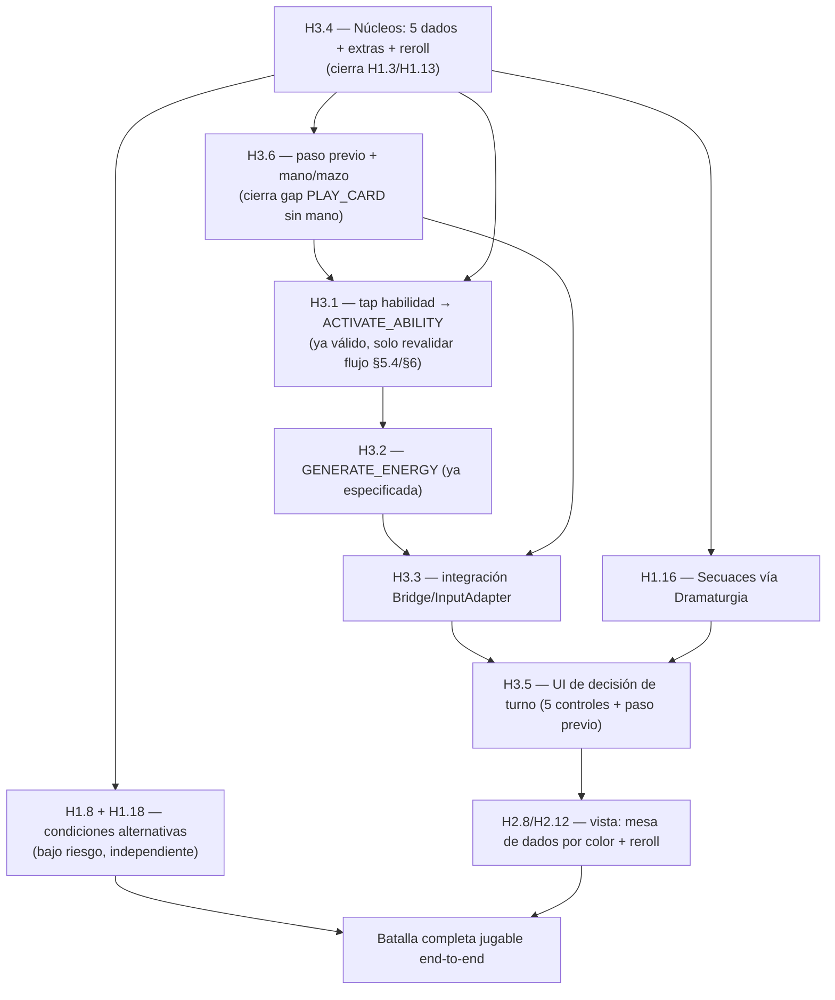

# Cierre del loop jugable de batalla — spec técnica consolidada

> Spec del Architect que traduce a diseño técnico la decisión de Director Creativo +
> Director del Estudio registrada en `.ai-studio/memory/decisions.md` (2026-07-08,
> "Cierre del loop jugable de batalla") y `.ai-studio/memory/glossary.md` (mismo día).
> Cubre el rediseño del modelo de Núcleos, el nuevo paso previo de turno, el nuevo
> comportamiento de Secuaces, las condiciones de victoria/derrota alternativas, y su
> conexión con la capa visual de H2. Sin código de producto — firmas, contratos,
> pseudocódigo de algoritmo y diagramas de flujo en texto. El Programmer implementa
> contra esto.
>
> **Historias que esta spec cierra/reabre** (ver `.ai-studio/memory/backlog.md`):
> H1.3 (reescrita), H1.13 (tests a reescribir contra el nuevo modelo), H1.16 (rediseño
> de comportamiento de Secuaces), H1.8 (nuevo campo de catálogo), H1.18 (nueva
> evaluación de fin de combate + paso previo de turno), H3.4 (implementación completa
> del nuevo modelo de Núcleos), H3.6 (implementación completa del paso previo de
> turno). Valida sin cambios de contrato: H3.1, H3.2, H3.3 (con una nota de UI en H3.5).
>
> **Convención de documento:** esta spec es deliberadamente un único documento porque
> las 7 historias afectadas comparten una sola raíz de diseño (el `CombatEngine` y su
> `CombatStateSnapshot`) y deben implementarse en el orden descrito en §7 sin
> fragmentarse en PRs que se pisen entre sí. Los documentos `docs/specs/H1.3_*.md` y
> `docs/specs/H1.16_*.md` existentes **quedan supersedidos por completo** por §1 y §3 de
// aquí respectivamente — se conservan como archivo histórico, no se borran (mismo
> criterio que decisions.md, "nunca se borra texto antiguo").

Estado del repo al momento de escribir esta spec: H1-H1.19 y H2.1-H2.15 implementados
(361+ tests). `CombatEngine` (`packages/domain/combat/src/combat-engine.ts`, ~1963
líneas) ya modela turnos, pool de Núcleos homogéneo (`NucleoInstance[]`, tamaño
configurable, vaciado-y-relanzado), cooldowns, Umbral, Trama/daño, Combo/Contratiempo,
Aliados, Secuaces (selección aleatoria — a sustituir), fases/Level-Up, condiciones de
victoria/derrota por defecto, IA de Enemigo dirigida por Dramaturgia (solo icono
ATTACK/PLOT). **No existe ningún concepto de mano/mazo del Líder** — `PLAY_CARD`/
`PLAY_ALLY`/`PLAY_CONTRATIEMPO` hoy resuelven directamente contra
`cardPoolIds`/mapas de config, sin validar pertenencia a una "mano". Esto se cierra en
§2.

---

## 0. Resumen de cambios por archivo (vista de pájaro)

```
packages/domain/shared/src/
  nucleo-color.ts            # SIN CAMBIOS — NucleoColor (5 valores), CoreCostRequirement, satisfiesCoreCost

packages/domain/combat/src/
  types/nucleo.ts             # MODIFICADO — añade NucleoDie (extiende NucleoInstance)
  nucleo-pool.ts               # RENOMBRADO → nucleo-table.ts — modelo de mesa fija + reroll
  nucleo-pool.test.ts          # RENOMBRADO → nucleo-table.test.ts — reescrito contra el nuevo modelo
  types/turn-phase.ts          # NUEVO — estado del paso previo gratuito del turno del Líder
  types/hand.ts                # NUEVO — mano/mazo de robo del Líder
  types/minion-behavior.ts     # NUEVO — MinionBehaviorSpec, MinionSelectionCriterion
  minion-ai.ts                 # NUEVO — selectActingMinions (pura), sustituye lógica ad-hoc
  types/victory-condition.ts   # NUEVO — AlternativeVictoryCondition (mirror de domain/catalog)
  types/config.ts              # MODIFICADO — tableMaxDice, leaderDeckCardIds, alternativeVictoryConditions, dramaturgiaDeck pasa a full DramaturgiaCardDefinition
  types/snapshot.ts            # MODIFICADO — nucleoTable reemplaza nucleoPool; +leaderHand, +freeStepState
  types/commands.ts            # MODIFICADO — +DRAW_OR_GENERATE, +DRAW_CARD, +ADD_EXTRA_NUCLEO_DIE (interno)
  types/events.ts              # MODIFICADO — NUCLEO_TABLE_REROLLED reemplaza NUCLEO_POOL_ROLLED, +NUCLEO_DIE_ADDED, +LEADER_HAND_CARD_DRAWN, +LEADER_HAND_DRAW_SKIPPED, +ENERGY_GENERATE_SKIPPED, +FREE_STEP_RESOLVED, +MINION_ACTION_RESOLVED (repetible), COMBAT_ENDED +alternativeConditionKind
  types/errors.ts              # MODIFICADO — +NUCLEO_ALREADY_SPENT, +CARD_NOT_IN_HAND, +FREE_STEP_ALREADY_TAKEN
  combat-engine.ts             # MODIFICADO — ver §1.4, §2.4, §3.3, §4.3
  catalog-adapter.ts           # MODIFICADO — dramaturgiaDeck pasa objetos completos; alternativeVictoryConditions; leaderDeckCardIds

packages/domain/catalog/src/
  types/dramaturgia-card.ts    # MODIFICADO — +minionBehavior?: MinionBehaviorSpec
  types/minion-behavior.ts     # NUEVO — mirror estructural (catalog no importa combat, mismo patrón que enemy-ai.ts)
  types/enemy.ts               # MODIFICADO — +alternativeVictoryConditions?
  types/scenario.ts            # MODIFICADO — +alternativeVictoryConditions?
  types/victory-condition.ts   # NUEVO — mirror estructural
  validation/schema.ts         # MODIFICADO — valida minionBehavior, alternativeVictoryConditions

packages/combat-scene/view/    # MODIFICADO — ver §5
packages/combat-scene/juice/   # MODIFICADO (JuiceConfig, fuera de alcance de esta spec en detalle) — ver §5
packages/combat-scene/input/   # MODIFICADO — ver §5.4
```

---

## 1. Modelo de Núcleos: 5 dados fijos + extras + tope + reroll al vaciar (H3.4, cierra H1.3/H1.13)

### 1.1 Decisión de modelo: "mesa persistente con estado gastado/disponible", no "pool que se vacía por remoción"

El modelo viejo (H1.3) **eliminaba** una `NucleoInstance` del array al gastarse (el pool
encogía hasta 0, luego se regeneraba entero). El modelo nuevo NO puede funcionar así:
decisions.md exige que **siempre haya exactamente 5 dados fijos en mesa** (uno por
color) más los extras — un dado nunca desaparece de la mesa al gastarse, solo queda
"gastado" hasta el próximo reroll colectivo.

**Decisión (Architect):** los dados viven en un array `dice: NucleoDie[]` que **nunca
cambia de longitud** salvo cuando se añade un dado EXTRA (`ADD_EXTRA_NUCLEO_DIE`,
ver §1.5). Gastar un dado cambia su `status` de `'AVAILABLE'` a `'SPENT'` sin tocar su
`value`/`color`/`id`. El reroll (cuando el último `'AVAILABLE'` se gasta) genera un
`value` nuevo para **todos** los dados y pone `status = 'AVAILABLE'` en todos —
manteniendo `id`/`color`/`kind` estables (un dado extra Rojo sigue siendo el mismo dado
extra Rojo tras 50 rerolls, solo cambia su valor).

### 1.2 Tipos nuevos/modificados

`packages/domain/combat/src/types/nucleo.ts` (MODIFICADO — añade, no quita nada de lo
existente que otras historias consumen: `NucleoInstance`, `NucleoValue` se mantienen
tal cual porque `ABILITY_ACTIVATED.nucleoSpent`, `LEADER_DAMAGED.nucleoSpent`, etc. —
eventos de H1.5/H1.6/H1.15/H1.16 — siguen usando `NucleoInstance` como snapshot de
"qué dado se gastó en este instante", sin `status`/`kind`; ningún event payload
existente cambia de forma):

```ts
import type { NucleoColor, NucleoInstanceId } from '@collector/domain-shared';

export type NucleoValue = number; // sin cambios (H1.3 §3.1) — 1-4 en generación, 0 posible por debuff futuro

export interface NucleoInstance {
  readonly id: NucleoInstanceId;
  readonly color: NucleoColor;
  readonly value: NucleoValue;
}

/** NUEVO H3.4. `'FIXED'` = uno de los 5 dados permanentes (uno por color, nunca se
 *  elimina de la mesa). `'EXTRA'` = añadido por una carta/equipo; tampoco se elimina
 *  una vez añadido en esta historia (no hay mecanismo de "quitar" un extra — fuera de
 *  alcance, contenido futuro). */
export type NucleoDieKind = 'FIXED' | 'EXTRA';

/** NUEVO H3.4. `'AVAILABLE'` = puede gastarse. `'SPENT'` = ya gastado en este ciclo,
 *  vuelve a `'AVAILABLE'` únicamente cuando ocurre un reroll colectivo (§1.4). */
export type NucleoDieStatus = 'AVAILABLE' | 'SPENT';

/** Extiende `NucleoInstance` (mismos 3 campos, mismo significado) con el estado de
 *  mesa. Es el tipo de `CombatStateSnapshot.nucleoTable` (§1.3) — NUNCA el tipo de
 *  `CombatEvent.nucleoSpent` (que sigue siendo `NucleoInstance` puro, ver nota arriba). */
export interface NucleoDie extends NucleoInstance {
  readonly kind: NucleoDieKind;
  readonly status: NucleoDieStatus;
}
```

### 1.3 `CombatStateSnapshot` — renombrado de campo (breaking, intencional)

```ts
// snapshot.ts — reemplaza el campo H1.3 `nucleoPool: readonly NucleoInstance[]`
readonly nucleoTable: readonly NucleoDie[];
```

Orden estable: los 5 `FIXED` primero (en el orden de `ALL_NUCLEO_COLORS`:
`AGRESION, CONTROL, DEFENSA, RECURSO, CAOS`), luego los `EXTRA` por orden de creación.
Este orden es lo que consume `createNucleoTable` en la vista (§5.2) para posicionar
cada color siempre en el mismo lugar de mesa.

### 1.4 `packages/domain/combat/src/nucleo-table.ts` (RENOMBRADO de `nucleo-pool.ts`)

```ts
import type { RandomSource, NucleoColor, NucleoInstanceId } from '@collector/domain-shared';
import { ALL_NUCLEO_COLORS } from '@collector/domain-shared';
import type { NucleoDie, NucleoValue } from './types/nucleo';

export const NUCLEO_VALUE_MIN = 1;
export const NUCLEO_VALUE_MAX = 4;

/** GDD/decisions.md: exactamente 5 dados fijos, uno por color — ya no es "tamaño de
 *  pool" configurable (DEFAULT_NUCLEO_POOL_SIZE desaparece). */
export const FIXED_NUCLEO_DICE_COUNT = 5; // === ALL_NUCLEO_COLORS.length, documentado explícito

/** Tope duro de dados simultáneos en mesa — valor de diseño sugerido, confirmado por
 *  Director Creativo en decisions.md (2026-07-08) como "sugerido: 10, a confirmar en
 *  balanceo". Configurable vía CombatEngineConfig.tableMaxDice (§1.7). */
export const DEFAULT_NUCLEO_TABLE_MAX_DICE = 10;

function rollValue(rng: RandomSource): NucleoValue {
  return rng.nextInt(NUCLEO_VALUE_MIN, NUCLEO_VALUE_MAX + 1);
}

/** Genera los 5 dados FIXED iniciales, uno por cada color de ALL_NUCLEO_COLORS, en ese
 *  orden — todos AVAILABLE. Usado solo en el constructor de CombatEngine. */
export function rollFixedDice(rng: RandomSource, nextId: () => NucleoInstanceId): NucleoDie[] {
  return ALL_NUCLEO_COLORS.map((color) => ({
    id: nextId(),
    color,
    value: rollValue(rng),
    kind: 'FIXED' as const,
    status: 'AVAILABLE' as const,
  }));
}

/** Genera un dado EXTRA nuevo de `color`, AVAILABLE. Usado por
 *  `CombatEngine.addExtraNucleoDie` (§1.5). */
export function rollExtraDie(color: NucleoColor, rng: RandomSource, nextId: () => NucleoInstanceId): NucleoDie {
  return { id: nextId(), color, value: rollValue(rng), kind: 'EXTRA', status: 'AVAILABLE' };
}

/** Reroll colectivo (GDD/decisions.md: "en cuanto se gasta el ÚLTIMO dado disponible,
 *  se re-tiran TODOS"). Conserva `id`/`color`/`kind` de cada dado, genera `value` nuevo,
 *  fuerza `status: 'AVAILABLE'` en todos — incluidos los que ya estaban disponibles
 *  (decisions.md no distingue "solo los gastados se re-tiran"; el texto es explícito:
 *  "se re-tiran TODOS los dados en mesa a la vez"). */
export function rerollAllDice(dice: readonly NucleoDie[], rng: RandomSource): NucleoDie[] {
  return dice.map((d) => ({ ...d, value: rollValue(rng), status: 'AVAILABLE' as const }));
}

export function countAvailableDice(dice: readonly NucleoDie[]): number {
  return dice.filter((d) => d.status === 'AVAILABLE').length;
}
```

Test file `nucleo-table.test.ts` reescribe TODO `nucleo-pool.test.ts` (H1.3 §4.1) contra
estas 4 funciones: cobertura mínima —
- `rollFixedDice`: siempre 5 dados, un color de cada uno de `ALL_NUCLEO_COLORS`
  (`toEqual(ALL_NUCLEO_COLORS)` sobre `dice.map(d => d.color)`, orden incluido), valor en
  `[1,4]`, todos `AVAILABLE`/`FIXED`.
- `rollExtraDie`: color = el pedido, `kind: 'EXTRA'`, `AVAILABLE`.
- `rerollAllDice`: mismos ids/colores/kinds antes y después, valores pueden cambiar,
  todos `AVAILABLE` después (incluir un caso donde antes había una mezcla
  AVAILABLE/SPENT).
- `countAvailableDice`: caso con mezcla.
- Reproducibilidad con semilla fija (mismo patrón que H1.3 §4.1).

### 1.5 `CombatEngine` — estado y comandos nuevos

**Estado interno** (reemplaza `nucleoPool: NucleoInstance[]`):

```ts
private nucleoTable: NucleoDie[];      // longitud >= 5, crece solo por dados EXTRA
private readonly tableMaxDice: number; // default DEFAULT_NUCLEO_TABLE_MAX_DICE
```

**Constructor** (reemplaza `this.nucleoPool = this.rollNewPool();`):

```ts
this.tableMaxDice = config.tableMaxDice ?? DEFAULT_NUCLEO_TABLE_MAX_DICE;
this.nucleoTable = rollFixedDice(this.randomSource, () => this.nextNucleoId());
// Sin dados EXTRA iniciales en el contenido de juguete — CombatEngineConfig NO expone
// un "initialExtraDice": si contenido futuro necesita un Escenario que arranque con un
// dado extra ya en mesa, se añade ahí explícitamente (fuera de alcance MVP).
```

**Gasto de dado** (reemplaza el bloque de `handleActivateAbility`/`executeAbilityEffect`
que hacía `this.nucleoPool = [...slice sin el gastado...]`):

```ts
// Validación (handleActivateAbility, mismo orden relativo que H1.3/H1.4 ya establecido,
// insertada donde antes estaba la búsqueda en nucleoPool):
const die = this.nucleoTable.find((d) => d.id === command.nucleoInstanceId);
if (!die) {
  return err({ code: 'NUCLEO_NOT_FOUND', nucleoInstanceId: command.nucleoInstanceId });
}
if (die.status === 'SPENT') {
  return err({ code: 'NUCLEO_ALREADY_SPENT', nucleoInstanceId: command.nucleoInstanceId });
}
if (!satisfiesCoreCost(requirement, die.color)) {
  return err({ code: 'NUCLEO_COLOR_MISMATCH', nucleoInstanceId: command.nucleoInstanceId, requirement, actualColor: die.color });
}

// Mutación (dentro de executeAbilityEffect, reemplaza el slice-removal):
this.nucleoTable = this.nucleoTable.map((d) =>
  d.id === die.id ? { ...d, status: 'SPENT' as const } : d
);
// nucleoSpent en ABILITY_ACTIVATED/LEADER_DAMAGED/etc. sigue siendo `{ id, color, value }`
// (NucleoInstance puro, tal como estaba el `die` ANTES de marcarlo SPENT) — sin cambio
// de forma en esos eventos.

// Reroll — reemplaza `if (this.nucleoPool.length === 0)`:
if (countAvailableDice(this.nucleoTable) === 0) {
  this.nucleoTable = rerollAllDice(this.nucleoTable, this.randomSource);
  const rerolled: CombatEvent = {
    type: 'NUCLEO_TABLE_REROLLED', // renombrado de NUCLEO_POOL_ROLLED
    dice: this.nucleoTable,
    priorityTurnOwner: this.turnOwner, // mismo razonamiento que H1.3 §5.8, sin cambios
  };
  events.push(rerolled);
  this.eventBus.emit(rerolled);
}
```

La regla "quien tenga turno tras el vaciado elige primero" (H1.3 §5.8) es **exactamente
la misma prueba lógica** que antes: la única puerta de entrada para gastar sigue siendo
`command.side !== this.turnOwner → NOT_YOUR_TURN`, y ese gate no cambia con este
refactor. Los 2 tests de "Escenario A/B" de H1.3 §7.2 se migran literalmente, solo
cambiando `nucleoPool`→`nucleoTable` y `NUCLEO_POOL_ROLLED`→`NUCLEO_TABLE_REROLLED`.

**Nuevo comando interno `ADD_EXTRA_NUCLEO_DIE`** — no es un `CombatCommand` público
despachable por el jugador (nunca aparece en el union `CombatCommand`); es un efecto de
resolución de carta, igual que `SHIELD`/`PLOT` en `PlayableCardEffectDefinition`
(H1.18). Se extiende esa unión:

```ts
// types/playable-card.ts — añade una 4ª variante
export type PlayableCardEffectDefinition =
  | { readonly kind: 'ATTACK_ENEMY'; /* ... */ }
  | { readonly kind: 'PLOT'; readonly amount: number }
  | { readonly kind: 'SHIELD'; readonly amount: number }
  | { readonly kind: 'ADD_NUCLEO_DIE'; readonly color: NucleoColor }; // NUEVO H3.4
```

`CombatEngine` privado, invocado desde `handlePlayCard` en la misma rama `switch` que ya
resuelve `SHIELD`/`PLOT`:

```ts
private addExtraNucleoDie(color: NucleoColor): CombatEvent {
  if (this.nucleoTable.length >= this.tableMaxDice) {
    return { type: 'NUCLEO_DIE_ADD_SKIPPED', color, reason: 'TABLE_AT_MAX' }; // no lanza, no es error de comando
  }
  const die = rollExtraDie(color, this.randomSource, () => this.nextNucleoId());
  this.nucleoTable = [...this.nucleoTable, die];
  return { type: 'NUCLEO_DIE_ADDED', color, dieId: die.id, tableSizeAfter: this.nucleoTable.length };
}
```

Nota de diseño (decisions.md): *"Intentos de añadir dados que exceden el tope se
ignoran"* — por eso `NUCLEO_DIE_ADD_SKIPPED` es un evento informativo, no un
`CombatCommandError`; `PLAY_CARD` sigue teniendo éxito completo (la carta se juega,
paga Energía, consume acción) aunque su efecto de añadir dado se ignore por tope. Mismo
patrón que "Si ya está al tope de la opción elegida, no ocurre nada" del paso previo
(§2).

### 1.6 Validación de coste de habilidad — sin cambios de comportamiento

`satisfiesCoreCost(requirement, color)` (domain/shared, H1.3 §2.2) es agnóstico de si el
dado es FIXED o EXTRA — un coste `{ kind: 'COLOR', colors: ['AGRESION'] }` acepta
cualquier dado AGRESION disponible, fijo o extra; un coste `{ kind: 'ANY' }` acepta
cualquiera de los `AVAILABLE` en mesa. Ninguna lógica de Umbral (H1.5), Trama/daño
(H1.6) ni Aliados (H1.15) cambia — todas consumen `nucleo.value`/`nucleo.color` de un
`NucleoInstance`, forma que no cambia.

### 1.7 `CombatEngineConfig` — cambios

```ts
// config.ts
// ELIMINADO: readonly poolSize?: number;  (ya no hay "tamaño de pool" — son 5 fijos + extras)
readonly tableMaxDice?: number; // NUEVO H3.4, default DEFAULT_NUCLEO_TABLE_MAX_DICE (10)
```

### 1.8 Impacto en `enemy-ai.ts` (H1.7/H1.16) — firma de función cambia de tipo de colección, no de algoritmo

`poolHasValidNucleo`/`decideEnemyNucleoToSpend` reciben hoy `pool: readonly
NucleoInstance[]` ya pre-filtrado por el caller. Se mantiene igual, pero el caller
(`CombatEngine`) ahora debe filtrar `this.nucleoTable` a solo `status === 'AVAILABLE'`
antes de pasarlo:

```ts
const availableDice = this.nucleoTable.filter((d) => d.status === 'AVAILABLE');
const nucleoDecision = decideEnemyNucleoToSpend(requirement, availableDice, playerColors, this.randomSource);
```

Sin cambio de firma en `enemy-ai.ts` — `NucleoDie` es estructuralmente compatible con
`NucleoInstance` (lo extiende), así que `readonly NucleoInstance[]` sigue aceptando un
`readonly NucleoDie[]` sin cast. Cero cambios de código en `enemy-ai.ts`.

### 1.9 Definition of Done de H3.4 (+ cierre de H1.3/H1.13)

- [ ] `types/nucleo.ts` añade `NucleoDieKind`, `NucleoDieStatus`, `NucleoDie` (§1.2).
- [ ] `nucleo-pool.ts`/`nucleo-pool.test.ts` renombrados a `nucleo-table.ts`/
      `nucleo-table.test.ts`, contenido reemplazado según §1.4.
- [ ] `CombatStateSnapshot.nucleoPool` renombrado a `nucleoTable: readonly NucleoDie[]`.
- [ ] `CombatEvent` — `NUCLEO_POOL_ROLLED` renombrado a `NUCLEO_TABLE_REROLLED` (payload
      `dice` en vez de `pool`); nuevo `NUCLEO_DIE_ADDED`, nuevo `NUCLEO_DIE_ADD_SKIPPED`.
- [ ] `CombatCommandError` añade `NUCLEO_ALREADY_SPENT`.
- [ ] `CombatEngineConfig.poolSize` eliminado, `tableMaxDice?` añadido.
- [ ] `PlayableCardEffectDefinition` añade `ADD_NUCLEO_DIE`.
- [ ] `combat-engine.ts`: constructor, `handleActivateAbility`/`executeAbilityEffect`,
      `handlePlayCard`, y el punto de uso en `handleResolveMinionAction`/turno de IA
      migrados a `nucleoTable` (§1.5/§1.8) — ningún otro sistema (cooldowns, Umbral,
      Trama/daño, Aliados, fases/Level-Up, victoria/derrota) cambia de comportamiento.
- [ ] Todos los tests de `combat-engine.test.ts`/`combat-engine.*.test.ts` que referencian
      `nucleoPool`/`NUCLEO_POOL_ROLLED`/`poolSize` se migran a los nuevos nombres —
      ningún test de mecánicas NO relacionadas con Núcleos (Umbral, cooldowns, Trama,
      Aliados, Combo, fases) cambia su aserción de fondo, solo el vocabulario de mesa.
- [ ] Nuevos tests: dado EXTRA se puede añadir hasta el tope, tope se ignora
      silenciosamente por encima; reroll afecta a TODOS los dados (fijos + extras) a la
      vez; un dado ya `SPENT` no puede volver a gastarse hasta el próximo reroll.

---

## 2. Paso previo gratis de turno + mano/mazo del Líder (H3.6, cierra parcialmente H1.18)

### 2.1 Gap previo: no existe mano/mazo en el motor — se cierra aquí

Ninguna historia anterior modeló `hand`/`deck` — `PLAY_CARD`/`PLAY_ALLY`/
`PLAY_CONTRATIEMPO` resuelven directamente contra `cardId` sin comprobar que esa carta
esté "en mano". Esto era aceptable mientras no existía la mecánica de robo; ahora que
H3.6 introduce robo de verdad, dejarlo así vaciaría de sentido la mecánica (el jugador
podría jugar cualquier carta de su pool sin haberla robado nunca). **Esta spec extiende
el alcance de H3.6** para cerrar esa deuda: añade el concepto de mano/mazo y hace que
`PLAY_CARD`/`PLAY_ALLY`/`PLAY_CONTRATIEMPO` validen pertenencia a la mano.

### 2.2 Tipos nuevos

`packages/domain/combat/src/types/hand.ts` (NUEVO):

```ts
export const LEADER_INITIAL_HAND_SIZE = 5; // decisions.md: "Mano inicial de combate: 5 cartas"
export const LEADER_HAND_SIZE_MAX = 7;     // decisions.md: "Tope de mano: 7"
```

`packages/domain/combat/src/types/turn-phase.ts` (NUEVO):

```ts
/** Estado del paso previo gratuito del turno actual del Líder (decisions.md, "Estructura
 *  del turno del jugador: paso previo gratis + 2 acciones"). Se resetea a `false` en
 *  cada `handleEndTurn` que entrega el turno al Líder — NUNCA aplica al turno de
 *  Enemigo (el paso previo es EXCLUSIVO del Líder, la IA no lo usa). */
export type LeaderFreeStepState = { readonly takenThisTurn: boolean };
```

### 2.3 `CombatStateSnapshot` — campos nuevos

```ts
readonly leaderHand: readonly CardId[];       // orden estable = orden de robo
readonly leaderDeckRemaining: number;         // solo el conteo — evita filtrar info de orden a la UI/Phaser innecesariamente
readonly leaderFreeStep: LeaderFreeStepState; // { takenThisTurn: boolean }
```

### 2.4 Comandos nuevos

```ts
// commands.ts — añade 2 variantes
| {
    /** NUEVO H3.6. Paso previo GRATIS del turno del Líder — no consume
     *  actionsTakenThisTurn. Válido como máximo 1 vez por turno de Líder. */
    readonly type: 'DRAW_OR_GENERATE';
    readonly action: 'draw' | 'generate';
  }
| {
    /**
     * NUEVO H3.6 (extensión de alcance sobre H3.2 — decisions.md exige que "Robar
     * Carta" también exista como acción PAGADA, simétrica a GENERATE_ENERGY que H3.2 ya
     * implementó). Consume 1 de las 2 acciones del turno. Mismo efecto que
     * `DRAW_OR_GENERATE { action: 'draw' }`, solo cambia el coste.
     */
    readonly type: 'DRAW_CARD';
  }
```

`GENERATE_ENERGY` (H3.2, ya implementada/especificada) no cambia de contrato — sigue
siendo la versión pagada de generar energía. `DRAW_CARD` es su análogo para robar carta,
que faltaba en el backlog original y esta spec añade explícitamente para que decisions.md
quede completamente implementado (las 4 opciones de la lista de 2 acciones: Jugar Carta,
Generar Energía, Robar Carta, Activar Habilidad).

### 2.5 Lógica compartida — helpers privados de `CombatEngine`

```ts
/** Ejecuta el efecto "robar" (§0 de decisions.md: "roba 1 carta, tope de mano: 7").
 *  Si el mazo está vacío O la mano ya está al tope, NO ES UN ERROR — decisions.md:
 *  "Si ya está al tope de la opción elegida, no ocurre nada (no se pierde el paso,
 *  simplemente no tiene efecto)". Esta misma regla de "no-op sin error" se extiende a
 *  la versión PAGADA (decisions.md: "no hay ninguna diferencia de efecto entre la
 *  versión gratis y la versión que cuesta acción — la única diferencia es el coste").
 *  Devuelve el evento a emitir (drawn o skipped). */
private executeDrawCard(): CombatEvent {
  if (this.leaderHand.length >= LEADER_HAND_SIZE_MAX) {
    return { type: 'LEADER_HAND_DRAW_SKIPPED', reason: 'HAND_FULL' };
  }
  if (this.leaderDeckDrawPile.length === 0) {
    return { type: 'LEADER_HAND_DRAW_SKIPPED', reason: 'DECK_EMPTY' };
  }
  const cardId = this.leaderDeckDrawPile.pop() as CardId;
  this.leaderHand = [...this.leaderHand, cardId];
  return {
    type: 'LEADER_HAND_CARD_DRAWN',
    cardId,
    handSizeAfter: this.leaderHand.length,
    deckRemainingAfter: this.leaderDeckDrawPile.length,
  };
}

/** Ejecuta el efecto "generar energía" (tope 5). Reutilizable desde
 *  DRAW_OR_GENERATE/GENERATE_ENERGY — mismo criterio de no-op sin error si ya al tope. */
private executeGenerateEnergy(): CombatEvent {
  if (this.leaderEnergy >= LEADER_ENERGY_MAX) {
    return { type: 'ENERGY_GENERATE_SKIPPED', reason: 'ENERGY_AT_MAX' };
  }
  this.leaderEnergy += 1;
  return { type: 'ENERGY_GENERATED', amount: 1, leaderEnergyAfter: this.leaderEnergy }; // nombre de evento tal como lo fija H3.2
}
```

### 2.6 `handleDrawOrGenerate` (comando `DRAW_OR_GENERATE`)

```ts
private handleDrawOrGenerate(
  command: Extract<CombatCommand, { type: 'DRAW_OR_GENERATE' }>
): CombatCommandResult {
  if (this.turnOwner !== 'LEADER') {
    return err({ code: 'NOT_YOUR_TURN', expected: 'LEADER', actual: this.turnOwner });
  }
  if (this.leaderFreeStepTakenThisTurn) {
    return err({ code: 'FREE_STEP_ALREADY_TAKEN' });
  }

  this.leaderFreeStepTakenThisTurn = true; // se consume SIEMPRE, incluso si el efecto es no-op
  const effectEvent = command.action === 'draw' ? this.executeDrawCard() : this.executeGenerateEnergy();

  const wrapperEvent: CombatEvent = {
    type: 'FREE_STEP_RESOLVED',
    action: command.action,
    outcome: effectEvent.type.endsWith('SKIPPED') ? 'SKIPPED' : 'APPLIED',
  };

  const events = [effectEvent, wrapperEvent];
  for (const e of events) this.eventBus.emit(e);
  return ok(events);
}
```

**Nota de diseño explícita (resuelve un conflicto de fuente):** el criterio de
aceptación *original* de H3.6 en `backlog.md` (escrito antes de la decisión de diseño
del mismo día) pedía errores duros (`CANNOT_DRAW_EMPTY_DECK`, `ENERGY_AT_MAX` como
`CombatCommandError`). La decisión de decisions.md del mismo día, posterior, es
explícita: *"Si ya está al tope de la opción elegida, no ocurre nada"*. Esta spec sigue
decisions.md (fuente de mayor autoridad y más reciente) y **sustituye** el criterio de
error duro del backlog por el comportamiento no-op-sin-error de §2.5/§2.6 — se señala
aquí para que Coordinator actualice el texto de H3.6 en `backlog.md` en su próxima
pasada, sin que Programmer tenga que reconciliar la contradicción por su cuenta.

`DRAW_CARD` (paga 1 acción) reutiliza el mismo patrón que `handleGenerateEnergy` (H3.2):
valida turno, acciones disponibles, gasta 1 acción, llama `executeDrawCard()`, emite
evento. No requiere el chequeo `FREE_STEP_ALREADY_TAKEN` — es independiente del paso
previo, puede usarse aunque el paso previo ya se haya tomado (o no).

**Orden entre paso previo y las 2 acciones:** decisions.md describe una secuencia
("1. paso previo. 2. luego, 2 acciones") pero esta spec **NO impone un gate estricto**
que bloquee `ACTIVATE_ABILITY`/`PLAY_CARD`/etc. hasta que `DRAW_OR_GENERATE` se haya
invocado — el jugador puede optar por no tomarlo (perdiendo el valor gratis) o tomarlo
en cualquier momento de su turno antes de `END_TURN`, siempre que sea antes de la
primera vez o simplemente no lo tome. Se documenta como decisión explícita: forzar el
orden añadiría una validación de "fase de turno" nueva sin que decisions.md pida
explícitamente que sea bloqueante — el único requisito duro es "una vez por turno", ya
cubierto por `FREE_STEP_ALREADY_TAKEN`.

### 2.7 Hand-gating de `PLAY_CARD`/`PLAY_ALLY`/`PLAY_CONTRATIEMPO` (cierra el gap de §2.1)

Los 3 handlers ganan una validación nueva, en la posición donde ya validan
`turnOwner`/existencia del `cardId` en su mapa de config respectivo:

```ts
if (!this.leaderHand.includes(command.cardId)) {
  return err({ code: 'CARD_NOT_IN_HAND', cardId: command.cardId });
}
// ... resto de validaciones sin cambios ...
// Al mutar (éxito): elimina la carta de la mano.
this.leaderHand = this.leaderHand.filter((id) => id !== command.cardId);
```

**Impacto en tests existentes de H1.14/H1.15/H1.18:** todo test que hoy construye un
`CombatEngine` y despacha `PLAY_CARD`/`PLAY_ALLY`/`PLAY_CONTRATIEMPO` directamente sin
pasar por `DRAW_OR_GENERATE`/mano inicial fallará con `CARD_NOT_IN_HAND` tras este
cambio — Programmer debe actualizar esos tests para que la carta bajo prueba esté en
`leaderDeckCardIds` (§2.8) de forma que la mano inicial (5 cartas robadas del mazo
barajado) la contenga, o bien inyectar semillas de `SeededRandomSource` ya verificadas
en el nuevo test suite. Se lista explícitamente en la Definition of Done (§2.10).

### 2.8 `CombatEngineConfig` — campos nuevos

```ts
// config.ts
/** NUEVO H3.6. IDs de TODAS las cartas jugables del Líder (unión de playableCards +
 *  allyCards + contratiempoCards, en el orden que Programmer decida al ensamblar —
 *  ver catalog-adapter.ts §2.9) de las que se compone el mazo de robo de este combate.
 *  Se baraja UNA VEZ en el constructor (mismo `shuffle` Fisher-Yates ya usado para
 *  dramaturgiaDeck, H1.18). OBLIGATORIO — sin mazo no hay mano inicial. */
readonly leaderDeckCardIds: readonly CardId[];

/** Default LEADER_INITIAL_HAND_SIZE (5). */
readonly initialHandSize?: number;

/** Default LEADER_HAND_SIZE_MAX (7). */
readonly handSizeMax?: number;
```

### 2.9 `catalog-adapter.ts` — ensamblaje del mazo

```ts
// buildCombatEngineConfig — nuevo bloque
const leaderDeckCardIds: CardId[] = leader.cardPoolIds; // MVP: el mazo de combate = el pool completo de 10
// ...
return {
  // ...campos existentes...
  leaderDeckCardIds,
};
```

Nota: en el MVP el "mazo de combate" es simplemente `leader.cardPoolIds` (las 10 cartas
propias del Líder, H1.9) — no hay todavía un mazo de 30 cartas de la run (eso es
`domain/run`, fuera de alcance de `domain/combat`). Cuando `domain/run` exista, este
adaptador es el único punto que cambia: en vez de `leader.cardPoolIds` recibirá el mazo
ya construido de la run (30 cartas con evoluciones aplicadas). `CombatEngine` no sabe ni
le importa de dónde viene la lista.

### 2.10 Definition of Done de H3.6

- [ ] `types/hand.ts`, `types/turn-phase.ts` nuevos (§2.2).
- [ ] `CombatStateSnapshot` añade `leaderHand`, `leaderDeckRemaining`, `leaderFreeStep`.
- [ ] `CombatCommand` añade `DRAW_OR_GENERATE`, `DRAW_CARD`.
- [ ] `CombatEvent` añade `FREE_STEP_RESOLVED`, `LEADER_HAND_CARD_DRAWN`,
      `LEADER_HAND_DRAW_SKIPPED`, `ENERGY_GENERATE_SKIPPED` (más `ENERGY_GENERATED` si
      H3.2 no lo dejó ya cerrado con ese nombre exacto — verificar contra el spec/PR real
      de H3.2 antes de implementar, evitar duplicar el evento con otro nombre).
- [ ] `CombatCommandError` añade `FREE_STEP_ALREADY_TAKEN`, `CARD_NOT_IN_HAND`.
- [ ] `CombatEngineConfig` añade `leaderDeckCardIds` (obligatorio), `initialHandSize?`,
      `handSizeMax?`.
- [ ] Constructor: baraja `leaderDeckCardIds`, reparte mano inicial (5, o menos si el
      mazo tiene menos de 5), sin emitir evento (mismo criterio "constructor no emite").
- [ ] `handleDrawOrGenerate`, `handleDrawCard` implementados según §2.6.
- [ ] `handlePlayCard`/`handlePlayAlly`/`handlePlayContratiempo` ganan el gate de §2.7.
- [ ] `handleEndTurn` resetea `leaderFreeStepTakenThisTurn = false` únicamente cuando el
      turno entrante es `'LEADER'` (nunca para `'ENEMY'`).
- [ ] Tests parametrizados de §2.6/H3.6 backlog (adaptados a no-op-sin-error): mano llena
      → `LEADER_HAND_DRAW_SKIPPED`; mazo vacío → `LEADER_HAND_DRAW_SKIPPED`; energía al
      tope → `ENERGY_GENERATE_SKIPPED`; segunda llamada a `DRAW_OR_GENERATE` en el mismo
      turno → `FREE_STEP_ALREADY_TAKEN`; turno de Enemigo → `NOT_YOUR_TURN`;
      `DRAW_CARD` paga 1 acción y tiene el mismo efecto que la versión gratis.
- [ ] Tests existentes de H1.14/H1.15/H1.18 que despachan `PLAY_CARD`/`PLAY_ALLY`/
      `PLAY_CONTRATIEMPO` se actualizan para que la carta esté en mano (§2.7 nota de
      impacto) — se listan explícitamente los archivos afectados en el PR.

---

## 3. Secuaces: comportamiento dictado por Dramaturgia, no selección aleatoria (H1.16, rediseño)

### 3.1 Qué cambia exactamente

Hoy `handleResolveMinionAction` (combat-engine.ts ~L1553) elige un único Secuaz al azar
entre los que tienen acción especial válida (CD=0 + Núcleo disponible), o cae a un
"plano attack" de un Secuaz aleatorio si ninguno tiene acción especial lista. **Este
algoritmo desaparece.** La nueva fuente de verdad es el `minionBehavior` de la carta de
Dramaturgia que el Enemigo robó ESE turno — el motor ya no decide, solo interpreta y
valida.

### 3.2 Tipos nuevos — `MinionBehaviorSpec` (mirror `catalog`/`combat`, mismo patrón que `EnemyAbilityAiProfile`)

`packages/domain/catalog/src/types/minion-behavior.ts` (NUEVO):

```ts
import type { MinionDefinitionId } from './minion'; // si no existe ya un tipo de catálogo equivalente, usar string — ver nota

/**
 * GDD/decisions.md 2026-07-08: "el comportamiento está escrito en el TEXTO de la carta
 * de Dramaturgia". Vocabulario CERRADO de criterios ejecutables por el motor —
 * cualquier matiz narrativo adicional sigue viviendo en
 * `DramaturgiaCardDefinition.effectDescription` (texto libre, no ejecutable, sin
 * cambios respecto a H1.10).
 */
export type MinionSelectionCriterion =
  | { readonly kind: 'ALL' }                                            // "Tus secuaces atacan"
  | { readonly kind: 'RANDOM_ONE' }                                     // azar EXPLÍCITO de contenido, no del motor por defecto
  | { readonly kind: 'HIGHEST_PLANO_ATTACK' }                           // proxy MVP de "el más fuerte" — ver §3.2.1
  | { readonly kind: 'SPECIFIC_DEFINITION'; readonly minionDefinitionId: MinionDefinitionId }; // "el Secuaz X actúa"

export interface MinionBehaviorSpec {
  readonly criterion: MinionSelectionCriterion;
}
```

`packages/domain/combat/src/types/minion-behavior.ts` (NUEVO) — mismo contenido,
re-exportado tal cual dentro de `domain/combat` (mismo patrón de duplicación
estructural intencional que `EnemyAbilityBranch`/`EnemyAbilityTier` entre
`domain/catalog/types/enemy.ts` y `domain/combat/types/enemy-ai.ts`, documentado en
`enemy.ts` como *"catalog no puede importar ese validador"* — aquí aplica la misma regla
de dirección de dependencia, `catalog` nunca importa `combat`).

#### 3.2.1 Gap documentado: `HIGHEST_LIFE` no es implementable todavía

El ejemplo textual de decisions.md es *"Ataca el secuaz con más vida"* — pero
`MinionInPlay`/`MinionDefinition` (H1.16 original) **no tienen campo de vida** (nota
explícita en `types/minion.ts`: *"Sin campo de vida... no existe todavía ningún
mecanismo por el que el jugador dañe al Enemigo o a sus Secuaces"*). Añadir vida a los
Secuaces es una historia de contenido/sistema propia (fuera de alcance de este cierre
de loop — el Director Creativo no lo pidió explícitamente, solo dio un ejemplo
ilustrativo). **Esta spec NO añade vida a los Secuaces** y sustituye ese ejemplo por
`HIGHEST_PLANO_ATTACK` (criterio real y disponible hoy) como el criterio "ataca el más
fuerte" del contenido de juguete. Se señala explícitamente a Coordinator: si el
Director Creativo confirma que quiere `HIGHEST_LIFE` en contenido real (no solo de
juguete), hace falta una historia nueva que añada vida/daño a Secuaces antes de que el
catálogo pueda usar ese criterio — no bloquea el cierre del loop jugable actual.

### 3.3 `DramaturgiaCardDefinition` — campo nuevo

```ts
// packages/domain/catalog/src/types/dramaturgia-card.ts
export interface DramaturgiaCardDefinition {
  readonly id: DramaturgiaCardId;
  readonly name: string;
  readonly icon: EnemyAbilityBranch;
  readonly effectDescription?: string;
  /** NUEVO H1.16 (rediseño). Ausente = esta carta NO dicta comportamiento de Secuaz —
   *  ningún Secuaz actúa el turno en que sale esta carta (ver §3.5, nuevo
   *  MINION_ACTION_SKIPPED.reason). Presente = el motor resuelve exactamente este
   *  criterio, sin azar propio salvo que el criterio sea RANDOM_ONE (decisión de
   *  contenido explícita, no del motor). */
  readonly minionBehavior?: MinionBehaviorSpec;
}
```

`validation/schema.ts` (H1.8/H1.10) gana el parseo/validación de `minionBehavior`:
`kind: 'SPECIFIC_DEFINITION'` requiere que `minionDefinitionId` sea no-vacío (la
validación de que ese id exista realmente entre los Secuaces invocables del Enemigo es
responsabilidad de `validation/cross-reference.ts`, mismo patrón que otras referencias
cruzadas de H1.8 §4).

### 3.4 `CombatEngineConfig`/estado interno — Dramaturgia pasa de icono a carta completa

**Cambio de forma (breaking, documentado):** hasta ahora `dramaturgiaDeck:
readonly DramaturgiaCardIcon[]` (solo el icono, H1.18 §0.5) y el motor descartaba el
resto de la carta. Para que `RESOLVE_MINION_ACTION` pueda leer `minionBehavior`
necesita la carta COMPLETA en el momento de resolución, no solo su icono.

```ts
// config.ts
// ELIMINADO: readonly dramaturgiaDeck?: readonly DramaturgiaCardIcon[];
readonly dramaturgiaDeck?: readonly DramaturgiaCardDefinition[]; // NUEVO tipo de elemento
```

```ts
// combat-engine.ts — estado interno
private dramaturgiaDrawPile: DramaturgiaCardDefinition[]; // antes: DramaturgiaCardIcon[]
private dramaturgiaDiscardPile: DramaturgiaCardDefinition[];
private currentEnemyDramaturgiaCard: DramaturgiaCardDefinition | undefined; // NUEVO
```

`drawDramaturgiaCard` (H1.18 §0.5.3) se reescribe para operar sobre
`DramaturgiaCardDefinition` en vez de solo el icono, y **además** guarda la carta
robada en `this.currentEnemyDramaturgiaCard` antes de devolver su icono (el resto de la
función — reciclado de pila, eventos `DRAMATURGIA_DECK_RESHUFFLED`/
`DRAMATURGIA_CARD_DRAWN` — no cambia de comportamiento, solo el tipo que maneja
internamente):

```ts
private drawDramaturgiaCard(events: CombatEvent[]): DramaturgiaCardIcon {
  if (this.dramaturgiaDrawPile.length === 0) {
    this.dramaturgiaDrawPile = this.shuffle(this.dramaturgiaDiscardPile);
    this.dramaturgiaDiscardPile = [];
    // ...evento DRAMATURGIA_DECK_RESHUFFLED sin cambios...
  }
  const card = this.dramaturgiaDrawPile.pop() as DramaturgiaCardDefinition;
  this.dramaturgiaDiscardPile.push(card);
  this.currentEnemyDramaturgiaCard = card; // NUEVO — disponible para RESOLVE_MINION_ACTION este turno
  const drawn: CombatEvent = { type: 'DRAMATURGIA_CARD_DRAWN', icon: card.icon };
  events.push(drawn);
  this.eventBus.emit(drawn);
  return card.icon;
}
```

`this.currentEnemyDramaturgiaCard` se limpia (`undefined`) al inicio de cada nuevo turno
de Enemigo, antes de robar la siguiente carta — evita que una llamada tardía a
`RESOLVE_MINION_ACTION` fuera de secuencia lea la carta de un turno anterior (defensivo,
mismo estilo que `minionActionResolvedThisEnemyTurn`).

### 3.5 `packages/domain/combat/src/minion-ai.ts` (NUEVO) — selección pura

Sustituye la lógica ad-hoc inline de `handleResolveMinionAction` (H1.16 original
L1566-1579, selección de `specialCandidates` + `randomSource.pick`).

```ts
import type { RandomSource } from '@collector/domain-shared';
import type { MinionInPlay } from './types/minion';
import type { MinionBehaviorSpec } from './types/minion-behavior';

/**
 * Resuelve QUÉ instancias de Secuaz actúan este turno, dado el `minionBehavior` de la
 * carta de Dramaturgia robada (§3.3/§3.4). Pura respecto al estado del motor — no
 * valida CD/Núcleo (eso sigue en `CombatEngine`, §3.6, porque depende de
 * abilityCoreCosts/remainingCooldowns/nucleoTable que esta función no conoce).
 *
 * - `undefined` (la carta no menciona Secuaces) → [] siempre, sin importar cuántos
 *   Secuaces haya en mesa (§3.3, nuevo comportamiento por defecto: "no actúa nadie" en
 *   vez de "azar del motor").
 * - `ALL` → todas las instancias en mesa (mesa vacía → []).
 * - `RANDOM_ONE` → 1 instancia elegida por `randomSource.pick` (mesa vacía → []).
 * - `SPECIFIC_DEFINITION` → todas las instancias en mesa cuyo `definitionId` coincida
 *   (0, 1 o más si hay duplicados invocados).
 * - `HIGHEST_PLANO_ATTACK` → la(s) instancia(s) con `planoAttackAmount` máximo; empate
 *   se resuelve a UNA sola vía `randomSource.pick` (criterio singular "el más fuerte").
 */
export function selectActingMinions(
  behavior: MinionBehaviorSpec | undefined,
  minionsInPlay: readonly MinionInPlay[],
  randomSource: RandomSource
): readonly MinionInPlay[] {
  if (!behavior || minionsInPlay.length === 0) return [];

  switch (behavior.criterion.kind) {
    case 'ALL':
      return minionsInPlay;
    case 'RANDOM_ONE':
      return [randomSource.pick(minionsInPlay)];
    case 'SPECIFIC_DEFINITION':
      return minionsInPlay.filter((m) => m.definitionId === behavior.criterion.minionDefinitionId);
    case 'HIGHEST_PLANO_ATTACK': {
      const max = Math.max(...minionsInPlay.map((m) => m.planoAttackAmount));
      const top = minionsInPlay.filter((m) => m.planoAttackAmount === max);
      return [top.length === 1 ? (top[0] as MinionInPlay) : randomSource.pick(top)];
    }
  }
}
```

Tests dedicados en `minion-ai.test.ts` (nuevo archivo): 1 caso por `kind`, incluyendo
mesa vacía y `undefined` behavior, y el caso de empate en `HIGHEST_PLANO_ATTACK`.

### 3.6 `handleResolveMinionAction` — reescritura del cuerpo

```ts
private handleResolveMinionAction(
  command: Extract<CombatCommand, { type: 'RESOLVE_MINION_ACTION' }>
): CombatCommandResult {
  void command;
  if (this.turnOwner !== 'ENEMY') {
    return err({ code: 'NOT_YOUR_TURN', expected: 'ENEMY', actual: this.turnOwner });
  }
  if (this.minionActionResolvedThisEnemyTurn) {
    return err({ code: 'MINION_ACTION_ALREADY_RESOLVED_THIS_TURN' });
  }
  this.minionActionResolvedThisEnemyTurn = true;

  if (this.minionsInPlay.length === 0) {
    const event: CombatEvent = { type: 'MINION_ACTION_SKIPPED', reason: 'NO_MINIONS_IN_PLAY' };
    this.eventBus.emit(event);
    return ok([event]);
  }

  const behavior = this.currentEnemyDramaturgiaCard?.minionBehavior;
  const actors = selectActingMinions(behavior, this.minionsInPlay, this.randomSource);

  if (actors.length === 0) {
    // NUEVO reason — la carta de Dramaturgia de este turno no menciona Secuaces.
    const event: CombatEvent = { type: 'MINION_ACTION_SKIPPED', reason: 'NOT_SPECIFIED_BY_DRAMATURGIA' };
    this.eventBus.emit(event);
    return ok([event]);
  }

  const events: CombatEvent[] = [];
  for (const minion of actors) {
    events.push(...this.resolveOneMinionAction(minion)); // extrae el cuerpo H1.16 original
                                                            // (acción especial si CD/Núcleo listos,
                                                            // si no plano attack) SIN el pick aleatorio —
                                                            // ahora actúa sobre `minion` ya elegido.
  }
  return ok(events);
}
```

`resolveOneMinionAction(minion)` es exactamente el cuerpo que hoy tiene
`handleResolveMinionAction` para UN Secuaz ya elegido (acción especial si
`specialActionAbilityId` está listo con Núcleo disponible; si no, plano attack) —
extraído tal cual a un helper privado reutilizable en el `for`, sin cambio de
comportamiento por Secuaz individual. Cada Secuaz que actúa emite su propio
`MINION_ACTION_RESOLVED` (el tipo de evento ya admite repetirse en el mismo `dispatch`,
mismo patrón que `PHASE_CHANGED` en H1.17).

### 3.7 `CombatEvent`/`CombatCommandError` — cambios

```ts
// events.ts — MINION_ACTION_SKIPPED gana un 2º valor de `reason`
readonly type: 'MINION_ACTION_SKIPPED';
readonly reason: 'NO_MINIONS_IN_PLAY' | 'NOT_SPECIFIED_BY_DRAMATURGIA'; // NUEVO 2º valor
```

Ningún `CombatCommandError` nuevo — `RESOLVE_MINION_ACTION` sigue sin payload y sus
únicos rechazos (`NOT_YOUR_TURN`, `MINION_ACTION_ALREADY_RESOLVED_THIS_TURN`) no cambian.

### 3.8 Definition of Done de H1.16 (rediseño)

- [ ] `catalog/types/minion-behavior.ts`, `combat/types/minion-behavior.ts` nuevos.
- [ ] `DramaturgiaCardDefinition.minionBehavior?` añadido + validado en schema.ts.
- [ ] `CombatEngineConfig.dramaturgiaDeck` cambia de `DramaturgiaCardIcon[]` a
      `DramaturgiaCardDefinition[]`.
- [ ] `combat-engine.ts`: `currentEnemyDramaturgiaCard`, `drawDramaturgiaCard`
      reescrita, `handleResolveMinionAction` reescrita según §3.6, `resolveOneMinionAction`
      extraído.
- [ ] `minion-ai.ts` nuevo con `selectActingMinions` + tests dedicados (§3.5).
- [ ] `MINION_ACTION_SKIPPED.reason` gana `'NOT_SPECIFIED_BY_DRAMATURGIA'`.
- [ ] Tests existentes de `combat-engine.minions.test.ts` que asumían selección aleatoria
      del motor se reescriben para construir cartas de Dramaturgia con `minionBehavior`
      explícito y verificar que el criterio se respeta determinísticamente (`ALL`,
      `SPECIFIC_DEFINITION`, `HIGHEST_PLANO_ATTACK` con semilla fija para verificar
      reproducibilidad del desempate, `RANDOM_ONE`, y el caso `undefined` → ningún Secuaz
      actúa).
- [ ] `catalog-adapter.ts` actualizado para pasar `DramaturgiaCardDefinition[]` completo
      en vez de mapear a solo `.icon` (§3.4).

---

## 4. Condiciones de victoria/derrota alternativas (H1.8 + H1.18)

### 4.1 Vocabulario cerrado de condiciones — MVP evaluable hoy

El motor solo puede evaluar condiciones sobre datos que YA mantiene en estado interno:
`scenarioPlot`, `turnNumber`, `enemyDamage`, `leaderDamage`. **No** incluye
`ALL_MINIONS_DEFEATED` (el ejemplo textual de decisions.md) porque los Secuaces no
tienen vida ni mecanismo de derrota en el motor actual (mismo gap documentado en §3.2.1)
— se deja como vocabulario futuro, explícitamente no soportado en el schema del
catálogo todavía, para que `CatalogLoader` nunca acepte contenido que el motor no puede
evaluar.

```ts
// packages/domain/catalog/src/types/victory-condition.ts (NUEVO)
// packages/domain/combat/src/types/victory-condition.ts (NUEVO, mirror estructural — mismo
// patrón de duplicación por dirección de dependencia que minion-behavior.ts, §3.2)

export type AlternativeVictoryCondition =
  | { readonly kind: 'SCENARIO_PLOT_AT_MOST'; readonly amount: number; readonly outcome: 'VICTORY' | 'DEFEAT' }
  | { readonly kind: 'TURN_COUNT_AT_LEAST'; readonly turn: number; readonly outcome: 'VICTORY' | 'DEFEAT' }
  | { readonly kind: 'ENEMY_DAMAGE_AT_LEAST'; readonly amount: number; readonly outcome: 'VICTORY' | 'DEFEAT' };
  // Vocabulario CERRADO para el MVP — extender esta unión (y su evaluación en §4.4) es
  // la única forma de añadir un nuevo `kind`; nunca texto libre interpretado en runtime.
```

Ejemplo del backlog *"Perdedor: el contador de Trama llega a -5"* se modela como
`{ kind: 'SCENARIO_PLOT_AT_MOST', amount: -5, outcome: 'DEFEAT' }` — nota: `scenarioPlot`
hoy está saturado en 0 por abajo (H1.6 §0.4, "Piso en 0"), así que un umbral negativo
**nunca se cumplirá con el motor actual**. Se señala explícitamente: si Game
Designer/Director quiere una condición de derrota por Trama negativa, hace falta
además una historia que permita a `scenarioPlot` bajar de 0 (cambio de invariante de
H1.6, fuera de alcance de esta spec) — el tipo de dato ya lo modela, pero el motor no lo
producirá todavía. No bloquea el cierre del loop porque el contenido de juguete puede
usar umbrales `>= 0` sin problema.

### 4.2 `EnemyDefinition`/`ScenarioDefinition` — campo nuevo (H1.8)

```ts
// catalog/types/enemy.ts
export interface EnemyDefinition {
  // ...campos existentes...
  readonly alternativeVictoryConditions?: readonly AlternativeVictoryCondition[];
}

// catalog/types/scenario.ts
export interface ScenarioDefinition {
  // ...campos existentes...
  readonly alternativeVictoryConditions?: readonly AlternativeVictoryCondition[];
}
```

`validation/schema.ts` valida cada entrada según su `kind` (mismo estilo que
`parsePhaseChangeCondition`, H1.17): `amount`/`turn` son enteros, `SCENARIO_PLOT_AT_MOST`
no exige `amount >= 0` (a diferencia de otros campos numéricos del catálogo, este SÍ
puede ser negativo por diseño — ver nota §4.1).

### 4.3 `CombatEngineConfig`/estado — merge de Enemigo + Escenario

```ts
// config.ts
readonly alternativeVictoryConditions?: readonly AlternativeVictoryCondition[];
```

`catalog-adapter.ts`:
```ts
alternativeVictoryConditions: [
  ...(enemy.alternativeVictoryConditions ?? []),
  ...(scenario.alternativeVictoryConditions ?? []),
],
```

### 4.4 `evaluateAndApplyCombatEnd` — precedencia (H1.18, reescritura)

**Decisión de precedencia (Architect, no especificada por decisions.md — se cierra
aquí):** las condiciones alternativas se evalúan **antes** que las condiciones por
defecto, en el orden en que aparecen en el array (Enemigo primero, luego Escenario, tal
como se ensamblan en §4.3); dentro de las alternativas, la primera que se cumple gana.
Si ninguna alternativa se cumple, se cae a la lógica por defecto ya existente (H1.18
§0.6, sin cambios: derrota por vida del Líder > derrota por Trama > victoria por vida
del Enemigo, en ese orden). *Por qué esta precedencia:* una condición alternativa es
más específica al contenido (Enemigo/Escenario concretos) que la genérica del motor —
debe poder "adelantarse" a un desenlace por defecto que de otro modo tardaría más
turnos en cumplirse, que es precisamente el caso de uso que decisions.md describe
("permite Enemigos/Escenarios con identidad mecánica propia").

```ts
private evaluateAndApplyCombatEnd(events: CombatEvent[]): void {
  if (this.combatStatus !== 'IN_PROGRESS') return;

  for (const condition of this.alternativeVictoryConditions) {
    if (this.isAlternativeConditionMet(condition)) {
      this.finalizeCombat(condition.outcome, events, condition.kind);
      return;
    }
  }

  // Lógica por defecto — SIN CAMBIOS respecto a H1.18 §0.6.
  let outcome: CombatOutcome;
  let defeatReason: DefeatReason | undefined;
  if (this.leaderDamage >= this.leaderMaxHealth) {
    outcome = 'DEFEAT'; defeatReason = 'LEADER_HEALTH';
  } else if (this.scenarioPlot >= this.scenarioPlotDefeatThreshold) {
    outcome = 'DEFEAT'; defeatReason = 'SCENARIO_PLOT';
  } else if (this.enemyDamage >= this.enemyMaxHealth) {
    outcome = 'VICTORY';
  } else {
    return;
  }
  this.finalizeCombat(outcome, events, undefined, defeatReason);
}

private isAlternativeConditionMet(condition: AlternativeVictoryCondition): boolean {
  switch (condition.kind) {
    case 'SCENARIO_PLOT_AT_MOST': return this.scenarioPlot <= condition.amount;
    case 'TURN_COUNT_AT_LEAST': return this.turnNumber >= condition.turn;
    case 'ENEMY_DAMAGE_AT_LEAST': return this.enemyDamage >= condition.amount;
  }
}

/** Extraído de la cola final de evaluateAndApplyCombatEnd (H1.18) — centraliza la
 *  mutación de combatStatus/defeatReason y la emisión de COMBAT_ENDED, ahora
 *  parametrizado por si el desenlace vino de una condición alternativa. */
private finalizeCombat(
  outcome: CombatOutcome,
  events: CombatEvent[],
  alternativeConditionKind?: AlternativeVictoryCondition['kind'],
  defeatReason?: DefeatReason
): void {
  this.combatStatus = outcome;
  this.defeatReason = alternativeConditionKind ? 'ALTERNATIVE' : defeatReason;
  const event: CombatEvent = {
    type: 'COMBAT_ENDED',
    outcome,
    ...(this.defeatReason !== undefined ? { defeatReason: this.defeatReason } : {}),
    ...(alternativeConditionKind !== undefined ? { alternativeConditionKind } : {}),
  };
  events.push(event);
  this.eventBus.emit(event);
}
```

`DefeatReason` (`types/combat-status.ts`) gana un 3er valor:
```ts
export type DefeatReason = 'LEADER_HEALTH' | 'SCENARIO_PLOT' | 'ALTERNATIVE'; // NUEVO
```

`COMBAT_ENDED` gana un campo opcional:
```ts
readonly alternativeConditionKind?: AlternativeVictoryCondition['kind'];
```

### 4.5 Definition of Done de H1.8 (parcial) + H1.18 (parcial)

- [ ] `catalog/types/victory-condition.ts`, `combat/types/victory-condition.ts` nuevos.
- [ ] `EnemyDefinition`/`ScenarioDefinition.alternativeVictoryConditions?` añadidos +
      validados en schema.ts.
- [ ] `CombatEngineConfig.alternativeVictoryConditions?` añadido; `catalog-adapter.ts`
      hace el merge Enemigo+Escenario.
- [ ] `evaluateAndApplyCombatEnd` reescrita según §4.4 (extracción de `finalizeCombat`);
      `DefeatReason` gana `'ALTERNATIVE'`; `COMBAT_ENDED` gana `alternativeConditionKind?`.
- [ ] Tests: cada `kind` de `AlternativeVictoryCondition` con al menos 1 caso VICTORY y 1
      DEFEAT; caso de precedencia (una condición alternativa se cumple en el mismo tick
      que una condición por defecto — la alternativa gana); caso sin alternativas
      configuradas (`alternativeVictoryConditions` vacío/omitido) se comporta EXACTAMENTE
      igual que el H1.18 original (test de regresión explícito).

---

## 5. Capa visual H2 — nuevos game objects y eventos de dominio a consumir

> No se especifican recetas `JuiceConfig` (fuera de alcance del rol de Architect para
> feel de arte, según el encargo) — sí se especifica QUÉ game objects/estado nuevo
> necesita `combat-scene` y a qué eventos de dominio nuevos debe suscribirse
> `EffectsDirector`/`view` para que Programmer conecte las recetas ya existentes de H2.5
> (`diceRoll`, etc.) sin inventar mecánica de dominio nueva en la capa visual.

### 5.1 Qué se retira de la vista actual (H2.8)

`createCorePool(scene)` (H2.8 §criterio: *"crea visuales de los 5+1 Núcleos... como
dados animables"*) asumía el modelo viejo (pool homogéneo de fichas que se eliminan al
gastarse). Se **retira su semántica de "5+1 fichas homogéneas que desaparecen"** y se
sustituye por §5.2. El nombre de función puede conservarse o renombrarse a
`createNucleoTable(scene)` — se recomienda el renombre para reflejar el nuevo dominio
(mesa persistente, no pool).

### 5.2 `createNucleoTable(scene, snapshot)` — nuevo layout por color

Contrato (firma, no implementación):

```ts
// packages/combat-scene/view/nucleo-table-view.ts (NUEVO, sustituye a la porción de
// core-pool-view.ts responsable del layout — nombre exacto de archivo a discreción de
// Programmer, manteniendo la separación por "view" ya establecida en H2.8)
export function createNucleoTable(scene: Phaser.Scene, table: readonly NucleoDie[]): NucleoTableView;

export interface NucleoTableView {
  /** Un game object por dado en `table`, indexado por NucleoInstanceId — usado tanto
   *  para animar (diceRoll/dim) como para que InputAdapter (§5.4) resuelva taps. */
  getDieObject(id: NucleoInstanceId): Phaser.GameObjects.GameObject | undefined;
  /** Reconstruye/reposiciona cuando `table.length` cambia (dado EXTRA añadido) —
   *  invocado al recibir NUCLEO_DIE_ADDED. */
  addDie(die: NucleoDie): void;
  /** Actualiza el sprite de un dado ya existente tras spend/reroll (valor, tinte de
   *  estado SPENT/AVAILABLE) sin recrearlo — invocado al recibir ABILITY_ACTIVATED
   *  (dado pasa a SPENT) o NUCLEO_TABLE_REROLLED (todos vuelven a AVAILABLE con valor
   *  nuevo). */
  updateDie(die: NucleoDie): void;
}
```

**Layout requerido (para el pedido de "que se vea bien" del Director Creativo):** 5
posiciones fijas de mesa, una por color de `ALL_NUCLEO_COLORS`, cada una con su propio
color de fondo/borde/icono identificable (mismo mapeo funcional GDD §11.3 ya usado por
`domain/combat`: Agresión=rojo, Control=azul, Defensa=verde, Recurso=amarillo,
Caos=púrpura — la vista es la primera capa que traduce estos IDs internos a color visual
real, `domain` nunca conoce el hex). Los dados EXTRA de un color se posicionan
apilados/adyacentes a la posición fija de ese mismo color (agrupación visual por color,
requisito explícito del encargo: "agrupados/identificables por color").

### 5.3 Eventos de dominio nuevos que `EffectsDirector`/vista deben mapear

| Evento (`CombatEvent.type`)     | Qué debe pasar visualmente (sin recetas concretas) |
|---|---|
| `NUCLEO_TABLE_REROLLED`         | TODOS los game objects de dado (fijos + extras) reproducen la receta `diceRoll` (H2.5) en paralelo, terminando con su nuevo valor visible. Sustituye la vieja interpretación de H2.12 ("Núcleo gastado desaparece / pool vacío → no hay Núcleos en tablero") — **ya no aplica**: los dados nunca desaparecen de mesa. |
| `NUCLEO_DIE_ADDED`               | Aparece un nuevo game object de dado en la posición agrupada de su color (entrada con receta tipo `diceRoll` o una variante de "spawn"), la mesa no se recoloca de golpe — animación de entrada individual. |
| `NUCLEO_DIE_ADD_SKIPPED`         | Feedback negativo breve (mismo lenguaje visual que un comando rechazado, ej. shake rojo en la carta que lo intentó) — informativo, sin animación de dado (no hay dado que animar). |
| `ABILITY_ACTIVATED` (con `nucleoSpent`) | El dado con `id === nucleoSpent.id` cambia a estado visual "gastado" (dim/greyscale/opacidad reducida) — NO desaparece (cambio de comportamiento respecto a H2.12 original, que asumía remoción). |
| `LEADER_HAND_CARD_DRAWN`         | Una carta nueva aparece en la mano (animación desde un mazo/pila visual hacia el abanico de mano — reutilizable con una variante de `cardFlip`, H2.5). |
| `LEADER_HAND_DRAW_SKIPPED` / `ENERGY_GENERATE_SKIPPED` | Feedback informativo no bloqueante (ej. toast breve "mano llena"/"energía al máximo"), sin animación de juice pesada. |
| `FREE_STEP_RESOLVED`             | Marca visual de que el paso previo del turno ya se gastó (ej. deshabilitar/atenuar el control de paso previo en el HUD hasta el próximo turno del Líder). |
| `MINION_ACTION_RESOLVED` (repetible) | Sin cambio de contrato respecto a H1.16 original — pero ahora puede llegar más de una vez en el mismo `dispatch()` (criterio `ALL`/`SPECIFIC_DEFINITION`); la vista debe animar cada instancia de Secuaz independientemente, no asumir "como mucho 1 por turno". |
| `COMBAT_ENDED` (con `alternativeConditionKind`) | Sin cambio de contrato visual respecto a H1.18 (modal de resultado) — el campo nuevo es opcional/informativo, útil solo si se quiere un texto de resultado distinto para victorias/derrotas "especiales" (no bloqueante, decisión de copy fuera de esta spec). |

### 5.4 `InputAdapter` — nuevo intent semántico

```ts
// packages/combat-scene/input — extiende PlayerIntent (arquitectura ya establecida en
// architecture_stack.md §4.3, refinada en H2.7/H3.1)
| { type: 'SELECT_NUCLEO_DIE', dieId: NucleoInstanceId, color: NucleoColor, kind: 'FIXED' | 'EXTRA' }
```

Necesario porque, a diferencia del modelo viejo (donde `ACTIVATE_ABILITY` podía
auto-elegir "cualquier ficha válida" sin que el jugador tuviera que fijarse en cuál era
cuál, ya que las fichas eran fungibles dentro de un mismo color/coste), el nuevo modelo
de mesa persistente con dados identificables por color hace que el jugador **vea** los 5
colores en todo momento y pueda **elegir explícitamente** con qué dado pagar cuando
varios son válidos (p. ej. una habilidad Neutra con 2 dados AGRESION disponibles de
distinto valor — elegir el de mayor valor es una decisión táctica real gracias a
Umbral). El flujo de H3.1 (tap en habilidad → `ACTIVATE_ABILITY`) se extiende: tras
`SELECT_ABILITY`, si hay más de un dado válido en mesa, el `InputAdapter`/HUD debe
recoger un `SELECT_NUCLEO_DIE` antes de despachar `ACTIVATE_ABILITY` con el
`nucleoInstanceId` concreto (si solo hay un dado válido, se puede auto-seleccionar sin
pedir el gesto extra — decisión de UX de detalle para H3.5, no de este documento).

### 5.5 Impacto en H2.10/H2.12 (specs existentes, no se reabren formalmente pero se anotan aquí)

- **H2.10 (Cooldowns visuales):** sin cambios de contrato — sigue operando sobre
  `AbilityCooldownSnapshot`/`COOLDOWNS_TICKED`, ninguno de los cuales cambia en esta spec.
- **H2.12 (Animaciones de Núcleos gastados y pool nuevo rolleado):** su interpretación
  de "Núcleo gastado → desaparece" y "pool vacío → no hay Núcleos en tablero" queda
  **obsoleta** por el nuevo modelo de mesa persistente (§5.3, filas `ABILITY_ACTIVATED`/
  `NUCLEO_TABLE_REROLLED`) — se señala explícitamente para que Coordinator anote esta
  historia como parcialmente reabierta si Programmer ya la había implementado contra el
  modelo viejo antes de este cierre de loop.

---

## 6. Validación de H3.1/H3.2/H3.3/H3.5 frente al nuevo modelo

- **H3.1 (tap habilidad → `ACTIVATE_ABILITY`):** su contrato (`SELECT_ABILITY` →
  `CombatBridge.dispatch(ACTIVATE_ABILITY)`) sigue siendo coherente — `ACTIVATE_ABILITY`
  no cambia de forma (§1.6). Único ajuste: como se detalla en §5.4, el flujo de
  selección de Núcleo puede necesitar un paso intermedio (`SELECT_NUCLEO_DIE`) que H3.1
  no contemplaba porque asumía Núcleos fungibles. **No es una ruptura de contrato**,
  es una extensión de flujo — H3.1 sigue siendo un prerequisito válido de H3.4/§5.4, no
  al revés.
- **H3.2 (`GENERATE_ENERGY`):** sin cambios de contrato. §2.5 reutiliza literalmente su
  lógica (`executeGenerateEnergy`) para no duplicar la regla de tope 5 en dos sitios —
  Programmer debe factorizar el cuerpo ya implementado de `handleGenerateEnergy` (H3.2)
  hacia el helper compartido en vez de reescribirlo desde cero.
- **H3.3 (integración `GENERATE_ENERGY` en `CombatBridge`/`InputAdapter`):** sin cambios
  de contrato — el patrón que establece (intent → dispatch → evento a ambos canales) es
  exactamente el que `DRAW_OR_GENERATE`/`DRAW_CARD` (§2) deben replicar.
- **H3.5 (UI de decisión de turno):** su alcance crece de 3 a **5** controles visibles:
  "Jugar Carta", "Activar Habilidad", "Generar Energía" (acción pagada), "Robar Carta"
  (acción pagada, NUEVO por §2.4), más el paso previo gratuito ("Robar" / "Energía
  gratis", una sola vez por turno, visualmente distinto de los 2 controles de acción
  pagada — no comparte el mismo estado de "gastado" que `actionsTakenThisTurn`). Se
  señala explícitamente a Coordinator para actualizar el criterio de aceptación de H3.5
  en `backlog.md` (pasa de 3 botones a 5 + 1 paso previo).

---

## 7. Orden de implementación recomendado para Programmer

El objetivo es una batalla completa jugable en pocos días — el orden prioriza lo que
bloquea el ciclo end-to-end sobre pulido no esencial, y respeta las dependencias reales
entre los cambios de este documento.



**Justificación del orden:**

1. **H3.4 primero, sin excepción.** Es el único cambio que toca la estructura interna
   del `CombatEngine` (constructor, `handleActivateAbility`, `executeAbilityEffect`,
   `CombatStateSnapshot`) de forma que CUALQUIER otro trabajo hecho antes tendría que
   rehacerse. Incluye migrar H1.3/H1.13 como parte del mismo PR (backlog ya lo señala:
   "debe revisarse ANTES de que Architect diseñe el nuevo modelo" — el diseño ya está
   hecho aquí, ahora Programmer implementa ambos juntos).
2. **H3.6 justo después.** Depende de H3.4 solo en el sentido de que ambos tocan
   `combat-engine.ts` y conviene no tener 2 PRs grandes en paralelo sobre el mismo
   archivo — no hay dependencia de datos real entre dados y mano/mazo. Es la pieza que
   hace que "jugar una carta" tenga sentido real (mano) y cierra el paso previo gratuito
   que decisions.md pide como parte central del nuevo ritmo de turno.
3. **H1.16 (Secuaces) en paralelo a H3.6** si hay más de un Programmer disponible — solo
   depende de H3.4 (para el filtrado de dados AVAILABLE en la selección de Núcleo del
   Secuaz, §1.8) y de la extensión de `DramaturgiaCardDefinition` (catálogo, sin
   dependencia de `hand`/mesa). Es contenido crítico para que un combate contra un
   Enemigo con Secuaces se sienta como decisiones de contenido, no de motor.
4. **H1.8 + H1.18 (condiciones alternativas) es la pieza de menor riesgo y más
   aislada** — puede hacerse en cualquier momento después de H3.4 (solo depende de que
   `evaluateAndApplyCombatEnd` exista, que ya existe desde H1.18 original). Se recomienda
   intercalarla donde haya hueco, no bloquea nada del resto.
5. **H3.1/H3.2/H3.3 se revalidan (no se reimplementan) después de H3.4/H3.6** porque su
   contrato de comando no cambia, pero si ya estaban implementadas contra el modelo
   viejo, sus tests de integración con `CombatBridge` deben volver a pasar contra los
   nuevos nombres de evento (`NUCLEO_TABLE_REROLLED`, etc.) — trabajo de "arreglar
   referencias", no de rediseño.
6. **H3.5 (UI de decisión) al final de la capa de dominio**, porque su alcance (5
   controles) depende de que `DRAW_CARD`/`DRAW_OR_GENERATE` (H3.6) y el flujo de
   selección de Núcleo (H3.4/§5.4) ya existan para poder mostrar su estado real.
7. **H2.8/H2.12 (vista de mesa de dados) es lo último que bloquea "verse bien"** — puede
   empezar en paralelo tan pronto H3.4 emita los eventos nuevos (`NUCLEO_TABLE_REROLLED`,
   `NUCLEO_DIE_ADDED`), pero su terminación real depende de que H3.1/H3.5 ya definan qué
   intents/controles dispara la interacción con la mesa. Es la pieza de "feel chulo" que
   el Director Creativo pidió explícitamente — no se debe recortar, pero tampoco debe
   bloquear que el resto del loop (reglas) esté jugable antes por CLI/HUD mínimo si el
   tiempo aprieta.

**Camino crítico mínimo para "batalla completa jugable" (aunque no luzca aún el feel
final):** H3.4 → H3.6 → H1.16 → (H1.8+H1.18 en paralelo) → H3.1/H3.2/H3.3 revalidados →
harness CLI de H1.19 actualizado como humo rápido de regresión end-to-end antes de
invertir en H3.5/H2.8/H2.12 (la capa visual). Esto permite validar con Game
Designer/Director Creativo que el LOOP DE REGLAS completo (dados, paso previo,
secuaces, condiciones alternativas) funciona de principio a fin antes de gastar tiempo
de "feel", que es más caro de iterar.
