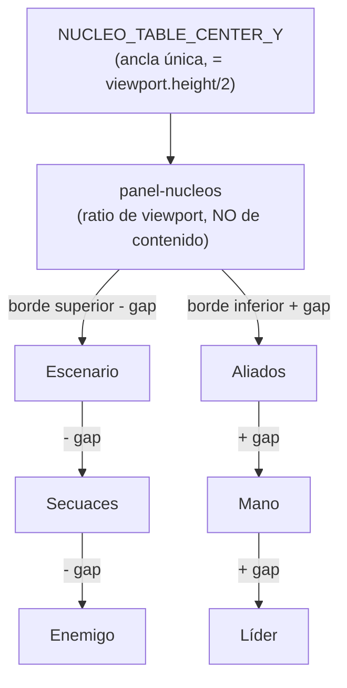

# H5.1 — Mesa de dados en el centro visual permanente

> Implementa vision.md "Experiencia objetivo del combate rediseñado (2026-07-12)" §1 ("La mesa de
> dados es el centro visual permanente del combate") y backlog.md H5.1. Reutiliza y extiende
> `packages/combat-scene/src/view/board-layout.ts` (única fuente de verdad de coordenadas, cerrada
> como tal en `docs/specs/H4_layout_fuente_unica.md`) — **no la sustituye**, invierte cuál nodo es la
> raíz de la cadena de derivación. Sin cambios de dominio: `packages/domain/*` no se toca.

---

## 0. Diagnóstico — por qué la mesa hoy NO es el centro visual

Con los valores vigentes (`COMBAT_SCENE_VIEWPORT.height = 2060`, `NUCLEO_TABLE_ROW_Y = 1340`):

- El *bounding box* real de contenido de la mesa de Núcleos (`NUCLEOS_CONTENT`, `board-layout.ts`)
  mide **204px** de alto (peor caso reservado, con dados EXTRA apilados: 204px también, ver
  `NUCLEO_CONTENT_BOTTOM_Y`) — un **9.9%** de los 2060px de viewport virtual.
- Su centro vertical (`NUCLEO_TABLE_ROW_Y = 1340`) cae al **65%** de la altura del viewport, no al
  50%.
- El panel visual que lo envuelve (`PANEL_ZONES['panel-nucleos']`) se dimensiona hoy por
  `panelFromContent` — bounding box de contenido + `PANEL_CONTENT_PADDING_PX` (5px) — es decir, un
  panel que se ajusta AL TAMAÑO MÍNIMO de sus dados, exactamente como cualquier otro panel del
  tablero (Enemigo, Escenario, Aliados...). No hay ninguna distinción visual que lo marque como "el
  corazón del tablero".

El backlog (H5.1) pide que la mesa ocupe **40-50% de la altura** y **60-80% del ancho** del
viewport, en posición central invariable. Esto no es alcanzable ajustando el panel al contenido real
de los dados (64px de lado) — requiere que el panel de Núcleos deje de derivarse de su contenido y
pase a ser un tamaño de **diseño deliberado**, con relleno generoso alrededor de los dados (la "mesa
de fieltro" con espacio de sobra, no un marco ajustado).

---

## 1. Decisión de arquitectura — la mesa pasa a ser la ANCLA raíz de la cadena de derivación

`H4_layout_fuente_unica.md` estableció el principio "cero literales de posición fuera de
`board-layout.ts`, todo lo demás se deriva por fórmula a partir de un pequeño conjunto de anclas".
Hasta hoy esas anclas eran `ENEMY_POSITION`/`SCENARIO_POSITION` (arriba del viewport), y la cadena
derivaba siempre hacia abajo (Enemigo → Secuaces → Escenario → Aliados → Núcleos → Mano → Líder).

**H5.1 cambia cuál nodo es la ancla raíz — no rompe el principio, lo reaplica sobre un nodo
distinto:**

- **Nueva ancla única:** `NUCLEO_TABLE_CENTER_Y`, fijada al centro vertical exacto del viewport.
  Ya no es un literal "porque no depende de nadie por arriba" (como `ENEMY_POSITION` hoy) — es un
  literal **por diseño explícito** (el requisito es "centro de pantalla", no "lo que sobre tras
  colocar lo demás").
- **El panel de Núcleos dimensiona por RATIO de viewport, no por contenido.** Es la única excepción
  a `panelFromContent` en todo el archivo — documentada aquí y en el código, mismo criterio que ya
  usa el archivo para excepciones deliberadas (anclas, tamaños duplicados documentados).
- **Todo lo demás deriva en DOS direcciones desde esa ancla**, no en una sola como antes:
  - Zona superior (Enemigo → Secuaces → Escenario) deriva **hacia arriba** desde el borde superior
    del panel de Núcleos.
  - Zona inferior (Aliados → Mano → Líder) deriva **hacia abajo** desde el borde inferior del panel
    de Núcleos.



**Por qué no es una redefinición completa del layout (Opción A "grid/flexbox", ya rechazada en
`H4_layout_fuente_unica.md` §1.1 por coste desproporcionado):** se mantiene el layout de una sola
columna vertical (retrato 9:16, `Phaser.Scale.FIT`), el mismo modelo de `ContentBox`/`PanelZone`, y
la misma dirección de dependencia (`board-layout.ts` sigue siendo la única fuente, sin ciclos). Solo
cambia qué nodo es la raíz de la cadena y que un panel (el de Núcleos) deja de ajustarse a su
contenido.

---

## 2. Nuevas constantes y fórmulas (`board-layout.ts`)

### 2.1 Ancla y tamaño de la mesa

```ts
// NUEVO H5.1 — ancla raíz. Sustituye a ENEMY_POSITION/SCENARIO_POSITION como raíz de la cadena de
// derivación (esas dos constantes SIGUEN existiendo como posiciones fijas, pero ahora se DERIVAN
// hacia arriba desde este punto, ver §2.2 — dejan de ser anclas independientes).
export const NUCLEO_TABLE_CENTER_Y = Math.round(COMBAT_SCENE_VIEWPORT.height / 2); // 1030

// NUEVO H5.1 — rango pedido por backlog H5.1 ("40-50% alto, 60-80% ancho"). Valores de diseño
// dentro del rango, no derivados de contenido — única excepción a panelFromContent en el archivo.
export const NUCLEO_PANEL_HEIGHT_RATIO = 0.45; // dentro de [0.40, 0.50]
export const NUCLEO_PANEL_WIDTH_RATIO = 0.72; // dentro de [0.60, 0.80]

export const NUCLEO_PANEL_HEIGHT = Math.round(COMBAT_SCENE_VIEWPORT.height * NUCLEO_PANEL_HEIGHT_RATIO); // 927
export const NUCLEO_PANEL_WIDTH = Math.round(COMBAT_SCENE_VIEWPORT.width * NUCLEO_PANEL_WIDTH_RATIO); // 778

// La fila de dados FIXED se sigue centrando en NUCLEO_TABLE_CENTER_Y — con 0 dados EXTRA (caso
// normal), los dados están exactamente en el centro geométrico del panel. El panel tiene margen de
// sobra por diseño (927px de panel contra ~204px de contenido real, ver §0) para que el apilado de
// dados EXTRA (hasta NUCLEO_MAX_EXTRA_DICE_STACKED_PER_COLOR) nunca se acerque al borde del panel.
export const NUCLEO_TABLE_ROW_Y = NUCLEO_TABLE_CENTER_Y; // 1030, reemplaza la fórmula derivada de ALLIES_CONTENT_BOTTOM_Y
```

`panel-nucleos` en `PANEL_ZONES` deja de construirse vía `panelFromContent(...)` — se construye
directo:

```ts
{ id: 'panel-nucleos', x: 540, y: NUCLEO_TABLE_CENTER_Y, width: NUCLEO_PANEL_WIDTH, height: NUCLEO_PANEL_HEIGHT, label: 'Núcleos' }
```

`NUCLEOS_CONTENT` (el `ContentBox` real de los dados, usado por `CONTENT_BOXES_TOP_TO_BOTTOM` para
el test de no-solape) se sigue calculando igual que hoy (top/bottom real de los dados FIXED+EXTRA),
pero ahora se verifica contra el borde del PANEL (927px), no al revés — la invariante de test cambia
de forma (ver §5).

### 2.2 Zonas compactas — Enemigo/Escenario/Líder reducen su tamaño de tile

Para que Enemigo+Secuaces+Escenario quepan en el hueco superior (`NUCLEO_TABLE_CENTER_Y -
NUCLEO_PANEL_HEIGHT/2` ≈ 567px de presupuesto) y Aliados+Mano+Líder en el hueco inferior (viewport
restante desde `NUCLEO_TABLE_CENTER_Y + NUCLEO_PANEL_HEIGHT/2` ≈ 1493 hasta 2060, ≈ 567px también),
los tiles de rol (Líder/Enemigo/Escenario, hoy `ROLE_TILE_HALF_PX = 100` → 200×200) y su fila de
habilidades adyacente pasan a un tamaño **compacto** cuando la mesa está centrada — el contenido de
Secuaces/Aliados/Mano (`CARD_TILE_HALF_PX = 90` → 120×180) ya es razonablemente compacto y no
necesita reducirse.

```ts
// NUEVO H5.1 — tamaño compacto de tile de rol (Líder/Enemigo/Escenario), sustituye a
// ROLE_TILE_HALF_PX SOLO para el cálculo de posición/contenido en el layout centrado en mesa.
// Documentado 1:1 contra su origen real igual que ROLE_TILE_HALF_PX (role-view.ts) — Programmer
// reduce ROLE_SIZE en role-view.ts de {200,200} a {140,140} en el mismo cambio.
export const COMPACT_ROLE_TILE_HALF_PX = 70; // = ROLE_SIZE compacto (140) / 2

// NUEVO H5.1 — offset de la fila de habilidades bajo un tile de rol compacto, escalado
// proporcionalmente desde el valor anterior (180 → ~126, redondeado a 120).
export const COMPACT_ABILITIES_ROW_OFFSET_PX = 120;

// NUEVO H5.1 — gap más ajustado dentro de las zonas compactas (superior/inferior), separado de
// CONTENT_GAP_PX (12, que se mantiene para el hueco inmediato contra el panel de Núcleos, el más
// importante de preservar generoso). Con más presupuesto de altura disponible tras el panel de
// Núcleos (H5.1 no reduce el viewport), este valor puede subir si el margen final lo permite —
// Programmer ajusta contra board-layout.test.ts (ver §5).
export const COMPACT_ZONE_GAP_PX = 8;
```

`ENEMY_POSITION`/`SCENARIO_POSITION`/`LEADER_POSITION` dejan de ser anclas top-down y pasan a
derivarse así (cadena invertida respecto a hoy):

```ts
// Borde superior del panel de Núcleos — punto de partida de la derivación HACIA ARRIBA.
const NUCLEO_PANEL_TOP_Y = NUCLEO_TABLE_CENTER_Y - NUCLEO_PANEL_HEIGHT / 2; // 1030 - 463.5 ≈ 566

// Escenario: inmediatamente encima del panel de Núcleos.
export const SCENARIO_POSITION = { x: 540, y: NUCLEO_PANEL_TOP_Y - COMPACT_ZONE_GAP_PX - COMPACT_ROLE_TILE_HALF_PX };
// Secuaces: encima de Escenario.
export const MINIONS_ROW_Y = SCENARIO_POSITION.y - COMPACT_ROLE_TILE_HALF_PX - COMPACT_ZONE_GAP_PX - CARD_TILE_HALF_PX;
// Enemigo: encima de Secuaces.
export const ENEMY_POSITION = { x: 540, y: MINIONS_ROW_Y - CARD_TILE_HALF_PX - COMPACT_ZONE_GAP_PX - COMPACT_ROLE_TILE_HALF_PX };

// Borde inferior del panel de Núcleos — punto de partida de la derivación HACIA ABAJO.
const NUCLEO_PANEL_BOTTOM_Y = NUCLEO_TABLE_CENTER_Y + NUCLEO_PANEL_HEIGHT / 2; // ≈ 1494

// Aliados: inmediatamente debajo del panel de Núcleos.
export const ALLIES_ROW_Y = NUCLEO_PANEL_BOTTOM_Y + COMPACT_ZONE_GAP_PX + CARD_TILE_HALF_PX;
// Mano: debajo de Aliados.
export const HAND_ROW_POSITION = { x: 540, y: ALLIES_ROW_Y + CARD_TILE_HALF_PX + COMPACT_ZONE_GAP_PX + CARD_TILE_HALF_PX };
// Líder: debajo de Mano.
export const LEADER_POSITION = {
  x: 540,
  y: HAND_ROW_POSITION.y + CARD_TILE_HALF_PX + COMPACT_ZONE_GAP_PX + COMPACT_ROLE_TILE_HALF_PX,
};

export const ENEMY_ABILITIES_ROW_Y = ENEMY_POSITION.y + COMPACT_ABILITIES_ROW_OFFSET_PX;
export const LEADER_ABILITIES_ROW_Y = LEADER_POSITION.y + COMPACT_ABILITIES_ROW_OFFSET_PX;
```

**Verificación de presupuesto (cálculo ilustrativo, Programmer confirma con test — ver §5):**
Enemigo+Secuaces+Escenario compactos consumen aprox. `70+8+90+8+70 ≈ 246px` de contenido más 2 gaps
ya contados → el conjunto cabe holgadamente en el presupuesto de ~566px superior (con margen para
subir `COMPACT_ZONE_GAP_PX` o el tamaño de tile compacto si Programmer lo prefiere). Lo mismo aplica
al hueco inferior (Aliados+Mano+Líder). **Este es un punto de partida razonado, no un número
pixel-perfect verificado contra el test real** — Programmer debe correr `board-layout.test.ts` (§5)
tras implementar y ajustar `COMPACT_ROLE_TILE_HALF_PX`/`COMPACT_ZONE_GAP_PX`/`NUCLEO_PANEL_HEIGHT_RATIO`
(dentro de su rango permitido) si el resultado no pasa, exactamente el mismo patrón iterativo que ya
usaron las rondas de H4 (`H4_diseno_real_ui.md`, `H4_fix_urgente_lider_fuera_viewport.md`).

### 2.3 Consumidores fuera de `board-layout.ts` que deben actualizarse

- `role-view.ts`: `ROLE_SIZE` pasa de `{200,200}` a `{140,140}` (o el valor final que Programmer fije
  para `COMPACT_ROLE_TILE_HALF_PX * 2`) — **solo si** H5.1 decide reducir el tile de Phaser real, no
  solo el bounding box reservado. Recomendado: sí reducirlo, para que el marco/panel visual coincida
  con el tile real (evita el mismo tipo de bug que `H4_layout_fuente_unica.md` documentó).
- `apps/shell/src/combat/CombatBoardOverlay.tsx` (`ROLE_TEXT_OFFSET_Y`, hoy `120`): debe escalarse
  proporcionalmente si el tile compacto cambia su offset de texto — reutiliza el mismo criterio 1:1
  documentado que ya existe entre `board-layout.ts` y esta constante.
- `apps/shell/src/combat/card/AbilityRow.tsx`/`AbilityTile.tsx`: sin cambio de contrato, solo reciben
  `rowY`/posiciones ya recalculadas vía import — mismo patrón que H4.

---

## 3. Tratamiento visual de la mesa — "mesa de verdad", no un panel más

Nuevo módulo `packages/combat-scene/src/view/nucleo-table-panel.ts` (o extensión de `panel-view.ts`
si Programmer prefiere no crear archivo nuevo — decisión de detalle sin impacto de contrato), llamado
una vez en `createBoard`/`createBoardView` **antes** de `createNucleoTable` (para que los dados se
dibujen por encima del fondo de mesa):

```ts
export interface NucleoTablePanelOptions {
  readonly x: number;
  readonly y: number;
  readonly width: number;
  readonly height: number;
}

/** H5.1 §3 — fondo distintivo de la mesa de Núcleos: panel más grande y con más peso visual que el
 *  resto de PANEL_ZONES (fill algo más oscuro/saturado + borde --foil translúcido persistente, para
 *  que se lea como "el centro" incluso sin ningún efecto de foco activo, spec H5.3/H5.4). NO participa
 *  en `panelFromContent` (ver §2.1) — se dibuja como una capa adicional, no sustituye la entrada
 *  `panel-nucleos` de `PANEL_ZONES` (que sigue existiendo para la etiqueta de zona en
 *  `CombatBoardOverlay.tsx` y para el test de no-solape). */
export function createNucleoTablePanel(scene: Phaser.Scene, options: NucleoTablePanelOptions): void;
```

```ts
// Constantes de diseño — nuevo bloque en board-layout.ts, mismo criterio que PANEL_FILL_COLOR/
// PANEL_BORDER_COLOR ya existentes (H4 §4.1), pero un tono distinto para diferenciar la mesa del
// resto de paneles.
export const NUCLEO_PANEL_TABLE_FILL_COLOR = 0x171620; // ligeramente más oscuro que --binder (0x1f1e26)
export const NUCLEO_PANEL_TABLE_FILL_ALPHA = 0.55;
export const NUCLEO_PANEL_TABLE_ACCENT_COLOR = 0xd4a24c; // = --foil
export const NUCLEO_PANEL_TABLE_ACCENT_ALPHA = 0.35; // translúcido — presente SIEMPRE, no solo en foco
export const NUCLEO_PANEL_TABLE_ACCENT_WIDTH_PX = 3;
export const NUCLEO_PANEL_TABLE_RADIUS_PX = 24; // más redondeado que RADIUS_PANEL (12) — distingue su forma
```

**Por qué un borde `--foil` translúcido permanente:** es la única superficie del tablero con acento
`--foil` fuera del contexto de selección/acción (que hasta H4 era su único uso, `H4_diseno_real_ui.md`
§3.2 "el botón de confirmación es el ÚNICO lugar... en `--foil`"). H5.1 amplía deliberadamente esa
regla: la mesa de Núcleos es, por diseño de esta historia, la segunda superficie permanente en
`--foil` — su propio "está siempre en foco" se lee siempre, sin depender de que ocurra un big moment
(H5.3/H5.4 añaden foco TRANSITORIO adicional sobre esta base permanente, no lo sustituyen).

`NUCLEO_DIE_SIZE` (`nucleo-table-view.ts`, hoy 64) puede subir moderadamente (sugerido 80-84) dado el
espacio extra disponible — Programmer ajusta `TILE_SEPARATION_PX`/posiciones de columna si hace falta
para que las 5-6+ columnas de color quepan dentro de `NUCLEO_PANEL_WIDTH` (778px sugeridos) sin
desbordar; validar contra `board-layout.test.ts` y visualmente en emulador móvil.

---

## 4. Resumen de archivos

```
packages/combat-scene/src/view/board-layout.ts       # MODIFICADO — nueva ancla NUCLEO_TABLE_CENTER_Y,
                                                       # panel-nucleos por ratio, derivación invertida
                                                       # (arriba/abajo), constantes COMPACT_*, NUCLEO_PANEL_*
packages/combat-scene/src/view/role-view.ts            # MODIFICADO — ROLE_SIZE compacto (140×140)
packages/combat-scene/src/view/nucleo-table-view.ts     # MODIFICADO — NUCLEO_DIE_SIZE aumentado,
                                                        # nombra cada tile (`rect.setName(die.id)`,
                                                        # requerido por H5.3/H5.4 — ver esa spec §2.4)
packages/combat-scene/src/view/nucleo-table-panel.ts    # NUEVO — fondo/borde distintivo de la mesa (§3)
packages/combat-scene/src/view/board-view.ts            # MODIFICADO — llama createNucleoTablePanel()
                                                        # antes de createNucleoTable()
packages/combat-scene/src/view/board-layout.test.ts     # MODIFICADO — nuevos invariantes (§5)
apps/shell/src/combat/CombatBoardOverlay.tsx            # MODIFICADO — ROLE_TEXT_OFFSET_Y escalado si
                                                        # el tile compacto cambia su offset de texto
```

---

## 5. Invariantes nuevas de test (`board-layout.test.ts`)

1. **Ratio de la mesa:** `PANEL_ZONES['panel-nucleos'].height / COMBAT_SCENE_VIEWPORT.height` está en
   `[0.40, 0.50]`; `.width / COMBAT_SCENE_VIEWPORT.width` está en `[0.60, 0.80]`.
2. **Centrado vertical:** `Math.abs(PANEL_ZONES['panel-nucleos'].y - COMBAT_SCENE_VIEWPORT.height / 2)`
   es `<= 10` (tolerancia por redondeo).
3. **No-solape reforzado (ya existente, `H4_layout_fuente_unica.md` §1.2 punto 3):** se mantiene sin
   cambio de forma — sigue verificando que el gap real entre `ContentBox` consecutivas de
   `CONTENT_BOXES_TOP_TO_BOTTOM` es `>= COMPACT_ZONE_GAP_PX`/`CONTENT_GAP_PX` según corresponda a la
   frontera (los dos huecos inmediatos al panel de Núcleos usan `CONTENT_GAP_PX`; el resto de
   fronteras de la zona compacta usan `COMPACT_ZONE_GAP_PX`, ambas `> 0`, así que un único `>= min`
   contra el menor de los dos basta como cota inferior universal — Programmer decide el detalle
   exacto de la aserción).
4. **Todo el contenido cabe dentro del viewport:** `LEADER_CONTENT.bottom <= COMBAT_SCENE_VIEWPORT.height`
   y `ENEMY_CONTENT.top >= 0` (mismo criterio que el fix P0 previo, `H4_fix_urgente_lider_fuera_viewport.md`).

---

## 6. Fuera de alcance explícito

- Layout multi-columna/grid en horizontal — sigue descartado por el mismo análisis de coste/beneficio
  de `H4_layout_fuente_unica.md` §1.1; H5.1 logra "mesa central" dentro del modelo de una columna.
- Arte real de la mesa (textura de fieltro, madera, etc.) — el tratamiento visual de §3 es geometría +
  color plano (`Graphics`/`Rectangle`), no un asset de imagen nuevo.
- Reposicionar Secuaces/Aliados a los laterales de la mesa (layout "orbital" literal en 2D) — el
  backlog lo sugiere como posibilidad ("zonas izquierda/derecha o inferior"), pero se descarta aquí:
  requeriría el layout multi-columna ya rechazado arriba. Secuaces/Aliados permanecen en su fila
  horizontal propia, ahora comprimida verticalmente (§2.2) pero en la misma columna única.
- Cambiar `NUCLEO_MAX_EXTRA_DICE_STACKED_PER_COLOR` o el tope de dados en mesa — sin cambios de
  diseño de esa mecánica, solo de dónde se dibuja.

---

## 7. Dependencias con otras historias de la Épica E5

- **H5.4/H5.6** reutilizan `board-layout.ts` para resolver posiciones de foco (zoom de cámara hacia
  un dado/rol concreto) — dependen de que los nombres/exports de este archivo sigan existiendo con la
  misma forma (`ENEMY_POSITION`, `SCENARIO_POSITION`, `LEADER_POSITION`, `NUCLEO_TABLE_ROW_Y`), no de
  sus valores numéricos exactos. Sin bloqueo de tipos.
   - `nucleo-table-view.ts` gana `rect.setName(die.id)` en esta historia (§4) — es un prerrequisito
    técnico de H5.3/H5.4 (foco de cámara sobre un dado concreto necesita poder resolverlo por nombre,
    ver esa spec §2.4), documentado aquí para que Programmer no lo pierda al secuenciar el trabajo.
- **H5.5** reutiliza `NUCLEO_TABLE_CENTER_Y`/`PANEL_ZONES['panel-nucleos']` para posicionar el
  selector de categoría (revelación progresiva) de forma coherente con el nuevo centro de gravedad
  visual del tablero — ver esa spec §3.
- Sin dependencia de H5.2/H5.3 hacia esta historia (H5.1 es puramente de layout/geometría, no de
  interacción ni de juice).
