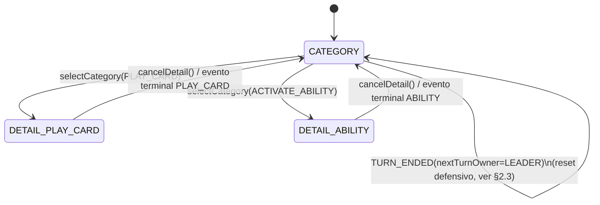

# H5.2 — Revelación progresiva de decisiones de turno (`TurnDecisionFlow`)

## ⚠️ CORRECCIÓN 2026-07-13 — el gating de categoría se retira para PLAY_CARD/ACTIVATE_ABILITY

> Ver decisions.md 2026-07-13 ("Corrección crítica tras playtesting real de E5") y backlog.md H5.2
> reabierta. El Director Creativo jugó el build real y reportó que pedir "¿qué categoría de acción
> quieres?" antes de poder tocar una carta de la mano o un icono de habilidad es ceremonia
> innecesaria: ambas acciones YA tienen un objetivo visual explícito en el tablero (la carta, el
> icono), así que deben ejecutarse con tap directo, exactamente como H3.1/H3.3 las dejó ANTES de
> H5.2/H5.5. El gating de categoría solo tenía sentido para las 2 acciones SIN objetivo visual propio
> (Generar Energía, Robar Carta), que decisions.md 2026-07-13 pide como "2 botones discretos y
> pequeños a un lado del tablero" — nunca como parte de una fila principal de 4 botones iguales.

### Qué cambia — todo el §1-§4 de abajo queda RETIRADO, no reinterpretado

A diferencia de otras correcciones de este proyecto (que acotan alcance sin tirar código), aquí la
corrección es una **retirada completa** de `TurnDecisionFlow`/`TurnRevealStage`/`ActionCategory`/
`DetailCategory`, con justificación explícita de por qué no se deja como "cascarón reducido":

- Las únicas 2 categorías que sobrevivirían a la corrección (`GENERATE_ENERGY`/`DRAW_CARD`) **nunca
  transicionaban de fase** en la máquina de estados original (§2.1 de abajo: "el estado SIGUE en
  CATEGORY — nunca hubo transición"). Sin `PLAY_CARD`/`ACTIVATE_ABILITY` (las únicas categorías que sí
  abrían `DETAIL`, §2.2), la máquina de estados queda permanentemente en un único estado —
  `TurnDecisionFlow` se convertiría en una envoltura sin estado real que solo reenvía 2 dispatches
  directos. Mantenerla como "cascarón" añadiría una capa de indirección sin ningún beneficio de
  diseño; se retira por completo y las 2 categorías supervivientes vuelven a despachar directo contra
  `bridge.dispatch(...)`, exactamente el patrón que el paso previo gratuito (`TurnStartModal`/franja
  "Paso previo" de `CombatHud`) ya usa desde H4 sin ninguna máquina de estados de por medio.
- `PendingSelection`/`TargetingSignal` de `gesture-command-translator.ts` (el sub-flujo de targeting
  cuando hay múltiples Secuaces, o de selección de Núcleo) **NO se toca** — nunca dependió de
  `TurnDecisionFlow` (`cancelDetail()` solo delegaba en `cancelPending()` como conveniencia, la propia
  máquina de `PendingSelection` tiene su ciclo de vida independiente desde antes de H5). Sigue
  funcionando exactamente igual, sin ningún cambio de esta corrección.

### Qué reemplaza al gating — mano/habilidades SIEMPRE visibles, 2 botones discretos aparte

1. **`HandCardRow` (mano) y `AbilityRow` del Líder vuelven a estar SIEMPRE visibles e interactivas**
   durante el turno del jugador (mismo criterio que tenían en H4, antes de que H5.5 las ocultara tras
   `stage.stage === 'DETAIL'`). Tap directo en una carta → `handleCardTap` → comando. Tap directo en un
   icono de habilidad → `handleAbilityTap` → comando. Sin paso de "declarar categoría" antes. Ver
   detalle completo de qué archivos revertir en la corrección de H5.5 más abajo en ese documento.
2. **Generar Energía y Robar Carta se mueven a un componente nuevo, `SideActionRail`**, anclado al
   margen lateral de la mesa de Núcleos (no a la fila principal del HUD superior) — 2 botones pequeños,
   discretos, siempre visibles durante el turno del jugador, cada uno despachando su comando
   DIRECTAMENTE (`bridge.dispatch({ type: 'GENERATE_ENERGY' })` / `{ type: 'DRAW_CARD' }'`), sin pasar
   por ninguna máquina de estados. Contrato completo en `docs/specs/H5.7_hud_lider_discreto.md`
   §3 — vive ahí (no aquí) porque comparte contexto de layout/HUD con el resto de esa corrección de
   peso visual, pero es la pieza que sustituye funcionalmente a este documento.

### Archivos retirados (DELETE, no MODIFICADOS)

```
packages/combat-scene/src/interaction/turn-decision-flow.ts       # DELETE
packages/combat-scene/src/interaction/turn-decision-flow.test.ts  # DELETE
apps/shell/src/combat/use-turn-reveal-stage.ts                    # DELETE
```

Y las reexportaciones correspondientes (`TurnDecisionFlow`, `TurnDecisionSignal`, `TurnRevealStage`,
`ActionCategory`, `createTurnDecisionFlow`) se retiran de `packages/combat-scene/src/interaction/index.ts`
y `packages/combat-scene/src/index.ts`. Detalle completo de TODOS los archivos afectados (incluida
`CombatScene.ts`, `CombatScreen.tsx`, `CombatHud.tsx`, `CombatBoardOverlay.tsx`) en la corrección de
`docs/specs/H5.5_cableado_flujo_progresivo.md` — ese documento es ahora la fuente de verdad del
cableado corregido; este documento (H5.2) queda como registro histórico de la arquitectura RETIRADA
(§1-§8 de abajo), conservado sin editar más allá de esta cabecera, por la misma razón que
`decisions.md` nunca borra texto antiguo — para que quede constancia de qué se probó y por qué se
descartó.

---

## Contenido original (RETIRADO 2026-07-13, conservado como registro histórico — ver corrección arriba)

> Implementa vision.md §2 ("El turno se responde una pregunta a la vez") y backlog.md H5.2. Vive en
> `packages/combat-scene/src/interaction/` (capa de interacción de Phaser, mismo paquete que
> `gesture-command-translator.ts`/`targeting-signal.ts`). El cableado a React (qué se pinta en cada
> fase) es H5.5 — esta historia define la **máquina de estados y su contrato de lectura/escritura**,
> reutilizada por H5.5 sin ambigüedad. Sin cambios de dominio.

---

## 0. Diagnóstico — qué existe hoy y qué falta

Hoy `apps/shell` expone **simultáneamente** las 4 categorías de acción del turno pagado (mano de
cartas completa vía `HandCardRow`, las 4 habilidades del Líder vía `AbilityRow`, y los botones
"Generar Energía"/"Robar Carta" del `CombatHud`) desde el primer instante en que empieza el turno del
jugador — exactamente el problema que el Director Creativo señaló ("necesito ver todo el tablero
antes de decidir"). El paso previo gratuito (`TurnStartModal`, H4) YA es secuencial (una pregunta,
"robar o generar", antes de cualquier otra cosa) — **ese patrón no cambia, H5.2 no lo toca**.

Lo que sí existe y H5.2 **reutiliza sin modificar**: `gesture-command-translator.ts` ya implementa
una máquina de estados de revelación progresiva para el ÚLTIMO tramo de cada acción (`PendingSelection`:
`AWAITING_ATTACK_TARGET(_FOR_ABILITY)` → `AWAITING_NUCLEO_FOR_CARD/ABILITY` → dispatch), publicada vía
`TargetingSignal` (pub/sub) y consumida por `TargetingPromptBanner`/`targeting-highlight-view.ts`. H5.2
**no reemplaza esa máquina** — la envuelve con un nivel superior que gobierna **cuándo mano/habilidades
son siquiera visibles/interactivas**, antes de que esa máquina interna entre en juego.

---

## 1. Contrato — `TurnDecisionFlow`

Nuevo módulo `packages/combat-scene/src/interaction/turn-decision-flow.ts`.

```ts
/** Las 4 categorías de la spec de dominio (decisions.md "Estructura del turno del jugador",
 *  2 acciones pagadas). Mismo vocabulario que `ControlId` ya usa `CombatHud.tsx` — H5.5 unifica
 *  ambos (ver esa spec §1). */
export type ActionCategory = 'PLAY_CARD' | 'ACTIVATE_ABILITY' | 'GENERATE_ENERGY' | 'DRAW_CARD';

/** Categorías que SIEMPRE requieren un tramo de detalle (elegir qué carta/qué habilidad) antes de
 *  poder ejecutarse — coincide exactamente con las 2 categorías "grandes" de vision.md (activar
 *  habilidad tiene foco total; jugar carta puede llevar a un ataque con objetivo, también relevante).
 *  Las otras 2 (GENERATE_ENERGY/DRAW_CARD) son las "rutinarias": no tienen sub-elección posible (el
 *  efecto es siempre el mismo, +1 Energía / +1 carta), así que categoría=acción, sin tramo de detalle. */
export type DetailCategory = Extract<ActionCategory, 'PLAY_CARD' | 'ACTIVATE_ABILITY'>;

export type TurnRevealStage =
  | { readonly stage: 'CATEGORY' }
  | { readonly stage: 'DETAIL'; readonly category: DetailCategory };

export interface TurnDecisionSignal {
  getState(): TurnRevealStage;
  /** Mismo tipo de retorno que `TargetingSignal.subscribe`/`CombatBridge.subscribeHudEvents`. */
  subscribe(listener: (state: TurnRevealStage) => void): () => void;
}

export interface TurnDecisionFlow {
  /** Único punto de entrada del gesto "el jugador tocó la categoría X". Ver §2 para el
   *  comportamiento exacto por categoría. */
  selectCategory(category: ActionCategory): void;
  /** Vuelve a `CATEGORY` desde `DETAIL`, cancelando también cualquier selección de objetivo/Núcleo
   *  pendiente en `GestureCommandTranslator` (delega en `cancelPending()`, inyectado en la
   *  construcción — ver §3). Equivalente al botón "Cancelar"/"Atrás" que H5.5 monta en fase DETAIL. */
  cancelDetail(): void;
  readonly signal: TurnDecisionSignal;
}

export function createTurnDecisionFlow(deps: TurnDecisionFlowDeps): TurnDecisionFlow;
```

---

## 2. Comportamiento de `selectCategory`



### 2.1 Categorías "rutinarias" (`GENERATE_ENERGY`, `DRAW_CARD`) — sin tramo de detalle

```ts
if (category === 'GENERATE_ENERGY') {
  bridge.dispatch({ type: 'GENERATE_ENERGY' });
  return; // el estado SIGUE en CATEGORY — nunca hubo transición, no hace falta "volver"
}
if (category === 'DRAW_CARD') {
  bridge.dispatch({ type: 'DRAW_CARD' });
  return;
}
```

Si el comando es rechazado por el motor (ej. Energía al máximo, mano llena) no se emite ningún evento
de dominio — el estado no cambia, el jugador ve el mismo feedback de "deshabilitado"/rechazo que ya
provee H4 (`disabledReasonFor`, tooltips). **`selectCategory` no valida disponibilidad por sí mismo**
— delega esa responsabilidad íntegramente al motor (mismo criterio ya establecido en
`gesture-command-translator.ts`: la UI ofrece el gesto, el motor decide si es válido). H5.5 sigue
siendo responsable de no ofrecer un botón de categoría obviamente inválido (reutiliza
`disabledReasonFor`/`freeStepAvailabilityFor`, sin cambios de esas funciones).

### 2.2 Categorías "grandes" (`PLAY_CARD`, `ACTIVATE_ABILITY`) — abren tramo de detalle

```ts
if (category === 'PLAY_CARD' || category === 'ACTIVATE_ABILITY') {
  setStage({ stage: 'DETAIL', category });
  return;
}
```

Al entrar en `DETAIL`, H5.5 revela `HandCardRow` (si `category === 'PLAY_CARD'`) o `AbilityRow` del
Líder (si `category === 'ACTIVATE_ABILITY'`) como interactivos; el tramo INTERNO de esa selección
(qué carta/habilidad concreta, qué objetivo si aplica, qué dado de Núcleo) sigue resolviéndose
íntegramente por la máquina YA EXISTENTE de `gesture-command-translator.ts` (`PendingSelection`,
`TargetingSignal`) — **`TurnDecisionFlow` no duplica esa lógica, solo gobierna la visibilidad previa
a que el jugador pueda siquiera tocar una carta/habilidad concreta**.

### 2.3 Vuelta automática a `CATEGORY` — suscripción a eventos terminales

```ts
/** Eventos de dominio cuya llegada mientras stage === 'DETAIL' significa "la acción de esta
 *  categoría se completó" — vuelve a CATEGORY automáticamente. Un comando RECHAZADO (el motor
 *  devuelve error, sin emitir evento) deja al jugador en DETAIL para reintentar o cancelar
 *  manualmente — comportamiento deliberado, mismo criterio que el resto del flujo de targeting. */
const TERMINAL_EVENT_TYPES: ReadonlySet<CombatEvent['type']> = new Set([
  'CARD_PLAYED',           // PLAY_CARD (Evento/Equipo) resuelto
  'ALLY_ENTERED_PLAY',     // PLAY_CARD (Aliado) resuelto
  'CONTRATIEMPO_PLAYED',   // PLAY_CARD (Contratiempo) resuelto
  'ABILITY_ACTIVATED',     // ACTIVATE_ABILITY resuelto
]);
```

`createTurnDecisionFlow` se suscribe a `bridge.subscribeHudEvents` (mismo canal que
`use-combat-snapshot.ts`/`use-combat-log.ts` — nunca al canal de juice `subscribeSceneEvents`, mismo
criterio de separación de responsabilidad ya establecido en H2.3/H4). Dos reglas:

1. Si `stage.stage === 'DETAIL'` y llega un evento en `TERMINAL_EVENT_TYPES` cuyo tipo corresponde a
   la categoría activa (`CARD_PLAYED`/`ALLY_ENTERED_PLAY`/`CONTRATIEMPO_PLAYED` → `PLAY_CARD`;
   `ABILITY_ACTIVATED` → `ACTIVATE_ABILITY`) → `setStage({ stage: 'CATEGORY' })`.
2. Si llega `TURN_ENDED` con `nextTurnOwner === 'LEADER'` → `setStage({ stage: 'CATEGORY' })`
   incondicionalmente (reset defensivo de inicio de turno — nunca debería hacer falta si la regla 1
   ya cerró el tramo anterior, pero cierra cualquier caso borde sin dejar al jugador atrapado en
   `DETAIL` de un turno pasado).

No hace falta un tercer canal de "cancelación por error" — un comando rechazado simplemente no emite
ningún evento de los dos listados, así que el estado no cambia (correcto: el jugador sigue en DETAIL
para corregir su elección).

---

## 3. Construcción — dependencias inyectadas

```ts
export interface TurnDecisionFlowDeps {
  readonly bridge: CombatBridge;
  /** Reutiliza el MISMO `cancelPending()` que ya expone `GestureCommandTranslator` (H4 §5.3) — al
   *  cancelar el tramo de detalle, cualquier `PendingSelection` de targeting/Núcleo en curso también
   *  se limpia, para no dejar un prompt de "elige un objetivo" huérfano tras volver a CATEGORY. */
  readonly cancelPending: () => void;
}
```

`CombatScene.create()` (`packages/combat-scene/src/scenes/CombatScene.ts`) construye
`createTurnDecisionFlow({ bridge: this.bridge, cancelPending: () => translator.cancelPending() })`
inmediatamente después de construir `translator` (mismo punto donde hoy se construyen
`targetingSignal`/`translatorHandle`) — orden de construcción documentado en H5.5 §2 (que también
añade el getter `getTurnDecisionSignal()`/`getTurnDecisionFlowHandle()` a `CombatScene`, simétrico a
`getTargetingSignal()`/`getGestureCommandTranslator()` ya existentes).

---

## 4. `GENERATE_ENERGY`/`DRAW_CARD` — ¿quién despacha, HUD o `TurnDecisionFlow`?

**Decisión: `TurnDecisionFlow.selectCategory` es el ÚNICO punto de dispatch para estas 2 categorías a
partir de H5.5.** Hoy `CombatHud.tsx` despacha `GENERATE_ENERGY`/`DRAW_CARD` directamente vía
`bridge.dispatch(...)` en el `onClick` de sus botones (H3.5/H4). H5.5 debe migrar esos `onClick` para
llamar a `turnDecisionFlow.selectCategory('GENERATE_ENERGY' | 'DRAW_CARD')` en su lugar — **mismo
efecto observable** (el dispatch ocurre igual, inmediato, sin tramo), pero centraliza el punto de
entrada de las 4 categorías en un solo objeto, evitando que "jugar carta"/"activar habilidad" pasen
por `TurnDecisionFlow` mientras "generar energía"/"robar carta" siguen despachando por un camino
paralelo distinto (inconsistencia que complicaría el mantenimiento futuro sin beneficio). Detalle de
implementación de H5.5, sin impacto en el contrato de esta historia.

---

## 5. Qué NO hace `TurnDecisionFlow`

- No gestiona el paso previo gratuito (`DRAW_OR_GENERATE`, `TurnStartModal`) — ese flujo ya es
  secuencial desde H4 y queda intacto.
- No gestiona "Fin de turno" (`END_TURN`) — sigue siendo un control siempre visible fuera de las 4
  categorías (meta-acción, no parte de "qué hago con mi acción"), sin cambios respecto a H4.
- No decide QUÉ pintar en cada fase (grid de cartas, fila de habilidades, botones de categoría) — eso
  es responsabilidad de H5.5 (capa React), que consume `TurnDecisionSignal` de la misma forma que
  `useTargetingPrompt` ya consume `TargetingSignal` hoy (mismo patrón de hook, ver esa spec §1).
- No decide el peso visual (foco total / rutinario) de la resolución de la acción — eso es H5.3/H5.4,
  que actúan sobre los eventos de dominio ya emitidos, un nivel de abstracción distinto e
  independiente de este flujo de revelación.

---

## 6. Resumen de archivos

```
packages/combat-scene/src/interaction/turn-decision-flow.ts       # NUEVO — contrato + implementación (§1-§3)
packages/combat-scene/src/interaction/turn-decision-flow.test.ts   # NUEVO — casos §2/§4
packages/combat-scene/src/interaction/index.ts                     # MODIFICADO — reexporta el módulo nuevo
packages/combat-scene/src/scenes/CombatScene.ts                    # MODIFICADO — construye TurnDecisionFlow,
                                                                     # getTurnDecisionSignal()/handle (§3, detallado en H5.5)
packages/combat-scene/src/index.ts                                 # MODIFICADO — reexporta tipos públicos
                                                                     # (TurnDecisionSignal, TurnRevealStage, ActionCategory)
```

---

## 7. Casos de test que Programmer debe cubrir

1. `selectCategory('GENERATE_ENERGY')` → `bridge.dispatch` llamado con `{ type: 'GENERATE_ENERGY' }`,
   `signal.getState()` sigue en `{ stage: 'CATEGORY' }` (nunca transiciona).
2. `selectCategory('DRAW_CARD')` → análogo con `DRAW_CARD`.
3. `selectCategory('PLAY_CARD')` → `signal.getState()` pasa a `{ stage: 'DETAIL', category: 'PLAY_CARD' }`,
   ningún `dispatch` todavía.
4. Con estado `DETAIL/PLAY_CARD`, emitir `CARD_PLAYED` vía el bridge de test → `signal.getState()`
   vuelve a `{ stage: 'CATEGORY' }`.
5. Con estado `DETAIL/ACTIVATE_ABILITY`, emitir `CARD_PLAYED` (evento de la OTRA categoría) → el
   estado NO cambia (sigue en `DETAIL/ACTIVATE_ABILITY`) — el filtro por categoría activa es real, no
   "cualquier evento terminal cierra cualquier detalle".
6. `cancelDetail()` desde `DETAIL/ACTIVATE_ABILITY` → vuelve a `CATEGORY` y `cancelPending` (mock) fue
   invocado exactamente una vez.
7. Emitir `TURN_ENDED` con `nextTurnOwner: 'LEADER'` estando en `DETAIL/PLAY_CARD` → vuelve a
   `CATEGORY` (reset defensivo, §2.3 regla 2).
8. Emitir `TURN_ENDED` con `nextTurnOwner: 'ENEMY'` → sin cambio de estado (la regla 2 solo aplica
   al turno entrante del Líder).
