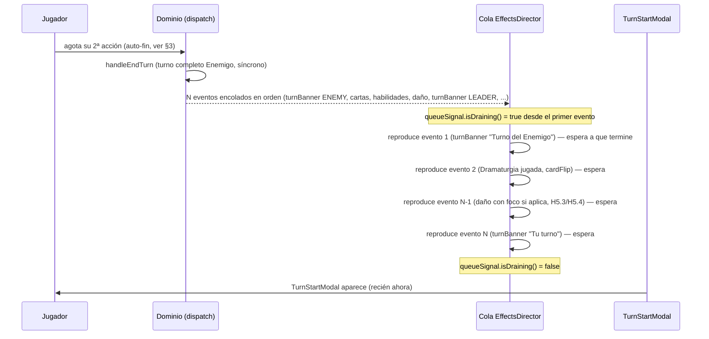

# H5.9 — Fin de turno automático + visualización clara del turno del Enemigo

> Cubre backlog.md B5.3. Revisa el flujo de `END_TURN` (`CombatHud.tsx` botón "Fin de turno",
> `combat-engine.ts` `handleEndTurn`), el canal de juice (`packages/combat-scene/src/juice/
> effects-director.ts`) y el popup de inicio de turno (`apps/shell/src/combat/TurnStartModal.tsx`,
> `docs/specs/H4_flujo_turno_y_log.md` §1-§2). Reutiliza íntegramente `BigMomentClassifier`/
> `FocusController`/`JUICE_CONFIG` (H5.3/H5.4/H5.6) — **no se rediseña ninguna clasificación de
> "momento grande"**, solo se corrige CÓMO se secuencian los eventos que esos sistemas ya consumen.

---

## 0. Diagnóstico — 2 bugs distintos detrás de un mismo síntoma

El Director Creativo reportó dos síntomas que parecen uno solo ("el botón de fin de turno es confuso"
+ "el cambio de turno salta a un popup ciego sin ver qué hizo el Enemigo") pero tienen 2 causas
técnicas independientes:

### 0.1 Causa 1 — no hay auto-fin de turno (síntoma: botón confuso)

`handleEndTurn` (dominio) solo se dispara por el comando explícito `END_TURN`, despachado hoy
ÚNICAMENTE por el `onClick` del botón "Fin de turno" de `CombatHud.tsx`. El motor nunca termina el
turno por sí mismo al agotar las 2 acciones — el jugador debe recordar pulsar un botón adicional que
no aporta ninguna decisión real (con las 2 acciones ya gastadas, no hay nada más que "confirmar").

### 0.2 Causa 2 — `EffectsDirector.attach` no serializa eventos entre sí (síntoma: popup ciego)

`handleEndTurn` resuelve el turno COMPLETO del Enemigo de forma síncrona dentro de una sola llamada a
`dispatch({ type: 'END_TURN' })` (`combat-engine.ts` líneas 1532-1701: tick de cooldowns, pasivos de
Secuaces, cambios de fase, IA automática completa —`runAutomaticEnemyTurn`— y la recursión que cierra
de vuelta a `LEADER`) — potencialmente 5-15+ `CombatEvent` emitidos en la MISMA pila de llamadas
síncrona, ANTES de que `dispatch()` retorne. `CombatBridge` reenvía cada evento a ambos canales
(`hudBus`/`sceneBus`) de forma síncrona (`combat-bridge.ts` líneas 52-55) en el momento en que ocurre.

Consecuencia en el canal HUD (React): `snapshot` refleja el estado FINAL del turno del Enemigo
INSTANTÁNEAMENTE tras el `dispatch()` — `TurnStartModal` (cuya condición de aparición es
`snapshot.turn.turnOwner === 'LEADER' && !leaderFreeStep.takenThisTurn`) puede pasar a `shouldShow =
true` en el MISMO tick en el que el jugador terminó su turno, sin que el jugador haya tenido tiempo de
PERCIBIR nada de lo que el Enemigo hizo — el "popup ciego" del feedback.

Consecuencia en el canal Scene (Phaser/`EffectsDirector`): `attach()` (`effects-director.ts` líneas
159-174) llama `void resolveEvent(...)` por cada evento entrante SIN esperar a que el anterior
termine — es "fire-and-forget" por diseño (comentario explícito: "Fire-and-forget respecto al bus de
eventos de dominio"). Esto es CORRECTO cuando solo llega 1 evento por `dispatch()` (el caso normal de
una acción del jugador), pero con 5-15 eventos del turno completo del Enemigo llegando en la MISMA
pila síncrona, TODAS las animaciones (`turnBanner`, `focusZoom`/`focusBlur` de cada `ABILITY_ACTIVATED`,
`hitImpact`/`screenShake` de cada daño, `cardFlip` de cada carta de Dramaturgia) arrancan
PRÁCTICAMENTE A LA VEZ en vez de en secuencia legible — el jugador no puede seguir "primero jugó esta
carta, luego esta habilidad, luego este daño" porque todo ocurre superpuesto.

---

## 1. Corrección 1 — cola de reproducción serializada en `EffectsDirector`

**No se toca `JUICE_CONFIG`, `BigMomentClassifier` ni `FocusController`** (ya correctos, per encargo
explícito). Se cambia ÚNICAMENTE la orquestación interna de `attach()`: de "disparar cada evento
inmediatamente, sin esperar" a "encolar y drenar uno a uno, en orden de llegada".

```ts
// packages/combat-scene/src/juice/effects-director.ts — MODIFICADO

/** NUEVO H5.9 — señal de lectura de si la cola de reproducción tiene trabajo pendiente/en curso.
 *  Expuesta para que `apps/shell` pueda esperar a que la "reproducción" de un turno completo del
 *  Enemigo termine antes de mostrar `TurnStartModal` (§2). Mismo patrón de pub/sub que
 *  `TargetingSignal`/`RejectionSignal`. */
export interface EffectsQueueSignal {
  isDraining(): boolean;
  subscribe(listener: (draining: boolean) => void): () => void;
}

export interface EffectsDirector {
  attach(bridge: CombatBridge, scene: Phaser.Scene): Unsubscribe;
  /** NUEVO H5.9. */
  readonly queueSignal: EffectsQueueSignal;
}

export function createEffectsDirector(
  config: JuiceConfig,
  recipes: JuiceRecipeRegistry,
  soundManager: SoundManager,
  bigMomentClassifier: BigMomentClassifier,
  focusController: FocusController,
): EffectsDirector {
  const queue: JuiceTarget[] = [];
  let draining = false;
  const listeners = new Set<(draining: boolean) => void>();

  function setDraining(next: boolean): void {
    if (draining === next) return;
    draining = next;
    listeners.forEach((listener) => listener(draining));
  }

  async function drain(scene: Phaser.Scene): Promise<void> {
    setDraining(true);
    while (queue.length > 0) {
      const target = queue.shift()!;
      const steps = config[target.event.type] ?? [];
      const isBigMoment = steps.some((s) => s.isBigMoment === true) || bigMomentClassifier.classify(target.event);
      // eslint-disable-next-line no-await-in-loop -- secuenciación DELIBERADA, ver §0.2/§1
      await resolveEvent(steps, target, scene, recipes, soundManager, isBigMoment, focusController);
    }
    setDraining(false);
  }

  return {
    attach(bridge: CombatBridge, scene: Phaser.Scene): Unsubscribe {
      return bridge.subscribeSceneEvents((event: CombatEvent) => {
        const steps = config[event.type] ?? [];
        if (steps.length === 0) return; // sin receta — no entra en cola, mismo criterio que antes

        queue.push(resolveJuiceTarget(event));
        if (!draining) void drain(scene); // arranca el drenaje si estaba inactivo; si ya está
                                           // drenando, el nuevo evento simplemente se procesará
                                           // cuando le toque el turno en la cola (orden FIFO)
      });
    },
    queueSignal: {
      isDraining: () => draining,
      subscribe(listener: (draining: boolean) => void): () => void {
        listeners.add(listener);
        return () => listeners.delete(listener);
      },
    },
  };
}
```

- **`resolveEvent` (función privada existente) no cambia** — sigue resolviendo UN evento (steps +
  wrap de foco si `isBigMoment`), solo que ahora se le hace `await` en vez de `void` desde el llamador.
- **`resolveJuiceTarget`/clasificación de `isBigMoment` se evalúan en el momento de DRENAR (no de
  encolar)** — sin diferencia práctica: son funciones puras respecto al propio evento; para los 2 casos
  que leen `bridge.getSnapshot()` en vivo (`MINION_DAMAGED`/`ALLY_DAMAGED` en `BigMomentClassifier`), el
  comentario YA EXISTENTE en `big-moment-classifier.ts` anticipa exactamente esta lectura tardía
  ("si la entidad ya no está en mesa... se trata como `false` sin lanzar") — sin cambio de contrato.
- **Eventos sin receta (`steps.length === 0`) nunca entran en la cola** — mismo comportamiento que
  hoy (se ignoran), así que no añaden latencia de "esperar su turno" para nada.
- **Reentrante-seguro por construcción**: si un segundo lote de eventos llega mientras `drain()` ya
  está corriendo (ej. el jugador dispara una acción que también encola, mientras el turno anterior
  todavía se está reproduciendo — no debería ocurrir en la práctica dado que la UI queda bloqueada
  mientras drena, ver §2, pero la cola lo tolera sin condición de carrera: el nuevo evento simplemente
  se añade al final del array y se procesa en su turno).

---

## 2. Corrección 2 — `TurnStartModal` espera a que la cola termine de drenar

```ts
// packages/combat-scene/src/scenes/CombatScene.ts — MODIFICADO
export class CombatScene extends Phaser.Scene {
  // ...propiedades existentes...

  /** NUEVO H5.9 — expuesto a `apps/shell` tras `READY`, mismo ciclo de vida que
   *  `getTargetingSignal()`/`getGestureCommandTranslator()`. */
  getEffectsQueueSignal(): EffectsQueueSignal {
    return this.effectsDirectorHandle.queueSignal;
  }
}
```

`create()` guarda la instancia de `effectsDirector` (hoy es una variable local que se descarta tras
`attach()`) como propiedad de instancia `this.effectsDirectorHandle` para poder exponer
`queueSignal` — único cambio estructural en `create()`, sin alterar el orden de construcción existente.

```ts
// apps/shell/src/combat/use-effects-queue-draining.ts — NUEVO, mismo patrón que use-turn-reveal-stage.ts
export function useEffectsQueueDraining(signal: EffectsQueueSignal | null): boolean {
  const [draining, setDraining] = useState<boolean>(signal?.isDraining() ?? false);
  useEffect(() => {
    if (!signal) return undefined;
    setDraining(signal.isDraining());
    return signal.subscribe(setDraining);
  }, [signal]);
  return draining;
}
```

`CombatScreen.tsx` obtiene `effectsQueueSignal` tras `READY` (mismo bloque que
`setTargetingSignal`/`setGestureHandle`) y `CombatHudOverlay` calcula
`const effectsQueueDraining = useEffectsQueueDraining(effectsQueueSignal);`, pasado a `TurnStartModal`
como prop nueva.

```tsx
// apps/shell/src/combat/TurnStartModal.tsx — MODIFICADO
export interface TurnStartModalProps {
  readonly snapshot: CombatStateSnapshot;
  readonly bridge: CombatBridge;
  /** NUEVO H5.9 — mientras `true`, el modal NO aparece aunque el resto de la condición de §1.1 ya se
   *  cumpla: el turno del Enemigo (o la última acción del propio Líder) todavía se está reproduciendo
   *  visualmente. Evita el "popup ciego" — el jugador ve completo lo que ocurrió antes de que se le
   *  pida la siguiente decisión. */
  readonly effectsQueueDraining: boolean;
}

const shouldShow =
  snapshot.status === 'IN_PROGRESS' &&
  snapshot.turn.turnOwner === 'LEADER' &&
  !snapshot.leaderFreeStep.takenThisTurn &&
  !dismissedForTurn.has(snapshot.turn.turnNumber) &&
  !effectsQueueDraining; // NUEVO H5.9
```

Con esto, la secuencia real percibida por el jugador pasa a ser:



- **No se introduce ningún componente nuevo de "anuncio de acción del Enemigo"** — la visualización
  YA existe y ya es correcta en su CONTENIDO (`EnemyDramaturgiaCardSlot`, foco total de H5.3/H5.4 sobre
  `ABILITY_ACTIVATED`/`PHASE_CHANGED`, `CombatLogPanel` con pulso en `--danger` para líneas
  `ENEMY_ACTION` — todo H4/H5.3-H5.6 ya construido y correcto). El ÚNICO defecto real era la
  SECUENCIACIÓN (§1) y que nada esperaba a que esa secuencia terminara antes de interrumpir con un
  modal (§2) — ambos ya corregidos arriba, sin inventar sistemas nuevos de "reveal".
- **Opcional/recomendado, no bloqueante**: mientras `effectsQueueDraining === true`, `CombatBoardOverlay`
  puede desactivar el `onTap` de `HandCardRow`/`AbilityRow` del Líder (mano/habilidades siguen VISIBLES
  per H5.5 corregida, pero no interactivas) para que el jugador no pueda actuar sobre un tablero que
  todavía está "recolocándose" tras el turno del Enemigo — mismo criterio que ya usa `interactive`
  como prop en `AbilityRow`. Si Programmer lo omite por presupuesto de tiempo, no es bloqueante: el
  motor seguiría rechazando cualquier acción que llegara antes de que fuera turno real del Líder (que
  ya lo es, técnicamente, en cuanto `dispatch()` retornó) — el peor caso es que un clic muy rápido
  "adelante" la animación sin romper ninguna regla de dominio.

---

## 3. Corrección 3 — fin de turno automático, sin botón

### 3.1 Retirada del botón

`CombatHud.tsx` pierde el botón "Fin de turno" y la prop `onEndTurn` (ver
`docs/specs/H5.5_cableado_flujo_progresivo.md` §5, que ya documenta esta retirada como parte de la
simplificación conjunta del HUD). `CombatScreen.tsx` deja de pasar
`onEndTurn={() => bridge.dispatch({ type: 'END_TURN' })}`.

### 3.2 `useAutoEndTurn` — hook nuevo

```ts
// apps/shell/src/combat/use-auto-end-turn.ts — NUEVO
export function useAutoEndTurn(bridge: CombatBridge, snapshot: CombatStateSnapshot, leaderAbilities: readonly AbilityViewData[]): void {
  const dispatchedForTurnRef = useRef<number | null>(null);

  useEffect(() => {
    const isLeaderTurn = snapshot.turn.turnOwner === 'LEADER' && snapshot.status === 'IN_PROGRESS';
    if (!isLeaderTurn) return;
    if (dispatchedForTurnRef.current === snapshot.turn.turnNumber) return; // ya disparado este turno

    const actionsExhausted = snapshot.actions.actionsTaken >= snapshot.actions.actionsAllowed;
    const availability = paidActionAvailabilityFor(snapshot, leaderAbilities); // H5.5 corregida §7
    const noLegalActionLeft = !availability.anyAvailable;

    if (actionsExhausted || noLegalActionLeft) {
      dispatchedForTurnRef.current = snapshot.turn.turnNumber;
      bridge.dispatch({ type: 'END_TURN' });
    }
  }, [bridge, snapshot, leaderAbilities]);
}
```

- **Condición doble** — no solo "agotó las 2 acciones" (redacción literal del encargo), sino TAMBIÉN
  "no le queda ninguna acción LEGAL posible aunque la cuota no esté agotada" (`noLegalActionLeft`,
  reutilizando `paidActionAvailabilityFor` de H5.5 corregida §7). Caso borde real que justifica esta
  segunda condición: Energía al máximo (5) Y mano llena (7) Y mazo vacío Y ninguna habilidad con
  cooldown en 0/Núcleo disponible Y mano sin ninguna carta pagable — en ese estado (infrecuente pero
  posible en partidas largas) el jugador tiene 0 acciones EJECUTABLES aunque `actionsTaken < 2`; sin
  esta segunda condición, al retirar el botón manual (§3.1) el turno quedaría bloqueado sin ninguna vía
  de escape. Con `anyAvailable` cubriendo los 4 tipos de acción pagada (incluidas `PLAY_CARD`/
  `ACTIVATE_ABILITY`, que ya NO son botones del HUD tras H5.5 corregida pero siguen siendo comandos de
  dominio válidos, el hook razona sobre el dominio, no sobre qué está pintado en el HUD), este
  deadlock queda cubierto sin depender de que el jugador "descubra" que no puede hacer nada.
- **Guard por `turnNumber`** (no por `actionsTaken`/`actionsAllowed` directamente) — evita doble
  dispatch si el efecto se re-ejecuta por cualquier otro cambio de `snapshot` dentro del mismo turno
  (ej. un evento no relacionado con acciones). `handleEndTurn` incrementa `turnNumber` de forma
  síncrona antes de retornar (`combat-engine.ts` línea 1535), así que el guard es correcto incluso si
  React vuelve a renderizar con el nuevo snapshot en el mismo ciclo.
- **Combo (3ª acción, H1.14)**: si `handleActivateAbility`/`handlePlayCard` conceden el bonus de Combo
  dentro del MISMO `dispatch()` que hizo `actionsTaken` alcanzar `actionsAllowed`, el motor ya sube
  `actionsAllowedThisTurn` ANTES de que ese `dispatch()` retorne (`combat-engine.ts` línea 1511) — el
  snapshot que React lee después YA reflejará `actionsAllowed` aumentado, así que
  `actionsExhausted` será `false` en ese caso y el hook no auto-termina el turno prematuramente. Sin
  condición de carrera.
- **Montaje**: `CombatHudOverlay` (`CombatScreen.tsx`) llama
  `useAutoEndTurn(bridge, snapshot, leaderAbilities)` una vez, junto al resto de hooks de esa función
  (`useTargetingPrompt`, `useCombatLog`, etc.) — no requiere ningún nuevo estado de React visible (es
  un hook de solo efecto secundario, sin valor de retorno).

---

## 4. Resumen de archivos

```
packages/combat-scene/src/juice/effects-director.ts       # MODIFICADO — cola serializada + queueSignal (§1)
packages/combat-scene/src/juice/effects-director.test.ts    # MODIFICADO — casos de secuenciación (§6)
packages/combat-scene/src/scenes/CombatScene.ts               # MODIFICADO — guarda effectsDirectorHandle,
                                                              # getEffectsQueueSignal() (§2)
packages/combat-scene/src/index.ts                             # MODIFICADO — reexporta EffectsQueueSignal
apps/shell/src/combat/use-effects-queue-draining.ts              # NUEVO (§2)
apps/shell/src/combat/TurnStartModal.tsx                          # MODIFICADO — prop effectsQueueDraining (§2)
apps/shell/src/combat/use-auto-end-turn.ts                          # NUEVO (§3.2)
apps/shell/src/screens/CombatScreen.tsx                              # MODIFICADO — obtiene effectsQueueSignal,
                                                                    # monta useAutoEndTurn, quita onEndTurn (§2/§3)
apps/shell/src/combat/CombatHud.tsx                                  # MODIFICADO — quita botón "Fin de turno"
                                                                    # (coordinado con H5.5 corregida §5)
```

---

## 5. Riesgo/duda a trasladar antes de Programmer

**No es bloqueante, pero merece decisión explícita de Coordinator/Director antes de implementar**: la
condición `noLegalActionLeft` de §3.2 es una adición del Architect no pedida literalmente en el
encargo (que decía "termine automáticamente al agotar sus 2 acciones"), necesaria para que retirar el
botón manual no deje una vía de escape sin cubrir en el caso borde de deadlock descrito. Si Coordinator/
Director prefieren NO cubrir ese caso borde ahora (probabilidad real de ocurrencia baja con el
contenido de juguete actual, 2×2×2) y aceptar el riesgo de un turno atascado en ese escenario extremo
como conocido/no bloqueante para este MVP, `noLegalActionLeft` puede recortarse de esta historia sin
afectar al resto del diseño (§1/§2 son independientes y cubren el 100% del feedback literal del
Director).

---

## 6. Casos de test que Programmer debe cubrir

1. `EffectsDirector`: emitir 3 eventos con receta (`ABILITY_ACTIVATED`, `LEADER_DAMAGED`, `TURN_ENDED`)
   SIN esperar entre ellos (mismo patrón que `handleEndTurn` real) → verificar que
   `recipe.play`/`resolveEvent` del evento 2 no arranca hasta que el `Promise` del evento 1 (incluido
   su posible `focusController.end()` si es big moment) se resolvió — mock de recetas con
   temporizadores controlados (`vi.useFakeTimers`) para verificar el orden estricto.
2. `EffectsDirector.queueSignal`: `isDraining()` pasa a `true` en cuanto el primer evento con receta
   entra en cola, y a `false` solo tras drenar el último — test con `subscribe` verificando ambas
   transiciones exactamente una vez cada una para un lote de N eventos.
3. `EffectsDirector.queueSignal`: un evento sin receta (`steps.length === 0`) NO dispara ningún cambio
   de `isDraining()` (test de regresión, coherente con "no entra en cola").
4. `TurnStartModal`: con `effectsQueueDraining=true` y el resto de condiciones de `shouldShow`
   cumplidas, el modal NO se renderiza; en cuanto `effectsQueueDraining` pasa a `false`, aparece.
5. `useAutoEndTurn`: snapshot con `actionsTaken === actionsAllowed` y `isLeaderTurn=true` → `dispatch`
   llamado exactamente una vez con `{ type: 'END_TURN' }`; un segundo render con el MISMO
   `turnNumber` no dispara un segundo dispatch.
6. `useAutoEndTurn`: snapshot con `actionsTaken < actionsAllowed` pero
   `paidActionAvailabilityFor(...).anyAvailable === false` (deadlock, ver §5) → `dispatch` también se
   llama con `END_TURN` (si Coordinator conserva esta condición).
7. `useAutoEndTurn`: snapshot de turno del Enemigo (`isLeaderTurn=false`) → nunca dispara `dispatch`.
8. E2E (Playwright): jugar un turno completo del Líder hasta agotar sus 2 acciones sin ningún click en
   un botón de "fin de turno" (que ya no existe en el DOM — assert de ausencia) → el turno cambia solo;
   la acción del Enemigo (banner + al menos una animación de contenido) es visible ANTES de que
   `TurnStartModal` aparezca (assert de orden temporal, no solo de presencia final).
